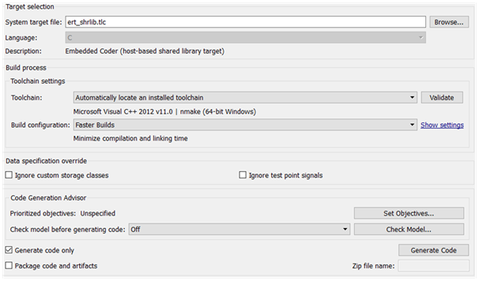

# Generating a DLL/SO Library

## Generating C++ Code

> Requirements: Embedded Coder, a properly configured compiler (GCC/Visual Studio), and access to the generated headers `MODEL_NAME.h`.

Embedded Coder is required to support the control system from Simulink.

Steps:

1. Define the inputs/outputs with In1/Out1 blocks.
2. In the settings: Code Generation → System target file = `ert_shrlib.tlc`.

{ width=400 }

3. Build the model (Ctrl+B or Build model). A directory with C/C++ sources will appear.

## Integrating a Simulink Model into Python

### 1) Build the Dynamic Library

— Linux/macOS:

```bash
gcc -shared -o model.so -fPIC *.c
```

— Windows (example):

```bash
make -f MODEL_NAME.mk
```

Where `*.c` refers to all generated source files.

### 2) Describe the Interaction Interface

The interface is described using `ctypes.Structure` and the types from `tensoraerospace/aerospacemodel/utils/rtwtypes.py`.

```python
import ctypes
from tensoraerospace.aerospacemodel.utils.rtwtypes import real_T

class ExtY(ctypes.Structure):
    _fields_ = [
        ("u", real_T),
        ("w", real_T),
        ("q", real_T),
        ("theta", real_T),
        ("sim_time", real_T),
    ]

class ExtU(ctypes.Structure):
    _fields_ = [("ref_signal", real_T)]
```

The library typically exposes the following functions:

- `MODEL_NAME_initialize`
- `MODEL_NAME_step` (the step size equals `dt` from the model parameters)
- `MODEL_NAME_terminate`

### 3) Example Usage from Python

```python
import os
import ctypes
import matplotlib.pyplot as plt
from tensoraerospace.aerospacemodel.utils.rtwtypes import real_T

class ExtY(ctypes.Structure):
    _fields_ = [("u", real_T), ("w", real_T), ("q", real_T), ("theta", real_T)]

class ExtU(ctypes.Structure):
    _fields_ = [("ref_signal", real_T)]

# Provide the correct library name/extension
lib_path = os.path.abspath("model.dll")  # or model.so / model.dylib
dll = ctypes.CDLL(lib_path)

X = ExtU.in_dll(dll, 'uav1_model_U')
Y = ExtY.in_dll(dll, 'uav1_model_Y')

model_initialize = dll.model_initialize
model_step = dll.model_step
model_terminate = dll.model_terminate

model_initialize()

u_vals, w_vals, q_vals, theta_vals = [], [], [], []
for _ in range(2100):
    X.ref_signal = -0.0
    model_step()
    u_vals.append(Y.u)
    w_vals.append(Y.w)
    q_vals.append(Y.q)
    theta_vals.append(Y.theta)

model_terminate()

plt.plot(w_vals)
plt.ylabel('$u$, [m/s]')
plt.show()
```
