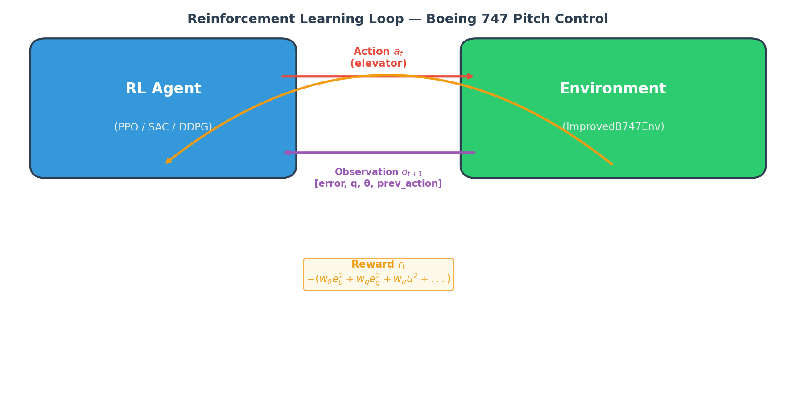

# Lesson 8 — Introduction to Reinforcement Learning for Aerospace Control

## 1. Why Reinforcement Learning for Aerospace?

In Lessons 1--7 we studied classical control theory: state-space models, stability analysis, pole placement, observer design, and PID tuning. These methods have been the backbone of flight control for decades and remain indispensable. However, they come with well-known limitations:

* **Fixed gains.** A controller designed for one flight condition (altitude, speed, mass) may perform poorly at another. Gain scheduling partially addresses this but requires a large number of design points.
* **Need for an accurate model.** Pole placement and LQR rely on precise knowledge of the matrices $A$, $B$, $C$, $D$. In practice, aerodynamic coefficients are uncertain and change with wear, damage, or icing.
* **Poor adaptation.** Classical controllers do not learn from experience. If the plant changes (e.g., partial actuator failure), the controller cannot adjust itself.
* **Difficulty with nonlinearities.** Linearization is valid only near the operating point. Large-envelope maneuvers, stall regions, and coupling effects are hard to capture.

**Reinforcement Learning (RL)** offers a fundamentally different paradigm: instead of deriving a control law from a mathematical model, the controller learns by interacting with the system (or its simulation). The key advantages are:

* **No explicit model required.** The agent discovers how the system behaves through trial and error.
* **Handles nonlinearities naturally.** Neural network policies can represent highly nonlinear mappings.
* **Adapts over time.** Online or continual learning allows the policy to adjust to changing dynamics.
* **Multi-objective optimization.** The reward function can encode complex goals (tracking + fuel economy + structural load limits).

Real-world aerospace RL applications are already being explored:

* Attitude control of agile UAVs under wind disturbances
* Powered descent guidance for reusable rockets (SpaceX-style landing)
* Satellite station-keeping with limited propellant
* Adaptive flight control for damaged aircraft
* Autonomous air combat maneuvering

In this lesson we introduce the RL framework, relate it to the classical concepts you already know, and show how TensorAeroSpace brings both worlds together.

---

## 2. RL Fundamentals in 5 Minutes

### 2.1 Core Concepts

An RL system consists of two entities:

| Concept | Classical Control Analogy | RL Term |
|---|---|---|
| Plant / Aircraft | Environment | **Environment** |
| Controller / Autopilot | Agent | **Agent** |
| Sensor readings | Observation / measurement | **State** $s_t$ |
| Control input | Actuator command | **Action** $a_t$ |
| Performance index | Cost function (LQR) | **Reward** $r_t$ |
| Control law $u = -Kx$ | Policy | **Policy** $\pi(a \mid s)$ |

At every discrete time step $t$, the agent observes the state $s_t$, selects an action $a_t$ according to its policy $\pi$, and the environment transitions to a new state $s_{t+1}$ while returning a scalar reward $r_t$. The goal of the agent is to maximize the expected cumulative reward:

$$J = \mathbb{E}\left[\sum_{t=0}^{T} \gamma^t r_t\right]$$

where $\gamma \in [0,1]$ is the **discount factor** (how much the agent values future rewards relative to immediate ones).

### 2.2 Episode Structure

An episode is one complete interaction sequence:

```
reset() --> s_0
  |
  +--> agent selects a_0
  |       |
  |       +--> env.step(a_0) --> s_1, r_0, done_0
  |
  +--> agent selects a_1
  |       |
  |       +--> env.step(a_1) --> s_2, r_1, done_1
  |
  ... (repeat until done=True)
```

In aerospace terms: the episode starts at an initial flight condition, the autopilot issues elevator/throttle commands at each time step, and the episode ends when the simulation horizon is reached or the aircraft leaves the safe flight envelope.

### 2.3 Policy

The policy $\pi$ is the mapping from observation to action. In classical control, the policy is an explicit formula such as $u = -Kx$. In RL, it is typically a neural network:

$$a_t = \pi_\theta(s_t)$$

where $\theta$ are the learnable parameters (weights) of the network. Training adjusts $\theta$ to maximize $J$.

Policies can be **deterministic** ($a = \mu_\theta(s)$, used in DDPG) or **stochastic** ($a \sim \pi_\theta(\cdot \mid s)$, used in PPO and SAC). Stochastic policies output a probability distribution over actions --- typically a Gaussian with learnable mean and standard deviation. This built-in randomness drives exploration: the agent tries slightly different control inputs and observes which ones yield higher rewards.

### 2.4 Value Functions and the Bellman Equation

Two value functions are central to RL:

* **State-value function** $V^\pi(s)$ --- the expected cumulative reward starting from state $s$ and following policy $\pi$:

$$V^\pi(s) = \mathbb{E}_\pi\left[\sum_{k=0}^{\infty} \gamma^k r_{t+k} \;\middle|\; s_t = s\right]$$

* **Action-value function** $Q^\pi(s,a)$ --- the expected cumulative reward starting from state $s$, taking action $a$, and then following policy $\pi$:

$$Q^\pi(s,a) = \mathbb{E}_\pi\left[\sum_{k=0}^{\infty} \gamma^k r_{t+k} \;\middle|\; s_t = s, a_t = a\right]$$

Both satisfy the **Bellman equation**, which expresses a recursive relationship:

$$Q^\pi(s,a) = r(s,a) + \gamma \, \mathbb{E}_{s' \sim P}\left[V^\pi(s')\right]$$

In aerospace terms: $Q^\pi(s,a)$ tells you "if the aircraft is in state $s$ and I apply elevator deflection $a$ right now, then follow my policy $\pi$ afterwards, how well will the rest of the flight go?" The Bellman equation decomposes this into the immediate reward plus the discounted future value --- exactly the same structure as Bellman's principle of optimality in classical dynamic programming.

Actor-critic algorithms (A2C, PPO, SAC) maintain both a policy (actor) and a value function (critic). The critic evaluates how good the current policy is, and the actor improves the policy based on the critic's feedback.

### 2.5 On-Policy vs Off-Policy

RL algorithms fall into two broad categories:

* **On-policy** (PPO, A2C, A3C): The agent learns from data collected by its current policy. After each policy update, old data is discarded. Simple but data-hungry.
* **Off-policy** (SAC, DDPG, DQN, DSAC): The agent stores past experiences in a **replay buffer** and learns from them even after the policy has changed. More sample-efficient but can be less stable.

For aerospace applications where each simulation episode is expensive (high-fidelity CFD-coupled models, hardware-in-the-loop), off-policy algorithms like SAC are often preferred because they extract more learning from each interaction.

### 2.6 Agent-Environment Loop for B747 Pitch Tracking

Consider a Boeing 747 tracking a pitch angle reference. The diagram below shows one time step:

```
+------------------+         action: elevator         +---------------------+
|                  |     deflection  delta_e           |                     |
|   RL Agent       |  -------------------------------->|   B747 Environment  |
|   (Neural Net    |                                   |   (State-Space      |
|    Policy)       |<----------------------------------|    Model)           |
|                  |    state: [alpha, q, theta, ...]  |                     |
+------------------+    reward: -|theta - theta_ref|   +---------------------+
```

The state vector might include angle of attack $\alpha$, pitch rate $q$, pitch angle $\theta$, and the tracking error. The reward penalizes deviation from the reference signal, encouraging the agent to learn a policy that tracks well.

---




## 3. RL vs Classical Control --- When to Use What

| Criterion | PID | LQR / Pole Placement | MPC | RL (PPO/SAC) |
|---|---|---|---|---|
| Model requirement | None (tuned online) | Accurate linear model | Accurate model (can be nonlinear) | None (learns from data) |
| Adaptability | Low (fixed gains) | Low | Medium (re-solve online) | High (policy updates) |
| Computational cost (online) | Very low | Very low | High (optimization at each step) | Low (forward pass through NN) |
| Stability guarantees | Gain/phase margins | Lyapunov-based | Constraint satisfaction | No formal guarantees (empirical) |
| Handles constraints | No | Indirectly (weighting) | Yes (explicit) | Via reward shaping |
| Nonlinear systems | Linearize first | Linearize first | Directly | Directly |
| Ease of tuning | 3 gains | Q, R matrices | Prediction horizon, cost | Reward function, hyperparameters |
| Multi-objective | Difficult | Weighting in Q, R | Multi-term cost | Flexible reward design |

**Rules of thumb:**

* **PID** --- Use for simple SISO loops where you need a quick, reliable baseline with minimal compute (e.g., inner-loop rate damper).
* **LQR / Pole Placement** --- Use when you have a good linear model and want provable stability with optimal performance.
* **MPC** --- Use when you need to handle hard constraints (actuator limits, envelope protection) and have sufficient compute.
* **RL** --- Use when the system is complex, nonlinear, or uncertain; when you want the controller to adapt; or when the task involves multi-objective optimization that is hard to express analytically.

In practice, RL and classical methods are often combined: a classical controller provides a safe baseline, and RL fine-tunes or replaces it as it learns.

---


## 4. Key RL Algorithms in TensorAeroSpace

TensorAeroSpace ships with a variety of control algorithms --- both classical and learning-based. Here is a summary of each, with guidance on when to use it.

### 4.1 PPO --- Proximal Policy Optimization

```python
from tensoraerospace.agent import PPO
```

* **Type:** On-policy, policy gradient
* **Action space:** Continuous
* **Key idea:** Clips the policy update to prevent destructively large steps, ensuring stable training.
* **When to use:** Your first choice for most aerospace RL tasks. Stable, general-purpose, works well with moderate amounts of data.

### 4.2 SAC --- Soft Actor-Critic

```python
from tensoraerospace.agent import SAC
```

* **Type:** Off-policy, actor-critic with entropy regularization
* **Action space:** Continuous
* **Key idea:** Maximizes reward while also maximizing policy entropy, which encourages exploration and robustness.
* **When to use:** When you want better sample efficiency than PPO. Especially effective for continuous control with smooth dynamics.

### 4.3 DDPG --- Deep Deterministic Policy Gradient

```python
from tensoraerospace.agent import DDPG
```

* **Type:** Off-policy, deterministic policy gradient
* **Action space:** Continuous
* **Key idea:** Learns a deterministic policy $\mu(s)$ using a replay buffer and target networks.
* **When to use:** Single-action continuous control problems. Can be less stable than SAC; consider SAC first.

### 4.4 DSAC --- Distributional Soft Actor-Critic

```python
from tensoraerospace.agent import DSAC
```

* **Type:** Off-policy, distributional RL
* **Action space:** Continuous
* **Key idea:** Models the full distribution of returns (not just the mean), enabling risk-aware control.
* **When to use:** When safety margins matter and you want to optimize worst-case performance (e.g., landing in crosswinds).

### 4.5 A2C --- Advantage Actor-Critic

```python
from tensoraerospace.agent import A2C
```

* **Type:** On-policy, actor-critic
* **Action space:** Continuous or discrete
* **Key idea:** Synchronous variant of A3C. Uses advantage estimates to reduce variance.
* **When to use:** A simpler on-policy baseline. Good for educational purposes and quick experiments.

### 4.6 A3C --- Asynchronous Advantage Actor-Critic

```python
from tensoraerospace.agent import Agent as A3CAgent
```

* **Type:** On-policy, asynchronous multi-worker
* **Action space:** Continuous or discrete
* **Key idea:** Runs multiple environment instances in parallel for faster exploration.
* **When to use:** When you have many CPU cores and want to speed up on-policy training.

### 4.7 DQN --- Deep Q-Network

```python
from tensoraerospace.agent import DQNAgent
```

* **Type:** Off-policy, value-based
* **Action space:** Discrete only
* **Key idea:** Learns an action-value function $Q(s,a)$ and acts greedily.
* **When to use:** Environments with discrete action spaces (e.g., Unity-based flight simulators with throttle levels).

### 4.8 GAIL --- Generative Adversarial Imitation Learning

```python
from tensoraerospace.agent import GAIL
```

* **Type:** Imitation learning
* **Action space:** Continuous
* **Key idea:** Learns a policy by imitating expert demonstrations, using a discriminator to distinguish agent behavior from expert behavior.
* **When to use:** When you have recorded flight data from an expert pilot or an existing autopilot and want to clone that behavior.

### 4.9 ADP / ADHDP --- Adaptive Dynamic Programming

```python
from tensoraerospace.agent import ADP
from tensoraerospace.agent import ADHDP
```

* **Type:** Neuro-dynamic programming
* **Action space:** Continuous
* **Key idea:** Approximates the Bellman equation using neural networks (action network + critic network). Rooted in optimal control theory.
* **When to use:** When you want an RL approach that is closely connected to classical dynamic programming and Bellman optimality.

### 4.10 HDP --- Heuristic Dynamic Programming

```python
from tensoraerospace.agent import HDP
```

* **Type:** Neuro-dynamic programming
* **Action space:** Continuous
* **Key idea:** Model-based variant that uses a learned system model alongside actor-critic networks.
* **When to use:** When you have (or can learn) a forward model of the plant and want to exploit it for faster convergence.

### 4.11 IHDP --- Integral Heuristic Dynamic Programming

```python
from tensoraerospace.agent import IHDPAgent
```

* **Type:** Neuro-dynamic programming (PyTorch-based)
* **Action space:** Continuous
* **Key idea:** Extends HDP with integral action for steady-state error elimination.
* **When to use:** Tracking problems where zero steady-state error is critical.

### 4.12 MPC --- Model Predictive Control

```python
from tensoraerospace.agent import MPC
```

* **Type:** Model-based optimal control
* **Action space:** Continuous
* **Key idea:** Solves a finite-horizon optimization problem at each time step using a learned or known dynamics model.
* **When to use:** When you need constraint handling and have a good dynamics model. Bridges classical and learning-based control.

### 4.13 PID --- Classical PID Controller

While not an RL algorithm, TensorAeroSpace includes PID as a baseline controller. It is invaluable for comparison studies.

### 4.14 Algorithm Selection Flowchart

```
                    START
                      |
            Do you have expert data?
                   /        \
                 Yes          No
                  |            |
                GAIL     Is the action space discrete?
                          /            \
                        Yes              No
                         |                |
                        DQN      Do you need risk-awareness?
                                   /            \
                                 Yes              No
                                  |                |
                                DSAC      Do you need high sample efficiency?
                                            /            \
                                          Yes              No
                                           |                |
                                          SAC             PPO (start here)
```

---

## 5. The Gymnasium Interface

TensorAeroSpace environments follow the [Gymnasium](https://gymnasium.farama.org/) API. This means that every environment --- whether it models a B747, an F-16, a satellite, or a rocket --- exposes the same interface.

### 5.1 Key Methods

| Method | Returns | Description |
|---|---|---|
| `env.reset()` | `obs, info` | Resets the environment to initial conditions. Returns the first observation and an info dictionary. |
| `env.step(action)` | `obs, reward, terminated, truncated, info` | Advances one time step. Returns the new observation, reward, termination flags, and info. |

The two termination flags follow the Gymnasium convention:

* **terminated** --- The episode ended due to a physical condition (e.g., the aircraft stalled or the reference was perfectly tracked).
* **truncated** --- The episode ended because the time limit was reached.

The episode is done when `terminated or truncated` is `True`.

### 5.2 Observation and Action Spaces

For a typical longitudinal aircraft environment:

* **Observation:** A vector containing state variables (angle of attack, pitch rate, pitch angle, etc.) and possibly the tracking error and reference signal.
* **Action:** A vector of control surface deflections (e.g., elevator angle in radians).

Both spaces are continuous (`gymnasium.spaces.Box`).

### 5.3 Code Example: Running the B747 Environment

The following example creates an `ImprovedB747Env`, runs one episode with zero control input, and prints the total reward. This is the simplest way to interact with the environment.

```python
import numpy as np
from tensoraerospace.envs import ImprovedB747Env
from tensoraerospace.signals.standart import unit_step
from tensoraerospace.utils import generate_time_period, convert_tp_to_sec_tp

# ----- Simulation parameters -----
dt = 0.1                                              # time step (seconds)
tp = generate_time_period(tn=40, dt=dt)               # time array
tps = convert_tp_to_sec_tp(tp, dt=dt)                 # time in seconds
number_time_steps = len(tp)                            # total steps

# Reference signal: 1-degree step in pitch angle (converted to radians)
reference = np.reshape(
    unit_step(degree=1, tp=tp, time_step=50, output_rad=True),
    (1, -1),
)

# ----- Create environment -----
env = ImprovedB747Env(
    initial_state=np.array([[0], [0], [0], [0]], dtype=np.float32),
    reference_signal=reference,
    number_time_steps=number_time_steps,
    dt=dt,
)

# ----- Run one episode with zero control -----
obs, info = env.reset()
done = False
total_reward = 0.0

while not done:
    action = np.array([0.0], dtype=np.float32)   # no control input
    obs, reward, terminated, truncated, info = env.step(action)
    done = terminated or truncated
    total_reward += reward

print(f"Episode finished after {number_time_steps} steps")
print(f"Total reward with zero control: {total_reward:.2f}")
print(f"Final observation: {obs}")
```

**What you should observe:** With zero control, the aircraft does not track the reference, and the total reward is poor. This is the open-loop baseline --- exactly what RL will learn to improve.

### 5.4 Available Environments

TensorAeroSpace provides environments for a range of aerospace vehicles:

| Environment | Vehicle | Type |
|---|---|---|
| `ImprovedB747Env` | Boeing 747 | Large transport aircraft |
| `LinearLongitudinalB747` | Boeing 747 | Linear longitudinal model |
| `LinearLongitudinalF16` | F-16 Fighting Falcon | Fighter jet |
| `F4CPitchEnvNormalized` | F-4C Phantom | Fighter jet (pitch channel) |
| `LinearLongitudinalF4C` | F-4C Phantom | Linear longitudinal model |
| `ImprovedX15Env` | X-15 | Hypersonic research aircraft |
| `ImprovedUltrastickEnv` | Ultrastick 120 | Small UAV |
| `LinearLongitudinalUAV` | Generic UAV | Linear longitudinal model |
| `ImprovedLAPANEnv` | LAPAN Surveillance UAV | Surveillance UAV |
| `ImprovedELVEnv` | Expendable Launch Vehicle | Rocket |
| `LinearLongitudinalMissileModel` | Generic Missile | Guided missile |
| `ImprovedMissileEnv` | Generic Missile | Improved missile model |
| `ImprovedComSatEnv` | Communication Satellite | Orbit keeping |
| `GeoSatEnv` | Geostationary Satellite | Station-keeping |
| `ComSatEnv` | Communication Satellite | Linear satellite model |

All environments share the same Gymnasium interface shown above.

---

## 6. From Classical to RL: The Bridge

If you have worked through Lessons 1--7, you already understand the building blocks of RL --- they just go by different names. Let us make the correspondence explicit.

### 6.1 State-Space Model becomes a Gymnasium Environment

In Lesson 7, the aircraft was described by:

$$\dot{x} = Ax + Bu, \quad y = Cx$$

In TensorAeroSpace, this same state-space model is wrapped inside a Gymnasium environment. The `step()` method integrates the equations forward by $\Delta t$ and returns the new state.

| Classical | RL / Gymnasium |
|---|---|
| State vector $x = [\alpha, q]^T$ | `obs` returned by `env.step()` |
| Control input $u = \delta_e$ | `action` passed to `env.step()` |
| Integration $x(t + \Delta t) = \ldots$ | Internal dynamics inside `env.step()` |
| Initial condition $x_0$ | `env.reset()` |

### 6.2 Gain Matrix K becomes a Neural Network Policy

In Lesson 7, the control law was:

$$u = -Kx = -\begin{bmatrix} 26.4 & 15.7 \end{bmatrix} \begin{bmatrix} \alpha \\ q \end{bmatrix}$$

This is a linear policy. An RL agent replaces $K$ with a neural network:

$$u = \pi_\theta(x)$$

The neural network can represent any nonlinear mapping, which means it can handle situations where a single linear gain is insufficient.

### 6.3 LQR Cost becomes Reward Function

In LQR, the cost to minimize is:

$$J = \int_0^\infty \left( x^T Q x + u^T R u \right) dt$$

In RL, the reward at each step is often defined as:

$$r_t = -\left( x_t^T Q x_t + u_t^T R u_t \right)$$

(Note the negative sign: LQR minimizes cost, RL maximizes reward.) The matrices $Q$ and $R$ play the same role in both formulations --- they encode the trade-off between tracking accuracy and control effort.

### 6.4 Why RL Can Go Beyond

Once the fundamentals are the same, why bother with RL? Because:

1. **Nonlinear systems.** The policy is not constrained to be linear. It can learn complex control strategies for large-angle maneuvers, stall recovery, or coupled lateral-directional-longitudinal control.
2. **Unknown disturbances.** During training, the agent encounters varied disturbances and learns robust responses. It does not need an explicit disturbance model.
3. **Multi-objective optimization.** The reward function can combine tracking error, control effort, structural loads, fuel consumption, and passenger comfort --- all in a single scalar signal.
4. **Transfer and generalization.** A policy trained across many flight conditions can generalize to unseen conditions, whereas gain-scheduled controllers require explicit design at each point.

### 6.5 Example: Comparing a Linear Controller with an RL Agent

To illustrate the bridge, here is a conceptual comparison using the B747 environment. We first apply a constant-gain proportional controller (the "classical" approach), then note where an RL agent would be trained instead.

```python
import numpy as np
from tensoraerospace.envs import ImprovedB747Env
from tensoraerospace.signals.standart import unit_step
from tensoraerospace.utils import generate_time_period, convert_tp_to_sec_tp

# ----- Setup (same as before) -----
dt = 0.1
tp = generate_time_period(tn=40, dt=dt)
tps = convert_tp_to_sec_tp(tp, dt=dt)
number_time_steps = len(tp)
reference = np.reshape(
    unit_step(degree=1, tp=tp, time_step=50, output_rad=True),
    (1, -1),
)

env = ImprovedB747Env(
    initial_state=np.array([[0], [0], [0], [0]], dtype=np.float32),
    reference_signal=reference,
    number_time_steps=number_time_steps,
    dt=dt,
)

# ----- Simple proportional controller (classical approach) -----
K_p = 5.0   # proportional gain (hand-tuned)

obs, info = env.reset()
done = False
total_reward_classical = 0.0
observations = [obs]

while not done:
    # The observation contains the tracking error; use it directly
    error = obs[0] if len(obs.shape) == 1 else obs[0, 0]
    action = np.array([K_p * error], dtype=np.float32)
    obs, reward, terminated, truncated, info = env.step(action)
    done = terminated or truncated
    total_reward_classical += reward
    observations.append(obs)

print(f"Classical P-controller reward: {total_reward_classical:.2f}")

# ----- Where RL fits in -----
# Instead of hand-tuning K_p, an RL agent (e.g., PPO) would:
#   1. Initialize a neural network policy pi_theta(obs) -> action
#   2. Collect episodes by interacting with the environment
#   3. Update theta to maximize cumulative reward
#   4. Repeat until the policy outperforms the classical controller
#
# See Lesson 10 for a complete training example.
```

---

## 7. Summary

This lesson established the bridge between classical control theory (Lessons 1--7) and reinforcement learning:

| What you already know | What RL adds |
|---|---|
| State-space models $\dot{x} = Ax + Bu$ | Gymnasium environments with `reset()` / `step()` |
| Linear control law $u = -Kx$ | Neural network policy $\pi_\theta(s)$ |
| LQR cost $x^TQx + u^TRu$ | Reward function $r_t$ |
| Stability via eigenvalue analysis | Empirical stability through training |
| Pole placement, observer design | End-to-end learning from interaction |

Key takeaways:

1. **RL is not a replacement for classical control** --- it is a complement. Use classical methods when they suffice; use RL when you need adaptability, nonlinearity handling, or multi-objective optimization.
2. **The Gymnasium interface** is the standard API for all TensorAeroSpace environments. Learn `reset()` and `step()`, and you can work with any vehicle model.
3. **TensorAeroSpace provides a rich set of algorithms** (PPO, SAC, DDPG, DSAC, A2C, A3C, DQN, GAIL, ADP, ADHDP, HDP, IHDP, MPC, PID) so you can choose the right tool for each task.
4. **Start with PPO** for your first RL experiments. It is stable, well-tested, and works on most continuous control tasks.

---

## 8. What's Next

* **Lesson 9: Environments in Detail** --- We will explore the full range of TensorAeroSpace environments, their state/action spaces, reward functions, and how to customize them.
* **Lesson 10: Training Your First RL Agent** --- A hands-on tutorial where you train a PPO agent to control the B747 pitch angle and compare its performance to a PID baseline.

---

## 9. Homework

### Exercise 1: Explore the Environment

Run the code from Section 5.3 with different reference signals. Try changing the step amplitude and timing:

```python
# Variation A: larger step amplitude
reference_a = np.reshape(
    unit_step(degree=2, tp=tp, time_step=50, output_rad=True),
    (1, -1),
)

# Variation B: earlier step
reference_b = np.reshape(
    unit_step(degree=1, tp=tp, time_step=20, output_rad=True),
    (1, -1),
)

# Variation C: larger amplitude, later step
reference_c = np.reshape(
    unit_step(degree=5, tp=tp, time_step=100, output_rad=True),
    (1, -1),
)
```

For each variation, record the total reward and the final observation. How does the reward change with step amplitude? Why?

### Exercise 2: Try Different Vehicles

Replace `ImprovedB747Env` with `ImprovedX15Env` or `ImprovedELVEnv`. Note that each environment may require different initial state dimensions. Check the environment documentation or source code for the expected `initial_state` shape.

Questions to answer:
* What is the dimension of the observation vector for each environment?
* How many control inputs (actions) does each environment accept?
* Is the open-loop behavior (zero control) stable or unstable?

### Exercise 3: Simple Controller Experiment

Implement a proportional-derivative (PD) controller:

$$u = K_p \cdot e + K_d \cdot \dot{e}$$

where $e$ is the tracking error. You can approximate $\dot{e}$ numerically:

```python
prev_error = 0.0
K_p = 5.0   # try values in [1, 20]
K_d = 0.5   # try values in [0.01, 5]

obs, info = env.reset()
done = False
total_reward = 0.0

while not done:
    error = obs[0] if len(obs.shape) == 1 else obs[0, 0]
    d_error = (error - prev_error) / dt
    action = np.array([K_p * error + K_d * d_error], dtype=np.float32)
    obs, reward, terminated, truncated, info = env.step(action)
    done = terminated or truncated
    total_reward += reward
    prev_error = error

print(f"PD controller reward: {total_reward:.2f}")
```

Try at least 5 combinations of $(K_p, K_d)$ and record the rewards. Note how tedious manual tuning is --- RL automates this search process.

### Exercise 4: Algorithm Matching

For each scenario below, choose the most appropriate algorithm from Section 4 and justify your choice:

* (a) You have 1000 recorded trajectories from an expert pilot and want to clone the behavior.
* (b) You need a controller for a satellite that must never exceed a thrust limit.
* (c) You want a robust pitch controller for an F-16 across the full flight envelope.
* (d) You have a Unity flight simulator with 5 discrete throttle levels.
* (e) You want to minimize both tracking error and control effort, and you do not have a dynamics model.
* (f) You need a controller that accounts for worst-case wind gust scenarios during approach.

### Exercise 5: Conceptual Questions

1. Explain in your own words why the discount factor $\gamma$ is needed. What happens if $\gamma = 0$? What about $\gamma = 1$?
2. In the Bellman equation, what is the role of the expectation over $s'$? How does this relate to stochastic disturbances in flight control?
3. Why might an off-policy algorithm (SAC) be preferred over an on-policy algorithm (PPO) when training with a high-fidelity flight simulator that is slow to run?

---

## 10. References

1. Sutton, R.S. and Barto, A.G. *Reinforcement Learning: An Introduction*, 2nd edition, MIT Press, 2018. [URL: http://incompleteideas.net/book/the-book.html](http://incompleteideas.net/book/the-book.html)
2. Schulman, J. et al. "Proximal Policy Optimization Algorithms." arXiv:1707.06347, 2017.
3. Haarnoja, T. et al. "Soft Actor-Critic: Off-Policy Maximum Entropy Deep Reinforcement Learning with a Stochastic Actor." ICML, 2018.
4. Koch, W. et al. "Reinforcement Learning for UAV Attitude Control." ACM Transactions on Cyber-Physical Systems, 3(2), 2019.
5. Gymnasium Documentation. [URL: https://gymnasium.farama.org/](https://gymnasium.farama.org/)
6. TensorAeroSpace Documentation. [URL: https://tensoraerospace.readthedocs.io/](https://tensoraerospace.readthedocs.io/)
