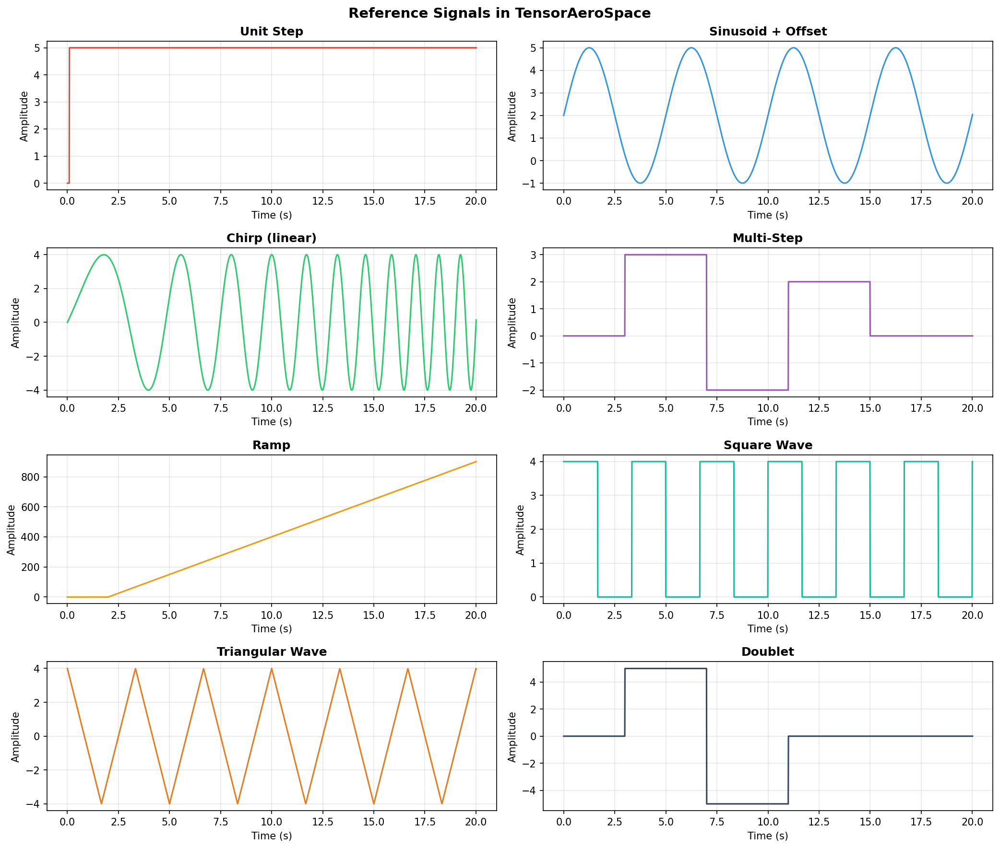

# Lesson 9 -- Environments and Simulations

## 1. Overview

TensorAeroSpace ships a collection of Gymnasium-compatible environments for
longitudinal control of aircraft, rockets and satellites. Every environment
follows the standard `gym.Env` interface (`reset`, `step`, `render`) and can be
instantiated either by class name or via `gym.make(env_id)`.

There are two families of environments:

| Family | Naming convention | Obs/act spaces | Reward | Intended use |
|---|---|---|---|---|
| **Legacy** | `LinearLongitudinal*` | raw physical units, 2-D column vectors `(n, 1)` | negative MSE | Classical control, IHDP, PID research |
| **Improved** | `Improved*` / `*Normalized` | normalized `[-1, 1]`, flat 1-D vectors | LQR-style shaped reward with termination | RL training (PPO, SAC, TD3, ...) |

**Rule of thumb:** use Legacy environments when you need direct access to the
state-space model and physical units. Use Improved environments when training a
neural-network policy.

---

## 2. Full Environment Catalogue

### 2.1 Legacy environments

| Env ID | Class | Vehicle | Default states | obs dim | act dim |
|---|---|---|---|---|---|
| `LinearLongitudinalB747-v0` | `LinearLongitudinalB747` | Boeing 747 | theta, q | 2 | 1 |
| `LinearLongitudinalF16-v0` | `LinearLongitudinalF16` | F-16 Fighting Falcon | alpha, q | 2 | 1 |
| `LinearLongitudinalF4C-v0` | `LinearLongitudinalF4C` | F-4C Phantom II | theta, q, alpha, V | 4 | 1 |
| `LinearLongitudinalX15-v0` | `LinearLongitudinalX15` | X-15 experimental | theta, q | 2 | 1 |
| `LinearLongitudinalUAV-v0` | `LinearLongitudinalUAV` | Generic UAV | theta, q | 2 | 1 |
| `LinearLongitudinalUltrastick-v0` | `LinearLongitudinalUltrastick` | Ultrastick-25e | theta, q | 2 | 1 |
| `LinearLongitudinalLAPAN-v0` | `LinearLongitudinalLAPAN` | LAPAN aircraft | theta, q | 2 | 1 |
| `LinearLongitudinalELVRocket-v0` | `LinearLongitudinalELVRocket` | ELV rocket | w, q, theta | 3 | 1 |
| `LinearLongitudinalMissileModel-v0` | `LinearLongitudinalMissileModel` | Missile | theta, q | 2 | 1 |
| `GeoSat-v0` | `GeoSatEnv` | Geostationary satellite | rho, theta, omega | 3 | 1 |
| `ComSat-v0` | `ComSatEnv` | Communication satellite | rho, rho_dot, theta_dot | 3 | 1 |

### 2.2 Improved (RL-ready) environments

| Env ID | Class | Vehicle | obs dim | act dim |
|---|---|---|---|---|
| `ImprovedB747-v0` | `ImprovedB747Env` | Boeing 747 | 4 | 1 |
| `ImprovedX15-v0` | `ImprovedX15Env` | X-15 | 4 | 1 |
| `ImprovedELV-v0` | `ImprovedELVEnv` | ELV rocket | 4 | 1 |
| `ImprovedLAPAN-v0` | `ImprovedLAPANEnv` | LAPAN aircraft | 4 | 1 |
| `ImprovedMissile-v0` | `ImprovedMissileEnv` | Missile | 4 | 1 |
| `ImprovedComSat-v0` | `ImprovedComSatEnv` | Comm. satellite | 4 | 1 |
| `ImprovedUltrastick-v0` | `ImprovedUltrastickEnv` | Ultrastick-25e | 5 | 2 |
| `F4CPitchNormalized-v0` | `F4CPitchEnvNormalized` | F-4C Phantom II | 4 | 1 |

---

## 3. Legacy Environments in Depth

### 3.1 State-space model

Every legacy environment wraps a discrete linear model of the form:

```
x(t+1) = A x(t) + B u(t)
y(t)   = C x(t)
```

where `x` is the state vector, `u` is the control input (elevator deflection,
thrust, etc.) and `y` is the measured output. Matrices `A`, `B`, `C` are
loaded from the corresponding `aerospacemodel` module.

### 3.2 Observation shape

Legacy environments return observations as **2-D column vectors** with shape
`(n, 1)`, where `n` is the number of states. Keep this in mind when feeding
observations into a neural network -- you may need to flatten them first.

### 3.3 Key parameters

| Parameter | Description |
|---|---|
| `initial_state` | Initial state vector (list of column vectors, e.g. `[[0], [0]]`) |
| `reference_signal` | Target trajectory, shape `(n_tracked, n_steps)` |
| `number_time_steps` | Simulation horizon length |
| `state_space` | List of state variable names to observe |
| `output_space` | List of output variable names |
| `tracking_states` | Subset of states used for reward computation |
| `reward_func` | Optional custom reward callable |
| `dt` | Discretization time step (default 0.01 s) |

### 3.4 Code example -- F-16 step tracking

```python
import numpy as np
import gymnasium as gym
import matplotlib.pyplot as plt

from tensoraerospace.utils import generate_time_period, convert_tp_to_sec_tp
from tensoraerospace.signals.standard import unit_step

# Time grid
dt = 0.01
tp = generate_time_period(tn=20, dt=dt)
tps = convert_tp_to_sec_tp(tp, dt=dt)
number_time_steps = len(tp)

# 5-degree step reference for angle of attack, starting at t=5 s
reference = np.reshape(
    unit_step(degree=5, tp=tp, time_step=5, output_rad=True),
    [1, -1],
)

# Create environment
env = gym.make(
    "LinearLongitudinalF16-v0",
    number_time_steps=number_time_steps,
    initial_state=[[0], [0], [0]],
    reference_signal=reference,
    state_space=["theta", "alpha", "q"],
    output_space=["theta", "alpha", "q"],
    tracking_states=["alpha"],
)

obs, info = env.reset()

# Run simulation with zero control (open-loop)
states = [obs.flatten()]
for _ in range(number_time_steps - 1):
    action = np.array([[0.0]])  # no control input
    obs, reward, terminated, truncated, info = env.step(action)
    states.append(obs.flatten())
    if terminated or truncated:
        break

states = np.array(states)
time = np.array(tps[: len(states)])

# Plot angle of attack trajectory
plt.figure(figsize=(10, 5))
plt.plot(time, np.rad2deg(states[:, 1]), label="alpha (deg)")
plt.plot(time, np.rad2deg(reference[0, : len(time)]), "--r", label="reference")
plt.xlabel("Time (s)")
plt.ylabel("Angle of attack (deg)")
plt.title("F-16 open-loop response to step reference")
plt.legend()
plt.grid(True)
plt.show()
```

---

## 4. Improved Environments in Depth

### 4.1 Design principles

Improved environments are built specifically for RL training and share the
following properties:

* **Normalized spaces.** Both observations and actions lie in `[-1, 1]`.
  The environment internally scales to/from physical units.
* **Flat 1-D vectors.** Observations are returned as `(obs_dim,)` arrays, not
  column vectors -- ready for standard policy networks.
* **LQR-style shaped reward.** The reward function is a weighted sum of
  tracking error, rate damping, control effort and smoothness terms.
* **Safety termination.** The episode terminates early (with a large negative
  penalty) if the vehicle exceeds physical limits such as maximum pitch angle
  or maximum pitch rate.

### 4.2 Walkthrough -- ImprovedB747Env

The `ImprovedB747Env` wraps the Boeing 747 longitudinal model with:

| Component | Details |
|---|---|
| **State vector** | `[u, w, q, theta]` (velocity, vertical velocity, pitch rate, pitch angle) in SI units |
| **Observation** | `[pitch_error, pitch_rate, pitch_angle, prev_action]` -- all normalized to `[-1, 1]` |
| **Action** | Normalized elevator deflection, single float in `[-1, 1]` (maps to +/-25 deg) |
| **Reward** | `-( w_pitch * e_pitch^2 + w_q * e_q^2 + w_action * |u| + w_smooth * |du| + w_jerk * |d2u| )` |
| **Termination** | `|theta| > 20 deg` or `|q| > 5 deg/s` triggers penalty of -100 |
| **Truncation** | Episode ends after `number_time_steps` |

### 4.3 Constructor parameters

```python
ImprovedB747Env(
    initial_state,                       # [u, w, q, theta] in SI
    reference_signal,                    # shape (1, n_steps), radians
    number_time_steps,                   # horizon
    dt=0.01,                             # time step (s)
    initial_elevator_deg=0.0,            # smooth start
    use_initial_action_on_first_step=True,
    reward_mode="step_response",         # or "tracking"
    survival_bonus=0.0,                  # per-step bonus for staying alive
    completion_bonus=0.0,                # bonus for finishing the episode
    early_termination_penalty=0.0,       # extra penalty on crash
    early_termination_penalty_per_step=0.0,
    include_reference_in_obs=False,      # adds 2 extra obs dims if True
)
```

### 4.4 Code example -- proportional controller on B747

```python
import numpy as np
import gymnasium as gym
import matplotlib.pyplot as plt

from tensoraerospace.utils import generate_time_period, convert_tp_to_sec_tp
from tensoraerospace.signals.standard import unit_step

dt = 0.01
tp = generate_time_period(tn=20, dt=dt)
tps = convert_tp_to_sec_tp(tp, dt=dt)
number_time_steps = len(tp)

# 3-degree pitch step at t=2 s
reference = np.reshape(
    unit_step(degree=3, tp=tp, time_step=2, output_rad=True),
    [1, -1],
)

env = gym.make(
    "ImprovedB747-v0",
    initial_state=[0.0, 0.0, 0.0, 0.0],
    reference_signal=reference,
    number_time_steps=number_time_steps,
    dt=dt,
)

obs, info = env.reset()

observations = [obs.copy()]
rewards = []
actions = []

for step in range(number_time_steps - 1):
    # Simple proportional control: action = -K_p * pitch_error
    # obs[0] is the normalized pitch error
    pitch_error = obs[0]
    action = np.array([-2.0 * pitch_error], dtype=np.float32)
    action = np.clip(action, -1.0, 1.0)

    obs, reward, terminated, truncated, info = env.step(action)
    observations.append(obs.copy())
    rewards.append(reward)
    actions.append(action[0])

    if terminated or truncated:
        break

observations = np.array(observations)
time = np.array(tps[: len(observations)])

fig, axes = plt.subplots(3, 1, figsize=(10, 10), sharex=True)

axes[0].plot(time, observations[:, 0], label="pitch error (norm)")
axes[0].set_ylabel("Normalized error")
axes[0].set_title("ImprovedB747Env -- Proportional controller")
axes[0].legend()
axes[0].grid(True)

axes[1].plot(time, observations[:, 2], label="pitch angle (norm)")
axes[1].set_ylabel("Normalized pitch")
axes[1].legend()
axes[1].grid(True)

axes[2].plot(time[: len(actions)], actions, label="action (norm)")
axes[2].set_xlabel("Time (s)")
axes[2].set_ylabel("Normalized action")
axes[2].legend()
axes[2].grid(True)

plt.tight_layout()
plt.show()

print(f"Episode length: {len(observations)} steps")
print(f"Total reward:   {sum(rewards):.2f}")
```

---


## 5. Reference Signals

The module `tensoraerospace.signals.standard` provides ready-made reference
signal generators for tracking tasks. All functions accept a time array `tp`
(created by `generate_time_period`) and return a 1-D array of the same length.

### 5.1 Available signals

| Function | Description | Key parameters |
|---|---|---|
| `unit_step` | Step function | `degree`, `time_step`, `output_rad` |
| `sinusoid` | Basic sine wave | `frequency`, `amplitude` |
| `sinusoid_vertical_shift` | Sine with DC offset | `frequency`, `amplitude`, `vertical_shift` |
| `constant_line` | Constant value | `value_state` |
| `ramp` | Linear ramp | `slope`, `time_start` |
| `pulse` | Rectangular pulse | `amplitude`, `time_start`, `width` |
| `square_wave` | Periodic square wave | `frequency`, `amplitude`, `duty_cycle` |
| `sawtooth` | Sawtooth wave | `frequency`, `amplitude` |
| `triangular_wave` | Triangular wave | `frequency`, `amplitude` |
| `chirp` | Frequency sweep | `f0`, `f1`, `amplitude`, `method` |
| `doublet` | Positive+negative pulse pair | `amplitude`, `time_start`, `width` |
| `multi_step` | Multiple step changes | `step_times`, `step_values` |
| `exponential` | Exponential approach | `amplitude`, `time_constant`, `time_start` |
| `gaussian_pulse` | Smooth bell pulse | `amplitude`, `center`, `width` |
| `multisine` | Sum of sinusoids | `frequencies`, `amplitudes`, `phases` |
| `damped_sinusoid` | Decaying oscillation | `frequency`, `amplitude`, `damping` |

### 5.2 Code examples

```python
import numpy as np
from tensoraerospace.utils import generate_time_period
from tensoraerospace.signals.standard import (
    unit_step, sinusoid_vertical_shift, chirp, multi_step, doublet
)

dt = 0.01
tp = generate_time_period(tn=20, dt=dt)

# Step signal: 5-degree step at t=3 s (output in radians)
sig_step = unit_step(tp=tp, degree=5, time_step=3, output_rad=True)

# Sinusoid with vertical offset
sig_sine = sinusoid_vertical_shift(
    tp=tp, frequency=0.2, amplitude=0.05, vertical_shift=0.05
)

# Chirp: frequency sweep from 0.1 Hz to 1.0 Hz
sig_chirp = chirp(tp=tp, f0=0.1, f1=1.0, amplitude=0.08)

# Multi-step: staircase reference
sig_multi = multi_step(
    tp=tp,
    step_times=[2, 6, 10, 15],
    step_values=[0.05, 0.03, -0.04, 0.02],
)

# Doublet: classic stability test maneuver
sig_doublet = doublet(
    tp=tp, amplitude=np.deg2rad(3), time_start=5.0, width=2.0
)
```

To use any signal as a reference for an environment, reshape it to `(1, -1)`:

```python
reference = np.reshape(sig_step, [1, -1])
```

---




## 6. Custom Environment Configuration

### 6.1 Changing simulation parameters

Both Legacy and Improved environments accept `dt` (time step) and
`number_time_steps` (horizon). The total simulation time equals
`number_time_steps * dt`.

```python
# 30-second simulation at 50 Hz
dt = 0.02
tp = generate_time_period(tn=30, dt=dt)
number_time_steps = len(tp)
```

### 6.2 Custom initial states

For legacy environments, initial states are column vectors:

```python
# F-16 with initial angle of attack of 2 degrees
initial_state = [[0], [np.deg2rad(2)], [0]]
```

For improved environments, states are flat arrays in SI units:

```python
# B747 with small initial pitch rate
initial_state = [0.0, 0.0, np.deg2rad(0.5), 0.0]  # [u, w, q, theta]
```

### 6.3 Custom reward functions (Legacy environments)

Legacy environments accept a `reward_func` parameter. The function receives
the current state, reference signal and time step:

```python
def custom_reward(state, ref_signal, ts, action=None):
    """Penalize oscillation by adding a rate penalty."""
    if ref_signal.ndim == 2 and ref_signal.shape[1] > ts:
        ref_at_ts = ref_signal[:, ts].flatten()
    else:
        ref_at_ts = ref_signal.flatten()
    tracking_error = np.mean((state.flatten() - ref_at_ts) ** 2)
    rate_penalty = 0.1 * np.sum(state.flatten() ** 2)
    return float(-(tracking_error + rate_penalty))

env = gym.make(
    "LinearLongitudinalB747-v0",
    initial_state=[[0], [0]],
    reference_signal=reference,
    number_time_steps=number_time_steps,
    reward_func=custom_reward,
)
```

### 6.4 Reward modes in Improved environments

Improved B747 supports two reward modes:

* `"step_response"` (default) -- includes step-specific shaping terms for
  overshoot, settling time and oscillation. Best when training on step
  references.
* `"tracking"` -- universal mode using only base quadratic cost. Use for
  sinusoidal, chirp or other non-step reference signals.

```python
env = gym.make(
    "ImprovedB747-v0",
    initial_state=[0.0, 0.0, 0.0, 0.0],
    reference_signal=reference,
    number_time_steps=number_time_steps,
    reward_mode="tracking",
)
```

---

## 7. Accessing Internal Model Data

Legacy environments expose the underlying aerospace model through
`env.unwrapped.model`. This gives you access to state and control histories,
as well as built-in plotting.

### 7.1 Key methods

| Method | Description |
|---|---|
| `model.get_state(name, to_deg=False)` | Get state history as an array |
| `model.get_control(name, to_deg=False)` | Get control history as an array |
| `model.plot_transient_process(name, time, ref, lang="eng", to_deg=True)` | Plot state vs reference |

### 7.2 Code example

```python
import numpy as np
import gymnasium as gym
import matplotlib.pyplot as plt

from tensoraerospace.utils import generate_time_period, convert_tp_to_sec_tp
from tensoraerospace.signals.standard import unit_step

dt = 0.01
tp = generate_time_period(tn=20, dt=dt)
tps = convert_tp_to_sec_tp(tp, dt=dt)
number_time_steps = len(tp)

reference = np.reshape(
    unit_step(degree=5, tp=tp, time_step=5, output_rad=True),
    [1, -1],
)

env = gym.make(
    "LinearLongitudinalB747-v0",
    number_time_steps=number_time_steps,
    initial_state=[[0], [0]],
    reference_signal=reference,
    state_space=["theta", "q"],
    output_space=["theta", "q"],
    tracking_states=["theta"],
)

obs, _ = env.reset()
for i in range(number_time_steps - 1):
    action = np.array([0.5])  # constant elevator input
    obs, reward, terminated, truncated, info = env.step(action)
    if terminated or truncated:
        break

# Access the underlying model
model = env.unwrapped.model

# Retrieve state history
theta_deg = model.get_state("theta", to_deg=True)
q_deg = model.get_state("q", to_deg=True)

# Retrieve control history
stab_hist = model.get_control("stab", to_deg=True)

# Built-in plotting
model.plot_transient_process(
    "theta",
    time=np.array(tps),
    ref_signal=reference[0],
    lang="eng",
    to_deg=True,
    figsize=(10, 5),
)
```

---

## 8. Vectorized Environments

For efficient parallel training, `ImprovedB747VecEnvTorch` runs `N`
independent B747 simulations in a single batched tensor operation. It supports
both CPU and CUDA devices.

```python
from tensoraerospace.envs import ImprovedB747VecEnvTorch

vec_env = ImprovedB747VecEnvTorch(
    num_envs=64,
    number_time_steps=2000,
    dt=0.01,
    device="cpu",        # or "cuda"
)

obs, info = vec_env.reset()
# obs shape: (64, 4) -- batch of 64 observations

for _ in range(2000):
    actions = vec_env.action_space_sample()  # random actions, shape (64, 1)
    obs, rewards, terminated, truncated, info = vec_env.step(actions)
    # rewards shape: (64,)
```

The vectorized environment also supports **signal randomization** --
automatically generating varied step, sine and ramp references for each
sub-environment to prevent the agent from memorizing a single trajectory.

---

## 9. Environment Comparison

| Env ID | Vehicle | obs | act | Reward | Termination | Recommended agents |
|---|---|---|---|---|---|---|
| `LinearLongitudinalB747-v0` | B747 | 2 | 1 | -MSE | time limit | PID, IHDP, LQR |
| `LinearLongitudinalF16-v0` | F-16 | 2 | 1 | -MSE | time limit | PID, IHDP, LQR |
| `LinearLongitudinalF4C-v0` | F-4C | 4 | 1 | -MSE | time limit | PID, IHDP, LQR |
| `LinearLongitudinalX15-v0` | X-15 | 2 | 1 | -MSE | time limit | PID, IHDP, LQR |
| `LinearLongitudinalUAV-v0` | UAV | 2 | 1 | -MSE | time limit | PID, IHDP, LQR |
| `LinearLongitudinalUltrastick-v0` | Ultrastick | 2 | 1 | -MSE | time limit | PID, IHDP, LQR |
| `LinearLongitudinalLAPAN-v0` | LAPAN | 2 | 1 | -MSE | time limit | PID, IHDP, LQR |
| `LinearLongitudinalELVRocket-v0` | ELV | 3 | 1 | -MSE | time limit | PID, IHDP, LQR |
| `LinearLongitudinalMissileModel-v0` | Missile | 2 | 1 | -MSE | time limit | PID, IHDP, LQR |
| `GeoSat-v0` | GeoSat | 3 | 1 | -MSE | time limit | PID, LQR |
| `ComSat-v0` | ComSat | 3 | 1 | -MSE | time limit | PID, LQR |
| `ImprovedB747-v0` | B747 | 4 | 1 | LQR-shaped | pitch/rate limits | PPO, SAC, TD3 |
| `ImprovedX15-v0` | X-15 | 4 | 1 | LQR-shaped | pitch/rate limits | PPO, SAC, TD3 |
| `ImprovedELV-v0` | ELV | 4 | 1 | LQR-shaped | pitch/rate limits | PPO, SAC, TD3 |
| `ImprovedLAPAN-v0` | LAPAN | 4 | 1 | LQR-shaped | pitch/rate limits | PPO, SAC, TD3 |
| `ImprovedMissile-v0` | Missile | 4 | 1 | LQR-shaped | pitch/rate limits | PPO, SAC, TD3 |
| `ImprovedComSat-v0` | ComSat | 4 | 1 | LQR-shaped | state limits | PPO, SAC, TD3 |
| `ImprovedUltrastick-v0` | Ultrastick | 5 | 2 | LQR-shaped | pitch/rate limits | PPO, SAC, TD3 |
| `F4CPitchNormalized-v0` | F-4C | 4 | 1 | LQR-shaped | pitch/rate limits | PPO, SAC, TD3 |

---

## 10. What's Next

In the next lesson we will use the Improved environments to **train our first
RL agent** using PPO and SAC from the TensorAeroSpace agent library. We will
learn how to configure hyperparameters, track training progress and evaluate
the resulting autopilot against classical baselines.
