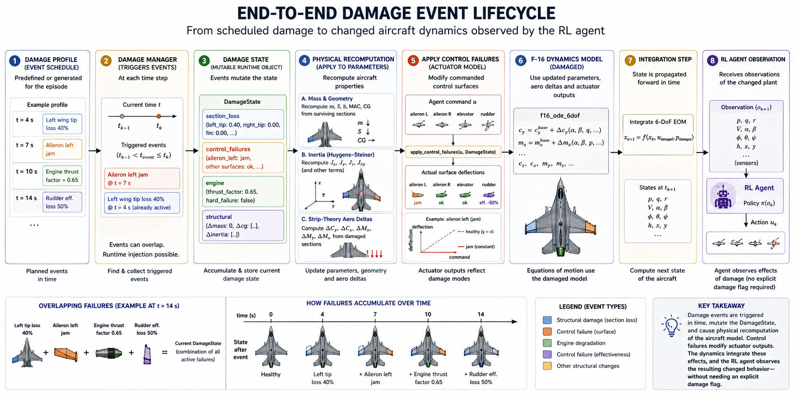
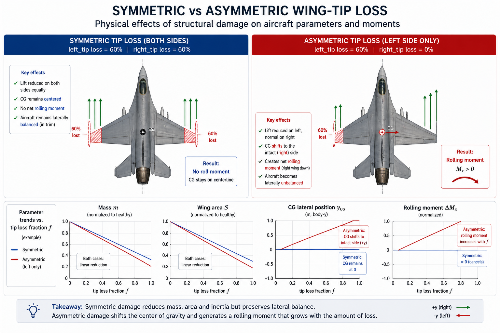

# Implementation and examples — F-16 damage

This page describes the structure of the damage subsystem code and contains
the worked examples. A short overview and quick start are on
[Aircraft damage modeling](aircraft-damage-modeling.md). All formulas are
in [Damage modeling mathematics](aircraft-damage-modeling-math.md).

## Architecture and physical model

The implementation lives at
`tensoraerospace/aerospacemodel/f16/nonlinear/damage/`. A detailed design
document (outside the main navigation) is at
`docs/superpowers/specs/2026-04-28-aircraft-damage-modeling-design.md` —
available in the repository sources.

Key points:

- **Parametric geometry recompute** — at each damage event, mass, wing
  area, span, MAC, centre of gravity, and the inertia tensor are
  recomputed from per-section contributions using Huygens-Steiner.
- **Strip-theory aerodynamic corrections** — each section contributes
  proportionally to lost lift/drag/moment when damaged. Approximate
  fidelity ~10–20 % vs full vortex-lattice methods (VLM, Vortex Lattice
  Method) — adequate for RL training and quick FDM simulations, not for
  certification-grade modelling.
- **Asymmetric damage requires the angular 6-DoF model** with
  `split_stab=True` (4-input action: `[stab_left, stab_right, aileron,
  rudder]` — separate channel per stabilator half plus combined ailerons
  and rudder). Symmetric damage works in both longitudinal and angular envs.
- **Bit-identical baseline** — without a `damage_profile`, env behaviour
  is byte-for-byte identical to the un-damaged baseline. Existing tests,
  trained agents, and saved trajectories work unchanged.

## How the damage model works

The damage subsystem turns the F-16 into a piecewise-time-varying plant.
It does this with three linked layers: a **section-based geometry**, a
**damage state** evolved by scheduled events, and a **runtime physics
recompute** that feeds updated parameters and aero-coefficient deltas
back into the existing F-16 ODEs.

The diagram below shows how a scheduled event flows through the entire
pipeline — from `DamageProfile` to the agent's observation:



### Layer 1 — Section-based geometry

The aircraft is decomposed into 13 named sections (6 wing + 2 stabilator
halves + vertical tail + 3 control surfaces + fuselage). Each section
carries the data needed to compute its own contribution to the
aircraft-level totals: position (`span_position`, `aero_x_arm`, `cg_local`),
size (`area`, `chord`, `sweep`), inertial properties (`mass`, local
`inertia_local`), and aerodynamic coefficients (`cl_alpha_contribution`,
`cd0_contribution`).


The section data lives declaratively in
`tensoraerospace/aerospacemodel/f16/nonlinear/damage/data/f16_geometry.yaml`
and is loaded into a `BaseGeometry` object through `load_f16_geometry()`.
Geometry is calibrated so that the sum of section contributions matches
the existing `F16AngularParameters` baseline within ~1 % for mass and
area, and ~5 % for the inertia tensor — see the calibration tests in
`tests/aerospacemodel/f16_damage/presets_test.py`.

### Layer 2 — DamageState evolved by events

`DamageState` is a mutable runtime object describing the current health
of every section, every control surface, and the engine. It tracks four
sub-states:

- `section_loss: dict[str, float]` — fraction in `[0, 1]` of each section
  that is missing.
- `control_failures: dict[str, ControlFailure]` — per-surface failure
  modes (`jam`, `efficiency_loss`, `lost`, `free_floating`).
- `engine: EngineState` — `thrust_factor` and `hard_failure` flag.
- `structural: StructuralState` — additional mass / CG / inertia deltas
  not tied to a specific section (e.g., dropped stores, ice accretion).

A `DamageProfile` is a list of `DamageEvent` entries each scheduled at a
specific `trigger_time`. The `DamageManager` (owned by the env) processes
the schedule on every step:

```python
def update(self, t_current, t_previous):
    triggered = [
        e for e in self.profile.events
        if t_previous < e.trigger_time <= t_current
    ]
    for ev in triggered:
        self._apply_event(ev)        # mutates DamageState
    if triggered:
        apply_to_params(self.params, self.geometry, self.state)
    return triggered
```

Multiple events can stack (compound failures), and an injected one-shot
event can be added at runtime via `damage_manager.inject_event(...)` —
useful for RL curricula where damage is sampled per episode.


### Layer 3 — Runtime physics recompute

When at least one event triggers, three physics computations run, in
order (full formulas in the
[mathematics document](aircraft-damage-modeling-math.md)):

**(a) Mass-geometry recompute.** Per-section masses scale by $(1 - f_s)$
and the aircraft-level `m`, wing area `S`, span `b`, MAC `bA`, and CG
position are recomputed by mass-weighted aggregation. Symmetric tip loss
keeps the CG centred; asymmetric loss shifts it towards the surviving
side. See
[Effective mass and centre of gravity](aircraft-damage-modeling-math.md#effective-mass-and-centre-of-gravity)
and [Aerodynamic aggregates](aircraft-damage-modeling-math.md#aerodynamic-aggregates).

**(b) Inertia recompute via Huygens-Steiner.** For each surviving section
with effective mass $m^{eff}_s$, the parallel-axis theorem produces full
$J_{xx}, J_{yy}, J_{zz}, J_{xy}$ relative to the current aircraft CG. The
$J_{xy}$ (not $J_{xz}$) convention as the active off-diagonal is a
deliberate body-frame choice in this F-16 model. Full derivation in
[Inertia tensor via Huygens-Steiner](aircraft-damage-modeling-math.md#inertia-tensor-via-huygens-steiner).


The plot above shows how `m`, `S`, `Jx`, and `cg_y` evolve as a function
of wing-tip loss fraction. Symmetric loss (blue) decays linearly without
disturbing the CG; asymmetric (red) introduces a CG shift that grows
with `f`.

**(c) Strip-theory aerodynamic corrections.** Each section contributes
its own additive delta to the six aircraft-level coefficients on top of
the baseline lookup tables: $\Delta C_y, \Delta C_x, \Delta C_z, \Delta M_x,
\Delta M_y, \Delta M_z$. Moment deltas include the section's lever arm,
so losing a single tip produces a net rolling moment, while symmetric
loss cancels. All formulas in
[Strip-theory aerodynamic deltas](aircraft-damage-modeling-math.md#strip-theory-aerodynamic-deltas).


The two panels show this duality. **Left**: symmetric tip loss reduces
`Cy` proportionally — at `α = 10°` and 60 % bilateral loss, `ΔCy ≈ -0.10`,
i.e. ~12 % of the healthy lift. **Right**: asymmetric (left-only) loss
generates a roll-moment delta `ΔMx` that scales with both `α` and `f` —
this is the physics behind the dogfight scenario in
`example/failure_demos/f16_damage_dogfight_demo.py`.

The conceptual companion below collects the same physics into a single
side-by-side comparison: symmetric loss preserves balance and only
reduces lift, while asymmetric loss additionally introduces a CG shift
and a rolling moment that grows with the loss fraction.



### Putting it together — what the agent sees

Once damage is active, every step of the F-16 ODE picks up the corrections
through a single hook:

```python
# inside f16_ode_6dof
cy = get_cy(...) + delta_cy(α, β, geo, damage_state)
mx = get_mx(...) + delta_mx(α, β, geo, damage_state)
# ... etc for cx, cz, my, mz
```

Actuator commands also pass through `apply_control_failures(u, state)`
before reaching the integrator, so a jammed control surface produces a
non-trivial output independent of the agent's command. The agent therefore
does not need any explicit damage-state input: the dynamics it observes
**are** the damaged plant.

### Visual companion — the 3D web viewer

The same flight log structure that drives the analytics plots also
feeds an interactive WebGL viewer. With `render_mode="3d_web"` on the
env, calling `env.render()` after the episode opens a self-contained
HTML in the browser (or returns inline HTML in Jupyter):

```python
env = NonlinearAngularF16(..., render_mode="3d_web", damage_profile=profile)
env.reset()
for _ in range(N):
    env.step(action)
env.render()  # → browser tab or Jupyter cell
```

See [Recipe 16 — Interactive 3D viewer](../cookbook/16_3d_viewer.md)
for a walkthrough.

### Worked example — wing tip loss in flight

`example/failure_demos/f16_damage_dogfight_demo.py` runs the angular F-16 with
`damage_profile=WING_STRIKE_LEFT_TIP` (full loss of `left_tip` at
t = 10 s). With zero stick command, the trajectory shows the asymmetry
clearly — pre-damage the aircraft holds straight-and-level; post-damage
a roll moment develops and `ω_x` grows to several deg/s within seconds.


The roll-rate `ω_x` panel is the most direct demonstration: in the healthy
run it stays at zero, but after t = 10 s the damaged run accelerates —
this is exactly the moment imbalance produced by `delta_mx` in the
strip-theory layer. Pitch-rate `ω_z` and elevator stay in their pre-damage
ranges because the loss is not coupled to the pitch axis. The α channel
shows a small drift as the lift coefficient decreases.

## Built-in scenarios

Seven ready-to-use `DamageProfile` constants, importable directly from
`tensoraerospace.aerospacemodel.f16.nonlinear.damage`:

| Preset | Trigger | Effect |
|--------|---------|--------|
| `WING_STRIKE_LEFT_TIP` | t=10 s | Full loss of left wingtip |
| `WING_STRIKE_LEFT_HALF` | t=10 s | Left tip + 50% mid-section |
| `ELEVATOR_JAM_NEUTRAL` | t=5 s  | Both stabilator halves jammed at neutral |
| `ELEVATOR_JAM_PITCH_UP` | t=5 s | Both jammed at +10° |
| `RUDDER_LOST` | t=5 s | Rudder lost |
| `ENGINE_FLAMEOUT` | t=5 s | Engine flameout (thrust = 0) |
| `BIRDSTRIKE_COMPOUND` | t=5 s | 20% right wing + 70% engine loss |

### AIDI presets (AIDI = Adaptive Incremental Dynamic Inversion)

The same module also exposes three parameterised functions reproducing
the failure scenarios from Ul Haq et al. 2026 ("Adaptive Incremental
Dynamic Inversion for damaged F-16 control") — they return a
configurable `DamageProfile`:

```python
from tensoraerospace.aerospacemodel.f16.nonlinear.damage import (
    stab_efficiency_step,
    aileron_efficiency_loss_schedule,
    rudder_total_loss,
)

# Single-step efficiency loss on the (left) stabilator
# (mu = surviving fraction of effectiveness)
profile_a = stab_efficiency_step(t_inject=5.0, mu=0.25, surface="stab_left")

# Progressive efficiency-loss schedule on an aileron
profile_b = aileron_efficiency_loss_schedule(
    t_start=2.0, dt_between=1.0,
    levels=(1.0, 0.75, 0.5, 0.25, 0.0),
    surface="aileron_left",
)

# Complete rudder loss — the "worst case" preset from the paper
profile_c = rudder_total_loss(t_inject=10.0)
```

A ready-to-run example is in `example/reinforcement_learning/incremental_adp/example_aidi_damage_f16.ipynb`.

## Custom scenarios

```python
from tensoraerospace.aerospacemodel.f16.nonlinear.damage import (
    DamageEvent, DamageProfile,
)

profile = DamageProfile(events=[
    DamageEvent(8.0, "section_loss",
                payload={"section": "right_mid", "loss_fraction": 0.4},
                label="right_mid_40pct"),
    DamageEvent(15.0, "engine_failure",
                payload={"thrust_factor": 0.3}),
])
```

Each event is `DamageEvent(trigger_time, event_type, payload, label=None, duration=None)`.
The `label` is used in `info["damage_events_triggered"]` and the log for
readability (defaults to `event_type` if unset). The `duration` field is
reserved for future temporal effects and is currently ignored — damage is
permanent.

### Event types and payload

#### `section_loss`

```python
payload = {"section": str, "loss_fraction": float}
```

`loss_fraction` ∈ [0, 1] (out-of-range values are clipped). Valid section
names for the F-16:

| Group | Section names |
|-------|--------------|
| Wing (6) | `left_root`, `left_mid`, `left_tip`, `right_root`, `right_mid`, `right_tip` |
| Stabilator (2) | `stab_left`, `stab_right` |
| Vertical tail | `vtail` |
| Control surfaces | `rudder`, `aileron_left`, `aileron_right` |
| Fuselage | `fuselage_main` |

Note: the API accepts `fuselage_main`, but losing the fuselage is
physically meaningless (catastrophic mass loss). It exists primarily for
mass-balance calibration and is normally not used in scenarios.

#### `control_failure`

```python
payload = {"surface": str, "mode": str, ...}  # extra fields depend on mode
```

Valid surfaces: `stab_left`, `stab_right`, `aileron_left`,
`aileron_right`, `rudder`. Valid modes:

| Mode | Extra payload fields | Effect |
|------|----------------------|--------|
| `jam` | `jam_position_rad: float` | Surface frozen at the given position (rad), agent commands ignored |
| `efficiency_loss` | `efficiency: float ∈ [0, 1]` | Command multiplied by `efficiency` |
| `lost` | — | Surface unresponsive (output = 0) |
| `free_floating` | — | Same as `lost` (output = 0) |

#### `engine_failure`

```python
payload = {"thrust_factor": float, "hard_failure": bool}
```

`thrust_factor` ∈ [0, 1] is the thrust multiplier; `hard_failure=True`
forces zero thrust regardless of the multiplier. Both fields are optional
(supply only one if needed).

#### `structural_change`

```python
payload = {
    "mass_delta_kg": float,
    "cg_shift_m": tuple[float, float, float],
    "inertia_delta": tuple[float, float, float, float],  # ΔJx, ΔJy, ΔJz, ΔJxy
}
```

All fields are optional and applied additively (multiple events
accumulate). Used for effects not tied to a specific section: store
release / drops, ice accretion, fuel burn.

### Runtime event injection

In addition to a pre-loaded `DamageProfile`, you can inject one-shot
events at runtime — useful for curriculum RL. The `trigger_time` is
absolute simulation time (since episode start):

```python
from tensoraerospace.aerospacemodel.f16.nonlinear.damage import DamageEvent

# In a callback or training loop, t_now is the current sim time
event = DamageEvent(
    trigger_time=t_now + 0.5,            # fires 0.5 s from now
    event_type="section_loss",
    payload={"section": "left_tip", "loss_fraction": 0.5},
    label="injected_left_tip",
)
env.unwrapped.damage_manager.inject_event(event)
```

Injected events are single-fire and removed from the queue once they trigger.

## Random profiles for RL

```python
from tensoraerospace.aerospacemodel.f16.nonlinear.damage import (
    RandomDamageProfileGenerator,
)

generator = RandomDamageProfileGenerator(
    event_types=["section_loss", "control_failure", "engine_failure"],
    time_range=(5.0, 25.0),
    severity_range=(0.1, 1.0),
    num_events_range=(1, 2),
    seed=42,
    sections=("left_tip", "right_tip", "stab_left", "stab_right"),  # optional
)

profile = generator.sample()
obs, info = env.reset(options={"damage_profile": profile})
```

Constructor parameters:

- `event_types: list[str]` — which event types are eligible for sampling
  (`"section_loss"`, `"control_failure"`, `"engine_failure"`).
- `time_range: (float, float)` — uniform range for `trigger_time`.
- `severity_range: (float, float)` — range for `loss_fraction` on
  `section_loss` (default `(0.1, 1.0)`).
- `num_events_range: (int, int)` — number of events per profile
  (default `(1, 1)`).
- `sections: tuple[str, ...]` — sections allowed for `section_loss`.
  Default: `("left_tip", "left_mid", "right_tip", "right_mid", "stab_left", "stab_right")`
  — i.e. the "losable" wing and stabilator sections (no roots, vtail or
  fuselage).
- `seed: int | None` — for reproducibility.

For `control_failure`, surfaces and modes are sampled uniformly from a
built-in list; for `efficiency_loss` the coefficient is drawn from
$[0.2, 0.9]$, for `jam` from $[-0.15, 0.15]$ rad.

## What the env returns in `info`

When `damage_profile` or `damage_observable` is active, the `info` dict
returned from `env.step(action)` (not from `env.reset()`) contains:

- `info["damage_state"]` — full JSON snapshot of the current
  `DamageState` (fields `section_loss`, `control_failures`, `engine`,
  `structural`). Populated **on every step**.
- `info["damage_events_triggered"]` — list of labels (`label`, falling
  back to `event_type` if `label=None`) for events that fired this step.
  Present **only** on steps where events fire.

The env also accumulates history in `env.unwrapped.damage_events_log`
(event chronology) and `damage_state_log` (state snapshots at change
points) — used by the 3D viewer and convenient for offline analysis.

### Damage event callback

You can register a callback fired right after each event is applied
(useful for TensorBoard / WandB logging):

```python
def on_damage(event, state):
    print(f"[t={event.trigger_time}] {event.label or event.event_type}")

env = NonlinearAngularF16(
    ...,
    damage_profile=profile,
    damage_event_callback=on_damage,
)
```

## Observable damage

By default the agent does not observe the damage state — it must infer
deterioration from the dynamics. Pass `damage_observable=True` to extend
the observation vector with the loss fractions of **all** sections
(including stabilator, vtail, control surfaces, and fuselage — 13 total
on the F-16) and the scalar `engine.thrust_factor`:

```python
env = NonlinearAngularF16(
    initial_state=np.zeros(14),
    number_time_steps=2000,
    damage_profile=profile,
    damage_observable=True,
    split_stab=True,
)
```

Observation layout: `[14 base state elements, f_s for each section in
geo.section_names() order, thrust_factor]`. The 14 base elements are the
state vector of the angular 6-DoF F-16 (see
[Nonlinear 6-DoF angular](f16_nonlinear_angular.md)). With
`track_altitude=True` the base part grows from 14 to 16 and the total
becomes `16 + N_sections + 1`. For the F-16 standard configuration this
is `14 + 13 + 1 = 28`.

You can also enable `damage_observable=True` **without** a
`damage_profile` — the agent then sees zeros in the damage fields and
unity in `thrust_factor`, but the observation dimensionality stays the
same. Useful for training "universal" policies with fixed input
dimensionality.

## Resetting damage between episodes

`env.reset()` clears all damage and re-baselines parameters. To override
the profile per episode:

```python
obs, info = env.reset(options={"damage_profile": new_profile})
```

This is the standard pattern for RL training with randomised damage.

## Adaptive RL agents under damage

The repository ships two end-to-end examples that demonstrate online
adaptive RL agents flying a 60-second mission with a damage event injected
at t=20 s. Both use the **same** scenario — symmetric 30 % loss of both
wing tips, applied through the proper `DamageProfile` API — so they
provide a direct apples-to-apples comparison.

| Example | Path | Format |
|---------|------|--------|
| iADP (Incremental ADP) | `example/reinforcement_learning/incremental_adp/example_iadp_damage_f16.py` | runnable script |
| ET-DHP (Event-Triggered DHP) | `example/reinforcement_learning/incremental_adp/example_etdhp_damage_f16.py` | runnable script |
| ET-DHP (notebook version) | `example/reinforcement_learning/incremental_adp/example_etdhp_damage_f16.ipynb` | Jupyter notebook |
| AIDI (Adaptive Incremental Inversion) | `example/reinforcement_learning/incremental_adp/example_aidi_damage_f16.ipynb` | Jupyter notebook |

### Common scenario

* Underlying env: `NonlinearLongitudinalF16-v0` at the global trim
  `(α* = +4.92°, δₑ* = -4.45°)`.
* Reference: 0.8 °/s (iADP) or 3° (ET-DHP) sinusoidal command on
  pitch-rate / α with a 2 s warm-up.
* Damage profile:

  ```python
  DamageProfile(events=[
      DamageEvent(20.0, "section_loss",
                  payload={"section": "left_tip", "loss_fraction": 0.30}),
      DamageEvent(20.0, "section_loss",
                  payload={"section": "right_tip", "loss_fraction": 0.30}),
  ])
  ```

  At t=20 s the env recomputes `m`, `S`, `bA`, `Jx/Jy/Jz/Jxy` from the
  per-section contributions, and the longitudinal ODE picks up
  $\Delta C_y = -\sum_s C_{l\alpha,s}\,\alpha\,f_s\,A_s/S_{base}$
  from strip theory.

### iADP — closed-form policy + RLS plant identifier

```python
from tensoraerospace.aerospacemodel.f16.nonlinear.damage import (
    DamageEvent, DamageProfile,
)
from tensoraerospace.agent.iadp import IADPAgent, IADPConfig

profile = DamageProfile(events=[
    DamageEvent(20.0, "section_loss",
                payload={"section": "left_tip", "loss_fraction": 0.30}),
    DamageEvent(20.0, "section_loss",
                payload={"section": "right_tip", "loss_fraction": 0.30}),
])

env = gym.make(
    "NonlinearLongitudinalF16-v0",
    number_time_steps=6002,
    initial_state=[alpha_trim, 0.0, stab_trim, 0.0],
    reference_signal=...,
    state_space=["alpha", "wz", "stab", "dstab"],
    control_space=["stab"],
    use_reward=False,
    dt=0.01,
    integrator="euler",
    control_bias=stab_trim_deg,
    damage_profile=profile,
).unwrapped
```

iADP (Incremental Approximate Dynamic Programming) uses a fixed-forgetting
RLS (Recursive Least Squares) to track the local incremental plant
$\tilde{F}, \tilde{G}$ online, then derives the optimal control in closed
form:

$$\Delta\delta_t = -(R + \gamma\,\tilde{G}^T \tilde{P} \tilde{G})^{-1}\big[R\,\delta_{t-1} + \gamma\,\tilde{G}^T \tilde{P} X_t + \gamma\,\tilde{G}^T \tilde{P} \tilde{F} \Delta X_t\big]$$

Because the RLS sees the new plant through the residuals as soon as the
damage fires, $\tilde{G}$ settles within tens of milliseconds — no fault
detection or mode switching is required.

**Sample run output:**

```
=== Baseline (no damage) ===
Pre-damage RMSE  (5 s ≤ t < 20 s):  0.0701 °/s
Post-damage RMSE (22 s ≤ t ≤ 60 s): 0.0663 °/s

=== With damage (30% bilateral wing-tip loss at t=20s) ===
Pre-damage RMSE  (5 s ≤ t < 20 s):  0.0701 °/s
Post-damage RMSE (22 s ≤ t ≤ 60 s): 0.0703 °/s   ← negligible degradation
G̃ at t = 19.5 s: -0.00013                        ← pre-damage gain
G̃ at t = 25.0 s: -0.00017                        ← RLS still converging
G̃ at t = end:    +0.00010                        ← new stable estimate
Damage events triggered:
  t=19.99s : left_tip_30pct_loss
  t=19.99s : right_tip_30pct_loss
```

The post-damage RMSE (0.0703 °/s) is essentially identical to the
no-damage baseline (0.0663 °/s). iADP keeps tracking the sinusoidal
command without fault detection — the RLS observes the new plant gain
through the residuals and the closed-form policy adapts.

### ET-DHP — event-triggered actor/critic with frozen plant NN

```python
from tensoraerospace.agent.et_dhp import ETDHPAgent, ETDHPConfig

cfg = ETDHPConfig(
    actor_hidden=(24, 24), critic_hidden=(24, 24), model_hidden=(24, 24),
    Q=[10.0, 0.1, 0.0, 0.0], R=[1.0], gamma=0.95,
    u_bound=2.0, rho=0.2, trigger_floor=0.1,
    seed=0,
)
agent = ETDHPAgent(n_state=4, n_control=1,
                   state_transform=state_transform, config=cfg)
agent.fit_plant_model(states_arr, actions_arr, next_states_arr)  # offline
```

ET-DHP (Event-Triggered Dual Heuristic Programming) uses three neural
networks: a plant model, an actor, and a costate critic. The plant model
is **pre-trained offline on the healthy aircraft** and frozen. A
Lipschitz event trigger fires actor/critic updates only when the tracking
error breaches a threshold.

**Sample run output:**

```
=== Baseline (no damage) ===
Pre-damage  (5–20 s):    MAE=0.094°  RMSE=0.114°
Post-damage (22–60 s):   MAE=0.166°  RMSE=0.235°
Triggers:                56 pre, 261 post

=== With damage (30% bilateral wing-tip loss at t=20s) ===
Pre-damage  (5–20 s):    MAE=0.210°  RMSE=0.268°
Post-damage (22–60 s):   MAE=0.702°  RMSE=0.913°   ← ~4× degradation
Triggers:                219 pre, 547 post           ← 2× rise after damage
Damage events:
  t=19.99s : left_tip_30pct_loss
  t=19.99s : right_tip_30pct_loss
```

Post-damage tracking degrades to ~0.9° RMSE (vs ~0.24° no-damage). The
event trigger correctly responds to the new plant — trigger count
roughly doubles after t=20 s — but the actor/critic alone cannot fully
compensate because the frozen plant NN's Jacobians `F = ∂f/∂x`,
`G = ∂f/∂u` no longer match the damaged dynamics.

### iADP vs ET-DHP under damage — side by side

| | iADP | ET-DHP |
|---|---|---|
| Plant model | RLS, online | Neural network, frozen offline |
| Adaptation latency | ~10 ms (one RLS update) | Episodes (actor/critic gradient steps) |
| Detection signal | $\tilde{G}$ shift in RLS | Trigger-count surge |
| Post-damage RMSE | ≈ baseline (no degradation) | ~4× baseline |
| Trade-off | Strong on adaptation, requires PE warm-start (Persistence of Excitation — input must be sufficiently exciting) | Robust by design via event triggering, but plant NN must be re-fit on damaged data to recover full performance |

### Possible extensions

- **Online plant-NN updates for ET-DHP**: re-run `agent.fit_plant_model(...)`
  on a sliding window of recent transitions, effectively making the plant
  model online too.
- **Damage-conditioned policies**: pass `damage_observable=True` to the env
  so the agent's observation includes the per-section loss vector and
  engine thrust factor — the actor can then condition on the damage state
  directly.
- **Curriculum training**: combine `RandomDamageProfileGenerator` with a
  per-episode `env.reset(options={"damage_profile": ...})` to train an
  agent that has seen a distribution of damage scenarios.
