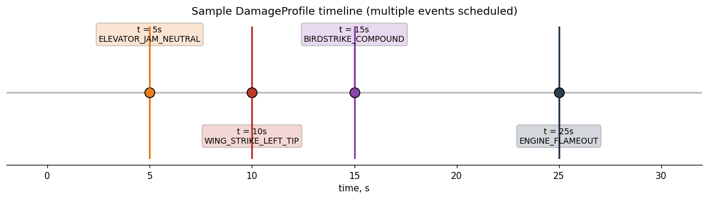
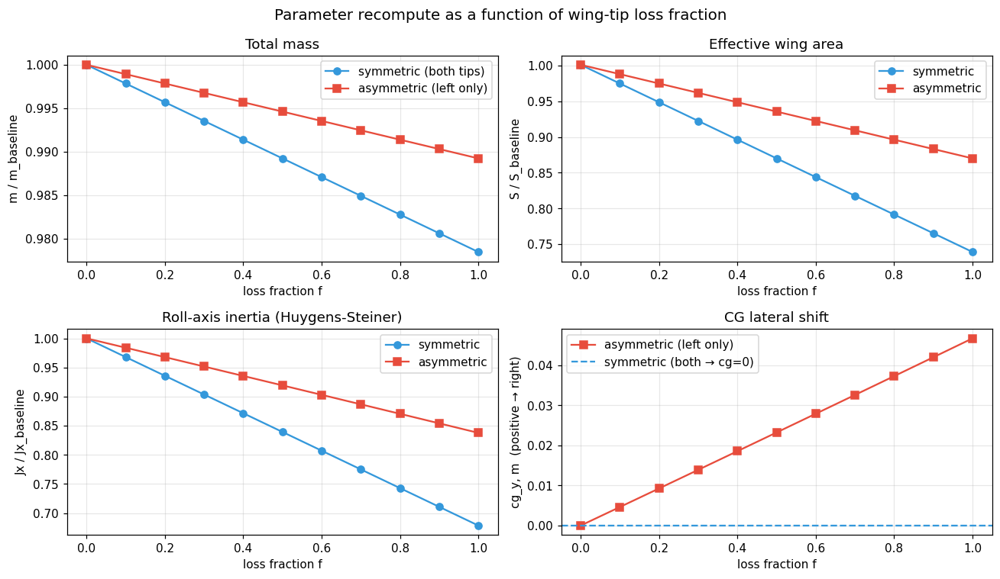
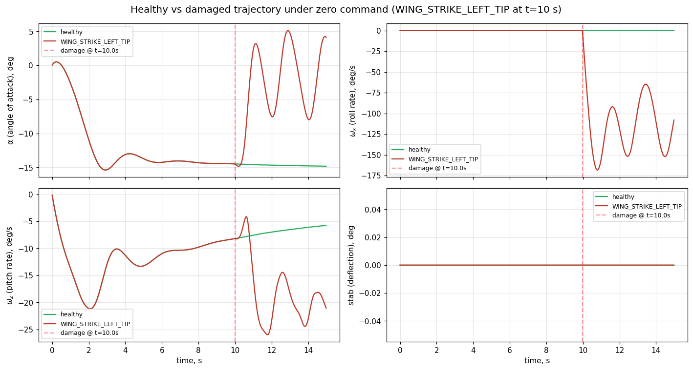

# Aircraft Damage Modeling

The damage subsystem turns the F-16 from a fixed plant into a **time-varying
control object**. It lets you schedule failures during a simulation — wing
tip loss, jammed control surfaces, engine failure, structural changes — and
the env recomputes the aircraft's mass, inertia, aerodynamic coefficients,
and control-surface effectiveness in real time. The agent under control then
faces a different plant from the moment a damage event fires.

Currently supported on the **nonlinear F-16** (longitudinal and 6-DoF angular).
The same `damage_profile` API plugs into both env variants and into any
controller / RL agent that uses them — see [Adaptive RL agents under
damage](#adaptive-rl-agents-under-damage) below for two worked examples.

## Quick start

```python
import numpy as np

from tensoraerospace.aerospacemodel.f16.nonlinear.damage import (
    WING_STRIKE_LEFT_TIP,
)
from tensoraerospace.envs.f16.nonlinear_angular import NonlinearAngularF16

env = NonlinearAngularF16(
    initial_state=np.zeros(14),
    number_time_steps=2000,
    damage_profile=WING_STRIKE_LEFT_TIP,
    split_stab=True,
)
obs, _ = env.reset()
for _ in range(2000):
    obs, r, term, trunc, info = env.step(np.zeros(4))
    if info.get("damage_events_triggered"):
        print(info["damage_events_triggered"])
```

A runnable version of this snippet ships at `example/f16_damage_dogfight_demo.py`.

## How the damage model works

The damage subsystem turns the F-16 into a piecewise-time-varying plant.
It does this with three linked layers: a **section-based geometry**, a
**damage state** evolved by scheduled events, and a **runtime physics
recompute** that feeds updated parameters and aero-coefficient deltas
back into the existing F-16 ODEs.

### Layer 1 — Section-based geometry

The aircraft is decomposed into 13 named sections (6 wing + 2 stabilator
halves + vertical tail + 3 control surfaces + fuselage). Each section
carries the data needed to compute its own contribution to the
aircraft-level totals: position (`span_position`, `aero_x_arm`, `cg_local`),
size (`area`, `chord`, `sweep`), inertial properties (`mass`, local
`inertia_local`), and aerodynamic coefficients (`cl_alpha_contribution`,
`cd0_contribution`).


The section data lives declaratively in
`tensoraerospace/aerospacemodel/f16/nonlinear/damage/data/f16_geometry.yaml`
and is loaded into a `BaseGeometry` object through `load_f16_geometry()`.
Geometry is calibrated so that the sum of section contributions matches
the existing `F16AngularParameters` baseline within ~1 % for mass and
area, and ~5 % for the inertia tensor — see the calibration tests in
`tests/aerospacemodel/f16_damage/presets_test.py`.

### Layer 2 — DamageState evolved by events

`DamageState` is a mutable runtime object describing the current health
of every section, every control surface, and the engine. It tracks four
sub-states:

- `section_loss: dict[str, float]` — fraction in `[0, 1]` of each section
  that is missing.
- `control_failures: dict[str, ControlFailure]` — per-surface failure
  modes (`jam`, `efficiency_loss`, `lost`, `free_floating`).
- `engine: EngineState` — `thrust_factor` and `hard_failure` flag.
- `structural: StructuralState` — additional mass / CG / inertia deltas
  not tied to a specific section (e.g., dropped stores, ice accretion).

A `DamageProfile` is a list of `DamageEvent` entries each scheduled at a
specific `trigger_time`. The `DamageManager` (owned by the env) processes
the schedule on every step:

```python
def update(self, t_current, t_previous):
    triggered = [
        e for e in self.profile.events
        if t_previous < e.trigger_time <= t_current
    ]
    for ev in triggered:
        self._apply_event(ev)        # mutates DamageState
    if triggered:
        apply_to_params(self.params, self.geometry, self.state)
    return triggered
```

Multiple events can stack (compound failures), and an injected one-shot
event can be added at runtime via `damage_manager.inject_event(...)` —
useful for RL curricula where damage is sampled per episode.



### Layer 3 — Runtime physics recompute

When at least one event triggers, three physics computations run, in
order:

**(a) Mass-geometry recompute.** Per-section masses scale by `(1 - f_s)`
and the aircraft-level `m`, wing area `S`, span `b`, MAC `bA`, and CG
position are recomputed by mass-weighted aggregation. Symmetric tip loss
keeps the CG centred; asymmetric loss shifts it towards the surviving
side.

**(b) Inertia recompute via Huygens-Steiner.** For each surviving section
with effective mass `m_s_eff`, the parallel-axis theorem gives:

$$J_{xx,\text{aircraft}} = \sum_s \Bigl[I_{xx,s} \cdot (1-f_s) + m_s^{eff} \cdot \bigl((y_s - y_{cg})^2 + (z_s - z_{cg})^2\bigr)\Bigr]$$

with analogous forms for `Jyy`, `Jzz`, and the off-diagonal `Jxy`. The
`+m·rx·ry` sign on the Jxy parallel-axis term is correct for this
codebase's body-frame convention (where `Jxy` — not `Jxz` — is the
active off-diagonal coupling in `f16_ode_6dof`; see
`F16AngularParameters.Jxy = 1331.4`).



The plot above shows how `m`, `S`, `Jx`, and `cg_y` evolve as a function
of wing-tip loss fraction. Symmetric loss (blue) decays linearly without
disturbing the CG; asymmetric (red) introduces a CG shift that grows
with `f`.

**(c) Strip-theory aerodynamic corrections.** Each section contributes
its own additive delta to the aircraft-level coefficients on top of the
baseline lookup tables. For lift:

$$\Delta C_y \;=\; -\sum_s c_{l\alpha,s} \cdot \alpha \cdot f_s \cdot \frac{\text{area}_s}{S_{\text{base}}}$$

and analogously for drag (`ΔCx`, with an extra jagged-edge term that
peaks at `f = 0.5`), side-force (`ΔCz`, dominated by vertical tail),
and the three moment coefficients (`ΔMx, ΔMy, ΔMz`). The moment deltas
include the section's lever arm: roll moment `ΔMx ∝ Δlift × y_arm`, so
losing a single tip produces a net rolling moment, while symmetric loss
cancels.


The two panels show this duality. **Left**: symmetric tip loss reduces
`Cy` proportionally — at `α = 10°` and 60 % bilateral loss, `ΔCy ≈ -0.10`,
i.e. ~12 % of the healthy lift. **Right**: asymmetric (left-only) loss
generates a roll-moment delta `ΔMx` that scales with both `α` and `f` —
this is the physics behind the dogfight scenario in
`example/f16_damage_dogfight_demo.py`.

### Putting it together — what the agent sees

Once damage is active, every step of the F-16 ODE picks up the corrections
through a single hook:

```python
# inside f16_ode_6dof
cy = get_cy(...) + delta_cy(α, β, geo, damage_state)
mx = get_mx(...) + delta_mx(α, β, geo, damage_state)
# ... etc for cx, cz, my, mz
```

The actuator commands also pass through `apply_control_failures(u, state)`
before reaching the integrator, so a jammed control surface produces a
non-trivial output independent of the agent's command. The agent therefore
does not need any explicit damage-state input: the dynamics it observes
**are** the damaged plant.

### Worked example — wing tip loss in flight

`example/f16_damage_dogfight_demo.py` runs the angular F-16 with
`damage_profile=WING_STRIKE_LEFT_TIP` (full loss of `left_tip` at
t = 10 s). With zero stick command, the trajectory shows the asymmetry
clearly — pre-damage the aircraft holds straight-and-level; post-damage
a roll moment develops and `ω_x` grows to several deg/s within seconds.



The roll-rate `ω_x` panel is the most direct demonstration: in the healthy
run it stays at zero, but after t = 10 s the damaged run accelerates —
this is exactly the moment imbalance produced by `delta_mx` in the
strip-theory layer. Pitch-rate `ω_z` and elevator stay in their pre-damage
ranges because the loss is not coupled to the pitch axis. The α channel
shows a small drift as the lift coefficient decreases.

## Built-in scenarios

| Preset | Trigger | Effect |
|--------|---------|--------|
| `WING_STRIKE_LEFT_TIP` | t=10 s | Full loss of left wingtip |
| `WING_STRIKE_LEFT_HALF` | t=10 s | Left tip + 50% mid-section |
| `ELEVATOR_JAM_NEUTRAL` | t=5 s  | Both stabilator halves jammed at neutral |
| `ELEVATOR_JAM_PITCH_UP` | t=5 s | Both jammed at +10° |
| `RUDDER_LOST` | t=5 s | Rudder lost |
| `ENGINE_FLAMEOUT` | t=5 s | Engine flameout (thrust = 0) |
| `BIRDSTRIKE_COMPOUND` | t=5 s | 20% right wing + 70% engine loss |

Import them from `tensoraerospace.aerospacemodel.f16.nonlinear.damage`.

## Custom scenarios

```python
from tensoraerospace.aerospacemodel.f16.nonlinear.damage import (
    DamageEvent, DamageProfile,
)

profile = DamageProfile(events=[
    DamageEvent(8.0, "section_loss",
                payload={"section": "right_mid", "loss_fraction": 0.4}),
    DamageEvent(15.0, "engine_failure",
                payload={"thrust_factor": 0.3}),
])
```

Available event types:

- `section_loss` — payload `{"section": str, "loss_fraction": float in [0,1]}`
- `control_failure` — payload `{"surface": str, "mode": str, ...mode-specific}`
  Modes: `"jam"` (with `jam_position_rad`), `"efficiency_loss"` (with `efficiency`), `"lost"`, `"free_floating"`
- `engine_failure` — payload `{"thrust_factor": float, "hard_failure": bool}`
- `structural_change` — payload `{"mass_delta_kg": float, "cg_shift_m": tuple, "inertia_delta": tuple}`

## Random profiles for RL

```python
from tensoraerospace.aerospacemodel.f16.nonlinear.damage import (
    RandomDamageProfileGenerator,
)

generator = RandomDamageProfileGenerator(
    event_types=["section_loss", "control_failure"],
    time_range=(5.0, 25.0),
    severity_range=(0.1, 1.0),
    num_events_range=(1, 2),
    seed=42,
)

profile = generator.sample()
obs, info = env.reset(options={"damage_profile": profile})
```

## Observable damage

By default, the agent does not observe the damage state — it must infer
deterioration from the dynamics. Pass `damage_observable=True` to extend
the observation vector with section-loss fractions and engine thrust
factor:

```python
env = NonlinearAngularF16(
    initial_state=np.zeros(14),
    number_time_steps=2000,
    damage_profile=profile,
    damage_observable=True,
    split_stab=True,
)
```

The observation grows from 14 to `14 + N_sections + 1` floats.

## Adaptive RL agents under damage

The repository ships two end-to-end examples that demonstrate online
adaptive RL agents flying a 60-second mission with a damage event injected
at t=20 s. Both use the **same** scenario — symmetric 30 % loss of both
wing tips, applied through the proper `DamageProfile` API — so they
provide a direct apples-to-apples comparison.

| Example | Path | Format |
|---------|------|--------|
| iADP (Incremental ADP) | `example/reinforcement_learning/example_iadp_damage_f16.py` | runnable script |
| ET-DHP (Event-Triggered DHP) | `example/reinforcement_learning/example_etdhp_damage_f16.py` | runnable script |
| ET-DHP (notebook version) | `example/reinforcement_learning/example_etdhp_damage_f16.ipynb` | Jupyter notebook |

### Common scenario

* Underlying env: `NonlinearLongitudinalF16-v0` at the global trim
  `(α* = +4.92°, δₑ* = -4.45°)`.
* Reference: 0.8 °/s (iADP) or 3° (ET-DHP) sinusoidal command on
  pitch-rate / α with a 2 s warm-up.
* Damage profile:

  ```python
  DamageProfile(events=[
      DamageEvent(20.0, "section_loss",
                  payload={"section": "left_tip", "loss_fraction": 0.30}),
      DamageEvent(20.0, "section_loss",
                  payload={"section": "right_tip", "loss_fraction": 0.30}),
  ])
  ```

  At t=20 s the env recomputes `m`, `S`, `bA`, `Jx/Jy/Jz/Jxy` from the
  per-section contributions, and the longitudinal ODE picks up
  `Δcy = -Σ cl_α_s · α · f_s · area_s/S_base` from strip theory.

### iADP — closed-form policy + RLS plant identifier

```python
from tensoraerospace.aerospacemodel.f16.nonlinear.damage import (
    DamageEvent, DamageProfile,
)
from tensoraerospace.agent.iadp import IADPAgent, IADPConfig

profile = DamageProfile(events=[
    DamageEvent(20.0, "section_loss",
                payload={"section": "left_tip", "loss_fraction": 0.30}),
    DamageEvent(20.0, "section_loss",
                payload={"section": "right_tip", "loss_fraction": 0.30}),
])

env = gym.make(
    "NonlinearLongitudinalF16-v0",
    number_time_steps=6002,
    initial_state=[alpha_trim, 0.0, stab_trim, 0.0],
    reference_signal=...,
    state_space=["alpha", "wz", "stab", "dstab"],
    control_space=["stab"],
    use_reward=False,
    dt=0.01,
    integrator="euler",
    control_bias=stab_trim_deg,
    damage_profile=profile,
).unwrapped
```

iADP uses a fixed-forgetting RLS to track the local incremental plant
`F̃, G̃` online, then derives the optimal control in closed form:

$$\Delta\delta_t = -(R + \gamma\,\tilde{G}^T \tilde{P} \tilde{G})^{-1}\big[R\,\delta_{t-1} + \gamma\,\tilde{G}^T \tilde{P} X_t + \gamma\,\tilde{G}^T \tilde{P} \tilde{F} \Delta X_t\big]$$

Because the RLS sees the new plant through the residuals as soon as the
damage fires, `G̃` settles within tens of milliseconds — no fault
detection or mode switching is required.

**Sample run output:**

```
=== Baseline (no damage) ===
Pre-damage RMSE  (5 s ≤ t < 20 s):  0.0701 °/s
Post-damage RMSE (22 s ≤ t ≤ 60 s): 0.0663 °/s

=== With damage (30% bilateral wing-tip loss at t=20s) ===
Pre-damage RMSE  (5 s ≤ t < 20 s):  0.0701 °/s
Post-damage RMSE (22 s ≤ t ≤ 60 s): 0.0703 °/s   ← negligible degradation
G̃ at t = 19.5 s: -0.00013                        ← pre-damage gain
G̃ at t = 25.0 s: -0.00017                        ← RLS still converging
G̃ at t = end:    +0.00010                        ← new stable estimate
Damage events triggered:
  t=19.99s : left_tip_30pct_loss
  t=19.99s : right_tip_30pct_loss
```

The post-damage RMSE (0.0703 °/s) is essentially identical to the
no-damage baseline (0.0663 °/s). iADP keeps tracking the sinusoidal
command without fault detection — the RLS observes the new plant gain
through the residuals and the closed-form policy adapts.

### ET-DHP — event-triggered actor/critic with frozen plant NN

```python
from tensoraerospace.agent.et_dhp import ETDHPAgent, ETDHPConfig

cfg = ETDHPConfig(
    actor_hidden=(24, 24), critic_hidden=(24, 24), model_hidden=(24, 24),
    Q=[10.0, 0.1, 0.0, 0.0], R=[1.0], gamma=0.95,
    u_bound=2.0, rho=0.2, trigger_floor=0.1,
    seed=0,
)
agent = ETDHPAgent(n_state=4, n_control=1,
                   state_transform=state_transform, config=cfg)
agent.fit_plant_model(states_arr, actions_arr, next_states_arr)  # offline
```

ET-DHP uses three neural networks: a plant model, an actor, and a
costate critic. The plant model is **pre-trained offline on the healthy
aircraft** and frozen. The Lipschitz event trigger fires actor/critic
updates only when tracking error breaches a threshold.

**Sample run output:**

```
=== Baseline (no damage) ===
Pre-damage  (5–20 s):    MAE=0.094°  RMSE=0.114°
Post-damage (22–60 s):   MAE=0.166°  RMSE=0.235°
Triggers:                56 pre, 261 post

=== With damage (30% bilateral wing-tip loss at t=20s) ===
Pre-damage  (5–20 s):    MAE=0.210°  RMSE=0.268°
Post-damage (22–60 s):   MAE=0.702°  RMSE=0.913°   ← ~4× degradation
Triggers:                219 pre, 547 post           ← 2× rise after damage
Damage events:
  t=19.99s : left_tip_30pct_loss
  t=19.99s : right_tip_30pct_loss
```

Post-damage tracking degrades to ~0.9° RMSE (vs ~0.24° no-damage). The
event trigger correctly responds to the new plant — trigger count
roughly doubles after t=20 s — but the actor/critic alone cannot fully
compensate because the frozen plant NN's Jacobians `F = ∂f/∂x`,
`G = ∂f/∂u` no longer match the damaged dynamics.

### iADP vs ET-DHP under damage — side by side

| | iADP | ET-DHP |
|---|---|---|
| Plant model | RLS, online | Neural network, frozen offline |
| Adaptation latency | ~10 ms (one RLS update) | Episodes (actor/critic gradient steps) |
| Detection signal | `G̃` shift in RLS | Trigger-count surge |
| Post-damage RMSE | ≈ baseline (no degradation) | ~4× baseline |
| Trade-off | Strong on adaptation, requires PE warm-start | Robust by design via event triggering, but plant NN must be re-fit on damaged data to recover full performance |

### Possible extensions

- **Online plant-NN updates for ET-DHP**: re-run `agent.fit_plant_model(...)`
  on a sliding window of recent transitions, effectively making the plant
  model online too.
- **Damage-conditioned policies**: pass `damage_observable=True` to the env
  so the agent's observation includes the per-section loss vector and
  engine thrust factor — the actor can then condition on the damage state
  directly.
- **Curriculum training**: combine `RandomDamageProfileGenerator` with a
  per-episode `env.reset(options={"damage_profile": ...})` to train an
  agent that has seen a distribution of damage scenarios.

## Architecture and physical model

Implementation lives at
`tensoraerospace/aerospacemodel/f16/nonlinear/damage/`. The design
document is at
`docs/superpowers/specs/2026-04-28-aircraft-damage-modeling-design.md`.

Key points:

- **Parametric geometry recompute** — at each damage event, mass, wing
  area, span, MAC, centre of gravity, and the inertia tensor are
  recomputed from per-section contributions using Huygens-Steiner.
- **Strip-theory aerodynamic corrections** — each section contributes
  proportionally to lost lift/drag/moment when damaged. Approximate
  fidelity ~10–20 % vs full vortex-lattice methods.
- **Asymmetric damage requires the angular 6-DoF model** with
  `split_stab=True` (4-input action: `[stab_left, stab_right, ail, dir]`).
  Symmetric damage works in both longitudinal and angular envs.
- **Bit-identical baseline** — without a `damage_profile`, env behaviour
  is byte-for-byte identical to the un-damaged baseline. Existing tests,
  trained agents, and saved trajectories work unchanged.

## Resetting damage between episodes

`env.reset()` clears all damage and re-baselines parameters. To override
the profile per episode:

```python
obs, info = env.reset(options={"damage_profile": new_profile})
```

This is the standard pattern for RL training with randomised damage.

## Limits

- Linear F-16, B-747, and other models are not yet supported.
- Aerodynamic corrections do not capture wake interference or stalled-flow
  perturbations beyond what the base lookup tables already encode.
- Wing flexibility / aeroelastic effects are not modelled.
- Cascading failures (one event triggering another) are not yet
  implemented; schedule them explicitly in the profile.
