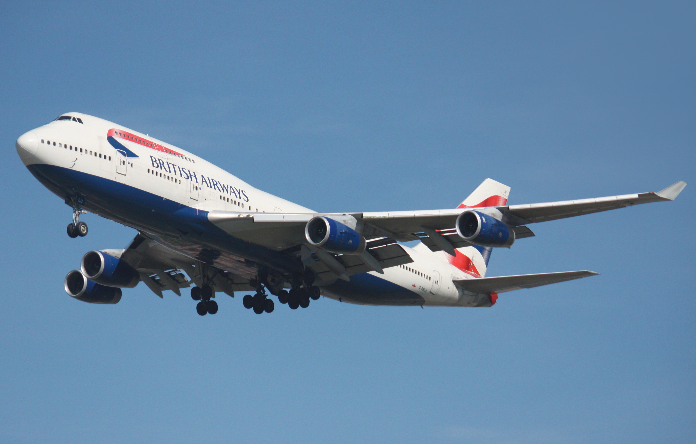

# Boeing 747 — Longitudinal Dynamics

The Boeing 747 is a double-deck wide-body passenger aircraft. The library provides its longitudinal flight channel as a linear state-space model together with a Gymnasium environment for training control agents.

{ width=800 }

<div class="grid cards" markdown>

-   :material-rocket-launch-outline: **Quick start**

    Launch the environment or the model within minutes.

    [:octicons-arrow-right-24: See example](#quick-start)

-   :material-cog-outline: **Model API**

    Python class documentation for the B747 longitudinal dynamics.

    [:octicons-arrow-right-24: Go to API](#python-api)

-   :material-gamepad-variant-outline: **Gymnasium environment**

    Ready environment for RL agents.

    [:octicons-arrow-right-24: Explore](#python-api)

-   :material-book-open-variant: **Theory**

    State equations and numerical parameters.

    [:octicons-arrow-right-24: Learn more](#mathematical-model)

</div>

## Performance specs (reference)

| Параметр | Значение |
|-------------|------------|
| Длина, м | 70.7 |
| Размах крыла, м | 64.4 |
| Высота самолёта, м | 19.4 |
| Площадь крыла, м² | 541.2 |
| Нормальная взлётная масса, кг | 11467 |

## Control object structure

The model is defined in the state space and describes the evolution of longitudinal motion variables when controlled by the elevator.

\[\dot{x} = A x + B u, \quad y = C x + D u\]

where the state vector and control input are:

\[
 x = \begin{bmatrix} u & w & q & \theta \end{bmatrix}^{\top}, \quad
 u_{in} = \eta
\]

The typical matrix structure is:

\[
\begin{bmatrix}
\dot{u} \\
\dot{w} \\
\dot{q} \\
\dot{\theta}
\end{bmatrix}
=
\begin{bmatrix}
+x_u & x_w & x_q & x_{\theta} \\
+z_u & z_w & z_q & z_{\theta} \\
+m_u & m_w & m_q & m_{\theta} \\
+0 & 0 & 1 & 0
\end{bmatrix}
\begin{bmatrix} u \\ w \\ q \\ \theta \end{bmatrix}
 +
\begin{bmatrix} x_{\eta} \\ z_{\eta} \\ m_{\eta} \\ 0 \end{bmatrix} \eta
\]

=== "Variables"

    - **u**: longitudinal speed, m/s
    - **w**: normal (vertical) speed, m/s
    - **q**: pitch rate, rad/s
    - **θ**: pitch angle, rad
    - **η**: elevator (stabilator) deflection, rad

=== "Coefficients"


- **x_u, x_w, x_q, x_θ** — partial derivatives of longitudinal force \(X\) with respect to \(u, w, q, \theta\)
- **z_u, z_w, z_q, z_θ** — partial derivatives of normal force \(Z\) with respect to \(u, w, q, \theta\)
- **m_u, m_w, m_q, m_θ** — partial derivatives of pitch moment \(M\) with respect to \(u, w, q, \theta\)
- **x_η, z_η, m_η** — partial derivatives with respect to the control input \(\eta\) (stabilator deflection)


!!! note "Units"
    Inside the models, angles and angular rates are in radians. API methods allow retrieving data in degrees.

## Mathematical model {#mathematical-model}

$$
\dot{x} = A x + B u, \qquad y = C x + D u
$$

Because the plant has no internal disturbances, the output \(y\) is not used (\(C\) is diagonal, \(D\) is zero).

Численные матрицы (пример линеаризации):

\[
\begin{bmatrix}
\dot{u} \\
\dot{w} \\
\dot{q} \\
\dot{\theta}
\end{bmatrix}
=
\begin{bmatrix}
-0.0069 & -0.0139 & 0 & -9.81 \\
-0.0905 & -0.6975 & 235.8928 & 0 \\
0.0004 & -0.0034 & 0 & 0.0911 \\
0 & 0 & 1 & 0 
\end{bmatrix}
\begin{bmatrix}
u \\
w \\
q \\
\theta 
\end{bmatrix}
 +
\begin{bmatrix}
-0.0001 \\
-5.5079 \\
-1.1569 \\
0
\end{bmatrix}
\eta
\]


!!! tip "Actuator limits"
    The default control limits are:

    - Maximum magnitude: \(\pm 25^\circ\)
    - Maximum rate: \(60^\circ/\text{s}\)

    Internal computations use radians; the limits are converted accordingly.

## Sources

1. Heffley R. K., Jewell W. F. Aircraft handling qualities data. – NASA, 1972. – № AD‑A277031. [Ссылка](https://ntrs.nasa.gov/citations/19730003312)
2. Abd Elwahab S. et al. Evaluation of Boeing 747‑E lateral autopilot using flying and handling qualities specifications // ICCCCEE 2017. IEEE. [Ссылка](https://ieeexplore.ieee.org/document/7867653)

## Quick start {#quick-start}

=== "Gymnasium"

    ```python
    import gymnasium as gym
    import numpy as np

    from tensoraerospace.envs import LinearLongitudinalB747
    from tensoraerospace.utils import generate_time_period
    from tensoraerospace.signals.standart import unit_step

    dt = 0.01
    tp = generate_time_period(tn=20, dt=dt)
    number_time_steps = len(tp)
    reference_signals = unit_step(degree=5, tp=tp, time_step=10, output_rad=True).reshape(1, -1)

    env = gym.make(
        'LinearLongitudinalB747-v0',
        number_time_steps=number_time_steps,
        initial_state=[[0],[0],[0],[0]],  # u, w, q, theta (will be mapped)
        reference_signal=reference_signals,
    )

    state, info = env.reset()
    for _ in range(200):
        action = np.array([[0.1]])
        state, reward, terminated, truncated, info = env.step(action)
        if terminated or truncated:
            break
    ```

=== "Model only"

    ```python
    import numpy as np
    from tensoraerospace.aerospacemodel import LongitudinalB747

    dt = 0.01
    number_time_steps = 200

    x0 = np.array([0.0, 0.0, 0.0, 0.0])  # [u, w, q, theta]

    model = LongitudinalB747(
        x0=x0,
        number_time_steps=number_time_steps,
        selected_state_output=["u", "w", "q", "theta"],
        dt=dt,
    )

    for t in range(number_time_steps - 1):
        u = np.array([[0.05]])  # stabilator deflection (rad)
        x_next = model.run_step(u)
    ```

## Python API

=== "Model"

    ::: tensoraerospace.aerospacemodel.b747.LongitudinalB747

=== "Gymnasium environment"

    ::: tensoraerospace.envs.b747.LinearLongitudinalB747