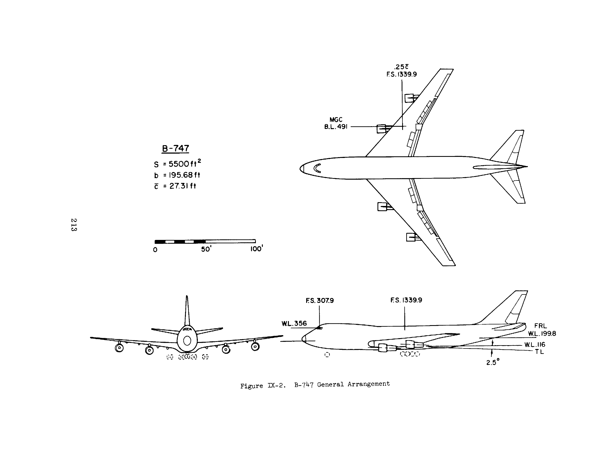
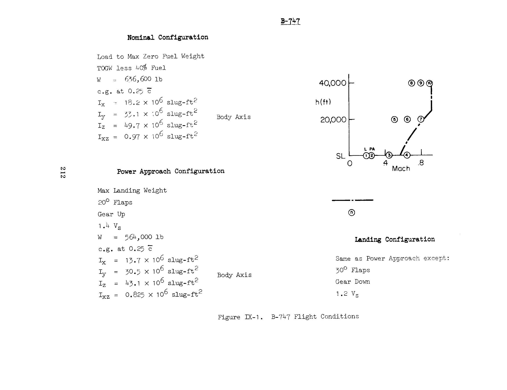

# Boeing 747-100 (Nonlinear 6-DoF Model)

`tensoraerospace.aerospacemodel.b747.nonlinear` — full nonlinear 6-DoF
model of the Boeing 747-100, built from **NASA CR-2144** (Heffley &
Jewell, 1972) — *Aircraft Handling Qualities Data*, Section IX.

| Parameter | Value |
|---|---|
| Aerodynamic source | NASA CR-2144 §IX (Heffley & Jewell 1972) |
| Published data | 10 trim points × 13 longitudinal + 15 lateral derivatives |
| Configurations | NOMINAL (cruise), POWER_APPROACH, LANDING |
| Engines | 4 × Pratt & Whitney JT9D-7 (188 400 lb T_SLS) |
| Coordinates | NED, body axis, ZYX 321 Euler |
| Control surfaces | elevator, aileron, rudder + throttle |
| Damage subsystem | per-surface effectiveness + jamming + decay |



## Geometry & mass (CR-2144 Table IX-3, Figure IX-2)

```
S    = 5500 ft²       (wing area)
b    = 195.68 ft       (span)
c̄    = 27.31 ft        (mean aerodynamic chord)
c.g. = 0.25 c̄         (centre of gravity)
```

| Configuration | W, lb | Iₓ, slug·ft² | I_y | I_z | I_xz |
|---|---:|---:|---:|---:|---:|
| **Nominal** (TOGW − 40% fuel) | 636 600 | 18.2 × 10⁶ | 33.1 × 10⁶ | 49.7 × 10⁶ | 0.97 × 10⁶ |
| **Power Approach** (564 000 lb, 20° flaps) | 564 000 | 13.7 × 10⁶ | 30.5 × 10⁶ | 43.1 × 10⁶ | 0.825 × 10⁶ |
| **Landing** (564 000 lb, 30° flaps, gear down) | 564 000 | 13.7 × 10⁶ | 30.5 × 10⁶ | 43.1 × 10⁶ | 0.825 × 10⁶ |

## Trim grid (CR-2144 Table IX-3)

CR-2144 publishes derivatives at **10 anchor flight conditions**:

| FC | Configuration | h, ft | M | V, ft/s | α₀, deg |
|---|---|---:|---:|---:|---:|
| 1 | LANDING        | 0      | 0.198 | 221 | 8.50 |
| 2 | POWER_APPROACH | 0      | 0.249 | 278 | 5.70 |
| 3 | NOMINAL        | 0      | 0.450 | 502 | 3.10 |
| 4 | NOMINAL        | 0      | 0.650 | 726 | 0.00 |
| 5 | NOMINAL        | 20 000 | 0.500 | 518 | 6.80 |
| 6 | NOMINAL        | 20 000 | 0.650 | 674 | 2.50 |
| 7 | NOMINAL        | 20 000 | 0.800 | 830 | 0.00 |
| 8 | NOMINAL        | 40 000 | 0.700 | 678 | 7.30 |
| 9 | NOMINAL        | 40 000 | 0.800 | 774 | 4.60 |
| 10| NOMINAL        | 40 000 | 0.900 | 871 | 2.40 |



The cruise points 3..10 sit on a regular `(h ∈ {0, 20K, 40K}) ×
(M ∈ {0.45..0.90})` grid, allowing bilinear interpolation of all
derivatives inside the certification envelope.

## State and control

**State** (12-D, body axis, NED, ZYX 321 Euler):

```
[u, v, w,           # body velocity, ft/s
 p, q, r,           # body angular rates, rad/s
 φ, θ, ψ,           # Euler angles, rad
 x_e, y_e, z_e]     # NED position, ft  (z_e positive down ⇒ altitude = -z_e)
```

**Control** (4-D):

```
[δ_e,  δ_a,  δ_r,  δ_T]
   ↓     ↓     ↓     ↓
elevator aileron rudder throttle
 (rad)  (rad)  (rad)   [0, 1]
```

Sign convention from CR-2144 Appendix A: `δ_e > 0` lowers trailing
edge (nose down); `δ_a > 0` right roll; `δ_r > 0` right yaw;
throttle is linear, `T = T_SLS · σ(h) · η(M, h) · PLA`.

## Equations of motion

Standard Newton-Euler in body axis:

$$
\dot u = (X_a + T)/m + g_x - (q\,w - r\,v)
$$

$$
\dot v = Y_a/m + g_y - (r\,u - p\,w)
$$

$$
\dot w = Z_a/m + g_z - (p\,v - q\,u)
$$

Body-axis gravity components:

$$
g_x = -g\sin\theta, \quad g_y = g\cos\theta\sin\varphi, \quad g_z = g\cos\theta\cos\varphi.
$$

Forces $X_a, Y_a, Z_a$ come from stability-axis $L, D, Y$ via the
α rotation:

$$
X_a = -D\cos\alpha + L\sin\alpha,\quad Z_a = -D\sin\alpha - L\cos\alpha,\quad Y_a = Y.
$$

Angular dynamics with $I_{xz}$ cross-coupling:

$$
\dot p = (I_z\,\bar L + I_{xz}\,\bar N) / \Gamma
$$

$$
\dot q = (M_a - (I_x - I_z)\,p\,r - I_{xz}(p^2 - r^2)) / I_y
$$

$$
\dot r = (I_{xz}\,\bar L + I_x\,\bar N) / \Gamma
$$

where $\Gamma = I_x I_z - I_{xz}^2$, $\bar L = L_a + I_{xz}(p\,q) - (I_z - I_y)\,q\,r$,
$\bar N = N_a - I_{xz}(q\,r) - (I_y - I_x)\,p\,q$.

ZYX 321 Euler kinematics and the NED DCM are standard
(Stevens-Lewis Appendix B).

## Aerodynamic build

Non-dimensional coefficients are built by **Taylor expansion around
the trim point**:

$$
C_L(\alpha, M, q, \dot\alpha, \delta_e) = C_{L_0} + C_{L_\alpha}\,(\alpha - \alpha_0) + C_{L_q}\,\hat q + C_{L_{\dot\alpha}}\,\hat{\dot\alpha} + C_{L_M}\,\Delta M + C_{L_{\delta_e}}\,\delta_e
$$

$$
C_m(\alpha, M, q, \dot\alpha, \delta_e) = C_{m_\alpha}\,(\alpha - \alpha_0) + C_{m_q}\,\hat q + C_{m_{\dot\alpha}}\,\hat{\dot\alpha} + C_{m_M}\,\Delta M + C_{m_{\delta_e}}\,\delta_e
$$

(analogous for $C_D$, $C_Y$, $C_l$, $C_n$). Here $\hat q = q\bar c/(2V)$,
$\hat p = p\,b/(2V)$, $\hat r = r\,b/(2V)$ are the standard
non-dimensional rate factors.

Dimensional forces and moments:

$$
L = q_{dyn}\,S\,C_L,\;\; D = q_{dyn}\,S\,C_D,\;\; Y = q_{dyn}\,S\,C_Y
$$

$$
\mathcal L = q_{dyn}\,S\,b\,C_l,\;\; \mathcal M = q_{dyn}\,S\,\bar c\,C_m,\;\; \mathcal N = q_{dyn}\,S\,b\,C_n
$$

with ISA dynamic pressure $q_{dyn} = \tfrac12\rho V^2$.

## JT9D-7 engine

The 4 × JT9D-7 cluster installed thrust follows
[Mattingly *Aircraft Engine Design* §8.6.4](#references):

$$
T_{inst}(M, h, \mathrm{PLA}) = T_{SLS} \cdot \sigma(h)^{n_h} \cdot \eta_{ram}(M) \cdot \mathrm{PLA}_{eff}
$$

with $T_{SLS} = 188\,400$ lb (Boeing 747-100 TCDS A20WE),
$\sigma(h) = \rho(h)/\rho_{SL}$, $n_h = 0.7$ below the tropopause /
$1.0$ above, $\eta_{ram}(M) = 1 - 0.49\sqrt{M}$ (clamped ≥ 0.05).

| h, ft | M | δ_T | T_inst, lb |
|---:|---:|---:|---:|
| 0 | 0.0 | 1.0 | 188 400 |
| 0 | 0.2 | 1.0 | 147 115 |
| 35 000 | 0.85 | 0.80 | 36 843 |
| 40 000 | 0.90 | 0.85 | 21 281 |

## Damage subsystem

Per-surface (elevator / aileron / rudder / throttle) effectiveness
$\mu_i \in [0,1]$ + jam deflection $j_i$ + decay time-constant $\tau_i$:

```
u_eff[i] = j_i  if  jam_active[i]  else  μ_i · u_cmd[i]
```

Five event types
(`tensoraerospace.aerospacemodel.b747.nonlinear.damage`):

| Event | Semantics |
|---|---|
| `SurfaceEffectivenessEvent(surface, mu)` | Instant loss: `μ ← mu` |
| `SurfaceJamEvent(surface, jam_value)` | Surface mechanically locks at `jam_value` |
| `SurfaceEffectivenessDecay(surface, τ, mu_floor)` | `μ̇ = -(1/τ)(μ − μ_floor)` |
| `EngineFailureEvent(engine_id, thrust_fraction)` | Single engine flameout (1..4) with asymmetric-thrust yaw moment |
| `FlapJamEvent(jammed_config)` | High-lift devices stuck at NOMINAL / POWER_APPROACH / LANDING |

### Asymmetric-thrust yaw moment

When `engines_mu[i]` is non-uniform across the four engines, the engine
model returns both total +x thrust and a yaw moment computed from the
spanwise engine positions (`±35.8` ft inner, `±71.7` ft outer):

$$
N_{\text{thrust}} = -\sum_{i=1}^{4} y_i \cdot T_i,\qquad T_i = (T_\text{cluster}/4) \cdot \mu_i
$$

So a dead engine on the left wing leaves more thrust on the right →
positive thrust offset toward +y → `N < 0` → nose yaws **left** (toward
the dead engine), as observed in real V_MC engine-out incidents.

### Flap-jam override

`FlapJamEvent.jammed_config` overrides the aerodynamic configuration
selection inside `b747_aero` regardless of `params.config`. The aircraft
keeps its mass / inertia from the active configuration, but lift, drag
and pitching-moment derivatives come from the jammed setting — this is
the canonical "flaps stuck at 30° during cruise" scenario.

Built-in presets:

* `ELEVATOR_50PCT_LOSS` — 50% elevator loss at t=5 s (Lu 2019 / Wang 2019)
* `ELEVATOR_JAMMED_NOSE_UP` — Hard-over: elevator stuck at −2°
* `AILERON_TOTAL_LOSS` — Total aileron loss at t=8 s
* `RUDDER_HYDRAULIC_LEAK` — Gradual rudder decay (τ=8 s, floor=0.3)
* `ENGINE_FLAMEOUT` — Throttle locked to idle at t=15 s
* `LEFT_OUTER_ENGINE_FAILURE` — Engine #1 flameout at t=10 s (≈ 75% thrust + nose-left yaw)
* `LEFT_TWO_ENGINES_OUT` — Both left engines fail at t=10 s (≈ 50% thrust, max asymmetry)
* `FLAPS_JAMMED_LANDING` — Flaps stuck at 30° at t=5 s (high CL/CD, low V_max)
* `FLAPS_JAMMED_RETRACTED` — Flaps fail to deploy past clean at t=5 s

## Trim finder

`tensoraerospace.aerospacemodel.b747.nonlinear.trim(h, V)` solves
(u̇, ẇ, q̇) = 0 via Newton-Raphson (`scipy.optimize.fsolve`),
returning trimmed (α, δ_e, δ_T) at the requested (altitude,
airspeed, configuration). For the landing configuration (FC1,
V=221 ft/s) the trimmer returns α=8.17°, matching the published
8.50° within 0.35° (figure-digitisation noise).

## Gymnasium env

Registered as `"NonlinearB747-v0"`. Three initialisation modes:

```python
import gymnasium as gym
import tensoraerospace  # registers the env

# 1. By one of the 10 published trim points
env = gym.make("NonlinearB747-v0", flight_condition_id=4, number_time_steps=2000)

# 2. Trim-finder at arbitrary (h, V)
env = gym.make("NonlinearB747-v0", trim_at=(20000.0, 674.0), number_time_steps=2000)

# 3. Arbitrary initial state
env = gym.make("NonlinearB747-v0",
    initial_state=np.array([726, 0, 0, 0, 0, 0, 0, 0, 0, 0, 0, 0]),
    number_time_steps=2000)
```

Action-space: either `"virtual"` (physical units) or `"normalized"`
(for RL: `[-1, 1]^4`).

## Related modules

* [Boeing 747-100 (linear)](b747.md) — legacy single-trim-point
  state-space model (longitudinal channel only).
* [B-747 usage examples](b747_examples.md) — practical recipes
  (trim, cruise, gymnastics, elevator failure).
* [Aircraft Damage Modeling](aircraft-damage-modeling.md) — general
  damage-subsystem concept (F-16 version).

## References

* **NASA CR-2144** — Heffley R.K., Jewell W.F. *Aircraft Handling
  Qualities Data*, Systems Technology Inc., December 1972, §IX.
* Boeing 747-100 Type Certificate Data Sheet A20WE (FAA).
* Mattingly J.D. *Aircraft Engine Design*, AIAA Education Series, 2nd
  ed., 2002 — §8.6.4 (installed-thrust lapse model).
* Stevens B.L., Lewis F.L., Johnson E.N. *Aircraft Control and
  Simulation*, Wiley, 3rd ed., 2015 — §3.7 (trim algorithm),
  Appendix B (ZYX 321 kinematics).
