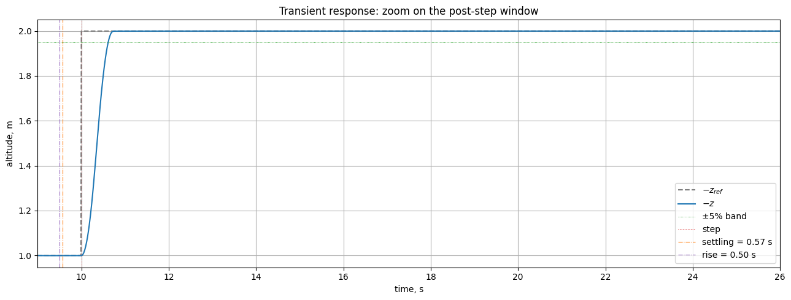

# Quadrotor: usage examples

Practical recipes for the
[`tensoraerospace.aerospacemodel.quadrotor.nonlinear`](#nonlinear) and
[`tensoraerospace.aerospacemodel.quadrotor.damage`](#damage) modules.
All snippets are self-contained — copy and run as-is. For the
theoretical model description see
[Quadrotor (Nonlinear 6-DoF)](quadrotor_nonlinear.md).

---

## Nonlinear 6-DoF { #nonlinear }

### 1. Bare hover

The simplest case: the quadrotor is held at the origin by a constant
thrust `m·g`. The RK4 integrator does this to machine precision.

```python
import numpy as np

from tensoraerospace.aerospacemodel.quadrotor.nonlinear import NonlinearQuadrotor

m = NonlinearQuadrotor(x0=np.zeros(12), dt=0.01, integrator="rk4")
u_hover = np.array([m.hover_thrust, 0.0, 0.0, 0.0])  # T, τ_x, τ_y, τ_z

for _ in range(1000):  # 10 s
    m.run_step(u_hover)

print(f"max |state| after 10 s: {np.max(np.abs(m.current_state)):.2e}")
# → ≈ 0 (exact equilibrium)
```

### 2. Free fall (no thrust)

With zero thrust and linear drag the quadrotor approaches the terminal
velocity `v∞ = m·g / k_dz`. Analytic solution:

$$
z(t) = v_\infty t + v_\infty \tau (e^{-t/\tau} - 1), \qquad \tau = m / k_{dz}.
$$

```python
import numpy as np

from tensoraerospace.aerospacemodel.quadrotor.nonlinear import NonlinearQuadrotor

m = NonlinearQuadrotor(x0=np.zeros(12), dt=0.001, integrator="rk4")
T_zero = np.zeros(4)

for _ in range(10_000):  # 10 s
    m.run_step(T_zero)

mass, g, k_dz = m.param.m, m.param.g, m.param.kdz
v_inf = mass * g / k_dz
tau = mass / k_dz
z_pred = v_inf * 10.0 + v_inf * tau * (np.exp(-10.0 / tau) - 1.0)

z_real = m.current_state[2]  # NED: positive z = down
print(f"z (model)     = {z_real:.3f} m")
print(f"z (analytic)  = {z_pred:.3f} m")
print(f"|delta|       = {abs(z_real - z_pred):.2e}")
# Match to 6+ decimals
```

### 3. Roll disturbance + P-feedback on phi

Start with a 3° roll and damp it with a simple proportional regulator
on `phi`. A small `KP_PHI = -0.05` gives near-critical damping at the
default inertia.

```python
import numpy as np

from tensoraerospace.aerospacemodel.quadrotor.nonlinear import (
    NonlinearQuadrotor,
    set_initial_state,
)

m = NonlinearQuadrotor(
    x0=set_initial_state(phi=np.deg2rad(3.0)),
    dt=0.005,
    integrator="rk4",
)

T_hover = m.hover_thrust
KP_PHI = -0.05
for _ in range(2000):  # 10 s
    phi = m.current_state[6]
    tau_x = KP_PHI * phi
    m.run_step(np.array([T_hover, tau_x, 0.0, 0.0]))

phi_final = np.rad2deg(m.current_state[6])
print(f"Final roll: {phi_final:+.4f}°  (started +3°)")
```

### 4. Integrator comparison: Euler vs RK4

At small `dt` both integrators converge to the same solution; at
larger `dt` RK4 stays more accurate. Test: hover with a 0.5 N·m roll
torque applied for 10 s.

```python
import numpy as np

from tensoraerospace.aerospacemodel.quadrotor.nonlinear import NonlinearQuadrotor

DT = 0.05  # relatively coarse
N = 200    # 10 s

results = {}
for integ in ("euler", "rk4"):
    m = NonlinearQuadrotor(x0=np.zeros(12), dt=DT, integrator=integ)
    u = np.array([m.hover_thrust, 0.5, 0.0, 0.0])
    for _ in range(N):
        m.run_step(u)
    results[integ] = m.current_state

print(f"After 10 s with tau_x = 0.5 N·m:")
print(f"  Euler:  phi = {np.rad2deg(results['euler'][6]):.4f}°")
print(f"  RK4:    phi = {np.rad2deg(results['rk4'][6]):.4f}°")
```

### 5. Custom parameters (different mass, inertia, drag)

Replace `default_parameters()` with your own `QuadrotorParameters` to
model a different airframe.

```python
import numpy as np

from tensoraerospace.aerospacemodel.quadrotor.nonlinear import (
    NonlinearQuadrotor,
    QuadrotorParameters,
)

# Lightweight 250 g racing drone
custom = QuadrotorParameters(
    m=0.25,
    Jx=0.0008, Jy=0.0008, Jz=0.0015,
    arm_length=0.085,
    kdx=0.02, kdy=0.02, kdz=0.04,
    thrust_max=10.0,
)

m = NonlinearQuadrotor(x0=np.zeros(12), dt=0.005, integrator="rk4")
m.set_param(custom)

print(f"Hover thrust: {m.hover_thrust:.3f} N  (mass {m.param.m} kg)")
# 0.25·9.81 = 2.4525 N
```

### 6. Reading state and control history

`ModelBase` keeps the full trajectory; access it via `get_state(name)`
and `get_control(name)` (with optional unit conversion).

```python
import numpy as np
import matplotlib.pyplot as plt

from tensoraerospace.aerospacemodel.quadrotor.nonlinear import NonlinearQuadrotor

m = NonlinearQuadrotor(x0=np.zeros(12), dt=0.01, integrator="rk4")
T_hover = m.hover_thrust

# 0.2-s τ_x impulse
for k in range(500):
    tau_x = 0.3 if 100 <= k < 120 else 0.0
    m.run_step(np.array([T_hover, tau_x, 0.0, 0.0]))

phi_deg = m.get_state("phi", to_deg=True)
p_deg_s = m.get_state("p", to_deg=True)
tau_x_log = m.get_control("tau_x")

t = np.arange(len(phi_deg)) * m.dt
fig, axes = plt.subplots(3, 1, figsize=(9, 6), sharex=True)
axes[0].plot(t, tau_x_log); axes[0].set_ylabel(r"$\tau_x$, N·m")
axes[1].plot(t, p_deg_s);  axes[1].set_ylabel(r"$p$, °/s")
axes[2].plot(t, phi_deg);  axes[2].set_ylabel(r"$\varphi$, °")
axes[2].set_xlabel("time, s")
plt.tight_layout(); plt.show()
```

### Companion notebook: `example_ihdp_quadrotor.ipynb`

The same PD altitude tracking scenario extended to a full step
response with IHDP, evaluated by `ControlBenchmark`. Reference: 1 m →
2 m at `t = 10 s`.


Zoom on the transient with `rise_time` and `settling_time` markers:



### 7. PD altitude tracking — climb to 2 m

Hover mode extended with PD feedback on `(z, w_b)`. With attitude held
level the full quadrotor reduces to a near-linear vertical system.

```python
import numpy as np

from tensoraerospace.aerospacemodel.quadrotor.nonlinear import NonlinearQuadrotor

m = NonlinearQuadrotor(x0=np.zeros(12), dt=0.01, integrator="rk4")
T_hover = m.hover_thrust
mass = m.param.m

z_ref = -2.0  # NED: target altitude 2 m above starting plane
KP, KD = 6.0, 6.0  # PD on (e_z, w_b)

def attitude_torques(state):
    phi, theta = state[6], state[7]
    p, q, r = state[9], state[10], state[11]
    return np.array([
        -0.05 * p - 0.30 * phi,
        -0.05 * q - 0.30 * theta,
        -0.05 * r,
    ])

for _ in range(800):  # 8 s
    s = m.current_state
    e_z = s[2] - z_ref
    dT = mass * (KP * e_z + KD * s[5])
    T = T_hover + np.clip(dT, -10.0, 10.0)
    m.run_step(np.array([T, *attitude_torques(s)]))

print(f"Final altitude: {-m.current_state[2]:.4f} m (target 2.0 m)")
```

---

## Damage subsystem { #damage }

### Companion notebook: `example_etdhp_quadrotor_damage.ipynb`

Sine altitude tracking with an ET-DHP controller that updates its
plant-network online. At `t = 20 s` the `M1 = 50%` fault triggers,
the plant-network adapts its $\hat\mu$ estimate over a few
event-trigger updates, and the controller compensates the asymmetry
with an elevated thrust command:


Detailed 4-panel breakdown — thrust, moments, event-trigger ticks and
motor-effectiveness estimate:


### 1. Built-in preset: 50% motor loss (Lu 2019)

The simplest way to reproduce a canonical FTC scenario — import a
ready-made profile and pass it to the env via `damage_profile`.

```python
import gymnasium as gym
import numpy as np

import tensoraerospace
from tensoraerospace.aerospacemodel.quadrotor.damage import LU_M1_50PCT_LOSS

env = gym.make(
    "NonlinearQuadrotor-v0",
    initial_state=np.zeros(12),
    number_time_steps=1000,
    damage_profile=LU_M1_50PCT_LOSS,
)

obs, _ = env.reset()
T_hover = env.unwrapped.model.hover_thrust
for k in range(1000):
    obs, _, _, trunc, info = env.step(np.array([T_hover, 0.0, 0.0, 0.0]))
    if "damage_events_triggered" in info:
        print(f"t = {k*0.01:.2f} s — fired: {info['damage_events_triggered']}")
        print(f"  motor μ: {info['damage_state']['mu']}")
    if trunc:
        break
```

### 2. Custom event: M2 loses 70% effectiveness at t=3 s

Build your own `DamageProfile` from any combination of events.

```python
from tensoraerospace.aerospacemodel.quadrotor.damage import (
    DamageProfile, RotorDamageEvent,
)

profile = DamageProfile(events=[
    RotorDamageEvent(trigger_time=3.0, rotor_id=1, mu=0.3, label="m2_70pct_loss"),
])
```

### 3. Multiple full losses staggered in time

```python
from tensoraerospace.aerospacemodel.quadrotor.damage import (
    DamageProfile, RotorLossEvent,
)

profile = DamageProfile(events=[
    RotorLossEvent(trigger_time=2.0, rotor_id=0, label="m1_lost"),
    RotorLossEvent(trigger_time=4.0, rotor_id=2, label="m3_lost"),  # uncontrollable
])
```

`RotorLossEvent` is shorthand for `mu = 0`. After `t = 4 s` only two
rotors (M2 and M4) remain — physically equivalent to total loss of
controllability in an X-frame.

### 4. Gradual wear: exponential decay of μ

The wear model `μ̇ = −(1/τ)(μ − μ_floor)` arms at `trigger_time` and
exponentially drives the rotor effectiveness to `mu_floor`. Useful
for long-endurance simulations.

```python
from tensoraerospace.aerospacemodel.quadrotor.damage import (
    DamageProfile, MotorEfficiencyDecay,
)

# Motor 3 degrades with 8 s time constant down to 30% effectiveness
wear = DamageProfile(events=[
    MotorEfficiencyDecay(
        trigger_time=2.0,
        rotor_id=2,
        tau=8.0,
        mu_floor=0.3,
        label="m3_wear",
    ),
])
```

After `t ≈ 3·τ ≈ 24 s` `μ` reaches `~mu_floor + 0.05·(1 - mu_floor)`.

### 5. Runtime injection (single-fire)

You can also inject events at runtime — for instance, in response to
an anomaly detector. Each injected event fires once and is cleared by
`env.reset()`.

```python
import numpy as np

from tensoraerospace.aerospacemodel.quadrotor.damage import RotorLossEvent
from tensoraerospace.envs.quadrotor import NonlinearQuadrotorEnv

env = NonlinearQuadrotorEnv(
    initial_state=np.zeros(12),
    number_time_steps=1000,
    action_space="virtual",
    damage_profile=None,
)
env.reset()
T_hover = env.model.hover_thrust

for k in range(1000):
    if k == 300:  # surprise — M4 lost at t = 3 s
        env.damage_manager.inject_event(
            RotorLossEvent(trigger_time=3.0, rotor_id=3, label="emergency_m4_loss")
        )
    obs, _, _, trunc, info = env.step(np.array([T_hover, 0.0, 0.0, 0.0]))
```

### 6. Logging events via callback

Pass `damage_event_callback=f(event, state)` to receive an explicit
notification every time an event fires. Convenient for TensorBoard /
Weights & Biases hooks.

```python
import numpy as np

from tensoraerospace.aerospacemodel.quadrotor.damage import LANZON_M1_LOSS
from tensoraerospace.envs.quadrotor import NonlinearQuadrotorEnv

events_log = []

def on_damage(event, state):
    events_log.append({
        "label": event.label,
        "rotor": event.rotor_id,
        "mu_after": float(state.mu[event.rotor_id]),
        "all_mu": state.mu.copy(),
    })

env = NonlinearQuadrotorEnv(
    initial_state=np.zeros(12),
    number_time_steps=1000,
    action_space="virtual",
    damage_profile=LANZON_M1_LOSS,
    damage_event_callback=on_damage,
)
env.reset()
# ...run episode...
print(events_log)
```

### 7. Reading damage state from info-dict

After every `env.step(...)`, `info` contains a snapshot of all 4
motors’ effectiveness and the effective/commanded `ω²` (when a damage
manager is active).

```python
import numpy as np

from tensoraerospace.aerospacemodel.quadrotor.damage import WEAR_DEGRADATION_M3
from tensoraerospace.envs.quadrotor import NonlinearQuadrotorEnv

env = NonlinearQuadrotorEnv(
    initial_state=np.zeros(12),
    number_time_steps=2500,
    action_space="virtual",
    damage_profile=WEAR_DEGRADATION_M3,
)
obs, _ = env.reset()
T_hover = env.model.hover_thrust
mu_history = []
for k in range(2500):
    obs, _, _, trunc, info = env.step(np.array([T_hover, 0.0, 0.0, 0.0]))
    mu_history.append(info["damage_state"]["mu"].copy())
    if trunc:
        break

mu_arr = np.array(mu_history)
print(f"Final μ: {mu_arr[-1]}")
# μ_3 → 0.30, others = 1.0
```

### 8. Damage in `rotor` action_space mode

If your controller emits rotor-level commands `[ω₁², ω₂², ω₃², ω₄²]`,
switch to `action_space="rotor"`. The env will apply `μ` to the
command before re-mixing into `(T, τ)` for the integrator.

```python
import gymnasium as gym
import numpy as np

import tensoraerospace
from tensoraerospace.aerospacemodel.quadrotor.damage import LU_M1_50PCT_LOSS

env = gym.make(
    "NonlinearQuadrotor-v0",
    initial_state=np.zeros(12),
    number_time_steps=500,
    action_space="rotor",
    damage_profile=LU_M1_50PCT_LOSS,
)
obs, _ = env.reset()
# In hover all four rotors carry the same ω² = T_hover / (4·k_T)
T_hover = 1.5 * 9.81
omega2_hover = T_hover / (4 * env.unwrapped.allocator.k_T)
action = np.full(4, omega2_hover)

for k in range(500):
    obs, _, _, trunc, info = env.step(action)
```

### 9. Reset and replay

`env.reset()` zeroes all μ and clears injected events but keeps the
profile. Run multiple episodes with the same fault injection.

```python
import numpy as np

from tensoraerospace.aerospacemodel.quadrotor.damage import LANZON_M1_LOSS
from tensoraerospace.envs.quadrotor import NonlinearQuadrotorEnv

env = NonlinearQuadrotorEnv(
    initial_state=np.zeros(12),
    number_time_steps=1000,
    action_space="virtual",
    damage_profile=LANZON_M1_LOSS,
)

for episode in range(3):
    env.reset()
    print(f"Episode {episode}: μ at start = {env.damage_manager.state.mu}")
```

### 10. Switching profile via `reset(options=...)`

You can swap the profile without re-creating the env — handy for
multi-task curricula where each episode carries a different fault
scenario.

```python
import numpy as np

from tensoraerospace.aerospacemodel.quadrotor.damage import (
    LANZON_M1_LOSS, LU_M1_50PCT_LOSS, WEAR_DEGRADATION_M3,
)
from tensoraerospace.envs.quadrotor import NonlinearQuadrotorEnv

env = NonlinearQuadrotorEnv(
    initial_state=np.zeros(12),
    number_time_steps=1000,
    action_space="virtual",
)

scenarios = [LANZON_M1_LOSS, LU_M1_50PCT_LOSS, WEAR_DEGRADATION_M3]
for sc in scenarios:
    env.reset(options={"damage_profile": sc})
    # ...run one episode under this scenario...
```

---

## See also

* [Quadrotor (Nonlinear 6-DoF)](quadrotor_nonlinear.md) — theory,
  frames, equations and validation.
* `example/reinforcement_learning/example_ihdp_quadrotor.ipynb` —
  online IHDP step response in altitude.
* `example/reinforcement_learning/example_etdhp_quadrotor_damage.ipynb`
  — ET-DHP with offline-pretrained plant network under M1 fault.
