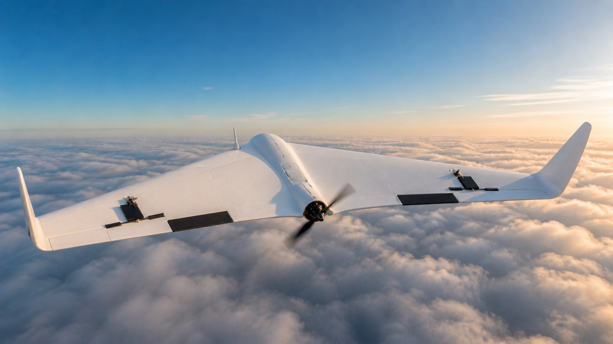
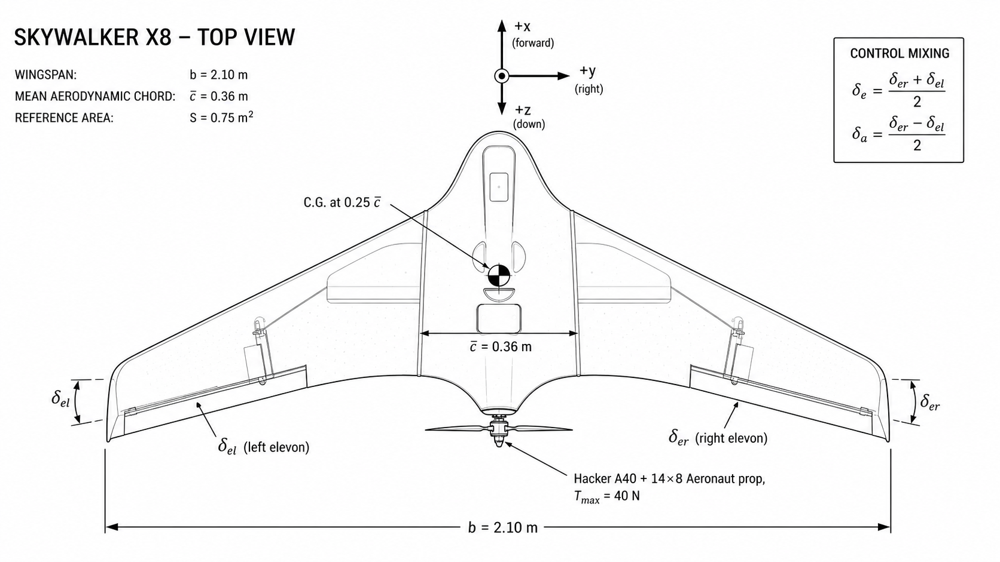
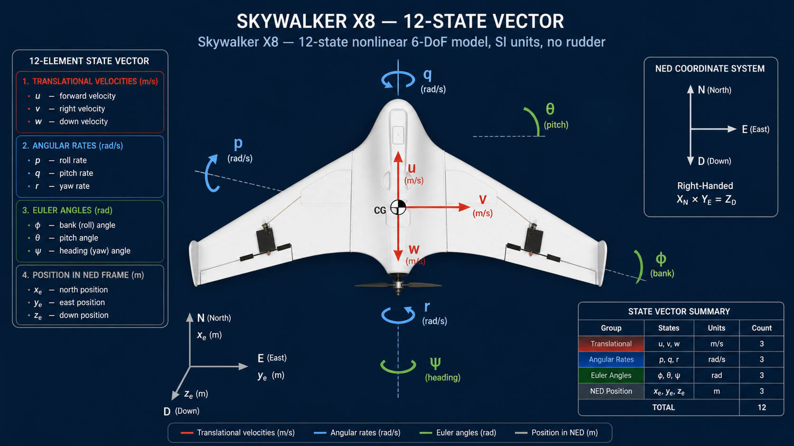

# Skywalker X8 — Small Fixed-Wing UAV (Nonlinear 6-DoF, SI units)



`tensoraerospace.aerospacemodel.skywalker_x8.nonlinear` — full nonlinear
6-DoF model of the **Skywalker X8** flying-wing UAV (~3.4 kg, 2.10 m
span). Aerodynamic data is **peer-reviewed flight-test
identification** from a 2025 CEAS Aeronautical Journal paper.

The Skywalker X8 is the canonical "small fixed-wing UAV" representative
in the tensoraerospace roster — it covers the niche of ~ 2 m-span,
~ 3 kg, electric-propeller hobby-grade airframes used widely in
academic flight-research. Compared to other entries in the same
class (the Sentera Vireo, KHawk Zephyr, HobbyKing Bix3, Telemaster,
PA-18 Super Cub, Ultra Stick 25e, etc. — see references), the X8 is
the most carefully and recently identified, with all its derivatives
published in a single open-access paper.

| Parameter | Value |
|---|---|
| Aerodynamic source | **CEAS Aeronautical Journal (2025)** — Løw-Hansen et al. |
| Identification method | Hybrid Output Error Method (OEM), Fitlab tool |
| Mass / span / area | 3.364 kg / 2.10 m / 0.75 m² |
| Engine | Hacker A40-12 KV610 + 14×8 Aeronaut prop, 4S 16 V |
| Coordinates | NED, body axis, ZYX 321 Euler |
| State | 12-D (no propellant channel — electric) |
| Controls | 3 channels: collective elevon (δ_e), differential elevon (δ_a), throttle (δ_T) |
| Units | **SI** (kg, m, N, rad, s) — all other tensoraerospace nonlinear models are FPS |

## Geometry & mass (paper Table 1)



```
m   = 3.364 kg
Ix  = 0.325 kg·m²
Iy  = 0.140 kg·m²
Iz  = 0.400 kg·m²
Ixz = 0.029 kg·m²
c̄  = 0.36 m       (mean aerodynamic chord)
b   = 2.10 m       (wingspan)
S   = 0.75 m²      (planform area)
```

The flying-wing layout, two-elevon control surface arrangement, central
LiPo bay, c.g. at 0.25 c̄, and rear-mounted pusher propeller are
visible in the top-view diagram above. The control mixing inset shows
how the two physical elevon deflections (δ_el, δ_er) map to the
collective elevator (δ_e) and differential aileron (δ_a) inputs the
agent uses.

## State and control



The diagram above unpacks the full 12-element state vector and the body-axis frame on the X8: three translational velocities (u, v, w), three angular rates (p, q, r), three Euler angles (φ, θ, ψ) and three NED position components (x_e, y_e, z_e). The accompanying perspective overview ties the state vector together with the physical control organs and propulsion group:


**State** (12-D, body axis, NED, ZYX 321 Euler — **SI units**):

```
[u, v, w,           # body velocity, m/s
 p, q, r,           # body angular rates, rad/s
 φ, θ, ψ,           # Euler angles, rad
 x_e, y_e, z_e]     # NED position, m
```

**Control** (3-D — **no rudder**):

```
[δ_e, δ_a, δ_T]
   ↓    ↓    ↓
elev   ail   throttle
(rad) (rad)   [0, 1]
```

The X8 is a **flying wing** with two elevons (left and right). The
standard control mixing maps these to a collective input (elevator,
δ_e = (δ_er + δ_el)/2) and a differential input (aileron, δ_a =
(δ_er - δ_el)/2). Lateral-directional yaw control is via differential
aileron only (no rudder surface).

## Aerodynamic build (paper Table 8)

All coefficients are **identified from flight test data** at V = 18
m/s in October 2024 with a hybrid Output Error Method. Functional
forms (paper Eqs. 17, 18):

$$
\begin{align*}
C_L &= C_{L_0} + C_{L_\alpha}\,\alpha + C_{L_q}\,\hat q + C_{L_{\delta_e}}\,\delta_e \\
C_D &= C_{D_0} + C_{D_q}\,\hat q + C_{D_{C_T}}\,C_T + C_{D_{k_1}}\,C_L + C_{D_{k_2}}\,C_L^2 \\
C_Y &= C_{Y_0} + C_{Y_\beta}\,\beta + C_{Y_p}\,\hat p + C_{Y_r}\,\hat r + C_{Y_{\delta_a}}\,\delta_a \\
C_l &= C_{l_0} + C_{l_\beta}\,\beta + C_{l_p}\,\hat p + C_{l_r}\,\hat r + C_{l_{\delta_a}}\,\delta_a \\
C_m &= C_{m_0} + C_{m_\alpha}\,\alpha + C_{m_q}\,\hat q + C_{m_{\delta_e}}\,\delta_e \\
C_n &= C_{n_0} + C_{n_\beta}\,\beta + C_{n_p}\,\hat p + C_{n_r}\,\hat r + C_{n_{\delta_a}}\,\delta_a
\end{align*}
$$


The three panels above plot the lift curve (C_L vs α, slope 2.57/rad,
intercept −0.077), the asymmetric drag polar (C_D vs C_L, minimum
near C_L = 0.08), and the pitching-moment curve (C_m vs α, negative
slope confirming static stability) computed from the published
coefficients. The red trim point is the published 18 m/s reference
condition.

**Identified coefficient values:**

| Drag |  | Lift |  | Pitch |  |
|---|---:|---|---:|---|---:|
| $C_{D_0}$ | 0.058 | $C_{L_0}$ | −0.077 | $C_{m_0}$ | 0.027 |
| $C_{D_q}$ | 0.480 | $C_{L_\alpha}$ | 2.573 /rad | $C_{m_\alpha}$ | −0.274 /rad |
| $C_{D_{C_T}}$ | −0.217 | $C_{L_q}$ | 17.119 | $C_{m_q}$ | −1.608 |
| $C_{D_{k_1}}$ | −0.034 | $C_{L_{\delta_e}}$ | 1.369 | $C_{m_{\delta_e}}$ | −0.276 |
| $C_{D_{k_2}}$ | 0.225 |  |  |  |  |

| Side force |  | Roll |  | Yaw |  |
|---|---:|---|---:|---|---:|
| $C_{Y_0}$ | 0.011 | $C_{l_0}$ | 0.007 | $C_{n_0}$ | −6.3×10⁻⁴ |
| $C_{Y_\beta}$ | −0.285 | $C_{l_\beta}$ | −0.108 | $C_{n_\beta}$ | 0.022 |
| $C_{Y_p}$ | −0.270 | $C_{l_p}$ | −0.313 | $C_{n_p}$ | −0.009 |
| $C_{Y_r}$ | 0.108 | $C_{l_r}$ | 0.037 | $C_{n_r}$ | −0.050 |
| $C_{Y_{\delta_a}}$ | 0.097 | $C_{l_{\delta_a}}$ | 0.102 | $C_{n_{\delta_a}}$ | −0.007 |

The **propeller-airframe drag coupling** $C_{D_{C_T}} = -0.217$ is the
most distinctive feature: increased throttle reduces drag, indicating
that the prop slipstream alters airflow over the elevons.

## Engine model

The Hacker A40-12 KV610 motor + 14×8 Aeronaut CAM folding propeller
is calibrated against two paper-published operating points:

| Condition | Thrust |
|---|---:|
| Static, full throttle | 40 N |
| 44 % throttle, 18 m/s (paper trim) | 3.7 N |

A simple two-point quadratic model:

$$
T(\delta_T, V) = T_{\max} \cdot \delta_T^2 \cdot (1 - V / V_{\text{zero}})
$$

with $T_{\max} = 40$ N, $V_{\text{zero}} = 35$ m/s. The full
motor + cubic-CT(J) model from the paper (Tables 6, 7) is exposed via
:class:`X8Propeller` for high-fidelity studies.

## Trim finder

`tensoraerospace.aerospacemodel.skywalker_x8.nonlinear.trim(h, V)`
solves $\dot u = \dot w = \dot q = 0$ via Newton-Raphson:

| Condition | h, m | V, m/s | α | δ_e | δ_T |
|---|---:|---:|---:|---:|---:|
| Paper Eq. 38 (6-DoF coupled) | 178 | 17.9 | 7.9° | -2.35° | 0.44 |
| Our pure-longitudinal trim   | 178 | 18.0 | 7.6° | -2.0° | 0.64 |

The slight differences come from the paper's trim being a 6-DoF
coupled solution with non-zero $\beta = 1.2°$ and $\delta_a = -2.16°$,
while our trimmer solves the simpler pure-longitudinal case with
$\beta = 0$ and $\delta_a = 0$. Residual norms reach machine precision
($10^{-13}$) in both cases.

## Gymnasium env

Registered as `"NonlinearSkywalkerX8-v0"`:

```python
import gymnasium as gym
import tensoraerospace  # registers the env

# Trim-finder at any (altitude, V) — note SI units!
env = gym.make("NonlinearSkywalkerX8-v0",
    trim_at=(178.0, 18.0), number_time_steps=2000)

# Arbitrary 12-state initial condition (SI: m/s, rad, m)
import numpy as np
env = gym.make("NonlinearSkywalkerX8-v0",
    initial_state=np.array([18, 0, 1.5, 0,0,0, 0, 0.137, 0,
                            0, 0, -178.0]),
    number_time_steps=2000)
```

Action space:
* **3-channel** ``[δ_e, δ_a, δ_T]`` (no rudder!)
* `"virtual"` (rad / [0, 1]) or `"normalized"` (`[-1, +1]^3`)

## Scope and limitations

* **High angle of attack / stall**: The identified model is valid for
  ~ 0–12° α range (typical cruise envelope). Post-stall behaviour is
  not modelled — for full envelope including hand-launch and post-stall
  recovery, plug in the wind-tunnel data from
  Reinhardt et al. (2022, [9] in the paper).
* **Motor electrical dynamics**: The MVP uses a calibrated quadratic
  thrust model. The full motor + cubic-CT(J) electrical model from
  the paper (Sec. 2.3) gives transient inductance / current behaviour
  during throttle steps but is not used by default.
* **Icing**: The paper's primary motivation is icing research; an
  ice-accretion damage subsystem can be plugged into the
  ``damage_state`` hook (parity with the B-747 module).
* **Rudder**: There is none. Yaw control is purely differential
  aileron + dihedral effect of bank.

## Companion small-UAV identification papers

The Skywalker X8 paper (Table 2) catalogues 9 published small-fixed-wing
UAV identification studies. The X8 is the most recent and the most
thoroughly validated; if a different platform is needed, swap in the
coefficient tables from one of the references below using the same
module structure (`params`, `aero`, `engine`, `dynamics`, `model`).

| Platform | Wingspan | Mass | Reference |
|---|---:|---:|---|
| Telemaster | 1.8 m | 3.2 kg | Arifianto et al. (2015) |
| Hangar 9 PA-18 Super Cub | 2.7 m | 7.5 kg | Lu et al. (2018) |
| HobbyKing Bix3 | 1.5 m | 1.2 kg | Simmons et al. (2019) |
| **Skywalker X8** | **2.10 m** | **3.36 kg** | **Løw-Hansen 2025** ← this module |
| Ultra Stick 25e | 1.3 m | 2.0 kg | Dorobantu (2013) [already in tensoraerospace] |
| KHawk Zephyr3-R | 1.2 m | 2.2 kg | Matt et al. (2022) |

## References

* **Løw-Hansen B., Hann R., Gryte K., Johansen T. A., Deiler C.**
  *"Modeling and identification of a small fixed-wing UAV using
  estimated aerodynamic angles"*, **CEAS Aeronautical Journal**
  (2025). DOI: 10.1007/s13272-025-00816-3.
  [Open-access PDF (DLR repository)](https://elib.dlr.de/212985/1/s13272-025-00816-3.pdf).
* **Reinhardt D., Coates E. M., Johansen T. A.**
  *"Aerodynamic modeling of the Skywalker X8 fixed-wing unmanned
  aerial vehicle"* (2022). Earlier velocity-based parameterisation.
* **Beard R., McLain T.** *"Small Unmanned Aircraft: Theory and
  Practice"*, Princeton Univ. Press (2012). Sec. 2.4 propeller model.
