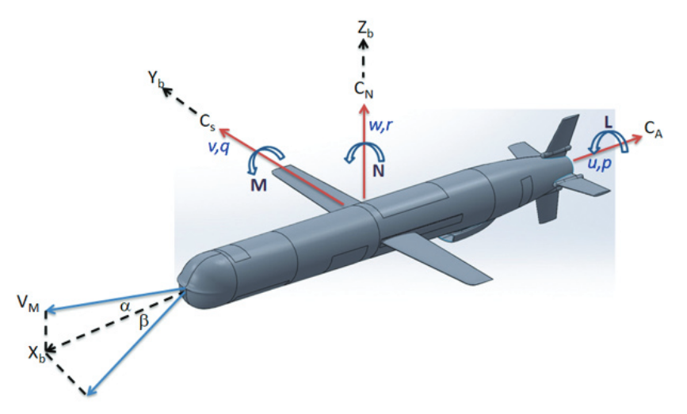

# Typical Rocket — Longitudinal Dynamics

Canonical missile model in the longitudinal channel. The page mirrors the ELV layout: quick start, math model, derivative tables, and API.

{ width=800 }

<div class="grid cards" markdown>

-   :material-rocket-launch-outline: **Quick start**

    Launch the environment or the model within minutes.

    [:octicons-arrow-right-24: See example](#quick-start)

-   :material-cog-outline: **Model API**

    Python class documentation for the typical rocket.

    [:octicons-arrow-right-24: Go to API](#python-api)

-   :material-gamepad-variant-outline: **Gymnasium environment**

    Ready environment for RL agents.

    [:octicons-arrow-right-24: Explore](#python-api)

-   :material-book-open-variant: **Theory**

    State equations and numerical parameters.

    [:octicons-arrow-right-24: Learn more](#mathematical-model)

</div>

## Control object structure

The model is defined in the state space:

\[\dot{x} = A x + B u, \quad y = C x + D u\]

where:

\[
 x = \begin{bmatrix} u & w & q & \theta \end{bmatrix}^{\top}, \quad
 u_{in} = \eta
\]

The typical matrix structure is:

\[
\begin{bmatrix}
\dot{u} \\
\dot{w} \\
\dot{q} \\
\dot{\theta}
\end{bmatrix}
=
\begin{bmatrix}
x_u & x_w & x_q & x_{\theta} \\
z_u & z_w & z_q & z_{\theta} \\
m_u & m_w & m_q & m_{\theta} \\
0 & 0 & 1 & 0
\end{bmatrix}
\begin{bmatrix} u \\ w \\ q \\ \theta \end{bmatrix}
 +
\begin{bmatrix} x_{\eta} \\ z_{\eta} \\ m_{\eta} \\ 0 \end{bmatrix} \eta
\]

=== "Variables"

    - **u**: longitudinal speed, m/s
    - **w**: vertical speed, m/s
    - **q**: pitch rate, rad/s
    - **θ**: pitch angle, rad
    - **η**: stabilizer control deflection, rad

=== "Coefficients"

    - **x_u, x_w, x_q, x_θ** — partial derivatives of longitudinal force \(X\) with respect to \(u, w, q, \theta\)
    - **z_u, z_w, z_q, z_θ** — partial derivatives of normal force \(Z\)
    - **m_u, m_w, m_q, m_θ** — partial derivatives of pitch moment \(M\)
    - **x_η, z_η, m_η** — derivatives with respect to the control \(\eta\)

!!! note "Units"
    Angles and angular rates are in radians. API methods can return values in degrees.

## Mathematical model {#mathematical-model}

$$
\dot{x} = A x + B u, \qquad y = C x + D u
$$

Numerical matrices (example linearization):

\[
\begin{bmatrix}
\dot{u} \\
\dot{w} \\
\dot{q} \\
\dot{\theta}
\end{bmatrix}
=
\begin{bmatrix}
-0.0089 & -0.1474 & 0 & -9.75 \\
-0.0216 & -0.3601 & 5.9470 & 0.01958 \\
0 & -0.0015 & -0.0224 & 0.0006 \\
0 & 0 & 1 & 0 
\end{bmatrix}
\begin{bmatrix}
u \\
w \\
q \\
\theta 
\end{bmatrix}
 +
\begin{bmatrix}
9.748 \\
3.77 \\
-0.034 \\
0.01
\end{bmatrix}
\eta
\]

### Derivatives (numerical values)

- **Matrix A (derivatives):**

  | Coefficient | Value |
  |-------------|----------|
  | x_u | -0.0089 |
  | x_w | -0.1474 |
  | x_q | 0 |
  | x_θ | -9.75 |
  | z_u | -0.0216 |
  | z_w | -0.3601 |
  | z_q | 5.9470 |
  | z_θ | 0.01958 |
  | m_u | 0.0 |
  | m_w | -0.0015 |
  | m_q | -0.0224 |
  | m_θ | 0.0006 |

- **Input η (column B):**

  | Coefficient | Value |
  |-------------|----------|
  | x_η | 9.748 |
  | z_η | 3.77 |
  | m_η | -0.034 |
  | θ_η | 0.01 |

!!! tip "Actuator limits"
    The default control limits are:

    - Maximum magnitude: \(\pm 25^\circ\)
    - Maximum rate: \(60^\circ/\text{s\)

    Internal computations use radians; the limits are converted accordingly.

## Sources

1. Arikapalli V. S. N. et al. Missile Longitudinal Dynamics Control Design using Pole Placement and LQR Methods — A Critical Analysis // Defence Science Journal. 2021. 71(5). [Link](https://www.strategicfront.org/forums/attachments/16232-article-text-62198-1-10-20210902-pdf.20806/)

## Reward

The default reward function returns the negative absolute tracking error for the pitch angle:

$$r_t = -|\theta(t) - \theta_{\text{ref}}(t)|$$

Higher reward (closer to 0) indicates better tracking performance. A custom reward function can be passed via the `reward_func` parameter.

## Quick start {#quick-start}

=== "Gymnasium"

    ```python
    import gymnasium as gym 
    import numpy as np

    from tensoraerospace.envs import LinearLongitudinalMissileModel
    from tensoraerospace.utils import generate_time_period
    from tensoraerospace.signals.standard import unit_step

    dt = 0.01
    tp = generate_time_period(tn=20, dt=dt)
    number_time_steps = len(tp)
    reference_signals = unit_step(degree=5, tp=tp, time_step=10, output_rad=True).reshape(1, -1)

    env = gym.make(
        'LinearLongitudinalMissileModel-v0',
        number_time_steps=number_time_steps, 
        initial_state=[[0],[0],[0],[0]],  # u, w, q, theta
        reference_signal=reference_signals,
    )
    state, info = env.reset()
    for _ in range(200):
        action = np.array([[0.1]])
        state, reward, terminated, truncated, info = env.step(action)
        if terminated or truncated:
            break
    ```

=== "Model only"

    ```python
    import numpy as np
    from tensoraerospace.aerospacemodel import MissileModel

    dt = 0.01
    number_time_steps = 200

    x0 = np.array([0.0, 0.0, 0.0, 0.0])

    model = MissileModel(
        x0=x0,
        number_time_steps=number_time_steps,
        selected_state_output=["u", "w", "q", "theta"],
        dt=dt,
    )

    for t in range(number_time_steps - 1):
        u = np.array([[0.05]])
        x_next = model.run_step(u)
    ```

## Python API

=== "Model"

    ::: tensoraerospace.aerospacemodel.rocket.MissileModel

=== "Gymnasium environment"

    ::: tensoraerospace.envs.rocket.LinearLongitudinalMissileModel
