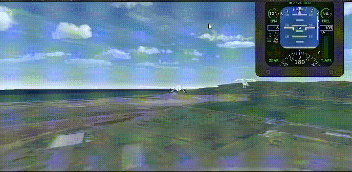
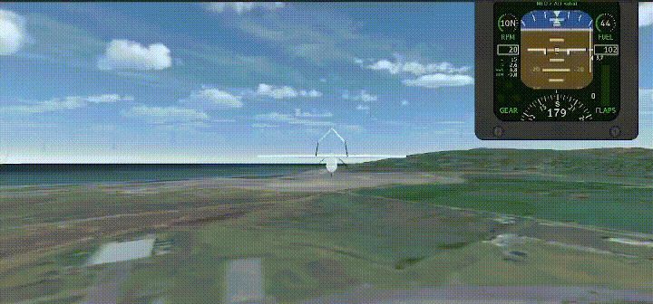
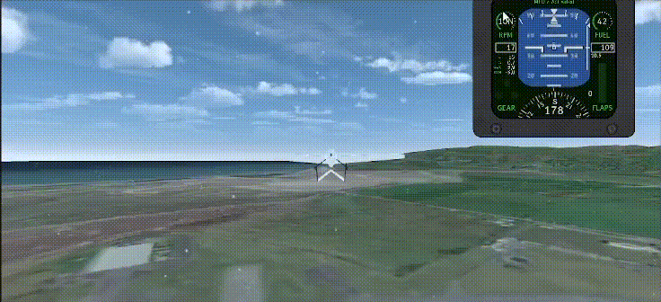
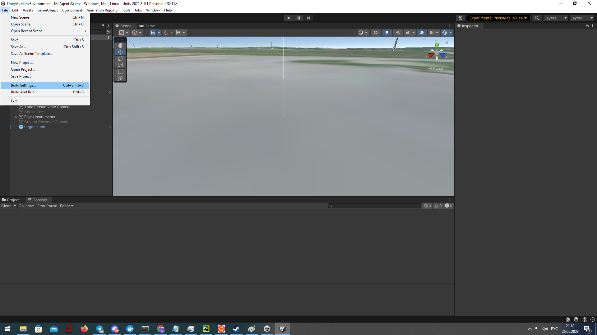

# Unity Environment

UnityAirplaneEnvironment is a training-focused Unity setup for aircraft reinforcement learning: ready-made scenes with increasing complexity, configurable physics, and a convenient `gym`-based Python wrapper.

- **Ready scenes**: base, birds, icing, rain, wind
- **Control & physics**: `AircraftManager`, aero modules, experiment configs
- **Python API**: `get_plane_env` and `unity_discrete_env` (3^7 discrete actions)
- **Scaling**: Docker, GPU, parallel workers

## Quick start {#quick-start}

1. Build the Unity project → [Build the environment in Unity](#build-the-environment-in-unity)
2. Run and validate the Python wrapper → [Interact with Python](#interact-with-python)
3. Launch A3C training in a container → [Run in Docker (GPU/CPU, distributed)](#run-in-docker-gpucpu-distributed)

Source: [tensoraerospace/UnityAirplaneEnvironment](https://github.com/tensoraerospace/UnityAirplaneEnvironment)

## Environment components

Components used to model aircraft motion:

| Component | Purpose | Usage/parameters |
| --- | --- | --- |
| Rigidbody | Physics component at the center of mass; defines mass and dynamics. | Attach to the aircraft center-of-mass object |
| CentreOfGravity | Marker for the aircraft’s center of gravity. | Place at the aircraft CG |
| AeroBody | Aerodynamic computations for aircraft parts; references the `Rigidbody`. | On each element (wings, fuselage, etc.) |
| AeroGroup | Collection of all aircraft `AeroBody` references. | On the aircraft controller object |
| Thruster | Applies thrust at the proper point. | On the propeller/engine |
| Elevator | Control surfaces: elevators, flaps, etc. | On movable wing/tail surfaces |
| AircraftManager | Handles aircraft physics and control channels. | Separate scene object |
| FlightDynamicsFlightManager | Links the aircraft, CG, `AircraftManager`, and experiment config (wind, initial pose, etc.). | Separate scene object |

### Control channels (AircraftManager)

| Channel | Description | Range |
| --- | --- | --- |
| Thrust | Engine thrust | Normalized [-1, 1]; discrete wrapper {-1, 0, 1} |
| Aileron | Ailerons | [-1, 1] / {-1, 0, 1} |
| Elevator | Elevator | [-1, 1] / {-1, 0, 1} |
| ElevatorTrim | Elevator trim | [-1, 1] / {-1, 0, 1} |
| Rudder | Rudder | [-1, 1] / {-1, 0, 1} |
| FlapUp | Raise flaps | Toggle/pulse |
| FlapDown | Lower flaps | Toggle/pulse |

!!! note
    В дискретной обёртке `unity_discrete_env` семимерное действие кодируется как одно целое число: 3 значения на канал ⇒ всего 3^7 действий.

## Unity scenes

Training includes 5 scenes (1 base + 4 with additional challenges) located in `UnityAirplaneEnvironment/Assets/AlbLab3/Scenes`.

???+ info "MLAgentsScene — base"
    Standard aircraft configuration.

???+ info "MLAgentsSceneBirds — birds"
    Random forces occasionally push the aircraft.

    Configure via the `Birds` component on `AircraftManager` (`Impact` and interval). Forces apply randomly to wings or nose with magnitude `(Impact, 2 × Impact)`.

    

???+ info "MLAgentsSceneCold — icing"
    Engine thrust is capped; thrust may stall; controls can freeze.

    Configure `MaxThrust` in `AircraftManager`; the `Cold` component defines freeze intervals (UI hint “controls frozen”).

    

???+ info "MLAgentsSceneRain — rain"
    Constant downward force vector.

    Configure with the `Rain` component (`Impact`).

    

???+ info "MLAgentsSceneWind — wind"
    Parameters from `UnityAirplaneEnvironment/Assets/AlbLab3/Experiment Settings/ml_agent_wind.asset` (speed, azimuth, elevator). Example: speed 10, elevator 30.

    

!!! note
Gravity is set to g = 9.81.

## Interact with Python {#interact-with-python}

Minimal example of acquiring the Unity `gym` wrapper with optional action discretization:

    from tensoraerospace.envs.unity_env import get_plane_env, unity_discrete_env

    # Path to the built Unity scene (Linux example)
    UNITY_BUILD_PATH = "/path/to/linux_build/build.x86_64"

    # For separate process/server usage, enable server=True and a unique worker id
    env = get_plane_env(UNITY_BUILD_PATH, server=True, worker=0)

    # Для дискретного пространства действий используйте обёртку
    env = unity_discrete_env(env)

    obs = env.reset()
    done = False
    total_reward = 0.0
    while not done:
        action = env.action_space.sample()
        obs, reward, done, info = env.step(action)
        total_reward += reward

    env.close()

!!! tip
    For parallel environments, assign unique `worker` ids and set `server=True` for each instance.

## Build the environment in Unity {#build-the-environment-in-unity}

1. Open File → Build Settings in Unity.

   

2. Choose the scene, target platform, and click Build.

   

3. Select the destination folder for the executable.

## Run in Docker (GPU/CPU, distributed) {#run-in-docker-gpucpu-distributed}

Benefits of distributed GPU training: higher throughput, natural parallelism (e.g., A3C), faster learning, and support for larger models. Coordination and synchronization across processes/devices are required for efficient execution.

Example Dockerfile with dependencies and TensorBoard startup:

<!-- markdownlint-disable MD046 -->
```dockerfile
FROM tensorflow/tensorflow:2.4.0-gpu-jupyter

RUN pip install gym==0.20.0 scipy==1.5.4 gym-unity==0.28.0
RUN mkdir /tf/logs
COPY a3c_example.py /tf

ENTRYPOINT tensorboard --logdir /tf/logs --port 8889 --host 0.0.0.0 & python a3c_example.py
```
<!-- markdownlint-enable MD046 -->

Скрипт обучения (A3C, несколько воркеров через `worker_id`):

<!-- markdownlint-disable MD046 -->
```python
from tensoraerospace.envs.unity_env import get_plane_env, unity_discrete_env
from tensoraerospace.agent.a3c import Agent, setup_global_params

def env_function(worker_id):
    # /tf/linux_build/build.x86_64 — path to the Unity build inside the container
    return get_plane_env("/tf/linux_build/build.x86_64", server=True, worker=worker_id)

actor_lr = 0.0005
critic_lr = 0.001
gamma = 0.99
hidden_size = 128
update_interval = 1

max_episodes = 100

setup_global_params(actor_lr, critic_lr, gamma, hidden_size, update_interval, max_episodes)

agent = Agent(env_function, gamma)
agent.train()
```
<!-- markdownlint-enable MD046 -->

Launch the container and mount the library and Unity build:

=== "Linux / macOS"

    ```bash
    docker run --gpus all \
      -v "$PWD/tensoraerospace:/tf/tensoraerospace" \
      -v "$PWD/linux_build:/tf/linux_build" \
      -p 8889:8889 \
      unity_docker
    ```

=== "Windows"

    ```bash
    docker run --gpus all \
      -v C:\\Users\\<USER>\\Projects\\TensorAeroSpace\\tensoraerospace:/tf/tensoraerospace \
      -v C:\\Users\\<USER>\\Projects\\TensorAeroSpace\\linux_build:/tf/linux_build \
      -p 8889:8889 \
      unity_docker
    ```

!!! warning
    `nvidia-container-toolkit` is required for GPU access. On Windows use absolute paths in `-v`.

## Sample training run


