# Signals

Generators of standard test signals for modeling, identification, and verification of control systems in `TensorAeroSpace`.

TensorAeroSpace provides **17 types of signals** for comprehensive system testing and analysis:

- **Basic signals**: Step, Ramp, Pulse, Constant
- **Periodic signals**: Sinusoid, Square wave, Triangular wave, Sawtooth
- **Complex signals**: Chirp, Doublet, Multi-step, Exponential, Gaussian pulse, Multisine, Damped sinusoid
- **Random signals**: Full random signal

## Quick Start

```python
from tensoraerospace.utils import generate_time_period
from tensoraerospace.signals.standard import unit_step, sinusoid, chirp, doublet
from tensoraerospace.signals.random import full_random_signal
import numpy as np

# Time axis 0..20 s (default step)
tp = generate_time_period(tn=20)

# Step of 5° at t = 10 s
u_step = unit_step(degree=5, tp=tp, time_step=10, output_rad=False)

# Sine wave with amplitude 10 units, frequency 0.01 Hz
u_sin = sinusoid(tp=tp, amplitude=10, frequency=0.01)

# Chirp signal for frequency response analysis
u_chirp = chirp(tp, f0=0.1, f1=2.0, amplitude=2.0, method='linear')

# Doublet for aerospace maneuvers
u_doublet = doublet(tp, amplitude=np.deg2rad(5), time_start=5.0, width=1.0)

# Random signal with random frequency and amplitude
u_rand = full_random_signal(0, 0.01, 20, (-0.5, 0.5), (-0.5, 0.5))
```

!!! tip "Units"
    For functions that support it, the `output_rad=False` parameter returns angles in degrees. Set it to `True` to get radians.

---

## Basic Signals

### Step Signal

A classic step input for exciting transient processes and analyzing system response.

=== "API"

    ::: tensoraerospace.signals.standard.unit_step

=== "Example"

    ```python
    from tensoraerospace.utils import generate_time_period
    from tensoraerospace.signals.standard import unit_step

    tp = generate_time_period(tn=20)
    u = unit_step(degree=5, tp=tp, time_step=10, output_rad=False)
    ```

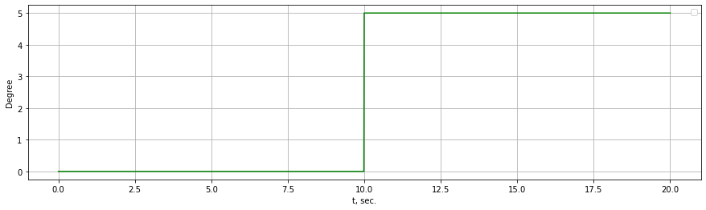

---

### Ramp Signal

Linear increasing signal for testing tracking capability of control systems.

=== "API"

    ::: tensoraerospace.signals.standard.ramp

=== "Example"

    ```python
    from tensoraerospace.utils import generate_time_period
    from tensoraerospace.signals.standard import ramp

    tp = generate_time_period(tn=20)
    u = ramp(tp, slope=0.5, time_start=2.0)
    ```

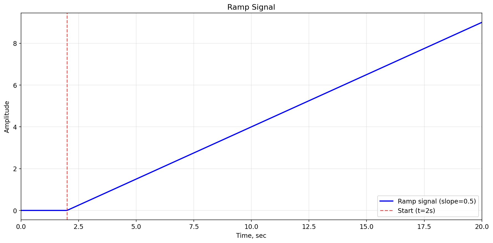

---

### Pulse Signal

Rectangular pulse for analyzing impulse response and transient behavior.

=== "API"

    ::: tensoraerospace.signals.standard.pulse

=== "Example"

    ```python
    from tensoraerospace.utils import generate_time_period
    from tensoraerospace.signals.standard import pulse

    tp = generate_time_period(tn=20)
    u = pulse(tp, amplitude=5.0, time_start=5.0, width=3.0)
    ```

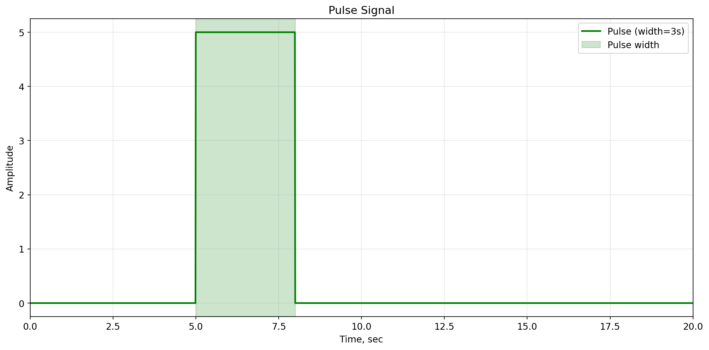

---

### Constant Signal

Constant reference signal for setpoint tracking and steady-state analysis.

=== "API"

    ::: tensoraerospace.signals.standard.constant_line

=== "Example"

    ```python
    from tensoraerospace.utils import generate_time_period
    from tensoraerospace.signals.standard import constant_line

    tp = generate_time_period(tn=20)
    u = constant_line(tp, value_state=3.0)
    ```

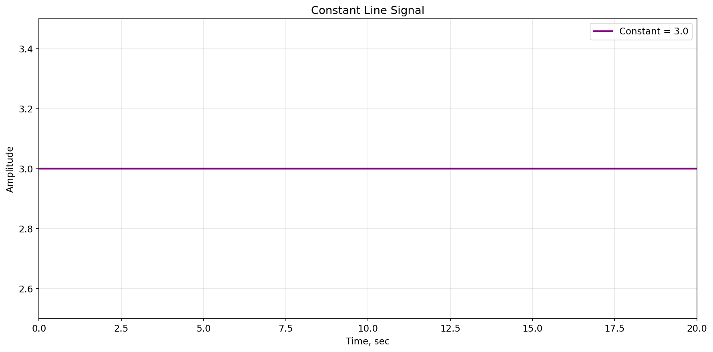

---

## Periodic Signals

### Sinusoidal Signal

Used for frequency analysis and testing linear subsystems.

=== "API"

    ::: tensoraerospace.signals.standard.sinusoid

=== "Example"

    ```python
    from tensoraerospace.utils import generate_time_period
    from tensoraerospace.signals.standard import sinusoid

    tp = generate_time_period(tn=20)
    u = sinusoid(tp=tp, amplitude=10, frequency=0.01)
    ```

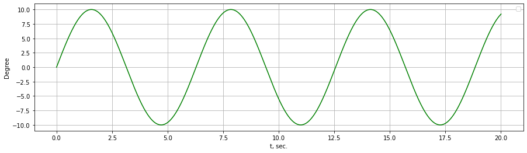

---

### Sinusoid with Vertical Shift

Sinusoidal signal with DC offset for testing systems with non-zero operating points.

=== "API"

    ::: tensoraerospace.signals.standard.sinusoid_vertical_shift

=== "Example"

    ```python
    from tensoraerospace.utils import generate_time_period
    from tensoraerospace.signals.standard import sinusoid_vertical_shift

    tp = generate_time_period(tn=20)
    u = sinusoid_vertical_shift(tp, frequency=0.5, amplitude=2.0, vertical_shift=5.0)
    ```

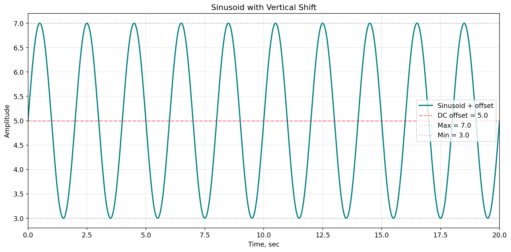

---

### Square Wave

Periodic square wave for switching control and relay-based systems.

=== "API"

    ::: tensoraerospace.signals.standard.square_wave

=== "Example"

    ```python
    from tensoraerospace.utils import generate_time_period
    from tensoraerospace.signals.standard import square_wave

    tp = generate_time_period(tn=20)
    u = square_wave(tp, frequency=0.5, amplitude=3.0, duty_cycle=0.5)
    ```


---

### Triangular Wave

Smooth periodic signal with symmetric rise and fall times.

=== "API"

    ::: tensoraerospace.signals.standard.triangular_wave

=== "Example"

    ```python
    from tensoraerospace.utils import generate_time_period
    from tensoraerospace.signals.standard import triangular_wave

    tp = generate_time_period(tn=20)
    u = triangular_wave(tp, frequency=0.3, amplitude=4.0)
    ```

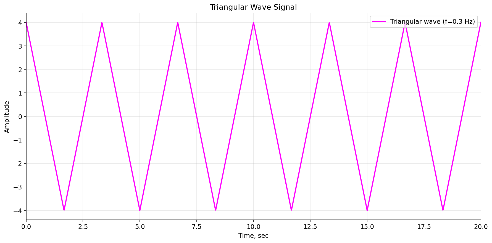

---

### Sawtooth Wave

Periodic sawtooth signal with linear increase from negative to positive amplitude.

=== "API"

    ::: tensoraerospace.signals.standard.sawtooth

=== "Example"

    ```python
    from tensoraerospace.utils import generate_time_period
    from tensoraerospace.signals.standard import sawtooth

    tp = generate_time_period(tn=20)
    u = sawtooth(tp, frequency=0.4, amplitude=3.0)
    ```


---

## Complex Signals

### Chirp Signal

Swept-frequency signal for system identification and frequency response analysis.

=== "API"

    ::: tensoraerospace.signals.standard.chirp

=== "Example"

    ```python
    from tensoraerospace.utils import generate_time_period
    from tensoraerospace.signals.standard import chirp

    tp = generate_time_period(tn=20)
    u = chirp(tp, f0=0.1, f1=2.0, amplitude=2.0, method='linear')
    ```


---

### Doublet

Aerospace maneuver signal consisting of positive and negative pulses for stability analysis.

=== "API"

    ::: tensoraerospace.signals.standard.doublet

=== "Example"

    ```python
    import numpy as np
    from tensoraerospace.utils import generate_time_period
    from tensoraerospace.signals.standard import doublet

    tp = generate_time_period(tn=20)
    u = doublet(tp, amplitude=np.deg2rad(10), time_start=5.0, width=1.0)
    ```


---

### Multi-Step Signal

Sequence of step changes for testing tracking performance with multiple setpoints.

=== "API"

    ::: tensoraerospace.signals.standard.multi_step

=== "Example"

    ```python
    from tensoraerospace.utils import generate_time_period
    from tensoraerospace.signals.standard import multi_step

    tp = generate_time_period(tn=20)
    u = multi_step(tp, step_times=[2, 5, 8, 12, 16], step_values=[1, 2, -1, 3, -2])
    ```

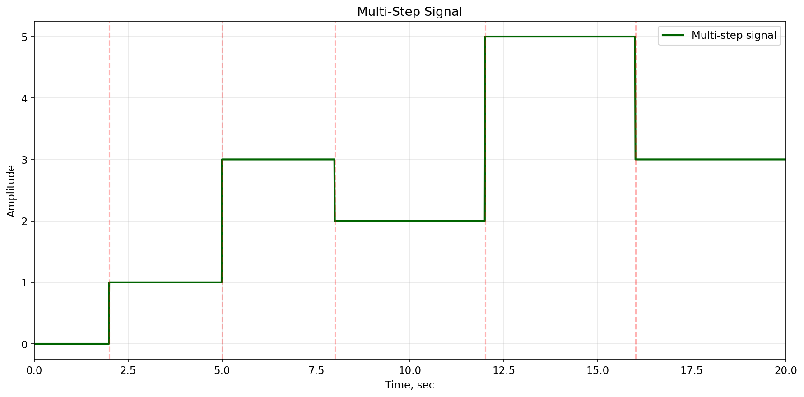

---

### Exponential Signal

Smooth exponential approach to final value, modeling first-order system response.

=== "API"

    ::: tensoraerospace.signals.standard.exponential

=== "Example"

    ```python
    from tensoraerospace.utils import generate_time_period
    from tensoraerospace.signals.standard import exponential

    tp = generate_time_period(tn=20)
    u = exponential(tp, amplitude=10.0, time_constant=2.0, time_start=3.0)
    ```

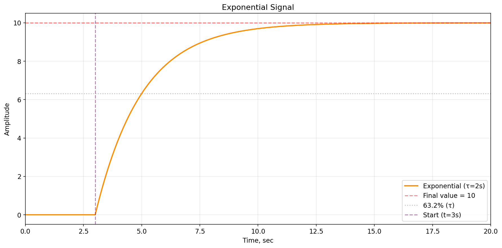

---

### Gaussian Pulse

Bell-shaped pulse for smooth disturbances and band-limited excitations.

=== "API"

    ::: tensoraerospace.signals.standard.gaussian_pulse

=== "Example"

    ```python
    from tensoraerospace.utils import generate_time_period
    from tensoraerospace.signals.standard import gaussian_pulse

    tp = generate_time_period(tn=20)
    u = gaussian_pulse(tp, amplitude=8.0, center=10.0, width=1.5)
    ```


---

### Multisine Signal

Sum of multiple sinusoids for multi-frequency system excitation and MIMO analysis.

=== "API"

    ::: tensoraerospace.signals.standard.multisine

=== "Example"

    ```python
    import numpy as np
    from tensoraerospace.utils import generate_time_period
    from tensoraerospace.signals.standard import multisine

    tp = generate_time_period(tn=20)
    u = multisine(tp, frequencies=[0.2, 0.5, 1.0, 1.5], 
                  amplitudes=[2.0, 1.5, 1.0, 0.5],
                  phases=[0, np.pi/4, np.pi/2, np.pi])
    ```

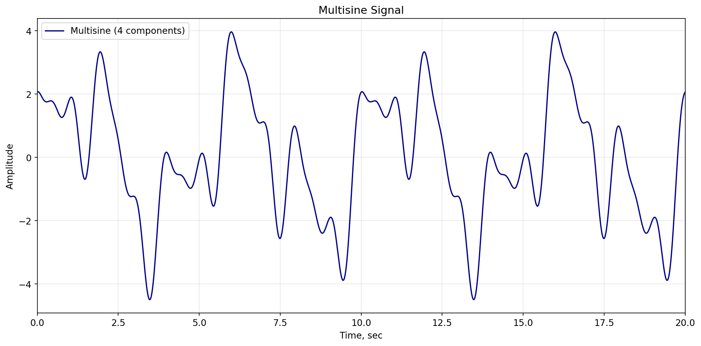

---

### Damped Sinusoid

Exponentially decaying oscillation, characteristic of underdamped systems.

=== "API"

    ::: tensoraerospace.signals.standard.damped_sinusoid

=== "Example"

    ```python
    from tensoraerospace.utils import generate_time_period
    from tensoraerospace.signals.standard import damped_sinusoid

    tp = generate_time_period(tn=20)
    u = damped_sinusoid(tp, frequency=1.0, amplitude=5.0, damping=0.3, time_start=2.0)
    ```


---

## Random Signals

### Random Signal by Frequency and Amplitude

Generates a random test input with configurable frequency and amplitude ranges for modeling disturbances.

=== "API"

    ::: tensoraerospace.signals.random.full_random_signal

=== "Example"

    ```python
    from tensoraerospace.signals.random import full_random_signal

    # full_random_signal(t0, dt, tn, amplitude_range, frequency_range)
    u = full_random_signal(0, 0.01, 20, (-0.5, 0.5), (-0.5, 0.5))
    ```

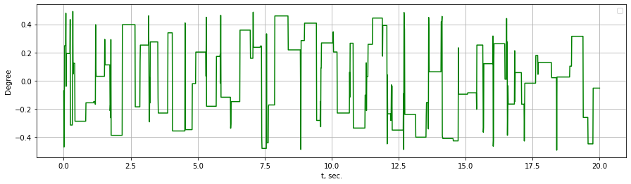

---

## Notes

- Use `tensoraerospace.utils.generate_time_period` to build the time axis.
- All functions return an array of signal values that aligns with the `tp` time axis.
- For aerospace applications, doublet signals are particularly useful for flight control testing.
- Chirp signals are ideal for system identification and frequency response analysis.
- Combine multiple signals to create complex test scenarios.
- **Chirp `f0` parameter:** `f0` must be positive; a `ValueError` is raised otherwise.
- **Chirp exponential mode with `f0 == f1`:** When `f0` equals `f1` in exponential mode, the function returns a constant-frequency sinusoid instead of raising an error.
