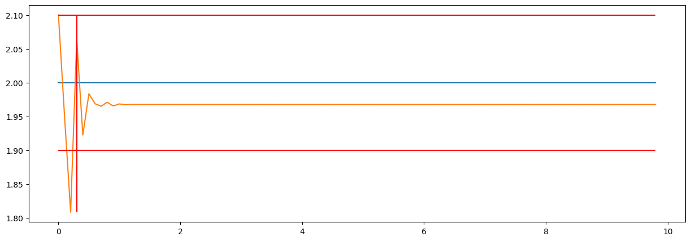

Пример использования MPC
===========================================================

В этом примере мы рассмотрим, как использовать нейросетевую модель для управления динамической системой. Мы создадим модель, сгенерируем данные, обучим модель и применим её для управления с использованием метода Model Predictive Control (MPC).


Подготовка окружения
--------------------

Сначала импортируем необходимые библиотеки:

.. code:: ipython3

    import numpy as np
    import gymnasium as gym
    import torch
    from tqdm import tqdm

    from tensoraerospace.envs.f16.linear_longitudial import LinearLongitudinalF16
    from tensoraerospace.utils import generate_time_period, convert_tp_to_sec_tp
    from tensoraerospace.signals.standart import unit_step, sinusoid
    from tensoraerospace.benchmark.function import static_error
    from tensoraerospace.agent.mpc.gradient import MPCOptimizationAgent
    from tensoraerospace.signals.random import full_random_signal
    from tensoraerospace.agent.pid import PID

    dt = 0.01  # Дискретизация
   tp = generate_time_period(tn=20, dt=dt)
   tps = convert_tp_to_sec_tp(tp, dt=dt)
   number_time_steps = len(tp) # Количество временных шагов
   reference_signals = np.reshape(unit_step(degree=5, tp=tp, time_step=10, output_rad=True), [1, -1]) # Заданный сигнал

   env = gym.make('LinearLongitudinalB747-v0',
                  number_time_steps=number_time_steps, 
                  initial_state=[[0],[0],[0],[0]],
                  reference_signal = reference_signals)
   state, info = env.reset()


Создание модели динамики
------------------------

Для моделирования системы создадим нейросетевую модель:


.. code:: ipython3

    import torch
    import torch.nn as nn

    class DynamicsModel(nn.Module):
        def __init__(self, state_dim=4, control_dim=1, hidden_dim=64):
            super().__init__()
            self.network = nn.Sequential(
                nn.Linear(state_dim + control_dim, hidden_dim),
                nn.ReLU(),
                nn.Linear(hidden_dim, hidden_dim),
                nn.ReLU(),
                nn.Linear(hidden_dim, hidden_dim),
                nn.ReLU(),
                nn.Linear(hidden_dim, state_dim)
            )

        def forward(self, x):
            return self.network(x)

Инициализация модели и данных
-----------------------------

Инициализируем модель и зададим параметры системы:

.. code:: ipython3

    from tensoraerospace.agent.mpc.dynamics import DynamicsNN

    state_ranges = [(-10.0, 10.0), (-4.5, 4.5), (-2.3, 2.3), (-15.0, 15.0)]
    
    A = torch.tensor(env.unwrapped.model.A, dtype=torch.float32)
    B = torch.tensor(env.unwrapped.model.B, dtype=torch.float32)

    
    dynamics_nn = DynamicsNN(DynamicsModel(hidden_dim=128))

Генерация тренировочных данных:

.. code:: ipython3

    states, controls, next_states = dynamics_nn.generate_training_data(
        num_samples=300_000,
        state_dim=4,
        control_dim=1,
        state_ranges=state_ranges,
        control_ranges=None,
        control_signals=["sine", "step", "sine_09", "sine_07", 
                         "sine_05_low_freq", "gaussian_noise",
                         "linear_up", "linear_down"],
        A=A,
        B=B)

Обучение модели
---------------

Обучим модель на сгенерированных данных:


.. code:: ipython3

    dynamics_nn.train_and_validate(
        torch.tensor(states, dtype=torch.float32),
        torch.tensor(controls, dtype=torch.float32),
        torch.tensor(next_states, dtype=torch.float32),
        epochs=400,
        batch_size=1024,
        verbose_epoch=20)

.. parsed-literal::

    Подготовка данных
    Загрузка данных
    Начало обучения

.. parsed-literal::

    100%|██████████| 400/400 [16:05<00:00, 2.41s/it]

Применение MPC для управления
-----------------------------

Теперь применим обученную модель для управления системой с помощью MPC:

.. code:: ipython3

    import matplotlib.pyplot as plt
    from tensoraerospace.agent.mpc.base import AircraftMPC

    mpc = AircraftMPC(dynamics_nn.model, horizon=2, dt=0.1)


Параметры симуляции:

.. code:: ipython3

    simulation_time = 20  # Время симуляции (в секундах)
    dt = 0.1
    steps = int(simulation_time / dt)
    
    x0 = np.array([0, 0, 0, 0])
    states = [x0]
    controls = []

Генерация опорной траектории:

.. code:: ipython3

    time = np.arange(steps + mpc.horizon + 1) * dt
    theta_ref = unit_step(degree=2, tp=time, time_step=dt)

Цикл управления:

.. code:: ipython3

    for i in tqdm(range(steps)):
        current_ref = theta_ref[i:i + mpc.horizon + 1]
        u_opt, predicted_states = mpc.optimize_control(states[-1], current_ref)
        next_states = A @ torch.tensor(states[-1], dtype=torch.float32) + B @ torch.tensor(u_opt)
        
        controls.append(u_opt)
        states.append(next_states.numpy())

Визуализация результатов симуляции
----------------------------------

.. code:: ipython3

    time_array = np.arange(0, simulation_time, dt)
    
    plt.figure(figsize=(10, 6))
    
    plt.subplot(2, 1, 1)
    plt.plot(time_array, [s[3] for s in states[:-1]], label="Actual Theta")
    plt.plot(time_array, theta_ref[:steps], label="Reference Theta")
    plt.ylabel("Theta")
    plt.legend()
    
    plt.subplot(2, 1, 2)
    plt.plot(time_array, controls)
    plt.xlabel("Time (s)")
    plt.ylabel("Control (u)")
    
    plt.tight_layout()
    plt.show()

Оценка качества управления
---------------------------

.. code:: ipython3

    from tensoraerospace.benchmark import ControlBenchmark
    
    bench = ControlBenchmark()
    
    res = bench.becnchmarking_one_step(
        theta_ref[:-3],
        np.array([float(s[3]) for s in states[:-1]]),
        settling_threshold=1.9,
        dt=dt)

.. code:: ipython3

    print("Статическая ошибка: ", res['static_error'])
    print("Время переходного процесса: ", res['settling_time'], "сек")
    print("Степень затухания: ", res['damping_degree'])
    print("Перерегулирование: ", res['overshoot'])

.. parsed-literal::

   Статическая ошибка:  0.03220049142837533
   Время переходного процесса:  0.30000000000000004 сек
   Степень затухания:  0.0014316554503416693
   Перерегулирование:  5.013108253479004

Визуализация результатов оценки качества управления:

.. code:: ipython3

   bench.plot(
       theta_ref[:-3],
       np.array([float(s[3]) for s in states[:-1]]),
       settling_threshold=1.9,
       dt=dt,
       time=time,
       figsize=(15,5))


```
