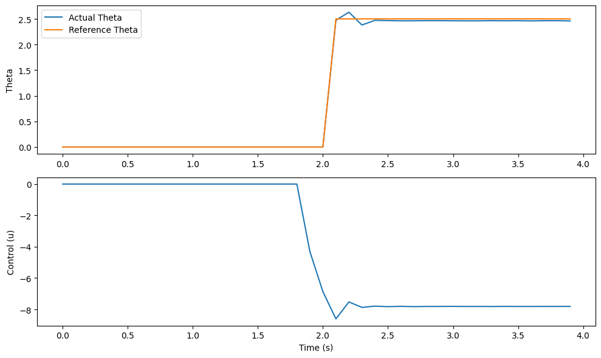
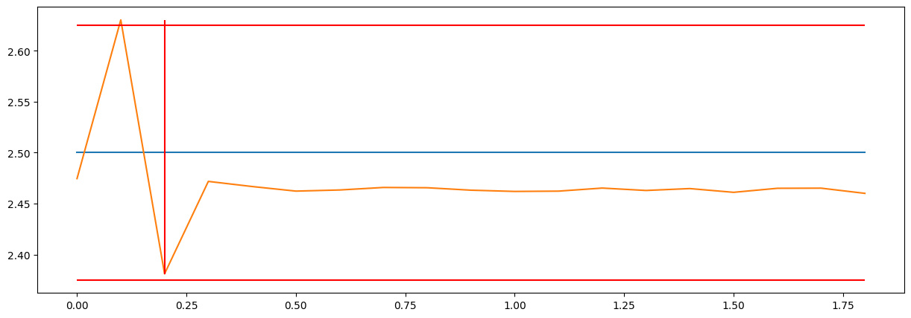

Пример использования MPC c Transformers
=======================================

Здесь приведен пример обучения нейронной сети, реализации управления с помощью MPC (Model Predictive Control) и анализа результатов с использованием инструмента для оценки характеристик системы управления.

1. Создание модели динамики
---------------------------

Для начала создается модель динамики системы с использованием нейронной сети и трансформеров. Генерируются тренировочные данные, которые затем используются для обучения модели.

.. code:: python

    from tensoraerospace.agent.mpc.transformers import TransformerDynamicsModel
    from tensoraerospace.agent.mpc.dynamics import DynamicsNN
    import torch
    from tensoraerospace.signals.standart import unit_step
    from tensoraerospace.utils import generate_time_period, convert_tp_to_sec_tp
    import numpy as np
    import gymnasium as gym

    # Параметры системы
    state_dim = 4  # Размерность состояния
    control_dim = 1  # Размерность управления
    input_dim = state_dim + control_dim
    output_dim = state_dim

    # Создание модели и генерация данных
    nn_transformers = TransformerDynamicsModel(input_dim, output_dim)
    dynamics_nn = DynamicsNN(nn_transformers)

    dt = 0.01  # Шаг дискретизации
    tp = generate_time_period(tn=20, dt=dt)  # Временной период
    tps = convert_tp_to_sec_tp(tp, dt=dt)
    number_time_steps = len(tp)  # Количество временных шагов

    reference_signals = np.reshape(unit_step(degree=5, tp=tp, time_step=10, output_rad=True), [1, -1])  # Сигнал

    # Инициализация среды Gym
    env = gym.make('LinearLongitudinalB747-v0',
                number_time_steps=number_time_steps,
                initial_state=[[0], [0], [0], [0]],
                reference_signal=reference_signals)

    state_ranges = [(-10.0, 10.0), (-4.5, 4.5), (-2.3, 2.3), (-15.0, 15.0)]
    A = torch.tensor(env.unwrapped.model.A, dtype=torch.float32)
    B = torch.tensor(env.unwrapped.model.B, dtype=torch.float32)

    # Генерация тренировочных данных
    states, controls, next_states = dynamics_nn.generate_training_data(
        num_samples=300_000,
        state_dim=4,
        control_dim=1,
        state_ranges=state_ranges,
        control_ranges=None,
        control_signals=["sine", "step", "sine_09", "sine_07", "sine_05_low_freq", "gaussian_noise", "linear_up", "linear_down"],
        A=A,
        B=B
    )

    # Обучение модели
    dynamics_nn.train_and_validate(
        torch.tensor(states, dtype=torch.float32),
        torch.tensor(controls, dtype=torch.float32),
        torch.tensor(next_states, dtype=torch.float32),
        epochs=400,
        batch_size=1024,
        verbose_epoch=20
    )

2. Реализация MPC (Model Predictive Control)
---------------------------------------------
После обучения модели динамики реализуется управление с помощью MPC.

.. code:: python

    import numpy as np
    import torch
    import matplotlib.pyplot as plt
    from tensoraerospace.agent.mpc.base import AircraftMPC

    # Инициализация MPC контроллера
    mpc = AircraftMPC(dynamics_nn.model, horizon=2, dt=0.1, iterations=50, learning_rate=10e-6, increment=1e-4)

    # Параметры симуляции
    simulation_time = 4  # Время симуляции (сокращено для примера)
    dt = 0.1
    steps = int(simulation_time / dt)

    # Начальное состояние системы
    x0 = np.array([0, 0, 0, 0])
    states = [x0]
    controls = []

    # Опорная траектория (сигнал)
    time = np.arange(steps + mpc.horizon + 1) * dt
    theta_ref = unit_step(degree=2.5, tp=time, time_step=0.02, output_rad=False)

    model_states = [torch.tensor([0., 0., 0., 0.], dtype=torch.float32)]

    # Основной цикл управления
    for i in tqdm(range(steps)):
        current_ref = theta_ref[i:i + mpc.horizon + 1]
        
        # Оптимизация управления с помощью MPC
        u_opt, predicted_states = mpc.optimize_control(states[-1], current_ref)
        
        # Обновление состояния системы на основе модели A и B
        next_states = A @ model_states[i] + B @ torch.tensor(u_opt, dtype=torch.float32)
        
        controls.append(u_opt)
        model_states.append(next_states)
        
        states.append(next_states)

3. Визуализация результатов
---------------------------
Результаты симуляции отображаются в виде графиков:

- Сравнение реального отклика системы с заданной траекторией.
- Управляющее воздействие.

.. code::

    time_array = np.arange(0, simulation_time, dt)

    plt.figure(figsize=(10, 6))

    plt.subplot(2, 1, 1)
    plt.plot(time_array, [s[3] for s in states[:-1]], label="Actual Theta")
    plt.plot(time_array, theta_ref[:steps], label="Reference Theta")
    plt.ylabel("Theta")
    plt.legend()

    plt.subplot(2, 1, 2)
    plt.plot(time_array, controls)
    plt.xlabel("Time (s)")
    plt.ylabel("Control (u)")

    plt.tight_layout()
    plt.show()

4. Анализ результатов
---------------------
Для оценки характеристик системы используется модуль ControlBenchmark.

.. code:: python

    from tensoraerospace.benchmark import ControlBenchmark

    bench = ControlBenchmark()
    res = bench.becnchmarking_one_step(
        theta_ref[:-3],
        np.array([float(s[3]) for s in states[:-1]]),
        settling_threshold=1.9,
        dt=dt
    )

    print("Статическая ошибка: ", res['static_error'])
    print("Время переходного процесса: ", res['settling_time'], "сек")
    print("Степень затухания: ", res['damping_degree'])
    print("Перерегулирование: ", res['overshoot'])

    # Построение графиков результатов управления и опорной траектории
    bench.plot(
        theta_ref[:-3],
        np.array([float(s[3]) for s in states[:-1]]),
        settling_threshold=0.9,
        dt=dt,
        time=time,
        figsize=(15, 5)
    )

.. code:: python

    Статическая ошибка:  0.03743922710418701
    Время переходного процесса:  0.2 сек
    Степень затухания:  0.012593524089427021
    Перерегулирование:  5.2121734619140625

Этот пример демонстрирует полный цикл работы с библиотекой TensorAerospace: от создания модели динамики до реализации управления и анализа характеристик системы управления на основе полученных данных.

