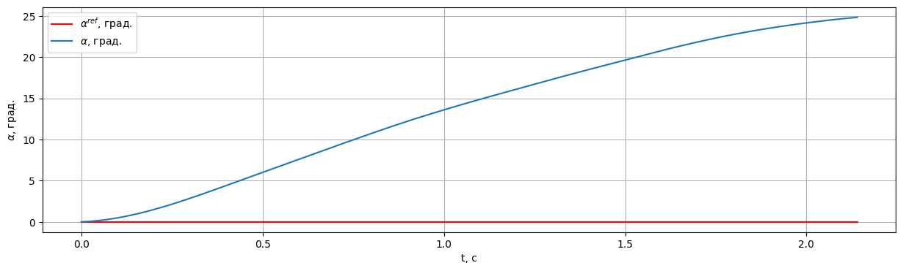

Пример использования SAC
===========================================================

.. code:: python

    import gym 
    import datetime
    import itertools
    import torch
    import numpy as np
    from gym.spaces import Box
    from tqdm import tqdm
    
    from tensorairspace.envs import LinearLongitudinalF16
    from tensorairspace.utils import generate_time_period, convert_tp_to_sec_tp
    from tensorairspace.signals.standart import unit_step
    from tensorairspace.agent.sac import SAC, ReplayMemory

.. code:: python

    dt = 0.01  # Дискретизация
    tp = generate_time_period(tn=20, dt=dt) # Временной периуд
    tps = convert_tp_to_sec_tp(tp, dt=dt)
    number_time_steps = len(tp) # Количество временных шагов
    reference_signals = np.reshape(unit_step(degree=5, tp=tp, time_step=10, output_rad=True), [1, -1]) # Заданный сигнал

.. code:: python

    env = gym.make('LinearLongitudinalF16-v0',
                   number_time_steps=number_time_steps, 
                   initial_state=[[0],[0],[0],[0]],
                   reference_signal = reference_signals)
    env.reset()

.. code:: python

    seed = 42
    replay_size = 1000000
    batch_size = 256
    updates_per_step = 1
    num_steps = 1000001

.. code:: python

    action_space_boxes = Box(low=np.array([-30]), high=np.array([30]), dtype=np.float32)

.. code:: python

    torch.manual_seed(seed)
    np.random.seed(seed)

.. code:: python

    memory = ReplayMemory(replay_size, seed)

.. code:: python

    agent = SAC(2, action_space_boxes, hidden_size=32, cuda=False)

.. code:: python

    # Training Loop
    total_numsteps = 0
    updates = 0
    
    for i_episode in itertools.count(1):
        episode_reward = 0
        episode_steps = 0
        done = False
        env.reset()
        state = np.array([0, 0], dtype=np.float32)
        reward_per_step = []
        for i in tqdm(range(len(tp)-1)):
            action = agent.select_action(state)
            if len(memory) > batch_size:
                for i in range(updates_per_step):
                    critic_1_loss, critic_2_loss, policy_loss, ent_loss, alpha = agent.update_parameters(memory, batch_size, updates)
                    updates += 1
            
            next_state, reward, done, _ = env.step(action) 
            next_state = np.array(next_state).reshape([1,-1])[0]
            episode_steps += 1
            total_numsteps += 1
            episode_reward += reward
            reward_per_step.append(reward)
            mask = 1 if episode_steps == len(tp)-1 else float(not done)
            memory.push(state, action, reward, next_state, mask)
            state = next_state
        
    #     env.model.plot_transient_process('alpha', tps, reference_signals[0], to_deg=True, figsize=(15,4))
        print("rewards episode", np.average(reward_per_step))
        if total_numsteps > num_steps:
            break

.. code:: python

    env.model.plot_transient_process('alpha', tps, reference_signals[0], to_deg=True, figsize=(15,4))

