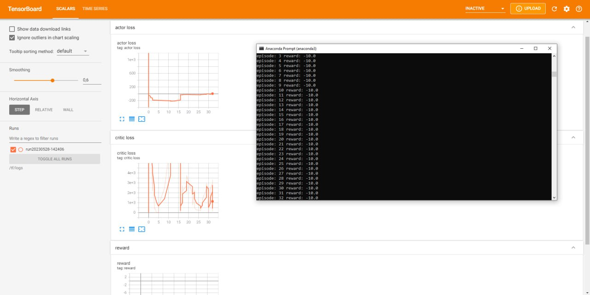

Пример запуска Unity среды с DQN агентом
==================================================

.. image:: img/img_demo_unity.gif
  :width: 800

Перед выполнением данного примера настройте unity среду по инструкции в разделе
Настройки Unity среды.

Импорты модели и среды

.. code:: python

    from tensoraerospace.agent.dqn.model import Model, PERAgent
    from tensoraerospace.envs.unity_env import get_plane_env, unity_discrete_env

Запуск теста DQN агента. После запуска данной ячейки необходимо запустить среду Unity

.. code:: python

    env = unity_discrete_env()
    num_actions = env.action_space.n
    model = Model(num_actions)
    target_model = Model(num_actions)
    agent = PERAgent(model, target_model, env, train_nums=100)
    agent.train()
    # test after
    # env = gym.wrappers.Monitor(env, './recording', force=True)
    rewards_sum = agent.evaluation(env)
    print("After Training: %d out of 200" % rewards_sum)  # 200 out of 200

.. parsed-literal::

    [INFO] Listening on port 5004. Start training by pressing the Play button in the Unity Editor.
    [INFO] Connected to Unity environment with package version 2.2.1-exp.1 and communication version 1.5.0
    [INFO] Connected new brain: My Behavior?team=0
    [WARNING] uint8_visual was set to true, but visual observations are not in use. This setting will not have any effect.
    [WARNING] The environment contains multiple observations. You must define allow_multiple_obs=True to receive them all. Otherwise, only the first visual observation (or vector observation ifthere are no visual observations) will be provided in the observation.
    D:\anaconda3\envs\unity-env\lib\site-packages\gym\logger.py:34: UserWarning: WARN: Box bound precision lowered by casting to float32

Экран запуска взаимодействия

.. image:: img/6.png
  :width: 800
  :alt: guide6

Пример запуска взаимодействия с случайным агентом

.. code:: python

    env = get_plane_env()

    env.reset()

    print(env.action_space) # Количество действий в среде
    print(env.observation_space) # Размер состояния среды

    for i in range(100):
        random_action = env.action_space.sample()
        print(random_action)
        new_obs, reward, done, info = env.step(random_action)
    env.close()

.. parsed-literal::

    [INFO] Listening on port 5004. Start training by pressing the Play button in the Unity Editor.
    [INFO] Connected to Unity environment with package version 2.2.1-exp.1 and communication version 1.5.0
    [INFO] Connected new brain: My Behavior?team=0
    [WARNING] uint8_visual was set to true, but visual observations are not in use. This setting will not have any effect.
    [WARNING] The environment contains multiple observations. You must define allow_multiple_obs=True to receive them all. Otherwise, only the first visual observation (or vector observation ifthere are no visual observations) will be provided in the observation.
    D:\anaconda3\envs\unity-env\lib\site-packages\gym\logger.py:34: UserWarning: WARN: Box bound precision lowered by casting to float32
      warnings.warn(colorize("%s: %s" % ("WARN", msg % args), "yellow"))
    Box([-1. -1. -1. -1. -1. -1. -1.], [1. 1. 1. 1. 1. 1. 1.], (7,), float32)
    Box([-inf -inf -inf -inf -inf -inf -inf -inf -inf -inf -inf -inf -inf -inf
     -inf -inf -inf -inf -inf -inf -inf -inf -inf -inf -inf -inf -inf -inf
     -inf -inf], [inf inf inf inf inf inf inf inf inf inf inf inf inf inf inf inf inf inf
     inf inf inf inf inf inf inf inf inf inf inf inf], (30,), float32)
    [-0.52338475  0.81265074 -0.27042347 -0.85183436  0.7446014  -0.8094786
     -0.68685627]
    [-2.3451948e-01  8.8675082e-01 -5.1349407e-01  5.1649964e-01
     -1.3739325e-01  3.4209377e-01  1.5065831e-04]
    ...

Пример запуска взаимодействия с случайным агентом

.. code:: python

    env = unity_discrete_env()

    env.reset()

    print(env.action_space)

    for i in range(100):
        random_action = env.action_space.sample()
        print(random_action)
        new_obs, reward, done, info = env.step(random_action)
    env.close()

.. parsed-literal::

    [INFO] Listening on port 5004. Start training by pressing the Play button in the Unity Editor.
    [INFO] Connected to Unity environment with package version 2.2.1-exp.1 and communication version 1.5.0
    [INFO] Connected new brain: My Behavior?team=0
    [WARNING] uint8_visual was set to true, but visual observations are not in use. This setting will not have any effect.
    [WARNING] The environment contains multiple observations. You must define allow_multiple_obs=True to receive them all. Otherwise, only the first visual observation (or vector observation ifthere are no visual observations) will be provided in the observation.
    Discrete(2187)
    1874
    342
    ...

Запуск в Docker на множестве GPU/CPU
------------------------------------

Обучение RL агента на множестве GPU имеет множество приемуществ: 

**Большая вычислительная мощность:** GPU обычно обеспечивают значительно большую вычислительную мощность, чем CPU. Это особенно важно для RL, где требуется большое количество вычислений для обработки больших массивов данных и применения сложных алгоритмов, таких как A3C (Asynchronous Advantage Actor-Critic).

**Параллелизм:** Алгоритм A3C уже изначально предназначен для асинхронного обучения с использованием множества потоков. Каждый поток работает с собственной копией среды и агента, и все они обновляют общий глобальный агент. Применение множества GPU улучшает этот процесс, позволяя большему количеству потоков работать параллельно и эффективнее выполнять обучение.

**Скорость обучения:** Запуск на множестве GPU может значительно увеличить скорость обучения. Обучение RL обычно требует много времени из-за сложности и неопределенности среды. Использование множества GPU может помочь ускорить процесс.

**Большие модели и более сложные среды:** Наконец, использование множества GPU позволяет работать с более большими нейронными сетями и более сложными средами. Это может быть особенно полезно в случае сложных задач RL, где одна модель или одна среда не могут адекватно представить все аспекты задачи.

Важно отметить, что для эффективного использования множества GPU требуются специальные техники программирования и управления ресурсами, такие как распределенное обучение и синхронизация между различными GPU.

Для распределенного обучения необходимо собрать Docker образ в котором присутсвуют необходимы зависимости и собранная среда Unity

.. code:: bash

  FROM tensorflow/tensorflow:2.4.0-gpu-jupyter

  RUN pip install gym==0.20.0 scipy==1.5.4 gym-unity==0.28.0
  RUN mkdir /tf/logs
  COPY a3c_example.py /tf

  ENTRYPOINT tensorboard --logdir /tf/logs --port 8889 --host 0.0.0.0 & python a3c_example.py

Скрипт для запуска обучения: 

.. code:: python

  from tensoraerospace.envs.unity_env import get_plane_env, unity_discrete_env
  from tensoraerospace.agent.a3c import Agent, setup_global_params

  def env_function(worker_id):
      # /tf/linux_build/build.x86_64 - путь к собранному Unity окружению 
      return get_plane_env("/tf/linux_build/build.x86_64", server=True, worker=worker_id)

  actor_lr = 0.0005
  critic_lr = 0.001
  gamma = 0.99
  hidden_size = 128
  update_interval = 1

  max_episodes = 100

  setup_global_params(actor_lr, critic_lr, gamma, hidden_size, update_interval, max_episodes)

  agent = Agent(env_function, gamma)
  agent.train()

Команда для запуска образа и пробросом библиотеки и собранной Unity среды

.. code:: bash
  
  docker run -v ./tensoraerospace:/tf/tensoraerospace -v ./linux_build:/tf/linux_build -p 8889:8889 unity_docker

Пример запуска обучения модели

