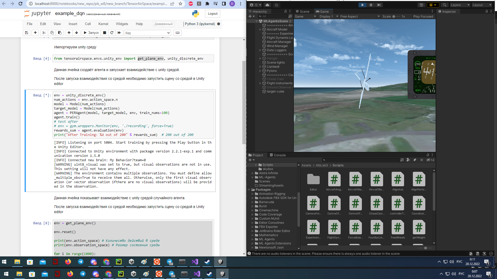

Пример запуска Unity среды с DQN агентом
==================================================

.. image:: img/img_demo_unity.gif
  :width: 800

Перед выполнением данного примера настройте unity среду по инструкции в разделе
Настройки Unity среды.

Импорты модели и среды

.. code:: ipython3

    from tensorairspace.agent.dqn.model import Model, PERAgent
    from tensorairspace.envs.unity_env import get_plane_env, unity_discrete_env

Запуск теста DQN агента. После запуска данной ячейки необходимо запустить среду Unity

.. code:: ipython3

    env = unity_discrete_env()
    num_actions = env.action_space.n
    model = Model(num_actions)
    target_model = Model(num_actions)
    agent = PERAgent(model, target_model, env, train_nums=100)
    agent.train()
    # test after
    # env = gym.wrappers.Monitor(env, './recording', force=True)
    rewards_sum = agent.evaluation(env)
    print("After Training: %d out of 200" % rewards_sum)  # 200 out of 200

.. parsed-literal::

    [INFO] Listening on port 5004. Start training by pressing the Play button in the Unity Editor.
    [INFO] Connected to Unity environment with package version 2.2.1-exp.1 and communication version 1.5.0
    [INFO] Connected new brain: My Behavior?team=0
    [WARNING] uint8_visual was set to true, but visual observations are not in use. This setting will not have any effect.
    [WARNING] The environment contains multiple observations. You must define allow_multiple_obs=True to receive them all. Otherwise, only the first visual observation (or vector observation ifthere are no visual observations) will be provided in the observation.
    D:\anaconda3\envs\unity-env\lib\site-packages\gym\logger.py:34: UserWarning: WARN: Box bound precision lowered by casting to float32

Экран запуска взаимодействия

Пример запуска взаимодействия с случайным агентом

.. code:: ipython3

    env = get_plane_env()

    env.reset()

    print(env.action_space) # Количество действий в среде
    print(env.observation_space) # Размер состояния среды

    for i in range(100):
        random_action = env.action_space.sample()
        print(random_action)
        new_obs, reward, done, info = env.step(random_action)
    env.close()

.. parsed-literal::

    [INFO] Listening on port 5004. Start training by pressing the Play button in the Unity Editor.
    [INFO] Connected to Unity environment with package version 2.2.1-exp.1 and communication version 1.5.0
    [INFO] Connected new brain: My Behavior?team=0
    [WARNING] uint8_visual was set to true, but visual observations are not in use. This setting will not have any effect.
    [WARNING] The environment contains multiple observations. You must define allow_multiple_obs=True to receive them all. Otherwise, only the first visual observation (or vector observation ifthere are no visual observations) will be provided in the observation.
    D:\anaconda3\envs\unity-env\lib\site-packages\gym\logger.py:34: UserWarning: WARN: Box bound precision lowered by casting to float32
      warnings.warn(colorize("%s: %s" % ("WARN", msg % args), "yellow"))
    Box([-1. -1. -1. -1. -1. -1. -1.], [1. 1. 1. 1. 1. 1. 1.], (7,), float32)
    Box([-inf -inf -inf -inf -inf -inf -inf -inf -inf -inf -inf -inf -inf -inf
     -inf -inf -inf -inf -inf -inf -inf -inf -inf -inf -inf -inf -inf -inf
     -inf -inf], [inf inf inf inf inf inf inf inf inf inf inf inf inf inf inf inf inf inf
     inf inf inf inf inf inf inf inf inf inf inf inf], (30,), float32)
    [-0.52338475  0.81265074 -0.27042347 -0.85183436  0.7446014  -0.8094786
     -0.68685627]
    [-2.3451948e-01  8.8675082e-01 -5.1349407e-01  5.1649964e-01
     -1.3739325e-01  3.4209377e-01  1.5065831e-04]
    ...

Пример запуска взаимодействия с случайным агентом

.. code:: ipython3

    env = unity_discrete_env()

    env.reset()

    print(env.action_space)

    for i in range(100):
        random_action = env.action_space.sample()
        print(random_action)
        new_obs, reward, done, info = env.step(random_action)
    env.close()

.. parsed-literal::

    [INFO] Listening on port 5004. Start training by pressing the Play button in the Unity Editor.
    [INFO] Connected to Unity environment with package version 2.2.1-exp.1 and communication version 1.5.0
    [INFO] Connected new brain: My Behavior?team=0
    [WARNING] uint8_visual was set to true, but visual observations are not in use. This setting will not have any effect.
    [WARNING] The environment contains multiple observations. You must define allow_multiple_obs=True to receive them all. Otherwise, only the first visual observation (or vector observation ifthere are no visual observations) will be provided in the observation.
    Discrete(2187)
    1874
    342
    ...

