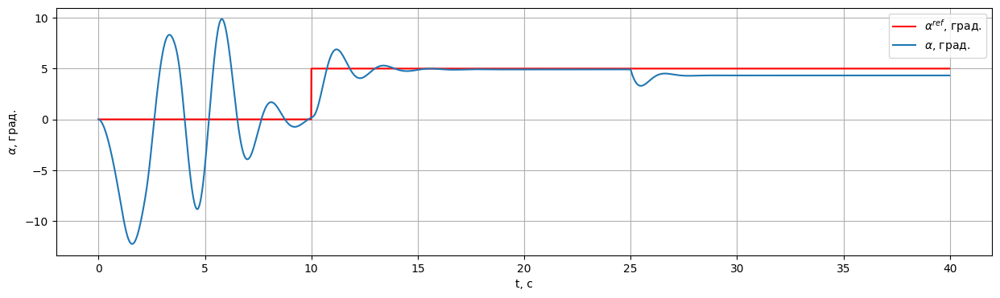
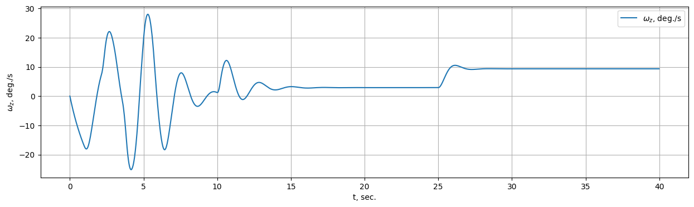
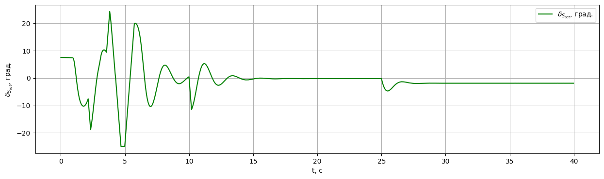

Работа IHDP с отказами системы
==============================

.. code:: python

    import gym 
    import numpy as np
    from tqdm import tqdm
    import pandas as pd
    
    from tensoraerospace.envs.f16.linear_longitudial import LinearLongitudinalF16
    from tensoraerospace.utils import generate_time_period, convert_tp_to_sec_tp
    from tensoraerospace.signals.standart import unit_step
    from tensoraerospace.agent.ihdp.model import IHDPAgent

.. code:: python

    dt = 0.01  # Дискретизация
    tp = generate_time_period(tn=40, dt=dt) # Временной периуд
    tps = convert_tp_to_sec_tp(tp, dt=dt)
    number_time_steps = len(tp) # Количество временных шагов
    reference_signals = np.reshape(unit_step(degree=5, tp=tp, time_step=10, output_rad=True), [1, -1]) # Заданный сигнал

.. code:: python

    env = gym.make('LinearLongitudinalF16-v0',
                   number_time_steps=number_time_steps, 
                   initial_state=[[0],[0],[0],[0]],
                   reference_signal = reference_signals,
                  tracking_states=["alpha"])
    env.reset()

.. code:: python

    pd.DataFrame(data=env.model.filt_A, columns=env.model.selected_states)

.. raw:: html

    

    
    <table border="1" class="dataframe">
      <thead>
        <tr style="text-align: right;">
          <th></th>
          <th>theta</th>
          <th>alpha</th>
          <th>q</th>
          <th>ele</th>
        </tr>
      </thead>
      <tbody>
        <tr>
          <th>0</th>
          <td>1.000000e+00</td>
          <td>0.000016</td>
          <td>0.009959</td>
          <td>-0.000003</td>
        </tr>
        <tr>
          <th>1</th>
          <td>4.537500e-15</td>
          <td>0.994583</td>
          <td>0.009090</td>
          <td>-0.000013</td>
        </tr>
        <tr>
          <th>2</th>
          <td>7.480623e-18</td>
          <td>0.003281</td>
          <td>0.991879</td>
          <td>-0.000514</td>
        </tr>
        <tr>
          <th>3</th>
          <td>0.000000e+00</td>
          <td>0.000000</td>
          <td>0.000000</td>
          <td>0.817095</td>
        </tr>
      </tbody>
    </table>
    

.. code:: python

    actor_settings = {
        "start_training": 5,
        "layers": (25, 1), 
        "activations":  ('tanh', 'tanh'), 
        "learning_rate": 2, 
        "learning_rate_exponent_limit": 10,
        "type_PE": "combined",
        "amplitude_3211": 15, 
        "pulse_length_3211": 5/dt, 
        "maximum_input": 25,
        "maximum_q_rate": 20,
        "WB_limits": 30,
        "NN_initial": 120,
        "cascade_actor": False,
        "learning_rate_cascaded":1.2
    }

.. code:: python

    incremental_settings = {
        "number_time_steps": number_time_steps, 
        "dt": dt, 
        "input_magnitude_limits":25, 
        "input_rate_limits":60,
    }

.. code:: python

    critic_settings = {
        "Q_weights": [8], 
        "start_training": -1, 
        "gamma": 0.99, 
        "learning_rate": 15, 
        "learning_rate_exponent_limit": 10,
        "layers": (25,1), 
        "activations": ("tanh", "linear"), 
            "WB_limits": 30,
        "NN_initial": 120,
        "indices_tracking_states": env.indices_tracking_states
    }

.. code:: python

    model = IHDPAgent(actor_settings, critic_settings, incremental_settings, env.tracking_states, env.state_space, env.control_space, number_time_steps, env.indices_tracking_states)

.. note::

    В данном примере происходит моделирование резкого изменения частной производной продольной силы по углу атаки :math:`z_{\alpha}` в матрице A пространств состояний. Таким образом моделируется изменение воздушного потока. 
    

.. code:: python

    xt = np.array([[0], [0]])
    
    for step in tqdm(range(number_time_steps-1)):
        if step == 2500:
            env.model.filt_A[1][1]=0.98# изменяем динамику полета в матрице пространства состояний
        ut = model.predict(xt, reference_signals, step)
        xt, reward, done, info = env.step(np.array(ut))

.. parsed-literal::

    100%|██████████| 4000/4000 [00:39<00:00, 100.74it/s]

.. code:: python

    env.model.plot_transient_process('alpha', tps, reference_signals[0], to_deg=True, figsize=(15,4))

 

.. code:: python

    env.model.plot_state('wz', tps, reference_signals[0], to_deg=True, figsize=(15,4))

 

.. code:: python

    env.model.plot_control('ele', tps, figsize=(15,4))

 
