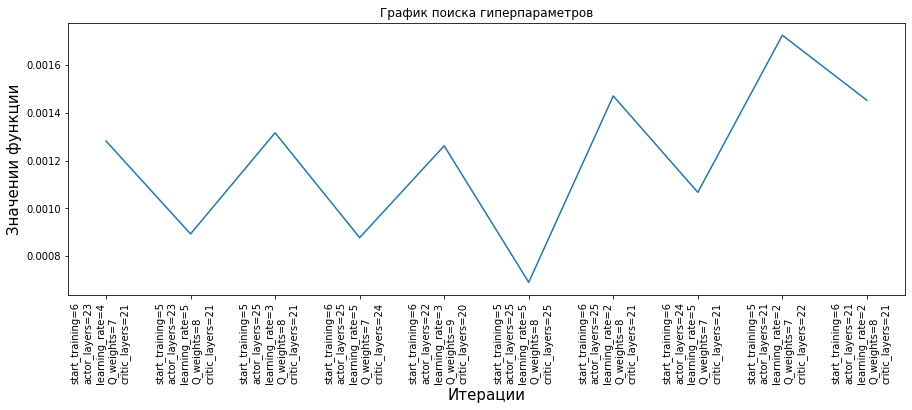

Оптимизация гиперпараметров 
===========================

.. code:: ipython3

    import numpy as np
    import gym
    from tensorairspace.optimization import HyperParamOptimizationOptuna
    from tensorairspace.agent.ihdp.model import IHDPAgent
    from tensorairspace.utils import generate_time_period
    from tensorairspace.signals import unit_step

.. warning::
    Перед началом создаем объект класса `HyperParamOptimizationOptuna` в основе которого лежит библиотека `Optuna`.
    Мы сделали обертку вокруг нее для удобства пользования, если вам неудобно пользоваться нашей оберткой вы всегда можете использовать просто `Optuna`.

.. code:: ipython3

    opt = HyperParamOptimizationOptuna(direction='minimize')

.. code:: ipython3

    dt = 0.01
    tp = generate_time_period(tn=20)
    number_time_steps = len(tp)
    reference_signals = np.reshape(unit_step(degree=5, tp=tp, time_step=10, output_rad=True), [1, -1])

.. code:: ipython3

    def objective(trial):
    
        env = gym.make('LinearLongitudinalF16-v0',
                   number_time_steps=number_time_steps,
                   initial_state=[[0], [0], [0], [0]],
                   reference_signal=reference_signals,
                   tracking_states=["alpha"])
        env.reset()
    
        actor_settings = {
            "start_training": trial.suggest_int("start_training", 5, 7, log=True),
            "layers": (trial.suggest_int("actor_layers", 20, 25, log=True), 1),
            "activations": ('tanh', 'tanh'),
            "learning_rate": trial.suggest_int("learning_rate", 2, 5, log=True),
            "learning_rate_exponent_limit": 10,
            "type_PE": "combined",
            "amplitude_3211": 15,
            "pulse_length_3211": 5 / dt,
            "maximum_input": 25,
            "maximum_q_rate": 20,
            "WB_limits": 30,
            "NN_initial": 120,
            "cascade_actor": False,
            "learning_rate_cascaded": 1.2
        }
        incremental_settings = {
            "number_time_steps": number_time_steps,
            "dt": dt,
            "input_magnitude_limits":25,
            "input_rate_limits":60,
        }
        critic_settings = {
            "Q_weights": [trial.suggest_int('Q_weights', 7, 9)], 
            "start_training": -1, 
            "gamma": 0.99, 
            "learning_rate": 15, 
            "learning_rate_exponent_limit": 10,
            "layers": (trial.suggest_int("critic_layers", 20, 25, log=True),1),
            "activations": ("tanh", "linear"), 
            "WB_limits": 30,
            "NN_initial": 120,
            "indices_tracking_states": env.indices_tracking_states
        }
        
    
    
        model = IHDPAgent(actor_settings, critic_settings, incremental_settings,
                          env.tracking_states, env.state_space, env.control_space, 
                          number_time_steps, env.indices_tracking_states)
        xt = np.array([[np.deg2rad(3)], [0]])
        for step in range(number_time_steps-1):
            ut = model.predict(xt, reference_signals, step)
            xt, reward, done, info = env.step(np.array(ut))
        return reward

.. warning::

    Критерий который мы будем использовать для оптимизации это модуль разницы между текущим состоянием и заданным. Расчет данного критерия происходит в методе `tensorairspace.envs.LinearLongitudinalF16.reward`. 

    .. code:: python

        @staticmethod
        def reward(state, ref_signal, ts):
            return np.abs(state[0] - ref_signal[:, ts])
    
    В дальнейшем мы планируем добавить и иные кретерии оптимальности в данную библиотеку 

.. code:: ipython3

    opt.run_optimization(objective, n_trials=10)

.. code:: ipython3

    opt.get_best_param()

.. parsed-literal::

    {'start_training': 5,
     'actor_layers': 25,
     'learning_rate': 5,
     'Q_weights': 8,
     'critic_layers': 25}

.. code:: ipython3

    opt.plot_parms()

