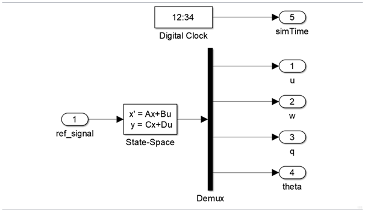

Примеры работы с Simulink моделями
==================================

Генерация C++ кода
------------------

Для поддержки ОУ из ПО Simulink необходима надстройка для Simulink – Embedded Coder.

Для преобразования Simulink модели в С код:

#. 	В настройках Simulink были выбраны: Code Generation/System target file ert_shrlib.tlc.
	
	.. image:: img/cpp_gen.png
  		:width: 400
  		:alt: Блок Stae-Space

#. Для построения модели использовалось сочетание клавиш ctrl+B. Также это можно сделать в панели навигации, выбрав пункт “Build model”. В результате появлялась папка с кодом на языке C++ в директории, в которой находилась модель. 

Создание объекта управления в симулинке
---------------------------------------

Для создания ОУ в ПО Simulink:

#. В рабочее поле были добавлены элементы из библиотеки Simulink:

        * Simulink/Continuous/State-Space

        * Simulink/Sources/Digital Clock

        * Simulink/Comonly Used Block/In1

        * Simulink/Comonly Used Block/Out1

#. Блоки In1/Out1 были переименованы в соответствующие названия.

#. В State-Space были заданы следующие параметры (для удобства работы использовали MATLAB Scripts)

	.. image:: img/sim_ss.png
  		:width: 400
  		:alt: Блок Stae-Space

#. Был создан MATLAB Script со следующим кодом:

    .. code-block:: matlab

        flag = 1;

        % Инициализцаия параметров
        [A,B,C,D] = b747_model(flag);

        init = [0 -0.0 -0.0 0];
        ref_signal = -0.10;

        % Время начала/конца/шага времени моделирования
        t_s = 0;
        t_e = 500;
        dt = 0.1;

        % Запуск Simulink модели
        simOut = sim('aircraft_sim.slx');

        y = simOut.get('yout');

        u = y.getElement(1).Values.Data;
        w = y.getElement(2).Values.Data;
        q = y.getElement(3).Values.Data;
        theta = y.getElement(4).Values.Data;
        t = y.getElement(5).Values.Data;

Интегрирование Simulink модели в Python 
---------------------------------------

Интегрирование Simulink модели в Python осуществлялось с помощью DLL библиотеки (библиотеки динамической компоновки). В результате генерации cpp кода получили код Simulink модели и Makefile с расширением .mk. После его запуска (команда `make -f MODEL_NAME.mk`) была скомпилирована DLL библиотека.

Для согласования типов данных и корректной работы модели использовался модуль ctypes и был написан преобразователь типов. tensorairspace/aerospacemodel/model/rtwtypes.py

В dll файлу существуют 3 функции
  * MODEL_NAME_initialize - служит для инициализации модели
  * MODEL_NAME_step - служит для расчета модели на следующем шаге модели
    шаг модели равен dt, определенном в MATLAB Script
  * MODEL_NAME_terminate - служит для освобождении ресурсов модели

Пример использования Simulink модели Боинга-747 с Python:

.. container:: cell code

   .. code:: python

      import os
      import ctypes

      import matplotlib.pyplot as plt

      from tensorairspace.aerospacemodel.utils.rtwtypes import *

.. container:: cell markdown

   .. rubric:: Боинг 747
      :name: боинг-747

.. container:: cell code

   .. code:: python

      b747_dll_path = os.path.abspath("../tensorairspace/aerospacemodel/model/simulinkModel/b747/b747_model_win64.dll")
      b747_dll = ctypes.windll.LoadLibrary(b747_dll_path)

      b747_model_initialize = b747_dll.b747_model_initialize
      b747_model_step = b747_dll.b747_model_step
      b747_model_terminate = b747_dll.b747_model_terminate

      # Model Parameters
      ref_signal = real32_T.in_dll(b747_dll, "b747_model_U")

      # Model output
      b747_Y = ExtY_T.in_dll(b747_dll, "b747_model_Y")

.. container:: cell code

   .. code:: python

      b747_model_initialize()

      b747_time = []
      b747_u = []
      b747_w = []
      b747_q = []
      b747_theta = []

      for step in range(int(2100)):
          b747_model_step()
          
          b747_time.append(float(b747_Y.time))
          b747_u.append(float(b747_Y.u))
          b747_w.append(float(b747_Y.w))
          b747_q.append(float(b747_Y.q))
          b747_theta.append(float(b747_Y.theta))

      b747_model_terminate()

   .. container:: output execute_result

      ::

         -116768371

.. container:: cell code

   .. code:: python

      plt.plot(b747_time, b747_u)

      plt.xlabel('t, [сек]')
      plt.ylabel('u, [м/c]')

   .. container:: output execute_result

      ::

         Text(0, 0.5, 'u, [м/c]')

   .. container:: output display_data

      .. image:: img/1d956d83a4eb35a3ba92960c5c8cebccabb52475.png

.. container:: cell code

   .. code:: python

      plt.plot(b747_time, b747_w)

      plt.xlabel('t, [сек]')
      plt.ylabel('w, [м/c]')

   .. container:: output execute_result

      ::

         Text(0, 0.5, 'w, [м/c]')

   .. container:: output display_data

      .. image:: img/d4bb03fc0fedcdc1492ceef2f129b9b221da7adf.png

.. container:: cell code

   .. code:: python

      plt.plot(b747_time, b747_q)

      plt.xlabel('t, [сек]')
      plt.ylabel('q, [рад/c]')

   .. container:: output execute_result

      ::

         Text(0, 0.5, 'q, [рад/c]')

   .. container:: output display_data

      .. image:: img/3ca94c40701bd7000df9db25864bcb033471af45.png

.. container:: cell code

   .. code:: python

      plt.plot(b747_time, b747_theta)

      plt.xlabel('t, [сек]')
      plt.ylabel(r'$\theta$, [рад]')

   .. container:: output execute_result

      ::

         Text(0, 0.5, '$\\theta$, [рад]')

   .. container:: output display_data

      .. image:: img/c2db9455ddd8a3be7f69f0900a88ef365d86d0c7.png

Пример использования Simulink модели F-16 с Python:

.. container:: cell code

   .. code:: python

      import os
      import ctypes

      import matplotlib.pyplot as plt

      from tensorairspace.aerospacemodel.utils.rtwtypes import *

.. container:: cell markdown

   .. rubric:: F-16
      :name: f-16

.. container:: cell code

   .. code:: python

      f16_dll_path = os.path.abspath("../tensorairspace/aerospacemodel/model/simulinkModel/f16/f16_model_win64.dll")
      f16_dll = ctypes.windll.LoadLibrary(f16_dll_path)

      f16_model_initialize = f16_dll.f16_model_initialize
      f16_model_step = f16_dll.f16_model_step
      f16_model_terminate = f16_dll.f16_model_terminate

      # Model Parameters
      ref_signal = real32_T.in_dll(f16_dll, "f16_model_U")

      # Model output
      f16_Y = ExtY_T.in_dll(f16_dll, "f16_model_Y")

.. container:: cell code

   .. code:: python

      f16_model_initialize()

      f16_time = []
      f16_u = []
      f16_w = []
      f16_q = []
      f16_theta = []

      for step in range(int(2100)):
          f16_model_step()
          
          f16_time.append(float(f16_Y.time))
          f16_u.append(float(f16_Y.u))
          f16_w.append(float(f16_Y.w))
          f16_q.append(float(f16_Y.q))
          f16_theta.append(float(f16_Y.theta))
          
      f16_model_terminate()

   .. container:: output execute_result

      ::

         -116768371

.. container:: cell code

   .. code:: python

      plt.plot(f16_time, f16_u)

      plt.xlabel('t, [сек]')
      plt.ylabel('u, [м/c]')

   .. container:: output execute_result

      ::

         Text(0, 0.5, 'u, [м/c]')

   .. container:: output display_data

      .. image:: img/49fb3125d2081891029fba77e3a1d3f62d709876.png

.. container:: cell code

   .. code:: python

      plt.plot(f16_time, f16_w)

      plt.xlabel('t, [сек]')
      plt.ylabel('w, [м/c]')

   .. container:: output execute_result

      ::

         Text(0, 0.5, 'w, [м/c]')

   .. container:: output display_data

      .. image:: img/8bb6669c2226f4d6315c22e9e8888b56f878e832.png

.. container:: cell code

   .. code:: python

      plt.plot(f16_time, f16_q)

      plt.xlabel('t, [сек]')
      plt.ylabel('q, [рад/c]')

   .. container:: output execute_result

      ::

         Text(0, 0.5, 'q, [рад/c]')

   .. container:: output display_data

      .. image:: img/066cdf4d4c608a870abb79db3b0080a765a62b96.png

.. container:: cell code

   .. code:: python

      plt.plot(f16_time, f16_theta)

      plt.xlabel('t, [сек]')
      plt.ylabel(r'$\theta$, [рад]')

   .. container:: output execute_result

      ::

         Text(0, 0.5, '$\\theta$, [рад]')

   .. container:: output display_data

      .. image:: img/e35193b58c1bca5e0f9d471520fbb8063795b50c.png

Пример использования Simulink модели ELV с Python:

.. container:: cell code

   .. code:: python

      import os
      import ctypes

      import matplotlib.pyplot as plt

      from tensorairspace.aerospacemodel.utils.rtwtypes import *

.. container:: cell markdown

   .. rubric:: ELV
      :name: elv

.. container:: cell code

   .. code:: python

      elv_dll_path = os.path.abspath("../tensorairspace/aerospacemodel/model/simulinkModel/elv/elv_model_win64.dll")
      elv_dll = ctypes.windll.LoadLibrary(elv_dll_path)

      elv_model_initialize = elv_dll.elv_model_initialize
      elv_model_step = elv_dll.elv_model_step
      elv_model_terminate = elv_dll.elv_model_terminate

      # Model Parameters
      ref_signal = real32_T.in_dll(elv_dll, "elv_model_U")

      # Model output
      elv_Y = ExtY_T_r.in_dll(elv_dll, "elv_model_Y")

.. container:: cell code

   .. code:: python

      elv_model_initialize()

      elv_time = []
      elv_w = []
      elv_q = []
      elv_theta = []

      for step in range(int(20)):
          elv_model_step()
          
          elv_time.append(float(elv_Y.time))
          elv_w.append(float(elv_Y.w))
          elv_q.append(float(elv_Y.q))
          elv_theta.append(float(elv_Y.theta))
          
      elv_model_terminate()

   .. container:: output execute_result

      ::

         -116768371

.. container:: cell code

   .. code:: python

      plt.plot(elv_time, elv_w)

      plt.xlabel('t, [сек]')
      plt.ylabel('w, [рад/c]')

   .. container:: output execute_result

      ::

         Text(0, 0.5, 'w, [рад/c]')

   .. container:: output display_data

      .. image:: img/9010a17073b06c7889077018e13a3ae56684f593.png

.. container:: cell code

   .. code:: python

      plt.plot(elv_time, elv_q)

      plt.xlabel('t, [сек]')
      plt.ylabel('q, [рад/c]')

   .. container:: output execute_result

      ::

         Text(0, 0.5, 'q, [рад/c]')

   .. container:: output display_data

      .. image:: img/6c4f9db03680280abd415b3ec1f024ecbdc64353.png

.. container:: cell code

   .. code:: python

      plt.plot(elv_time, elv_theta)

      plt.xlabel('t, [сек]')
      plt.ylabel(r'$\theta$, [рад]')

   .. container:: output execute_result

      ::

         Text(0, 0.5, '$\\theta$, [рад]')

   .. container:: output display_data

      .. image:: img/4775f06a550c2d893164b0bdaf7d359f3afc4f04.png

Пример использования Simulink модели типичной ракеты с Python:

.. container:: cell code

   .. code:: python

      import os
      import ctypes

      import matplotlib.pyplot as plt

      from tensorairspace.aerospacemodel.utils.rtwtypes import *

.. container:: cell markdown

   .. rubric:: Rocket
      :name: rocket

.. container:: cell code

   .. code:: python

      rocket_dll_path = os.path.abspath("../tensorairspace/aerospacemodel/model/simulinkModel/rocket/rocket_model_win64.dll")
      rocket_dll = ctypes.windll.LoadLibrary(rocket_dll_path)

      rocket_model_initialize = rocket_dll.rocket_model_initialize
      rocket_model_step = rocket_dll.rocket_model_step
      rocket_model_terminate = rocket_dll.rocket_model_terminate

      # Model Parameters
      ref_signal = real32_T.in_dll(rocket_dll, "rocket_model_U")

      # Model output
      rocket_Y = ExtY_T.in_dll(rocket_dll, "rocket_model_Y")

.. container:: cell code

   .. code:: python

      rocket_model_initialize()

      rocket_time = []
      rocket_u = []
      rocket_w = []
      rocket_q = []
      rocket_theta = []

      for step in range(int(2100)):
          rocket_model_step()
          
          rocket_time.append(float(rocket_Y.time))
          rocket_u.append(float(rocket_Y.u))
          rocket_w.append(float(rocket_Y.w))
          rocket_q.append(float(rocket_Y.q))
          rocket_theta.append(float(rocket_Y.theta))
          
      rocket_model_terminate()

   .. container:: output execute_result

      ::

         -116768371

.. container:: cell code

   .. code:: python

      plt.plot(rocket_time, rocket_u)

      plt.xlabel('t, [сек]')
      plt.ylabel('u, [м/c]')

   .. container:: output execute_result

      ::

         Text(0, 0.5, 'u, [м/c]')

   .. container:: output display_data

      .. image:: img/14065962e5e7b95769106defe74a45839316524b.png

.. container:: cell code

   .. code:: python

      plt.plot(rocket_time, rocket_w)

      plt.xlabel('t, [сек]')
      plt.ylabel('w, [м/c]')

   .. container:: output execute_result

      ::

         Text(0, 0.5, 'w, [м/c]')

   .. container:: output display_data

      .. image:: img/2ccbd419db52781eab564bbc37a9f5855cc93c37.png

.. container:: cell code

   .. code:: python

      plt.plot(rocket_time, rocket_q)

      plt.xlabel('t, [сек]')
      plt.ylabel('q, [рад/c]')

   .. container:: output execute_result

      ::

         Text(0, 0.5, 'q, [рад/c]')

   .. container:: output display_data

      .. image:: img/deab0f2643965809f749d259c6ba8cf34cb29dcd.png

.. container:: cell code

   .. code:: python

      plt.plot(rocket_time, rocket_theta)

      plt.xlabel('t, [сек]')
      plt.ylabel(r'$\theta$, [рад]')

   .. container:: output execute_result

      ::

         Text(0, 0.5, '$\\theta$, [рад]')

   .. container:: output display_data

      .. image:: img/3755763dbacba75c5c0e52c97ac146c21287ca8d.png
