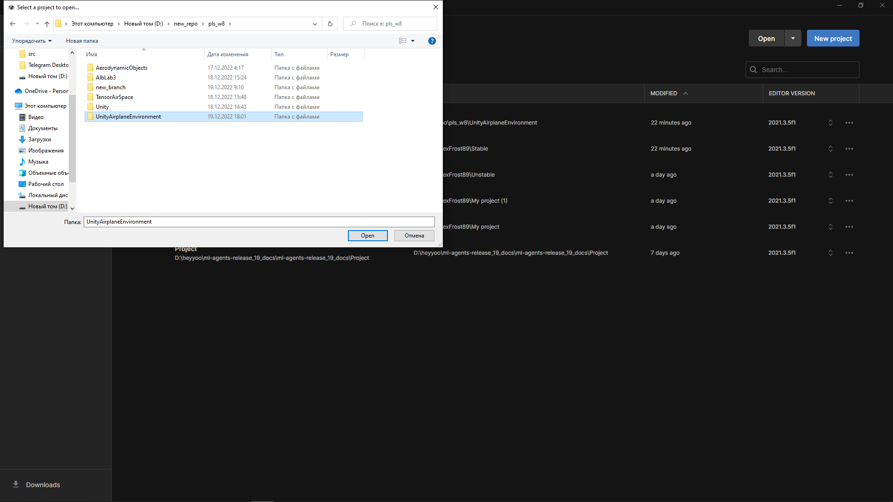

Настройка Unity среды
=========================

Для установки клонируйте репозиторий

.. code:: shell

    git clone git@github.com:tensoraerospace/UnityAirplaneEnvironment.git

Установите пакет для работы с unity ml agents

.. code:: shell

    pip install gym==0.20.0 gym-unity==0.28.0

Установите Unity hub по ссылке

- https://unity.com/download

Скачайте и установите версию Unity 2021.3.5f1 по ссылке

- https://unity.com/releases/editor/archive

Откройте проект в unity hub. Для этого нажмите на кнопку open и найдите
репозиторий на диске. Затем нажмите на кнопку open в папке репозитория.

Затем откройте проект в unity hub.

Затем внутри редактора Unity который откроется вместе с проектом откройте папку
Assets\AlbLab3\Scenes\MLAgentsScenes и выберите нужную сцену например MLAgentsScene
для запуска простой среды

Среда готова к работе