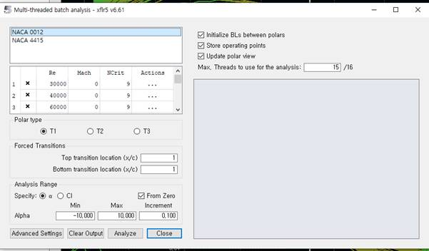

Анализ профиля крыла (Airfoil Analysis)
=========================

Для первого этапа нажмите комбинацию клавиш «CTRL + 1» или в панели вкладок выберите «Direct foil Design». Далее комбинацией клавиш «ALT + N» вызовем меню для создания NACA профилей. Для построения нестандартного профиля воспользуйтесь кнопкой загрузки файла формата dat (на рисунке выделена красным квадратом).

После определения профилей крыла следует рассчитать их аэродинамические характеристики в разделе «XFoil Direct Analysis». Во вкладке «Analysis» -> «Batch Analysis» нужно выбрать расчетное число Рейнольдса - это безразмерная величина, которая характеризует поток жидкости или газа, расчетное число Маха - это безразмерная величина, характеризующая скорость объекта относительно скорости звука в среде, в которой он движется, углы атаки - это угол между хордой аэродинамической поверхности (например, крыла самолета) и направлением потока воздуха, который касается этой поверхности. При выполнении анализа самолёта (Plane analysis) требуются данные для различных чисел Рейнольдса для более точных и корректных результатов анализа. 

  .. image:: img/image005.jpg
  :width: 800