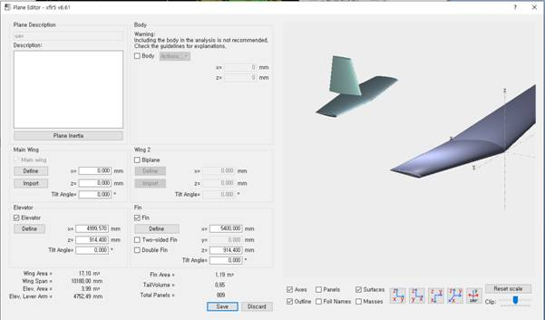

Анализ самолета (Plane Analysis): аэродинамический анализ самолета
=========================

Для построения ОУ в разделе «Wing and Plane Design» нажмите комбинацию клавиш «F3» или «Define New Plane»

«Define» служит для определения таких характеристик как размах крыла, длина хорды, стреловидность, определение профиля крыла, также есть возможность просмотра основных параметров(на рисунке отмечено красной рамкой) таких как площадь несущей поверхности, удлинение, длину хорды и прочее для Main Wing, Elevator, Fin. Также на этой панели можно настроить расположение элементов относительно координатной оси на ячейках x, y, z.

Также для расчета аэродинамичеких характеристик необходимо определить массу и, соответсвенно, моменты инерции объекта управления. Для их определения нужно зайти во вкладку «Plane inertia». После задания массы, моменты инерции считаются автоматически. После определения всех параметров в рабочей области появится эскиз объекта управления и слева внизу его основные физико-геометрические характеристики.

  Для расчета аэродинамических характеристик во вкладке «Analysis» -> «Define as Analysis» необходимо выбрать расчетные параметры. 

  .. image:: img/image012.jpg
  :width: 800

  Во вкладке «Polar Type» выбирается параметр расчета, «Analysis» - метод расчета, «Inertia» - в ней можно задавть свои моменты инерции, которые подсчитаны не автоматически, «Ref dimension» - здесь выбирается параметр критерия подобия, «Aero data» - для определения плотности и кинематической вязкости газа, «Extra drag» - можно задавать дополнительное сопротивление. 
В результатах работы видно, что ОУ получился статически устойчивым с нулевым коэффициентом момента тангажа при угле атаки равным 0 градусов, максимальное качество достигается при таком же угле атаки.

  .. image:: img/image013.jpg
  :width: 800
