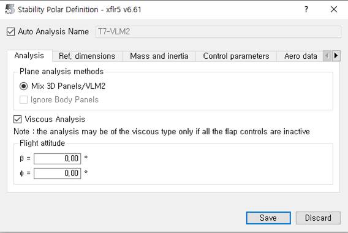

Анализ самолета (Plane Analysis): анализ устойчивости самолета
=========================

Для анализа устойчивости ОУ перейдите в раздел «Analysis»-> «Define a Stability Analysis» или нажмите комбинацию клавиш «SHIFT + F6».

Для расчета используется панельный метод. После задания параметров в рабочей области справа вверху выберите углы отклонения несущих поверхностей, необходимо выбрать начало, конец и шаг отклонения (выделено красной рамкой). Расчет введется по 2 видам движения в продольном и боковом.
В конце расчета получим необходимые характеристики для каждой выбранной точки (выделено черной рамкой). Результаты можно посмотреть либо нажав по интересующему параметру, либо нажав клавишу «L» получим историю расчета с необходимыми характеристиками. Например, на рисунке ниже представлена матрица состояний для ОУ с отклоненным рулем на 2 градуса при угле атаки равным 0 градусов.

  .. image:: img/image016.jpg
  :width: 800