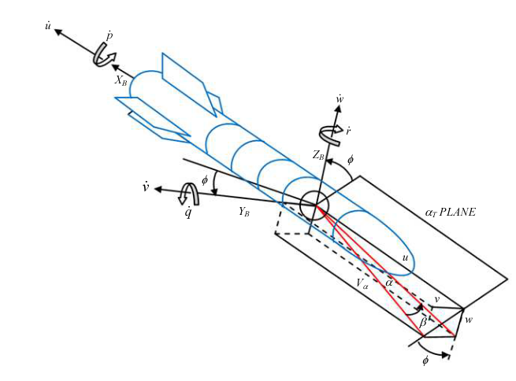

Типичная Ракета-Носитель ELV
========================================

ELV(Expendable launch vehicle) - ракета-носитель, предназначенная для выведения полезной нагрузки в космос.

Reference:
1.  Aliyu, Bhar & Funmilayo, A. & Okwo, Odooh & Sholiyi, Olusegun. (2019). State-Space Modelling of a Rocket for Optimal Control System Design. Journal of Aircraft and Spacecraft Technology. 3. 128-137. 10.3844/jastsp.2019.128.137.

2. Aliyu, Bhar. (2011). Expendable Launch Vehicle Flight Control-Design & Simulation with Matlab/Simulink. 