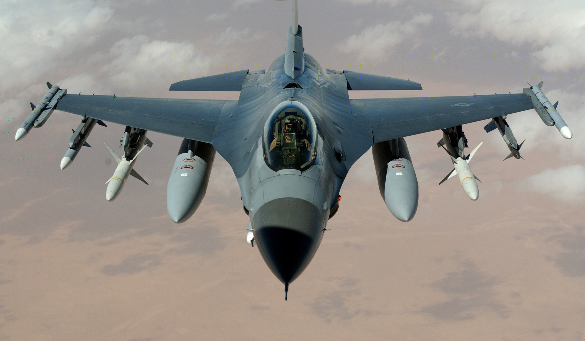

Самолет F-16 Fighting Falcon
========================================

General Dynamics F-16 Fighting Falcon — американский многофункциональный лёгкий истребитель четвёртого поколения.

ЛТХ
---

.. list-table:: ЛТХ
   :widths: 30 60
   :header-rows: 1

   * -  Модификация
     -  F-16A Block 10
   * -  Размах крыла, м
     -    9.45
   * -  Длина самолета со штангой ПВД,м
     -     15.03
   * -   Высота самолета,м
     -      5.09
   * -  Площадь крыла, м2
     -     27.87
   * -  Угол стреловидности, град
     -    40.0
   * -  Нормальная взлетная масса, кг
     - 11467

Математическая модель 
---------------------

Объект управления построен в пространстве состояний как и большинство объектов управления в данной библиотеке. Значения матрицы пространства состояний взяты из статьи ниже.

.. math::
  
  \dot{x}=Ax+Bu

  y=Cx+Du

Так как объект управления представляет собой объект без внутренних возмущающих процессов, выход системы :math:`y` не учитывается в процессе моделирования, поскольку матрицы :math:`C` и :math:`D` представляют собой диагональную матрицу и нулевой вектор.

.. math::

  \begin{bmatrix}
  \dot{u} \\
  \dot{\alpha} \\
  \dot{q} \\
  \dot{\theta} \\
  \end{bmatrix}
  = 
  \begin{bmatrix}
  x_u & x_{\alpha} & x_q & x_{\theta} \\
  z_u & z_{\alpha} & z_q & z_{\theta} \\
  m_u & m_{\alpha} & m_q & m_{\theta} \\
  0 & 0 & 1 & 0 \\
  \end{bmatrix}
  \begin{bmatrix}
  u \\
  \alpha \\
  q \\
  \theta \\
  \end{bmatrix}
  +
  \begin{bmatrix}
  x_{\eta} \\
  \alpha_{\eta} \\
  m_{\eta} \\
  0
  \end{bmatrix}
  \eta

Поэтому объект управления представлен в следующем виде

.. math::

  \begin{bmatrix}
  \dot{u} \\
  \dot{\alpha} \\
  \dot{q} \\
  \dot{\theta} \\
  \end{bmatrix}
  = 
  \begin{bmatrix}
  -0.1656 & -10.7137 & -7.2815 & -32.1740 \\
  -0.0018 & -0.0981 & 0.9276 & 0 \\
  0 & -0.6252 & -0.4673 & 0 \\
  0 & 0 & 1 & 0 \\
  \end{bmatrix}
  \begin{bmatrix}
  u \\
  \alpha \\
  q \\
  \theta \\
  \end{bmatrix}
  +
  \begin{bmatrix}
  -4.0478 \\
  -0.0253 \\
  -0.8992 \\
  0
  \end{bmatrix}
  \eta

где

-  :math:`u` Продольная скорость ЛА [м/с]
-  :math:`\alpha` угол атаки [град] 
-  :math:`q` Угловая скорость Тангажа [град/с]
-  :math:`\theta` - Тангаж [град]
-  :math:`\eta` - Угол отклонения стабилизатора [град]
-  :math:`x_u` - частная производная продольной силы по продольной скорости
-  :math:`x_w` - частная производная продольной силы по нормальной скорости
-  :math:`x_q` - частная производная продольной силы по угловой скорости
-  :math:`x_{\theta}` - частная производная продольной силы по углу тангажа
-  :math:`z_u` - частная производная вертикальной силы по продольной скорости
-  :math:`z_w` - частная производная вертикальной силы по нормальной скорости
-  :math:`z_q` - частная производная вертикальной силы по угловой скорости
-  :math:`z_{\theta}` - частная производная вертикальной силы по углу тангажа
-  :math:`m_u` - частная производная момента тангажа по продольной скорости
-  :math:`m_w` - частная производная момента тангажа по нормальной скорости
-  :math:`m_q` - частная производная момента тангажа по угловой скорости
-  :math:`m_{\theta}` - частная производная момента тангажа по углу тангажа

Модель
------

.. autoclass:: tensoraerospace.aerospacemodel.LongitudinalF16
    :members:
    :inherited-members:

Среда моделирования OpenAI Gym
------------------------------

.. autoclass:: tensoraerospace.envs.LinearLongitudinalF16
    :members:

Источники
---------

1. Albert Farr´e Gabernet Controllers for Systems with Bounded Actuators: Modeling and control of an F-16 aircraft // UNIVERSITY OF CALIFORNIA, IRVINE (https://cpb-us-e2.wpmucdn.com/sites.uci.edu/dist/2/1678/files/2014/11/MSthesis_AFarre07.pdf)

Пример использования
--------------------

.. code:: python

    import gymnasium as gym 
    import numpy as np
    from tqdm import tqdm

    from tensoraerospace.envs import LinearLongitudinalF16
    from tensoraerospace.utils import generate_time_period, convert_tp_to_sec_tp
    from tensoraerospace.signals.standart import unit_step

    dt = 0.01  # Дискретизация
    tp = generate_time_period(tn=20, dt=dt) # Временной период
    tps = convert_tp_to_sec_tp(tp, dt=dt)
    number_time_steps = len(tp) # Количество временных шагов
    reference_signals = np.reshape(unit_step(degree=5, tp=tp, time_step=10, output_rad=True), [1, -1]) # Заданный сигнал

    env = gym.make('LinearLongitudinalF16-v0',
               number_time_steps=number_time_steps, 
               initial_state=[[0],[0],[0]],
               reference_signal = reference_signals)
    env.reset() 

    observation, reward, done, info = env.step(np.array([[1]]))
