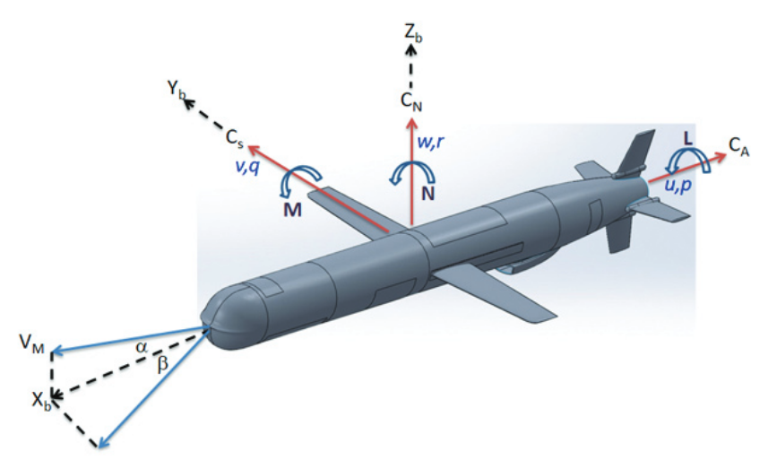

Модель ракеты
========================================

Ракета - летательный аппарат, двигающийся в пространстве за счёт действия реактивной тяги

Математическая модель 
---------------------

Объект управления построен в Пространстве состояний как и большинство объектов управления в данной библиотеке. Значения матрицы простанство состояний взяты из стать ниже.

.. math::
  
  \dot{x}=Ax+Bu

  y=Cx+Du

Так как объект управления предстовляет собой объект без внутренне возмущаю процессов выход системы  :math:`y` не учитывается в процессе моделирования по скольку матрицы  :math:`C` и  :math:`D`` представляют собой диагональную матрицу и нулевой вектор.

.. math::

  \begin{bmatrix}
  \dot{u} \\
  \dot{w} \\
  \dot{q} \\
  \dot{\theta} \\
  \end{bmatrix}
  = 
  \begin{bmatrix}
  x_u & x_w & x_q & x_{\theta} \\
  z_u & z_w & z_q & z_{\theta} \\
  m_u & m_w & m_q & m_{\theta} \\
  0 & 0 & 1 & 0 \\
  \end{bmatrix}
  \begin{bmatrix}
  u \\
  w \\
  q \\
  \theta \\
  \end{bmatrix}
  +
  \begin{bmatrix}
  x_{\eta} \\
  z_{\eta} \\
  m_{\eta} \\
  0
  \end{bmatrix}
  \eta

Поэтому объект управления представлен в следующем виде

.. math::

  \begin{bmatrix}
  \dot{u} \\
  \dot{w} \\
  \dot{q} \\
  \dot{\theta} \\
  \end{bmatrix}
  = 
  \begin{bmatrix}
  -0.0089 & -0.1474 & 0 & -9.75 \\
  -0.0216 & -0.3601 & 5.9470 & -0.151 \\
  0 & -0.0015 & -0.0224 & 0.0006 \\
  0 & 0 & 1 & 0 \\
  \end{bmatrix}
  \begin{bmatrix}
  u \\
  w \\
  q \\
  \theta \\
  \end{bmatrix}
  +
  \begin{bmatrix}
  9.748 \\
  3.77 \\
  -0.034 \\
  0.01
  \end{bmatrix}
  \eta

где

-  :math:`u` Продольная скорость ЛА [м/с]
-  :math:`w` Нормальная скорость ЛА [м/с] 
-  :math:`q` Угловая скорость Тангажа [град/с]
-  :math:`\theta` - Тангаж [град]
-  :math:`\eta` - Угол отклонения стабилизатора [град]
-  :math:`x_u` - частная производная продольной силы по продольной скорости
-  :math:`x_w` - частная производная продольной силы по нормальной скорости
-  :math:`x_q` - частная производная продольной силы по угловой скорости
-  :math:`x_{\theta}` - частная производная продольной силы по углу тангажа
-  :math:`z_u` - частная производная вертикальной силы по продольной скорости
-  :math:`z_w` - частная производная вертикальной силы по нормальной скорости
-  :math:`z_q` - частная производная вертикальной силы по угловой скорости
-  :math:`z_{\theta}` - частная производная вертикальной силы по углу тангажа
-  :math:`m_u` - частная производная момента тангажа по продольной скорости
-  :math:`m_w` - частная производная момента тангажа по нормальной скорости
-  :math:`m_q` - частная производная момента тангажа по угловой скорости
-  :math:`m_{\theta}` - частная производная момента тангажа по углу тангажа

Модель
------

.. autoclass:: tensoraerospace.aerospacemodel.MissileModel
    :members:

Среда моделирования OpenAI Gym
------------------------------

.. autoclass:: tensoraerospace.envs.LinearLongitudinalMissileModel
    :members:

Источники
---------

1. Arikapalli V. S. N. et al. Missile Longitudinal Dynamics Control Design using Pole Placement and LQR Methods--A Critical Analysis //Defence Science Journal. – 2021. – Т. 71. – №. 5. (https://www.strategicfront.org/forums/attachments/16232-article-text-62198-1-10-20210902-pdf.20806/)

Пример использования
--------------------

.. code:: python

    import gym 
    import numpy as np
    from tqdm import tqdm

    from tensoraerospace.envs import LinearLongitudinalMissileModel
    from tensoraerospace.utils import generate_time_period, convert_tp_to_sec_tp
    from tensoraerospace.signals.standart import unit_step

    dt = 0.01  # Дискретизация
    tp = generate_time_period(tn=20, dt=dt) # Временной периуд
    tps = convert_tp_to_sec_tp(tp, dt=dt)
    number_time_steps = len(tp) # Количество временных шагов
    reference_signals = np.reshape(unit_step(degree=5, tp=tp, time_step=10, output_rad=True), [1, -1]) # Заданный сигнал

    env = gym.make('LinearLongitudinalMissileModel-v0',
               number_time_steps=number_time_steps, 
               initial_state=[[0],[0],[0]],
               reference_signal = reference_signals)
    env.reset() 

    observation, reward, done, info = env.step(np.array([[1]]))
