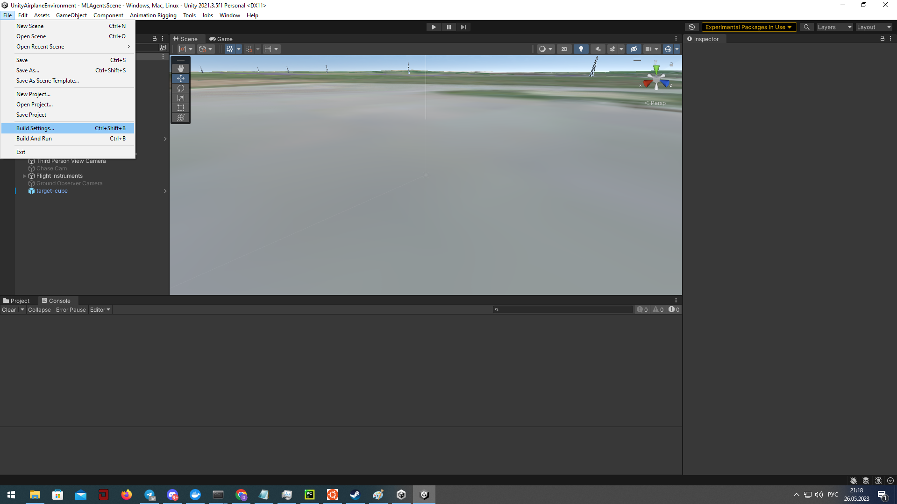
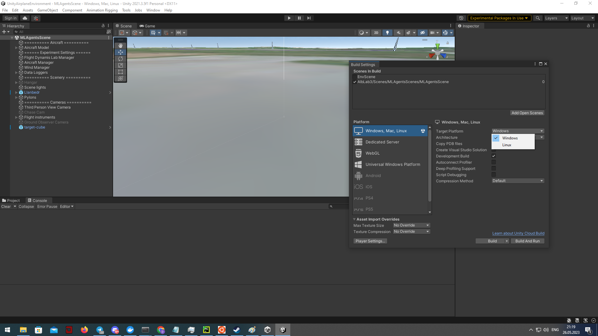
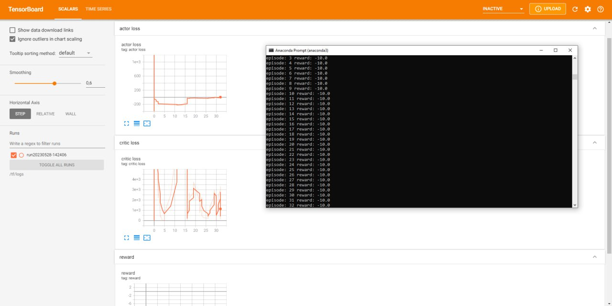

Unity среда
========================================

Это краткое описание среды моделирования UnityAirplaneEnvironment

https://github.com/TensorAirSpace/UnityAirplaneEnvironment

Описание элементов среды моделирования
--------------------------------------

Для моделирования движения самолёта было использовано несколько компонентов:

1. Rigidbody

Данный компонент используется на центре масс летательного аппарата. В нём указывается
масса объекта.

2. СentreOfGravity

Данный компонент используется на центре масс летательного аппарата для обозначения центра
масс летательного объекта.

3. AeroBody

Данный компонент используется на каждом примитивном объекте для которого необходимо
рассчитывать аэродинамику. В этих компонентах указывается группа объектов к которым они
относятся. Также указывается ссылка на физический компонент unity rigidbody.

4. AeroGroup

Данный компонент хранит ссылки на все отдельные объекты летательного аппарата с
компонентами AeroBody.

5. Thruster

К пропеллеру применяется компонент Thruster который прикладывает силу к самолёту в
правильной точке

6. Elevator

К подвижным частям крыльев самолёта применяется компонент Elevator.

7. AircraftManager

На отдельный объект на сцене применяется компонент AircraftManager. Данный компонент
обрабатывает физические взаимодействия связанные аэродинамикой. Также в данном компоненте
содержатся функции которые обрабатывают управление самолётом. Из возможных параметров
управления доступно 7 типов:

    - 7.1 Thrust - тяга двигателя
    - 7.2 Aileron - Элероны
    - 7.3 Elevator - Руль высоты
    - 7.4 ElevatorTrim - Триммер руля высоты
    - 7.5 Rudder - Руль направления
    - 7.6 FlapUp - Поднять закрылки
    - 7.7 FlapDown - Опустить закрылки

8. FlightDynamicsFlightManager

На отдельный объект на сцене применяется данные компонент. В данном компоненте
указываются ссылки на самолёт, центр его гравитации и AircraftManager. Также указывается
ссылка на конфиг файл для эксперимента. В данном файле можно настроить условия для среды.
Например: начальное положение самолёта, скорость ветра итд. Этот компонент отвечает за
настройку и усложнение среды.

Описание сцен unity среды
--------------------------------------

Для unity среды были созданы 5 сцен для обучения агента - 1 обычная и 4 с некоторыми
усложнениями. Сцены находятся по пути UnityAirplaneEnvironment\\Assets\\AlbLab3\\Scenes

1. MLAgentsScene

.. image:: ../example/env/img/img_demo_unity.gif

Сцена с стандартными настройками самолёта без усложнений

2. MLAgentsSceneBirds

.. image:: img/bird.gif

Сцена с птицами. Усложнение заключается в том, что в агента через некоторое количество
секунд врезаются птицы, что добавляет к нему вектор силы.
Для настройки вектора данной силы на объекте AircraftManager находится компонент
Birds. В нём в поле Impact можно настроить величину силы прикладываемой к самолёту, а
также интервал через который она прикладывается. Сила прикладывается случайно к крыльям
или к носу самолёта. Величина силы выбирается случайно в диапазоне (Impact, 2 * Impact)

3. MLAgentsSceneCold

.. image:: img/frozen.gif

Сцена с обледенением. Усложнение заключается в том что двигатель агента работает не в
полную мощность.
Для настройки ограничения работы двигателя на объекте AircraftManager находится
компонент AircraftManager. Ограничение на работу двигателя в нём указывается в поле
MaxThrust. Также есть возможность "глушить" двигатель из-за холода, то есть сбрасывать
текущий Thrust в 0. Для этого на объекте AircraftManager находится
компонент Cold. В нём можно настроить интервал через который двигатель будет глушиться
и после этого заводиться обратно. Также в течение интервала органы управления замерзают.
В это время на экране появляется надпись controls frozen.

4. MLAgentsSceneRain

.. image:: img/rain.gif

Сцена с дождём. Усложнение заключается в постоянном векторе силы который направлен вниз
и применяется к агенту.
Для настройки вектора данной силы на объекте AircraftManager находится компонент
Rain. В нём в поле Impact можно настроить величину силы прикладываемой к самолёту.

5. MLAgentsSceneWind

.. image:: img/wind.gif

Сцена с ветром. В данной сцене для усложнения создаётся ветер в файле конфига
UnityAirplaneEnvironment\\Assets\\AlbLab3\\Experiment Settings\\ml_agent_wind.asset
В нём в поле Wind speed установлена скорость ветра. Также в полях Wind Azimuth и
Wind Elevator можно настроить угол под которым дует ветер. В сцене скорость ветра
установлена в 10, Wind Elevator установлен в 30.

К самолёту применяется ускорение свободного падения g = 9.81.

Python взаимодействие со средой
-------------------------------

Для взаимодействия со средой была сделана функция получающая gym обертку нашей unity
среды и класс обёртка для агентов с дискретным пространством действий.

.. autoclass:: tensorairspace.envs.unity_env.get_plane_env
  :members:

.. autoclass:: tensorairspace.envs.unity_env.unity_discrete_env
  :members:

Пример сборки среды
--------------------------------------------
Для сборки среды необходимо в меню редактора unity File выбрать пункт Build Settings

Затем необходимо выбрать сцену для сборки, выбрать платформу и нажать на кнопку Build

После необходимо выбрать папку для сборки

Запуск в Docker на множестве GPU/CPU
------------------------------------

Обучение RL агента на множестве GPU имеет множество приемуществ: 

**Большая вычислительная мощность:** GPU обычно обеспечивают значительно большую вычислительную мощность, чем CPU. Это особенно важно для RL, где требуется большое количество вычислений для обработки больших массивов данных и применения сложных алгоритмов, таких как A3C (Asynchronous Advantage Actor-Critic).

**Параллелизм:** Алгоритм A3C уже изначально предназначен для асинхронного обучения с использованием множества потоков. Каждый поток работает с собственной копией среды и агента, и все они обновляют общий глобальный агент. Применение множества GPU улучшает этот процесс, позволяя большему количеству потоков работать параллельно и эффективнее выполнять обучение.

**Скорость обучения:** Запуск на множестве GPU может значительно увеличить скорость обучения. Обучение RL обычно требует много времени из-за сложности и неопределенности среды. Использование множества GPU может помочь ускорить процесс.

**Большие модели и более сложные среды:** Наконец, использование множества GPU позволяет работать с более большими нейронными сетями и более сложными средами. Это может быть особенно полезно в случае сложных задач RL, где одна модель или одна среда не могут адекватно представить все аспекты задачи.

Важно отметить, что для эффективного использования множества GPU требуются специальные техники программирования и управления ресурсами, такие как распределенное обучение и синхронизация между различными GPU.

Для распределенного обучения необходимо собрать Docker образ в котором присутсвуют необходимы зависимости и собранная среда Unity

.. code:: bash
  
  FROM tensorflow/tensorflow:2.4.0-gpu-jupyter

  RUN pip install gym==0.20.0 scipy==1.5.4 gym-unity==0.28.0
  RUN mkdir /tf/logs
  COPY a3c_example.py /tf

  ENTRYPOINT tensorboard --logdir /tf/logs --port 8889 --host 0.0.0.0 & python a3c_example.py

Скрипт для запуска обучения: 

.. code:: python

  from tensorairspace.envs.unity_env import get_plane_env, unity_discrete_env
  from tensorairspace.agent.a3c import Agent, setup_global_params

  def env_function(worker_id):
      # /tf/linux_build/build.x86_64 - путь к собранному Unity окружению 
      return get_plane_env("/tf/linux_build/build.x86_64", server=True, worker=worker_id)

  actor_lr = 0.0005
  critic_lr = 0.001
  gamma = 0.99
  hidden_size = 128
  update_interval = 1

  max_episodes = 100

  setup_global_params(actor_lr, critic_lr, gamma, hidden_size, update_interval, max_episodes)

  agent = Agent(env_function, gamma)
  agent.train()

Команда для запуска образа и пробросом библиотеки и собранной Unity среды

.. code:: bash
  docker run -v ./tensorairspace:/tf/tensorairspace -v ./linux_build:/tf/linux_build -p 8889:8889 unity_docker

Пример запуска обучения модели

