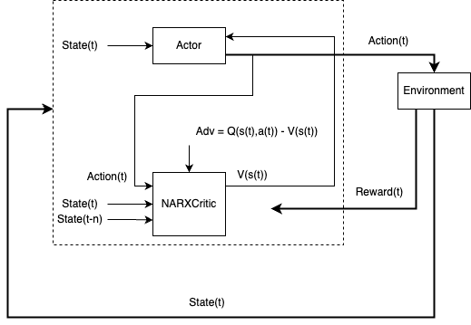

# A2C с NARX‑Critic

A2C (Advantage Actor‑Critic) использует актёра для выбора действий и критика для оценки состояний. В нашей реализации критик — NARX (Nonlinear AutoRegressive with eXogenous inputs), что позволяет лучше моделировать динамику и историю за счёт явного учёта прошедших состояний.

{ width=800 }

## Компоненты

- Актор: гауссовская политика \(\pi_\theta(a|s) = \mathcal{N}(\mu_\theta(s), \sigma_\theta^2)\); параметры — `Actor` (PyTorch)
- Критик (NARX): оценка \(V(s)\) на основе расширенного входа (текущее состояние + предыдущие сигналы); классы `Critic` (A2C) и `NARX` (модульная NARX‑сеть)
- Сбор опыта: `Runner` собирает траектории, клиппирует действия под `action_space`
- Обучение: `A2CLearner.learn` — обновления актёра/критика со стабилизацией (клиппинг градиента, энтропия)

## Теория (на базе реализации)

- Дисконтированные возвраты:

$$
G_t = \sum_{k=0}^{\infty} \gamma^k r_{t+k}, \quad G^{\text{episodic}}_t = r_t + \gamma (1-\text{done}) G_{t+1}
$$

- Advantage в коде:

$$
A_t = \begin{cases}
  r_t, & \text{если discount\_rewards=True (чисто по возвратам)}\\
  r_t + \gamma V(s_{t+1}) - V(s_t), & \text{иначе (TD‑таргет)}
\end{cases}
$$

и далее \(A_t = \text{td\_target} - V(s_t)\).

- Потери:

$$
\mathcal{L}_\text{actor} = -\,\mathbb{E}[\log \pi_\theta(a_t|s_t)\, A_t] - \beta\,\mathbb{E}[\mathcal{H}[\pi_\theta(\cdot|s_t)]]
$$

$$
\mathcal{L}_\text{critic} = \mathbb{E}\big[(\text{td\_target} - V_\phi(s_t))^2\big]
$$

### NARX как критик

NARX‑сеть (`tensoraerospace/agent/narx/model.py`) явно использует прошлый выход/состояние в качестве входа для предсказания следующего. В A2C вход критика формируется как конкатенация текущего состояния и предыдущего состояния (см. `process_memory_narx` — формирование `critic_states`). Это повышает качество оценок \(V(s)\) для систем с выраженной динамической памятью.

Идентификация (упрощённо):

- Обучение NARX сводится к минимизации MSE между предсказанным и целевым выходом по последовательности (см. `NARX.train`).
- В A2C критик обучается по MSE между таргетом (возвраты или TD) и текущей оценкой \(V(s)\).

## Обучение (контур)

1. `Runner.run` собирает пары \((s_t, a_t, r_t, s_{t+1}, done_t)\), клиппирует действия под `action_space`.
2. `process_memory_narx` формирует тензоры: действия, вознаграждения (опц. дисконтируются), состояния, следующие состояния, флаги завершения и `critic_states = [s_t, s_{t-1}]`.
3. `A2CLearner.learn`:
   - Если `discount_rewards=True`, таргет критика `td_target = rewards` (возвраты); иначе `r + γ V(s')`.
   - Advantage: `advantage = td_target - V(s)`.
   - Actor: лог‑вероятности из `Normal(mean,std)`, энтропия; обновление с клиппингом градиента.
   - Critic: MSE; обновление с клиппингом градиента.
   - Логирование в TensorBoard (losses, градиенты/параметры, награды).

## Быстрый старт

```python
import gymnasium as gym
import torch
from tensoraerospace.agent.a2c.narx import Actor, Critic, A2CLearner, Runner

env = gym.make('LinearLongitudinalF16-v0', number_time_steps=2000)
actor = Actor(state_dim=env.observation_space.shape[0], n_actions=env.action_space.shape[0])
critic = Critic(state_dim=env.observation_space.shape[0])
learner = A2CLearner(actor, critic, gamma=0.99, entropy_beta=0.01)
runner = Runner(env, actor, learner.writer)

memory = runner.run(max_steps=2048)
learner.learn(memory, steps=2048, discount_rewards=True)
```

!!! tip
    Для систем с сильной инерцией используйте `discount_rewards=False`, чтобы критик обучался по TD‑таргету с \(V(s')\).

## Документация API

::: tensoraerospace.agent.a2c.narx.A2CLearner

::: tensoraerospace.agent.a2c.narx.Runner

<!-- ::: tensoraerospace.agent.narx.model.NARX -->
