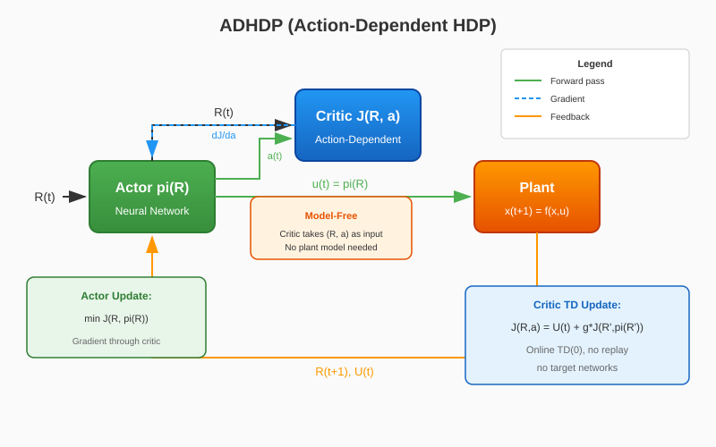

# Action-Dependent Heuristic Dynamic Programming (ADHDP)

ADHDP (Action-Dependent Heuristic Dynamic Programming) — это **безмодельный** метод из семейства Adaptive Critic Designs (ACD). В отличие от HDP, которому нужна модель объекта, ADHDP обучает функцию затрат \( J(R, a) \), зависящую от действия, которая принимает на вход и состояние, и действие. Актор улучшается путём минимизации выхода критика через обратное распространение градиента.

{ width=800 }

## Основные идеи

1. **Критик, зависящий от действия**: Критик \( J(R, a) \) оценивает функцию затрат как функцию наблюдаемого состояния \( R(t) \) и действия \( a(t) \)
2. **Безмодельный метод**: Не требуется модель объекта (матрицы A, B) — критик учится напрямую из переходов окружения
3. **Онлайн TD-обучение**: Критик обучается методом TD(0) на \( J(R_t, a_t) \approx U_t + \gamma J(R_{t+1}, \pi(R_{t+1})) \)
4. **Улучшение актора**: Актор минимизирует \( J(R, \pi(R)) \) обратным распространением градиента через критик

## Ключевое отличие: HDP vs ADHDP

| Аспект | HDP (модельный) | ADHDP (безмодельный) |
|--------|-----------------|----------------------|
| Вход критика | \( J(R) \) — только состояние | \( J(R, a) \) — состояние и действие |
| Обновление актора | Модельный прогноз | Градиент через критик |
| Нужна модель | Да (матрицы A, B) | Нет |
| Эффективность по данным | Выше (использует модель) | Ниже (учится на данных) |

## Архитектура

| Компонент | Роль | Реализация |
|-----------|------|------------|
| Актор \( \pi(R) \) | Генерирует управляющий сигнал \( u(t) \) | `DeterministicActor` (MLP с tanh выходом) |
| Критик \( J(R, a) \) | Оценивает функцию затрат от действия | `QCritic` (MLP: concat[R, a] → скаляр) |

## Алгоритм

### Цикл обучения

```
Для каждого эпизода:
    Сброс окружения → R(0)
    Для каждого шага t:
        1. Актор: a(t) = pi(R(t)) [+ шум исследования]
        2. Выполняем a(t) в окружении → R(t+1), U(t)
        
        # Обновление критика (TD-обучение)
        3. a'(t+1) = pi(R(t+1))  [следующее действие от актора]
        4. J_target = U(t) + g * J(R(t+1), a'(t+1))
        5. L_critic = MSE(J(R(t), a(t)), J_target)
        6. Обновляем критик градиентным спуском
        
        # Обновление актора
        7. a_pi = pi(R(t))
        8. L_actor = J(R(t), a_pi)  [минимизируем выход критика]
        9. Обновляем актор градиентным спуском через критик
```

### Математическая формулировка

**Функция потерь критика (TD-цель):**

$$
\mathcal{L}_{\text{critic}} = \mathbb{E}\left[ \left( J(R_t, a_t) - \left( U_t + \gamma J(R_{t+1}, \pi(R_{t+1})) \right) \right)^2 \right]
$$

**Функция потерь актора:**

$$
\mathcal{L}_{\text{actor}} = \mathbb{E}\left[ J(R_t, \pi(R_t)) \right]
$$

Где:
- \( U_t \) — мгновенные затраты (отрицательное вознаграждение)
- \( \gamma \) — коэффициент дисконтирования
- \( \pi(R) \) — политика актора

## Быстрый старт

```python
import numpy as np
from tensoraerospace.agent import ADHDP
from tensoraerospace.envs.b747 import ImprovedB747Env

def sine_reference(steps: int, amp_deg: float = 2.0, freq_hz: float = 0.05, dt: float = 0.1):
    """Генерация синусоидального опорного сигнала для слежения по тангажу."""
    t = np.arange(steps) * dt
    ref = np.deg2rad(amp_deg) * np.sin(2 * np.pi * freq_hz * t)
    return ref.reshape(1, -1).astype(np.float32)

num_steps = 300
dt = 0.1

env = ImprovedB747Env(
    initial_state=np.array([0.0, 0.0, 0.0, 0.0], dtype=float),
    reference_signal=sine_reference(num_steps, amp_deg=2.0, freq_hz=0.05, dt=dt),
    number_time_steps=num_steps,
    dt=dt,
    include_reference_in_obs=True,
)

agent = ADHDP(
    env,
    gamma=0.99,
    actor_lr=1e-4,
    critic_lr=1e-4,
    hidden_size=128,
    exploration_std=0.02,
    device="cpu",
    # Строгий режим: канонический ADHDP без базовой линии
    paper_strict=True,
)

# Обучение агента
agent.train(num_episodes=200, max_steps=num_steps)

# Сохранение обученной модели
agent.save("./adhdp_b747_model")
```

## Гиперпараметры

### Основные параметры

| Параметр | По умолчанию | Описание |
|----------|--------------|----------|
| `gamma` | 0.99 | Коэффициент дисконтирования будущих затрат |
| `actor_lr` | 1e-4 | Скорость обучения актора |
| `critic_lr` | 1e-4 | Скорость обучения критика |
| `hidden_size` | 256 | Размер скрытых слоёв обеих сетей |
| `exploration_std` | 0.02 | Стандартное отклонение гауссова шума |
| `device` | "cpu" | Устройство Torch ('cpu', 'cuda', 'mps') |

### Режим политики

| Параметр | По умолчанию | Описание |
|----------|--------------|----------|
| `paper_strict` | False | Если True, каноничный ADHDP без базовой линии |
| `policy_mode` | "direct" | "direct" (чистый актор) или "residual" (базовая линия + актор) |
| `residual_scale` | 0.2 | Масштаб остаточной политики при использовании базовой линии |

### Выбор действия

| Параметр | По умолчанию | Описание |
|----------|--------------|----------|
| `action_selection` | "actor" | "actor" (сеть актора) или "critic_gradient" (оптимизация в стиле HDPy) |
| `action_grad_steps` | 0 | Шагов градиента для оптимизации действия через критик |
| `action_grad_lr` | 0.0 | Скорость обучения для оптимизации действия |
| `action_momentum` | 0.0 | Импульс для сглаживания: u = m*u_prev + (1-m)*u_new |
| `action_max_abs` | 1.0 | Максимальная амплитуда действия (конверт безопасности) |

### Базовый контроллер

| Параметр | По умолчанию | Описание |
|----------|--------------|----------|
| `baseline_type` | "pid" | Тип базового контроллера: "pd" или "pid" |
| `baseline_kp` | -24.6295 | Пропорциональный коэффициент (настроен для B747) |
| `baseline_ki` | -0.2486 | Интегральный коэффициент |
| `baseline_kd` | -7.8179 | Дифференциальный коэффициент |
| `pid_i_clip` | 1.0 | Ограничение интеграла (anti-windup) |

### Расписание обучения (раздел III статьи)

| Параметр | По умолчанию | Описание |
|----------|--------------|----------|
| `baseline_warmup_episodes` | 0 | Эпизодов с базовой линией для прогрева критика |
| `critic_warmup_episodes` | 0 | Эпизодов с замороженным актором |
| `critic_cycle_episodes` | 0 | Эпизодов на цикл обучения критика (чередование) |
| `action_cycle_episodes` | 0 | Эпизодов на цикл обучения актора (чередование) |
| `warmstart_actor_episodes` | 0 | Эпизодов имитации базовой линии (прогрев) |

### Рандомизация траекторий

| Параметр | По умолчанию | Описание |
|----------|--------------|----------|
| `initial_state_noise_std` | 0.0 | Шум начального состояния |
| `reference_roll_steps` | 0 | Максимальный сдвиг опорного сигнала |
| `reference_noise_std` | 0.0 | Шум, добавляемый к опорному сигналу |

!!! tip "Persistent Excitation"
    Статья (раздел III) подчёркивает важность **persistent excitation** для стабильного обучения. Вместо сильного шума в действиях используйте рандомизацию траекторий (`initial_state_noise_std`, `reference_roll_steps`), чтобы агент видел разнообразные условия.

## Стратегии стабилизации

ADHDP предлагает несколько стратегий для стабилизации обучения:

### 1. Строгий режим (Paper-Strict)
```python
agent = ADHDP(env, paper_strict=True)
```
Каноничный ADHDP: чистая политика актора, без базовой линии, без BC-регуляризатора.

### 2. Остаточная политика
```python
agent = ADHDP(env, policy_mode="residual", residual_scale=0.2)
```
Актор обучает остаточную коррекцию поверх PID-базовой линии: `u = u_pid + 0.2 * pi(R)`.

### 3. Прогрев актора
```python
agent = ADHDP(env, warmstart_actor_episodes=10, warmstart_actor_epochs=2)
```
Предобучение актора имитации базовой линии методом supervised learning перед ACD-обновлениями.

### 4. Чередующееся обучение
```python
agent = ADHDP(env, critic_cycle_episodes=5, action_cycle_episodes=5)
```
Обучаем критик 5 эпизодов (актор заморожен), затем актор 5 эпизодов (критик заморожен).

## Сравнение с другими методами

| Метод | Критик | Модель | Обучение |
|-------|--------|--------|----------|
| **ADHDP** | \( J(R, a) \) | Не нужна | Онлайн TD |
| HDP | \( J(R) \) | Нужна | Модельный прогноз |
| DHP | \( \lambda = \partial J / \partial R \) | Нужна | Градиентный |
| DDPG | \( Q(s, a) \) | Не нужна | Replay + target networks |

!!! note "ADHDP vs DDPG"
    ADHDP — каноничный actor-critic из статьи без современных трюков стабилизации (replay buffer, target networks). Для лучшей эффективности и стабильности на практике используйте DDPG или SAC. ADHDP ценен для исследований и понимания основ ACD.

## Поддерживаемые окружения

- `ImprovedB747Env` — продольная динамика Boeing 747 со слежением за опорным сигналом

## Унифицированный интерфейс обучения

ADHDP реализует общую унифицированную сигнатуру `train()` из
`BaseRLModel`:

```python
agent.train(num_episodes=200, max_steps=500)
```

ADHDP‑специфичные параметры, принимаемые через `**kwargs`:

- `show_progress` (`bool`, устаревший псевдоним `verbose`) — управляет
  индикатором прогресса tqdm.
- `progress_desc` (`str`) — подпись описания tqdm.

## Документация API

::: tensoraerospace.agent.adhdp.model.ADHDP

::: tensoraerospace.agent.adp.networks.QCritic

::: tensoraerospace.agent.adp.networks.DeterministicActor

## Источники

- Prokhorov D.V., Wunsch D.C. "Adaptive Critic Designs." IEEE Transactions on Neural Networks, vol. 8, no. 5, pp. 997-1007, 1997.
- Werbos P.J. "A menu of designs for reinforcement learning over time." Neural Networks for Control, MIT Press, 1990.
- Si J., et al. "Handbook of Learning and Approximate Dynamic Programming." Wiley-IEEE Press, 2004.
