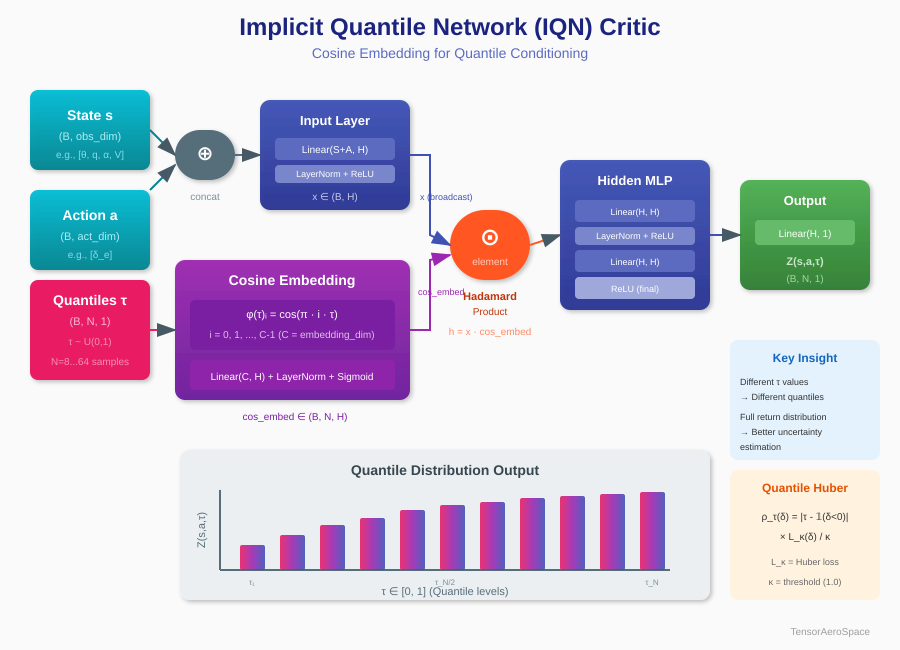

# Distributional Soft Actor-Critic (DSAC)

DSAC — современный off-policy алгоритм обучения с подкреплением, который объединяет преимущества **Soft Actor-Critic (SAC)** с **распределительным RL** на основе Implicit Quantile Networks (IQN). Алгоритм специально разработан для надёжного управления в аэрокосмических приложениях, где критически важны оценка неопределённости и плавность управляющих сигналов.

## Обзор архитектуры


DSAC расширяет стандартную архитектуру SAC несколькими ключевыми инновациями:

1. **Распределительные критики (IQN)**: Вместо предсказания одного Q-значения DSAC обучает полное распределение возвратов с помощью сдвоенных Implicit Quantile Networks
2. **CAPS-регуляризация**: Conditional Action Policy Smoothness обеспечивает плавные, безопасные для полёта управляющие команды
3. **Риск-чувствительное управление**: Поддержка функций искажения риска (CVaR, CPW, Wang) для консервативных или агрессивных политик

## Ключевые компоненты

### Сдвоенные IQN-критики

Основная инновация DSAC — использование **Implicit Quantile Networks (IQN)** в качестве критиков. Каждый критик предсказывает распределение возможных Q-значений, а не одну точечную оценку:



Ключевые особенности IQN-критика:

- **Косинусный эмбеддинг**: Уровни квантилей τ ∈ (0,1) кодируются с помощью косинусных базисных функций: φ(τ)ᵢ = cos(π · i · τ)
- **Произведение Адамара**: Признаки состояния-действия комбинируются с квантильными эмбеддингами через поэлементное умножение
- **Квантильный Huber Loss**: Робастная функция потерь, учитывающая асимметричную природу квантильной регрессии

### Цикл обучения

Цикл обучения DSAC следует структуре SAC с модификациями для распределительного обучения:


**Шаги обучения:**

1. **Выборка мини-батча**: Извлечение (s, a, r, s', done) из буфера воспроизведения
2. **Вычисление таргета**: Расчёт распределительной цели Беллмана с энтропийным бонусом
3. **Обновление критиков**: Минимизация квантильного Huber loss для обоих Z₁ и Z₂
4. **Заморозка критиков**: Временное отключение градиентов критиков
5. **Обновление актора**: Максимизация ожидаемого Q-значения с CAPS-регуляризацией
6. **Разморозка критиков**: Восстановление градиентов критиков
7. **Обновление температуры**: Корректировка коэффициента энтропии α (если автоматически)
8. **Soft-обновление таргетов**: Полиак-усреднение для целевых сетей

### CAPS-регуляризация

CAPS (Conditional Action Policy Smoothness) критически важна для аэрокосмических приложений:

- **Пространственная гладкость**: Штрафует чувствительность политики к малым возмущениям состояния
  
  $L_{spatial} = \lambda_s \cdot \frac{1}{B} \|\mu(s) - \mu(s + \epsilon)\|^2$

- **Временная гладкость**: Поощряет согласованность действий во времени
  
  $L_{temporal} = \lambda_t \cdot \frac{1}{B} \|a_t - a_{t+1}\|^2$

### Функции искажения риска

DSAC поддерживает риск-чувствительное управление через искажение уровней квантилей:

| Функция | Формула | Применение |
|---------|---------|------------|
| **Neutral** | τ | Стандартное ожидаемое значение |
| **CVaR** | clamp(τ · ξ, 0, 1) | Консервативное (worst-case) |
| **CPW** | τ^ξ / (τ^ξ + (1-τ)^ξ)^{1/ξ} | Весовая вероятность |
| **Wang** | Φ(Φ⁻¹(τ) + ξ) | Нормальное преобразование |

## Отличия от SAC

| Признак | SAC | DSAC |
|---------|-----|------|
| Выход критика | Одно Q-значение | N квантильных значений |
| Функция потерь | MSE | Квантильный Huber |
| Неопределённость | Нет | Полное распределение |
| Гладкость | Нет | CAPS-регуляризация |
| Риск-чувствительность | Нет | Функции искажения |

## Быстрый старт

```python
import numpy as np
import torch
from tensoraerospace.agent import DSAC
from tensoraerospace.envs.b747 import ImprovedB747Env

def step_reference(steps: int, deg: float = 5.0) -> np.ndarray:
    ref = np.zeros((1, steps), dtype=np.float32)
    ref[:, steps // 5 :] = np.deg2rad(deg)
    return ref

device = "cuda" if torch.cuda.is_available() else "cpu"
num_steps = 800

env = ImprovedB747Env(
    initial_state=np.array([0.0, 0.0, 0.0, 0.0], dtype=float),
    reference_signal=step_reference(num_steps, deg=5.0),
    number_time_steps=num_steps,
    dt=0.02,
    reward_mode="step_response",
)

agent = DSAC(
    env,
    batch_size=256,
    memory_capacity=500_000,
    learning_starts=10_000,
    updates_per_step=1,
    num_quantiles=32,
    embedding_dim=64,
    hidden_layers=[64, 64],
    huber_threshold=1.0,
    lr=4.4e-4,
    policy_lr=4.4e-4,
    gamma=0.99,
    tau=0.005,
    caps_lambda_smoothness=400.0,
    caps_lambda_temporal=400.0,
    caps_noise_std=0.05,
    device=device,
    log_every_updates=50,
    automatic_entropy_tuning=True,
)

# Обучение
agent.train(num_episodes=100, save_best=True, save_path="./runs")
agent.close()
```

## Гиперпараметры

### Критические параметры

| Параметр | По умолчанию | Описание |
|----------|--------------|----------|
| `num_quantiles` | 8 | Число квантильных выборок (рекомендуется 16-64) |
| `embedding_dim` | 64 | Размерность косинусного эмбеддинга |
| `huber_threshold` | 1.0 | Порог Huber loss κ |
| `batch_size` | 256 | Размер мини-батча |
| `learning_starts` | 10 000 | Шаги до начала обучения |

### Параметры CAPS

| Параметр | По умолчанию | Описание |
|----------|--------------|----------|
| `caps_lambda_smoothness` | 400.0 | Вес пространственной гладкости |
| `caps_lambda_temporal` | 400.0 | Вес временной гладкости |
| `caps_noise_std` | 0.05 | Шум для пространственного возмущения |

### Параметры оптимизации

| Параметр | По умолчанию | Описание |
|----------|--------------|----------|
| `lr` | 4.4e-4 | Скорость обучения критика |
| `policy_lr` | 4.4e-4 | Скорость обучения актора (по умолчанию = lr) |
| `gamma` | 0.99 | Коэффициент дисконтирования |
| `tau` | 0.005 | Коэффициент soft-обновления |
| `target_update_interval` | 1 | Частота обновления целевой сети |

### Управление риском

| Параметр | По умолчанию | Описание |
|----------|--------------|----------|
| `risk_distortion` | "neutral" | Имя функции искажения |
| `risk_measure` | 1.0 | Параметр искажения ξ |

!!! tip "Советы по обучению"
    - Держите `num_quantiles` в диапазоне 16-64 для стабильного обучения
    - Более высокие значения `caps_lambda` дают более плавные, но потенциально медленнее сходящиеся политики
    - Используйте `risk_distortion="cvar"` с `risk_measure < 1.0` для консервативного управления полётом
    - Уменьшите `updates_per_step`, если действия становятся слишком сглаженными или обучение нестабильно

## Векторизованное обучение

Для сред с параллельной симуляцией (например, GPU-ускоренных):

```python
agent.train_vector(
    total_steps=500_000,
    warmup_steps=10_000,
    log_every=2_000,
    reward_window=200,
    save_best=True,
    save_path="./runs",
)
```

## Документация API

::: tensoraerospace.agent.dsac.dsac.DSAC

::: tensoraerospace.agent.dsac.flight_critic.ZNet

::: tensoraerospace.agent.dsac.flight_critic.IQN

::: tensoraerospace.agent.dsac.flight_actor.NormalPolicyNet

::: tensoraerospace.agent.dsac.risk_distortions

## Благодарности

Реализация DSAC в TensorAeroSpace была вдохновлена и частично основана на отличной работе **Peter Seres** по риск-чувствительному распределительному обучению с подкреплением для управления полётом:

- **Репозиторий**: [peter-seres/dsac-flight](https://github.com/peter-seres/dsac-flight)
- **Описание**: Risk-sensitive Distributional Reinforcement Learning for Flight Control (проект магистерской диссертации)

Мы выражаем благодарность Peter Seres за его вклад в область распределительного RL для аэрокосмических приложений. Его реализация DSAC с IQN-критиками для исследовательского самолёта PH-LAB (Cessna Citation II) предоставила ценные идеи и архитектурные решения, которые были использованы в нашей реализации.

!!! note "Цитирование"
    Если вы используете DSAC-агент в своих исследованиях, пожалуйста, рассмотрите возможность цитирования как TensorAeroSpace, так и оригинального репозитория dsac-flight.
