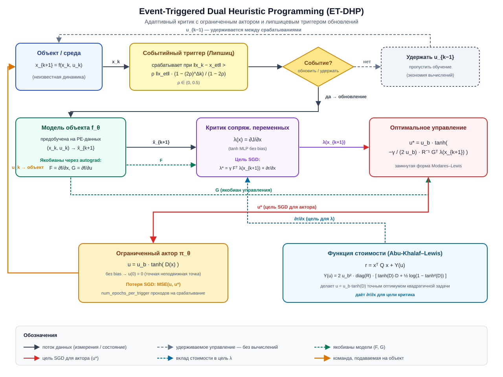

# Event-Triggered Dual Heuristic Programming (ET-DHP)

ET-DHP — адаптивный оптимальный регулятор из семейства Dual Heuristic Programming, расширенный схемой **событийного триггера**. Между срабатываниями триггера привод удерживает последнее управляющее воздействие, а обновления actor/critic не выполняются, что отделяет вычислительную частоту регулятора от частоты дискретизации датчиков/симуляции — экономия вычислений на задачах стабилизации может достигать порядка при сохранении качества регулирования замкнутого контура. См. также нелинейную модель F-16: [NonlinearLongitudinalF16](../model/f16_nonlinear_longitudinal.md).

## Ключевые идеи

- **Супервизор на основе событий**: правило липшицевского типа сравнивает измеренное состояние с состоянием, зафиксированным при последнем срабатывании; обновления выполняются только при превышении растущего, но ограниченного порога
- **Нейросетевая модель объекта**: предобученный двухслойный MLP предсказывает \(x_{k+1} = f(x_k, u_k)\); автограф через модель даёт якобианы \(F = \partial f/\partial x\) и \(G = \partial f/\partial u\), используемые в целевых функциях актора и критика
- **Ограниченный актор**: детерминированная политика \(u = u_b \cdot \tanh(D(x))\) соблюдает покомпонентные ограничения на привод даже во время начальной случайной фазы; \(u(0)=0\) по построению (без bias-слоёв), что обеспечивает точную неподвижную точку регулятора
- **Критик сопряжённых переменных**: критик напрямую регрессирует \(\lambda(x) = \partial J/\partial x\) (форма DHP), позволяя использовать чистое матрично-векторное обновление актора без скалярной головы \(J\)
- **Стоимость ограниченного управления Abu-Khalaf–Lewis**: интегральный член \(Y(u)\), добавленный к стоимости шага, делает \(u = u_b \cdot \tanh(D)\) точным оптимумом исходной квадратичной задачи регулирования

{ width=900 }

На схеме показан один шаг управления: измеренное состояние \(x_k\) сравнивается с состоянием при последнем срабатывании \(x_{\mathrm{et}}\); при срабатывании триггера модель объекта выдаёт \(F\) и \(G\) через autograd, критик вычисляет \(\lambda(x_{k+1})\), собирается замкнутая форма \(u^{*}\), и actor/critic делают шаги SGD. Между срабатываниями удерживается последнее значение \(u_{k-1}\), а градиенты не вычисляются.

## Отличия от близких методов

| Аспект | HDP | DHP | **ET-DHP** |
| --- | --- | --- | --- |
| Выход критика | \(J(x)\) | \(\lambda(x) = \partial J/\partial x\) | \(\lambda(x)\) |
| Модель объекта | Известная / отсутствует | Аналитическая или NN | Предобученная NN |
| Дискретизация | Временная | Временная | **Событийная** |
| Ограничения актора | Часто отсутствуют | Часто отсутствуют | \(u_b \cdot \tanh(D)\) |
| Функция стоимости | Квадратичная | Квадратичная | Квадратичная + интеграл ограниченного управления |

## Состав ET-DHP

| Компонент | Роль | Реализация |
| --- | --- | --- |
| PlantModelNN | Одношаговый предиктор \(x_{k+1} = f(x_k, u_k)\); источник якобианов \(F\), \(G\) | `tensoraerospace.agent.et_dhp.PlantModelNN` |
| ETDHPActor | Ограниченная детерминированная политика \(u_b \cdot \tanh(D(x))\) | `tensoraerospace.agent.et_dhp.ETDHPActor` |
| ETDHPCritic | Сеть сопряжённых переменных \(\lambda(x) = \partial J/\partial x\) | `tensoraerospace.agent.et_dhp.ETDHPCritic` |
| EventTrigger | Липшицевое правило срабатывания обновлений | `tensoraerospace.agent.et_dhp.EventTrigger` |
| ETDHPAgent | Оркестрация всех компонент, интерфейс predict/learn | `tensoraerospace.agent.et_dhp.ETDHPAgent` |

## Алгоритм

На каждом шаге \(k\) при измерении \(x_k\):

1. **Проверка события.** Сравнить \(\|x_k - x_{\mathrm{et}}\|\) с липшицевым порогом

\[
\rho \, \|x_{\mathrm{et}}\| \, \frac{1 - (2\rho)^{k - k_{\mathrm{trig}}}}{1 - 2\rho}
\]

   где \(x_{\mathrm{et}}\) и \(k_{\mathrm{trig}}\) — состояние и шаг, зафиксированные при последнем срабатывании триггера, а \(\rho \in (0, 0.5)\). Если порог превышен — срабатывание; иначе удерживать последнее управление и пропустить обучение.

2. **Якобианы модели.** Прямой проход \((x, u)\) через предобученную модель и построчный автограф для извлечения \(F = \partial f/\partial x\), \(G = \partial f/\partial u\).

3. **Оптимальное управление в замкнутой форме** (форма Modares–Lewis с ограничением):

\[
u^{*} = u_b \cdot \tanh\!\left(-\frac{\gamma}{2 u_b} R^{-1} G^{\top} \lambda(x_{k+1})\right)
\]

4. **Цель для сопряжённых переменных.** При функции стоимости \(r = x^{\top} Q x + Y(u)\) с интегральной стоимостью ограниченного управления

\[
Y(u) = 2 u_b^2 \, \mathrm{diag}(R) \cdot \bigl[\tanh(D)\cdot D + \tfrac{1}{2}\log(1 - \tanh^2 D)\bigr],
\]

цель для \(\lambda\) равна \(\lambda_{\mathrm{target}} = \gamma F^{\top} \lambda(x_{k+1}) + \partial r/\partial x\).

5. **Градиентные шаги.** SGD по актору относительно \(\mathrm{MSE}(u, u^{*})\) и по критику относительно \(\mathrm{MSE}(\lambda(x), \lambda_{\mathrm{target}})\).

## Быстрый старт

```python
import numpy as np
from tensoraerospace.agent.et_dhp import ETDHPAgent, ETDHPConfig

# Преобразование в регуляционное состояние: из исходного наблюдения
# в x_tilde, которое должно стремиться к нулю в рабочей точке.
def state_transform(obs, reference_signal, time_step):
    return np.degrees(np.asarray(obs).reshape(-1))  # пример: градусы

cfg = ETDHPConfig(
    actor_hidden=(24, 24),
    critic_hidden=(24, 24),
    model_hidden=(24, 24),
    actor_lr=5e-3,
    critic_lr=5e-3,
    model_lr=5e-3,
    model_epochs=300,
    Q=[10.0, 0.2, 0.0, 0.0],
    R=[0.5],
    gamma=0.95,
    num_epochs_per_trigger=5,
    u_bound=5.0,
    rho=0.15,
    trigger_floor=0.05,
    weight_init_scale=0.3,
    seed=0,
)

agent = ETDHPAgent(
    n_state=4,
    n_control=1,
    state_transform=state_transform,
    config=cfg,
)

# 1. Предобучение модели объекта на оффлайн-данных с PE-сигналом.
agent.fit_plant_model(states_arr, actions_arr, next_states_arr,
                      batch_size=128, verbose=True)

# 2. Онлайн замкнутый контур с событийным триггером.
obs, _ = env.reset()
agent.reset()
for k in range(number_time_steps - 2):
    agent.predict(obs, reference_signal, k)
    u_cmd = agent.last_action()
    obs_next, _, done, _, _ = env.step(u_cmd)
    metrics = agent.learn(obs_next, reference_signal, k, dt=dt)
    obs = obs_next
    if done:
        break
```

!!! tip
    Неподвижная точка актора — \(u(0) = 0\). Для задач слежения проектируйте `state_transform` так, чтобы идеальное слежение соответствовало нулю регуляционного состояния (например, вычитайте задающий сигнал из измеренного состояния).

## Гиперпараметры

### Общие

| Параметр | По умолчанию | Описание |
| --- | --- | --- |
| `gamma` | 1.0 | Коэффициент дисконтирования |
| `num_epochs_per_trigger` | 10 | Внутренние шаги SGD на одно срабатывание |
| `weight_init_scale` | 0.5 | Граница равномерной инициализации весов всех сетей |
| `seed` | None | Зерно ГСЧ для воспроизводимости |
| `device` | `"cpu"` | Устройство PyTorch |

### Актор

| Параметр | По умолчанию | Описание |
| --- | --- | --- |
| `actor_hidden` | (10, 10) | Размеры скрытых слоёв |
| `actor_lr` | 1e-3 | Скорость обучения SGD |
| `u_bound` | 1.0 | Покомпонентное ограничение привода |

### Критик

| Параметр | По умолчанию | Описание |
| --- | --- | --- |
| `critic_hidden` | (10, 10) | Размеры скрытых слоёв |
| `critic_lr` | 1e-3 | Скорость обучения SGD |

### Модель объекта

| Параметр | По умолчанию | Описание |
| --- | --- | --- |
| `model_hidden` | (10, 10) | Размеры скрытых слоёв |
| `model_lr` | 1e-3 | Скорость обучения Adam для оффлайн-обучения |
| `model_epochs` | 200 | Эпохи оффлайн-предобучения |
| `online_model_fit` | False | Продолжать дообучение модели после оффлайн-фазы |

### Функция стоимости

| Параметр | По умолчанию | Описание |
| --- | --- | --- |
| `Q` | (1.0,) | Диагональные веса стоимости состояния \(x^{\top} Q x\); длина = `n_state` |
| `R` | (1.0,) | Диагональные веса стоимости управления; длина = `n_control` |

### Событийный триггер

| Параметр | По умолчанию | Описание |
| --- | --- | --- |
| `rho` | 0.1 | Липшицевая константа \(\in (0, 0.5)\); меньше ⇒ больше срабатываний, точнее слежение |
| `trigger_floor` | 1e-3 | Минимальный порог (в единицах состояния) для подавления шумовых срабатываний |

### Исследование

| Параметр | По умолчанию | Описание |
| --- | --- | --- |
| `exploration_fn` | None | Опциональный callable `(time_sec) -> array`, добавляющий PE в цель актора |

## Поддерживаемые окружения

- `NonlinearLongitudinalF16-v0`
- `LinearLongitudinalF16-v0`

## Документация API

::: tensoraerospace.agent.et_dhp.model.ETDHPAgent

::: tensoraerospace.agent.et_dhp.model.ETDHPConfig

::: tensoraerospace.agent.et_dhp.networks.ETDHPActor

::: tensoraerospace.agent.et_dhp.networks.ETDHPCritic

::: tensoraerospace.agent.et_dhp.networks.PlantModelNN

::: tensoraerospace.agent.et_dhp.event_trigger.EventTrigger

## Источники

- Sun, B., Liu, C., Dally, K., van Kampen, E.-J. (2022). *Intelligent Aircraft Stabilization Control with Event-Triggered Scheme*. CEAS EuroGNC 2022.
- Abu-Khalaf, M., Lewis, F. L. (2005). *Nearly optimal control laws for nonlinear systems with saturating actuators using a neural network HJB approach*. Automatica, 41(5), 779–791.
- Modares, H., Lewis, F. L. (2014). *Optimal tracking control of nonlinear partially-unknown constrained-input systems using integral reinforcement learning*. Automatica, 50(7), 1780–1792.
