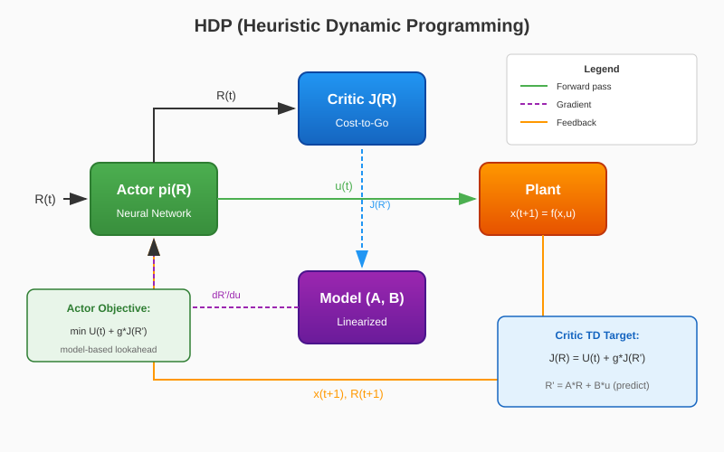

# Heuristic Dynamic Programming (HDP)

HDP (Heuristic Dynamic Programming) — это **модельный** метод из семейства Adaptive Critic Designs (ACD). В отличие от безмодельных подходов (таких как DDPG или SAC), HDP использует известную или обученную **линеаризованную модель системы** (матрицы A, B) для выполнения одношагового прогноза при улучшении актора. Сеть критика обучается оценивать скалярную функцию затрат \( J(R) \), а актор оптимизируется через обратное распространение градиента через модель для минимизации ожидаемых будущих затрат.

{ width=800 }

## Основные идеи

1. **Модельный критик**: Критик \( J(R) \) оценивает функцию затрат как функцию наблюдаемого состояния \( R(t) = [x(t), \theta_{ref}(t), q_{ref}(t)] \)
2. **Одношаговый прогноз**: Актор улучшается минимизацией \( U(t) + \gamma J(R_{t+1}) \), где \( R_{t+1} \) предсказывается с использованием линеаризованной модели
3. **Обучение методом временных разностей**: Критик обучается методом TD(0) на \( J(R_t) \approx U_t + \gamma J(R_{t+1}) \)
4. **Критик без действия на входе**: В отличие от ADHDP или DDPG, критик HDP не принимает действие на вход — он зависит только от состояния \( R \)

## Архитектура

| Компонент | Роль | Реализация |
|-----------|------|------------|
| Актор \( \pi(R) \) | Генерирует управляющий сигнал \( u(t) \) | `DeterministicActor` (MLP с tanh выходом) |
| Критик \( J(R) \) | Оценивает скалярную функцию затрат | `JCritic` (MLP → скаляр) |
| Модель \( (A, B) \) | Линеаризованная динамика для прогноза | Матрицы из `env.model.filt_A`, `env.model.filt_B` |

## Алгоритм

### Цикл обучения

```
Для каждого эпизода:
    Сброс окружения → x(0)
    Для каждого шага t:
        1. Формируем R(t) = [x(t), θ_ref(t), q_ref(t)]
        2. Актор: u(t) = π(R(t)) [+ шум исследования]
        3. Выполняем u(t) в окружении → x(t+1), U(t)
        4. Формируем R(t+1) = [x(t+1), θ_ref(t+1), q_ref(t+1)]
        
        # Обновление критика (TD-обучение)
        5. J_target = U(t) + γ · J(R(t+1))   [bootstrap если не терминал]
        6. L_critic = MSE(J(R(t)), J_target)
        7. Обновляем критик градиентным спуском
        
        # Обновление актора (модельный прогноз)
        8. R'(t+1) = A · R(t) + B · π(R(t))   [прогноз модели]
        9. L_actor = U(t) + γ · J(R'(t+1))
        10. Обновляем актор градиентным спуском (через модель и критик)
```

### Математическая формулировка

**Функция потерь критика (TD-цель):**

$$
\mathcal{L}_{\text{critic}} = \mathbb{E}\left[ \left( J(R_t) - \left( U_t + \gamma J(R_{t+1}) \right) \right)^2 \right]
$$

**Функция потерь актора (одношаговый прогноз):**

$$
\mathcal{L}_{\text{actor}} = \mathbb{E}\left[ U_t + \gamma J\left( A \cdot R_t + B \cdot \pi(R_t) \right) \right]
$$

Где:
- \( U_t \) — мгновенные затраты (отрицательное вознаграждение)
- \( \gamma \) — коэффициент дисконтирования
- \( A, B \) — матрицы линеаризованной системы

### Функция затрат

Полезность \( U(t) \) обычно является квадратичной функцией ошибки слежения:

$$
U(t) = w_\theta (\theta - \theta_{ref})^2 + w_q (q - q_{ref})^2 + w_u \|u\|^2 + w_{\Delta u} \|\Delta u\|^2
$$

| Вес | Назначение |
|-----|------------|
| \( w_\theta \) | Штраф за ошибку угла тангажа |
| \( w_q \) | Штраф за ошибку угловой скорости |
| \( w_u \) | Штраф за величину управления |
| \( w_{\Delta u} \) | Штраф за скорость изменения управления |

## Быстрый старт

```python
import numpy as np
from tensoraerospace.agent.hdp import HDP
from tensoraerospace.envs.b747 import ImprovedB747Env

def step_reference(steps: int, deg: float = 5.0) -> np.ndarray:
    """Генерация ступенчатого опорного сигнала для слежения по тангажу."""
    ref = np.zeros((1, steps), dtype=np.float32)
    ref[:, steps // 5:] = np.deg2rad(deg)
    return ref

num_steps = 800

env = ImprovedB747Env(
    initial_state=np.array([0.0, 0.0, 0.0, 0.0], dtype=float),
    reference_signal=step_reference(num_steps, deg=5.0),
    number_time_steps=num_steps,
    dt=0.02,
)

agent = HDP(
    env,
    gamma=0.99,
    actor_lr=3e-4,
    critic_lr=3e-4,
    hidden_size=256,
    exploration_std=0.1,
    device="cpu",
    # Веса функции затрат
    dhp_w_theta=5.0,
    dhp_w_q=0.2,
    dhp_w_u=0.01,
    dhp_w_du=0.02,
    # Опционально: использовать PD-базовую линию для устойчивости
    dhp_use_baseline=False,
)

# Обучение агента
agent.train(num_episodes=100, max_steps=num_steps)

# Сохранение обученной модели
agent.save("./hdp_b747_model")
```

## Гиперпараметры

### Основные параметры

| Параметр | По умолчанию | Описание |
|----------|--------------|----------|
| `gamma` | 0.99 | Коэффициент дисконтирования будущих затрат |
| `actor_lr` | 3e-4 | Скорость обучения актора |
| `critic_lr` | 3e-4 | Скорость обучения критика |
| `hidden_size` | 256 | Размер скрытых слоёв обеих сетей |
| `exploration_std` | 0.1 | Стандартное отклонение гауссова шума для исследования |

### Веса функции затрат

| Параметр | По умолчанию | Описание |
|----------|--------------|----------|
| `dhp_w_theta` | 5.0 | Вес ошибки слежения по углу тангажа |
| `dhp_w_q` | 0.2 | Вес ошибки слежения по угловой скорости |
| `dhp_w_u` | 0.01 | Вес величины управления |
| `dhp_w_du` | 0.02 | Вес скорости изменения управления (гладкость) |
| `dhp_use_env_cost` | True | Использовать функцию затрат окружения (если есть) |

### Параметры стабилизации

| Параметр | По умолчанию | Описание |
|----------|--------------|----------|
| `dhp_use_baseline` | False | Использовать PD/PID базовый контроллер |
| `dhp_baseline_type` | "pd" | Тип базового контроллера: "pd" или "pid" |
| `dhp_baseline_kp` | 0.6 | Пропорциональный коэффициент |
| `dhp_baseline_kd` | 0.2 | Дифференциальный коэффициент |
| `dhp_residual_scale` | 1.0 | Масштаб остаточной обученной политики |

### Расписание обучения

| Параметр | По умолчанию | Описание |
|----------|--------------|----------|
| `dhp_warmstart_actor_episodes` | 0 | Эпизодов для прогрева актора от базовой линии |
| `dhp_critic_cycle_episodes` | 0 | Эпизодов для обучения только критика (чередование) |
| `dhp_action_cycle_episodes` | 0 | Эпизодов для обучения только актора (чередование) |

## Сравнение с другими ACD-методами

| Метод | Выход критика | Улучшение актора | Нужна модель |
|-------|---------------|------------------|--------------|
| **HDP** | \( J(R) \) | Модельный прогноз | Да |
| DHP | \( \lambda = \partial J / \partial R \) | Прямой градиент | Да |
| GDHP | \( J(R), \lambda \) | И J, и градиенты | Да |
| ADHDP | \( J(R, a) \) | Градиент критика по действию | Нет |

!!! tip "Когда использовать HDP"
    Используйте HDP, когда у вас есть доступ к достаточно точной линеаризованной модели объекта управления. Метод обычно сходится быстрее безмодельных подходов для систем, где линейное приближение хорошо работает вблизи рабочей точки.

## Поддерживаемые окружения

- `ImprovedB747Env` — продольная динамика Boeing 747 со слежением за опорным сигналом

## Пример: Слежение за ступенчатым сигналом

Агент HDP может быть обучен следить за ступенчатым опорным сигналом угла тангажа:

```python
# Оценка обученного агента
obs, _ = env.reset()
done = False
theta_history = []

while not done:
    action = agent.select_action(obs, evaluate=True)
    obs, reward, terminated, truncated, info = env.step(action)
    done = terminated or truncated
    theta_history.append(obs[3])  # угол тангажа

import matplotlib.pyplot as plt
plt.plot(theta_history, label='Фактический θ')
plt.plot(env.reference_signal[0, :len(theta_history)], '--', label='Опорный')
plt.xlabel('Шаг времени')
plt.ylabel('Угол тангажа (рад)')
plt.legend()
plt.title('HDP: Слежение по тангажу')
plt.show()
```

## Документация API

::: tensoraerospace.agent.hdp.model.HDP

::: tensoraerospace.agent.adp.networks.JCritic

::: tensoraerospace.agent.adp.networks.DeterministicActor

## Источники

- Prokhorov D.V., Wunsch D.C. "Adaptive Critic Designs." IEEE Transactions on Neural Networks, vol. 8, no. 5, pp. 997-1007, 1997.
- Werbos P.J. "Approximate dynamic programming for real-time control and neural modeling." Handbook of Intelligent Control, 1992.
- Si J., et al. "Handbook of Learning and Approximate Dynamic Programming." Wiley-IEEE Press, 2004.
