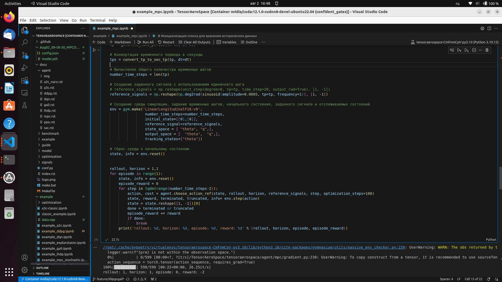

# Тестирование на ARM-процессорах

> :material-chip: Сравнение производительности TensorAeroSpace на ARM и x64 архитектурах.

!!! info "Поддержка ARM"
    TensorAeroSpace полностью совместим с ARM64-архитектурой и может использоваться на встраиваемых системах, таких как NVIDIA Jetson, для развёртывания систем управления в реальном времени.

## Сравнение архитектур ARM и x64

Выбор между ARM и x64 зависит от целей использования: ARM оптимален для встраиваемых систем с ограничением по энергопотреблению, x64 — для высокопроизводительных вычислений.

| Характеристика | ARM (RISC) | x64 (CISC) |
|---------------|------------|------------|
| Набор инструкций | Сокращённый (RISC) | Комплексный (CISC) |
| Энергопотребление | Низкое (10–20 Вт) | Высокое (45–65 Вт) |
| Производительность CPU | Оптимизирована для параллелизма | Высокая однопоточная производительность |
| Совместимость ПО | Требует нативной сборки | Широкая экосистема x86/x64 |
| Типовое применение | Edge-устройства, дроны, спутники | Рабочие станции, серверы |

## Тестовые конфигурации

### :material-robot: ARM: NVIDIA Jetson Xavier NX 16GB

Встраиваемая платформа для AI-вычислений на периферии.

| Параметр | Значение |
|----------|----------|
| **CPU** | 6-ядерный NVIDIA Carmel ARM®v8.2 64-bit |
| **Частота CPU** | До 1.9 ГГц |
| **GPU** | 384-ядерный NVIDIA Volta™ с 48 Tensor Cores |
| **Производительность AI** | До 21 TOPS (INT8) |
| **Память** | 16 ГБ LPDDR4x (59.7 ГБ/с) |
| **Хранилище** | 16 ГБ eMMC 5.1 |
| **TDP** | 10–20 Вт |
| **Размеры** | 69.6 × 45 мм (модуль) |

!!! tip "Применение в аэрокосмических системах"
    Jetson Xavier NX идеально подходит для:
    
    - Бортовых систем управления БПЛА
    - Наземных станций управления дронами
    - Обработки данных на спутниках
    - Edge-инференса для систем автопилота

### :material-laptop: x64: GIGABYTE A7 (AMD Ryzen™ 5000 Series)

Высокопроизводительный ноутбук для разработки и обучения моделей.

| Параметр | Значение |
|----------|----------|
| **CPU** | AMD Ryzen™ 9 5900HX / Ryzen™ 7 5800H |
| **Ядра/Потоки** | 8 ядер / 16 потоков |
| **Частота CPU** | 3.3–4.6 ГГц (boost) |
| **GPU** | NVIDIA GeForce RTX 3060/3070 |
| **Память** | До 64 ГБ DDR4-3200 |
| **Хранилище** | NVMe SSD (до 2 ТБ) |
| **TDP CPU** | 45 Вт |
| **Дисплей** | 17.3" FHD 144Hz |

## Результаты тестирования

### MPC-контроллер на LinearLongitudinalF16-v0

Тест: 599 шагов симуляции `LinearLongitudinalF16-v0` с MPC-агентом (`example_mpc.ipynb`).

| Метрика | Jetson Xavier NX 16GB | PC (x64 + CUDA) |
|---------|----------------------|-----------------|
| **Время эпизода** | **7 мин 57 сек** | **22 сек** |
| Скорость (it/s) | 1.25 | 26.25 |
| Время на шаг | ~800 мс | ~37 мс |
| Разница в скорости | 1x (baseline) | **21.7x быстрее** |

#### Результаты на Jetson Xavier NX


*Jupyter Notebook на Jetson Xavier NX: 598/599 шагов за 7:57 (1.25 it/s)*

#### Результаты на PC (x64 + NVIDIA GPU)



*VS Code + Docker (nvidia/cuda:12.1.0-cudnn8) на PC: 598/599 шагов за 22 сек (26.25 it/s)*

!!! warning "Важно"
    MPC-контроллер выполняет оптимизацию на каждом шаге (`optimization_steps=100`), что является вычислительно интенсивной операцией. Для ARM-платформ рекомендуется:
    
    - Уменьшить `optimization_steps` для real-time применений
    - Использовать предобученные RL-агенты (SAC, PPO) для инференса
    - Применять квантование моделей

### Анализ энергоэффективности

| Метрика | Jetson Xavier NX | PC (Ryzen + RTX) |
|---------|-----------------|------------------|
| TDP системы | ~15 Вт | ~150 Вт |
| Время эпизода | 477 сек | 22 сек |
| Энергия на эпизод | ~2.0 Вт·ч | ~0.9 Вт·ч |
| **Производительность на ватт** | 0.08 шаг/(Вт·с) | 1.75 шаг/(Вт·с) |

!!! note "Рекомендация"
    - **Для обучения и MPC**: x64-системы с дискретными GPU (в 21x быстрее)
    - **Для инференса с RL-агентами**: ARM-платформы (меньше энергопотребление, достаточная скорость)
    - **Для edge-устройств**: Jetson Xavier NX с предобученными моделями

## Установка на ARM

!!! warning "Ограниченная поддержка ARM"
    Тестирование проводилось только на **NVIDIA Jetson Xavier NX 16GB**. Мы не гарантируем работоспособность на других ARM-процессорах и платформах.
    
    Если вы столкнулись с проблемами при запуске на ARM:
    
    - Проверьте совместимость версий PyTorch/TensorFlow с вашей платформой
    - Создайте [Issue в нашем GitHub-репозитории](https://github.com/TensorAeroSpace/TensorAeroSpace/issues) с описанием платформы и ошибки
    - Приложите логи и информацию о версиях (`python --version`, `pip list`)

### NVIDIA Jetson (JetPack)

=== "Jetson Xavier NX / AGX Xavier"

    ```bash
    # Установка базовых зависимостей
    sudo apt update && sudo apt install -y python3-pip python3-venv
    
    # Создание виртуального окружения
    python3 -m venv ~/.venv/tas
    source ~/.venv/tas/bin/activate
    
    # Установка PyTorch для Jetson
    pip install --upgrade pip setuptools wheel
    pip install numpy
    
    # PyTorch wheel для JetPack 5.x (ARM64)
    pip install torch torchvision --index-url https://download.pytorch.org/whl/cu121
    
    # Установка TensorAeroSpace
    pip install tensoraerospace
    ```

=== "Raspberry Pi 4/5"

    ```bash
    # Python и venv
    sudo apt update && sudo apt install -y python3-pip python3-venv
    
    python3 -m venv ~/.venv/tas
    source ~/.venv/tas/bin/activate
    
    pip install --upgrade pip setuptools wheel
    pip install tensoraerospace
    ```

### Проверка GPU на Jetson

```python
import torch

print(f"CUDA доступна: {torch.cuda.is_available()}")
print(f"Устройство: {torch.cuda.get_device_name(0) if torch.cuda.is_available() else 'CPU'}")

# Пример с TensorAeroSpace
import gymnasium as gym

env = gym.make('LinearLongitudinalF16-v0')
print(f"Окружение загружено: {env.spec.id}")
```

## Оптимизация для ARM

### Quantization (квантование)

Для ускорения инференса на ARM рекомендуется использовать INT8-квантование:

```python
import torch

# Загрузка обученной модели
model = torch.load("policy.pth")
model.eval()

# Динамическое квантование для CPU
quantized_model = torch.quantization.quantize_dynamic(
    model,
    {torch.nn.Linear},
    dtype=torch.qint8
)

# Сохранение оптимизированной модели
torch.save(quantized_model.state_dict(), "policy_quantized.pth")
```

### TensorRT (для Jetson)

```python
import torch
import torch_tensorrt

model = torch.load("policy.pth").cuda().eval()

# Компиляция с TensorRT
trt_model = torch_tensorrt.compile(
    model,
    inputs=[torch_tensorrt.Input(shape=[1, 2], dtype=torch.float32)],
    enabled_precisions={torch.float16},  # FP16 для Volta
)

# Инференс
with torch.no_grad():
    output = trt_model(torch.randn(1, 2).cuda())
```

!!! warning "Совместимость"
    TensorRT требует JetPack SDK. Убедитесь, что версия JetPack совместима с вашей моделью Jetson.

## Рекомендации по развёртыванию

<div class="grid cards" markdown>

-   :material-memory: **Управление памятью**

    На ARM-устройствах ограничена память. Используйте:
    
    - Batch size = 1 для инференса
    - Модели с меньшим числом параметров
    - Очистку кэша: `torch.cuda.empty_cache()`

-   :material-thermometer: **Температурный режим**

    Встраиваемые системы чувствительны к перегреву:
    
    - Обеспечьте охлаждение (радиатор, вентилятор)
    - Мониторьте: `tegrastats` (Jetson)
    - Используйте power modes: `nvpmodel`

-   :material-clock-fast: **Real-time требования**

    Для систем управления в реальном времени:
    
    - Используйте PREEMPT_RT ядро
    - Отключите CPU frequency scaling
    - Привяжите процесс к ядру: `taskset`

-   :material-battery-charging: **Энергопотребление**

    Оптимизация автономности:
    
    - Jetson: `nvpmodel -m 0` (MAX-N) / `-m 1` (15W)
    - Отключайте неиспользуемые интерфейсы
    - Используйте sleep между инференсами

</div>

## Сравнительная таблица платформ

| Платформа | Архитектура | TDP | AI TOPS | Цена (USD) | Применение |
|-----------|-------------|-----|---------|------------|------------|
| Jetson Nano | ARM Cortex-A57 | 5–10 Вт | 0.5 | ~150 | Прототипирование |
| Jetson Xavier NX | ARM Carmel | 10–20 Вт | 21 | ~400 | Edge AI, БПЛА |
| Jetson AGX Orin | ARM Cortex-A78AE | 15–60 Вт | 275 | ~1000 | Автономные системы |
| Raspberry Pi 5 | ARM Cortex-A76 | 5–12 Вт | — | ~80 | Хобби, обучение |
| AMD Ryzen 7 5800H | x86-64 Zen 3 | 45 Вт | — | ~350 | Разработка, обучение |

## Следующие шаги

[:material-chart-line: Метрики бенчмарка](metrics.md){ .md-button .md-button--primary }
[:material-cog: Оптимизация гиперпараметров](../optimization/optuna_based.md){ .md-button }
[:material-robot: Примеры агентов](../example/agent/sac/example-sac-f16.md){ .md-button }

