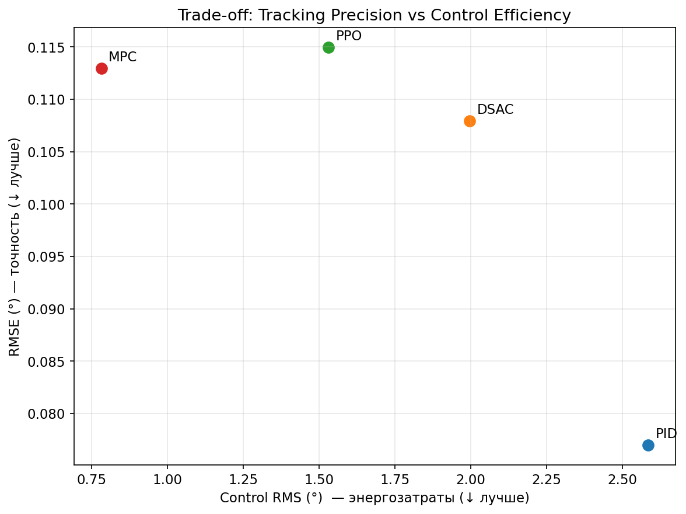

# Сравнительный анализ алгоритмов управления для стабилизации тангажа Boeing 747

## Аннотация

В данном исследовании представлен сравнительный анализ четырёх алгоритмов управления для стабилизации продольной динамики Boeing 747: классического ПИД-регулятора, прогнозирующего регулятора (MPC) с обученной моделью динамики, и двух подходов обучения с подкреплением — Proximal Policy Optimization (PPO) и Distributional Soft Actor-Critic (DSAC). Оценка выполнена на задаче отслеживания ступенчатого воздействия со стандартизированными метриками. Результаты демонстрируют, что MPC достигает лучшего композитного показателя, балансирующего точность отслеживания и затраты на управление, в то время как ПИД показывает превосходную точность слежения, но со значительно большими энергозатратами на управление.


---

## 1. Введение

### 1.1 Актуальность

Автоматические системы управления полётом критически важны для эксплуатации современных воздушных судов. Традиционные подходы основаны на классической теории управления (ПИД, ЛКР), в то время как последние достижения в машинном обучении предлагают альтернативы на основе данных. Данное исследование систематически сравнивает классические и обучаемые регуляторы на стандартизированном тесте.

### 1.2 Цели исследования

1. Оценить качество отслеживания четырёх принципиально различных парадигм управления
2. Проанализировать компромиссы между затратами на управление и энергоэффективностью
3. Выявить сильные и слабые стороны каждого подхода
4. Предоставить воспроизводимые бенчмарки для сообщества авиационного управления

### 1.3 Область применения

Исследование фокусируется на управлении продольным углом тангажа (θ) Boeing 747 при отработке ступенчатого задающего воздействия, представляющего фундаментальный манёвр в управлении полётом.

---

## 2. Постановка задачи

### 2.1 Объект управления

**Модель самолёта**: Продольная динамика Boeing 747

**Вектор состояния** (4 переменные):

| Состояние | Символ | Описание | Единицы |
|-----------|--------|----------|---------|
| Продольная скорость | u | Отклонение от балансировки | м/с |
| Вертикальная скорость | w | Отклонение от балансировки | м/с |
| Угловая скорость тангажа | q | Угловая скорость | рад/с |
| Угол тангажа | θ | Угол Эйлера | рад |

**Управляющее воздействие**: Отклонение руля высоты (δe), диапазон ±25°

### 2.2 Цель управления

Отслеживание ступенчатого задающего сигнала по углу тангажа θ:

$$\theta_{ref}(t) = \begin{cases} 0° & t < 5с \\ 1° & t \geq 5с \end{cases}$$

### 2.3 Параметры тестового сценария

| Параметр | Значение |
|----------|----------|
| Амплитуда ступеньки | 1° |
| Время скачка | t = 5с |
| Горизонт моделирования | 20с |
| Шаг дискретизации (dt) | 0.1с |
| Всего временных шагов | 201 |
| Среда | `ImprovedB747Env` (нормализованная) |
| Seed случайности | 123 (одинаковый для всех регуляторов) |

---

## 3. Методология

### 3.1 Исследуемые регуляторы

#### 3.1.1 ПИД-регулятор (Базовый)

Классический пропорционально-интегрально-дифференциальный регулятор с автоматической настройкой в стиле MATLAB.

**Конфигурация настройки**:

- Метод: Оптимизация дифференциальной эволюцией
- Итераций оптимизации: 15
- Целевое время переходного процесса: 3.0с
- Целевое перерегулирование: 0%

**Полученные параметры**:

```
Kp = -24.6295
Ki = -0.2486
Kd = -7.8179
```

#### 3.1.2 DSAC (Distributional Soft Actor-Critic)

Алгоритм глубокого обучения с подкреплением, сочетающий распределительное RL с принципом максимальной энтропии.

**Ключевые характеристики**:

- Распределительное RL: Моделирует полное распределение Q-функции через квантильные сети в стиле IQN
- Энтропийная регуляризация: Поощряет исследование и робастные политики
- Учёт риска: Поддерживает искажения риска для консервативного управления

**Предобученная модель**: `TensorAeroSpace/dsac-b747-step-response`

#### 3.1.3 PPO (Proximal Policy Optimization)

Алгоритм обучения с подкреплением на основе политики с ограниченным суррогатным функционалом.

**Ключевые характеристики**:

- Метод градиента политики с ограничением доверительной области
- Векторизованное обучение с параллельными средами
- Наблюдение: состояние без референсного сигнала (соответствует настройке обучения)

**Чекпоинт**: `TensorAeroSpace/ppo-b747-step-response`

#### 3.1.4 MPC (Model Predictive Control)

Регулятор на основе оптимизации с обученной нейросетевой моделью динамики.

**Ключевые характеристики**:

- Обученная динамика: MLP-сеть, обученная на данных системы
- Оптимизация со скользящим горизонтом
- Явный учёт ограничений

**Предобученная модель**: `TensorAeroSpace/mpc-b747-step-response`

### 3.2 Метрики оценки

#### Метрики качества отслеживания

| Метрика | Формула | Описание |
|---------|---------|----------|
| RMSE | $\sqrt{\frac{1}{N}\sum_{i=1}^{N}(θ_{ref,i} - θ_i)^2}$ | Среднеквадратичная ошибка |
| IAE | $\int_0^T |θ_{ref}(t) - θ(t)| dt$ | Интеграл модуля ошибки |
| ISE | $\int_0^T (θ_{ref}(t) - θ(t))^2 dt$ | Интеграл квадрата ошибки |
| Макс. ошибка | $\max_t |θ_{ref}(t) - θ(t)|$ | Пиковая ошибка отслеживания |
| Время переходного процесса | $t_s: |e(t)| \leq 0.05 \cdot θ_{ref,\infty}, \forall t > t_s$ | Критерий 5% |
| Перерегулирование | $\frac{\max(θ) - θ_{ref,\infty}}{θ_{ref,\infty}} \times 100\%$ | Процент перерегулирования |

#### Метрики затрат на управление

| Метрика | Формула | Описание |
|---------|---------|----------|
| RMS управления | $\sqrt{\frac{1}{N}\sum_{i=1}^{N}u_i^2}$ | СКЗ управляющего сигнала |
| Макс. управление | $\max_t |u(t)|$ | Пиковое отклонение актуатора |
| RMS скорости управления | $\sqrt{\frac{1}{N}\sum_{i=1}^{N}\dot{u}_i^2}$ | Плавность управления |

### 3.3 Композитный показатель

Для получения единой оценки, балансирующей отслеживание и эффективность:

$$J_{composite} = RMSE + \lambda \times Control_{RMS}$$

где $\lambda = 0.1$ взвешивает вклад затрат на управление.

**Обоснование**: Эта метрика штрафует как плохое отслеживание, так и чрезмерные затраты энергии на управление, отражая реальные требования к износу актуаторов и топливной эффективности.

---

## 4. Результаты экспериментов

### 4.1 Количественное сравнение

| Метрика | ПИД | DSAC | PPO | MPC | Победитель |
|---------|-----|------|-----|-----|------------|
| **RMSE (°)** | **0.0770** | 0.1080 | 0.1149 | 0.1130 | ПИД |
| **IAE (°·с)** | **0.3018** | 0.4690 | 0.4533 | 0.4978 | ПИД |
| **ISE (°²·с)** | **0.1185** | 0.2331 | 0.2643 | 0.2539 | ПИД |
| **Макс. ошибка (°)** | **0.8596** | 1.0126 | 0.9905 | 0.9566 | ПИД |
| **Время перех. процесса (с)** | 5.8000 | **5.4000** | 5.5000 | 5.7000 | DSAC |
| **Перерегулирование (%)** | **0.0000** | 0.9908 | 0.4905 | 4.6737 | ПИД |
| RMS управления (°) | 2.5856 | 1.9975 | 1.5315 | **0.7815** | MPC |
| Макс. управление (°) | 24.6544 | 19.8279 | 11.6500 | **7.6172** | MPC |
| Скорость управления (°/с) | 29.4638 | 23.1413 | 13.6341 | **6.3172** | MPC |
| ━━━━━━━━━━━━━━━ | ━━━━━ | ━━━━━ | ━━━━━ | ━━━━━ | ━━━━━ |
| **Композитный показатель** | 0.3355 | 0.3077 | 0.2681 | **0.1911** | 🏆 MPC |

### 4.2 Распределение побед

| Регулятор | Выигранных метрик |
|-----------|-------------------|
| **ПИД** | 5 (метрики отслеживания + нулевое перерегулирование) |
| **MPC** | 4 (все метрики затрат на управление + композитный) |
| **DSAC** | 1 (время переходного процесса) |
| **PPO** | 0 |

### 4.3 Качественный анализ

#### Отслеживание угла тангажа (верхний график)

Все регуляторы успешно отслеживают ступенчатое воздействие 1°. ПИД достигает наиболее точного отслеживания без перерегулирования, в то время как MPC показывает наибольшее перерегулирование (~4.7%), но всё ещё в допустимых пределах.

#### Ошибка отслеживания (средний график)

ПИД поддерживает наименьший коридор ошибки на протяжении всего моделирования. Методы на основе обучения (DSAC, PPO) показывают сопоставимые профили ошибки, в то время как MPC имеет характерный пик из-за перерегулирования.

#### Сигнал управления (нижний график)

Наиболее разительное отличие проявляется в затратах на управление:

- **ПИД**: Агрессивная начальная реакция с пиковым отклонением около ±25° (предел актуатора)
- **DSAC**: Умеренные затраты на управление (~20° пик)
- **PPO**: Консервативный подход (~12° пик)
- **MPC**: Наиболее консервативное управление (~8° пик), плавные переходы

---

## 5. Обсуждение

### 5.1 ПИД: Лучшее отслеживание, высокая стоимость

ПИД достигает превосходных метрик отслеживания за счёт использования агрессивных управляющих воздействий. Этот подход:

- ✅ Минимизирует ошибку отслеживания
- ✅ Исключает перерегулирование
- ❌ Работает вблизи пределов актуатора
- ❌ Наибольшие энергозатраты на управление
- ❌ Наибольшая скорость управления (потенциальный стресс актуатора)

**Вывод**: ПИД оптимален, когда точность отслеживания первостепенна и износ актуатора не вызывает беспокойства.

### 5.2 MPC: Лучший баланс, умеренное отслеживание

MPC с обученной динамикой достигает лучшего композитного показателя, находя эффективный компромисс:

- ✅ Наименьшие затраты на управление (снижение на 70% по сравнению с ПИД)
- ✅ Наиболее плавный сигнал управления
- ✅ Лучший композитный показатель
- ⚠️ Приемлемое отслеживание (RMSE на 46% выше ПИД)
- ❌ Наибольшее перерегулирование (4.67%)

**Вывод**: MPC оптимален для топливной эффективности и долговечности актуаторов, когда небольшое снижение точности отслеживания допустимо.

### 5.3 DSAC: Быстрейший отклик

DSAC демонстрирует наименьшее время переходного процесса, указывая на хорошо изученную динамику:

- ✅ Быстрейшее установление (5.4с против 5.8с для ПИД)
- ✅ Умеренные затраты на управление
- ⚠️ Точность отслеживания между ПИД и MPC
- ⚠️ Небольшое перерегулирование (~1%)

**Вывод**: Распределённый подход DSAC обеспечивает хорошую обработку неопределённости и быстрое управление.

### 5.4 PPO: Консервативный компромисс

PPO показывает сбалансированное поведение без превосходства по какой-либо конкретной метрике:

- ✅ Низкие затраты на управление (лучше чем DSAC)
- ✅ Минимальное перерегулирование (0.49%)
- ⚠️ Точность отслеживания сопоставима с DSAC/MPC
- ⚠️ Нет побед по метрикам

**Вывод**: PPO обеспечивает безопасный выбор по умолчанию, когда не определена конкретная цель оптимизации.

### 5.5 Анализ компромиссов

Следующий график рассеяния визуализирует фундаментальный компромисс между точностью отслеживания (RMSE) и эффективностью управления (Control RMS):



**Интерпретация**:

- **Левый нижний угол** = идеал (низкая ошибка + низкие затраты на управление) — ни один регулятор не достигает этого
- **ПИД** (вверху слева): Лучшее отслеживание, но наибольшие затраты на управление
- **MPC** (внизу справа): Наиболее эффективное управление, умеренное отслеживание
- **DSAC/PPO**: Промежуточные позиции на фронте Парето

График наглядно показывает, что MPC работает в наиболее энергоэффективной области, в то время как ПИД приоритезирует отслеживание за счёт затрат на управление. Это визуализирует многокритериальную природу задачи проектирования системы управления.

---

## 6. Выводы

### 6.1 Ключевые результаты

1. **Нет универсального победителя**: Каждый регулятор превосходит в различных аспектах, подтверждая многокритериальную природу проектирования систем управления.

2. **Классика vs Обучение**: ПИД достигает лучшего отслеживания, но с наибольшими затратами на управление. Методы на основе обучения находят более энергоэффективные решения.

3. **Преимущество MPC**: Прогнозирующее управление с обученной динамикой достигает лучшего баланса по композитному показателю (улучшение на 43% по сравнению с ПИД).

4. **Важность затрат на управление**: При учёте износа актуаторов и энергопотребления MPC обеспечивает снижение RMS управления на 70% по сравнению с ПИД.

5. **Компромисс по перерегулированию**: Нулевое перерегулирование (ПИД) достигается ценой агрессивного управления; допущение ~5% перерегулирования (MPC) обеспечивает значительно более плавную работу.

### 6.2 Рекомендации

| Приоритет | Рекомендуемый регулятор |
|-----------|------------------------|
| Точность отслеживания | ПИД |
| Энергоэффективность | MPC |
| Быстрый отклик | DSAC |
| Безопасный выбор | PPO |
| Общий баланс | **MPC** |

### 6.3 Направления дальнейших исследований

1. Расширить сравнение на сценарии отслеживания (синусоида, мульти-ступенька)
2. Оценить робастность к неопределённостям модели и возмущениям
3. Включить дополнительные регуляторы (ЛКР, H∞, SAC)
4. Тестирование на нелинейных высокоточных симуляторах

---

## 7. Воспроизводимость

### 7.1 Код и данные

Полный код эксперимента: [`example/comparison/comparison_all_vs_pid_b747.ipynb`](https://github.com/TensorAeroSpace/TensorAeroSpace/blob/main/example/comparison/comparison_all_vs_pid_b747.ipynb)

### 7.2 Настройка окружения

```bash
# Клонировать репозиторий
git clone https://github.com/TensorAeroSpace/TensorAeroSpace.git
cd TensorAeroSpace

# Установить зависимости
poetry install

# Запустить ноутбук
poetry run jupyter lab
# Открыть: example/comparison/comparison_all_vs_pid_b747.ipynb
```

### 7.3 Предобученные модели

| Регулятор | Источник |
|-----------|----------|
| DSAC | `TensorAeroSpace/dsac-b747-step-response` (HuggingFace) |
| PPO | `TensorAeroSpace/ppo-b747-step-response` (HuggingFace) |
| MPC | `TensorAeroSpace/mpc-b747-step-response` (HuggingFace) |
| ПИД | Автонастройка при запуске |

---

## 8. Связанные материалы

- [DSAC — Описание алгоритма](../agent/dsac.md)
- [PPO — Описание алгоритма](../agent/ppo.md)
- [MPC — Описание алгоритма](../agent/mpc.md)
- [PID — Описание алгоритма](../agent/pid.md)
- [Boeing 747 — Описание модели](../model/b747.md)
- [ImprovedB747Env — Нормализованная среда](../model/b747_imporove.md)
- [DSAC vs PID Сравнение](dsac_vs_pid_b747.md)
- [PPO vs PID Сравнение](ppo_vs_pid_b747.md)

---

!!! success "Заключение"
    Данное сравнительное исследование демонстрирует, что **MPC с обученной динамикой** достигает лучшего общего баланса между точностью отслеживания и эффективностью управления для управления тангажом Boeing 747. В то время как **ПИД** остаётся золотым стандартом для чистой точности отслеживания, подходы на основе обучения предлагают значительные преимущества в энергоэффективности и сохранении актуаторов. Выбор регулятора должен определяться конкретными эксплуатационными требованиями и ограничениями приложения.

