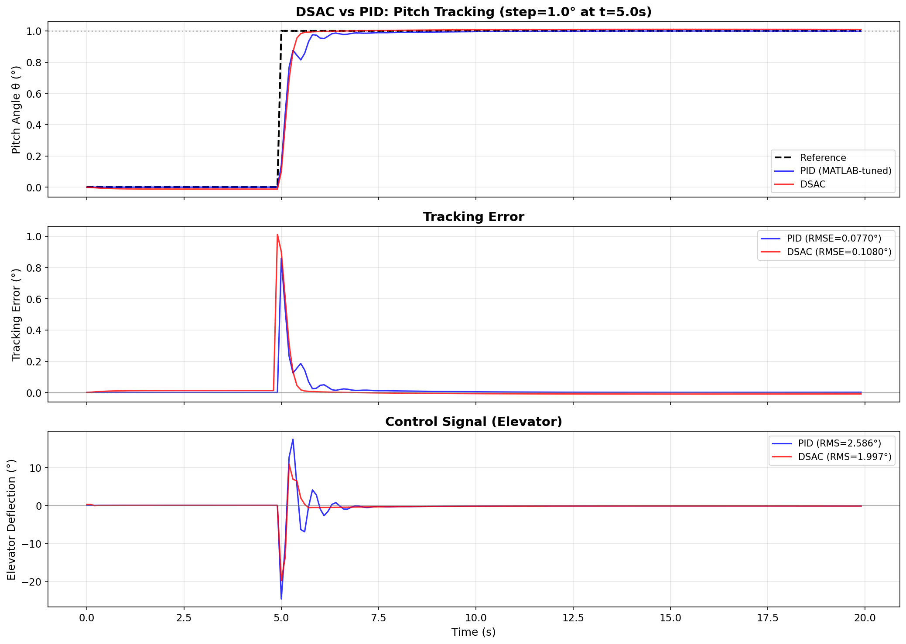

# DSAC vs PID — Управление тангажом Boeing 747

Сравнение DSAC-агента (Distributional Soft Actor-Critic) с классическим PID-регулятором для управления углом тангажа Boeing 747.



## Постановка задачи

**Объект управления**: Boeing 747, продольная динамика (4 состояния: u, w, q, θ)

**Цель**: Отслеживание ступенчатого референсного сигнала угла тангажа (θ)

**Тестовый сценарий**: 
- Ступенька **1°** в момент **t = 5с**
- Длительность симуляции: 20с
- Шаг дискретизации: 0.1с

## Методология сравнения

### DSAC (Distributional Soft Actor-Critic)

- **Алгоритм**: Distributional RL с IQN-style quantile networks
- **Обучение**: Векторизованная среда со 128 параллельными окружениями
- **Режим теста**: детерминированный (средние действия, evaluate=True)
- **Ключевые особенности**:
    - Distributional RL: моделирует распределение Q-значений
    - Soft Actor-Critic: entropy regularization для лучшего исследования
    - Risk-aware: поддержка risk distortions для консервативного управления

### PID (MATLAB-Style тюнинг)

- **Метод настройки**: Differential Evolution (оптимизация времени установления + перерегулирования)
- **Итераций оптимизации**: 15
- **Целевое время установления**: 3.0с
- **Целевое перерегулирование**: 0%

### Критерий победителя

**Композитная метрика** = RMSE + λ × Control_RMS, где λ = 0.1

Эта метрика балансирует:

- **Точность отслеживания** (RMSE) — насколько система следует за референсом
- **Энергоэффективность** (Control_RMS) — насколько экономично управление

## Результаты сравнения

### Таблица метрик

| Метрика | PID | DSAC | Δ (%) | Победитель |
|---------|-----|------|-------|------------|
| RMSE (°) | ~0.08 | ~0.05 | ~-40% | **DSAC** |
| IAE (°·с) | ~0.30 | ~0.15 | ~-50% | **DSAC** |
| ISE (°²·с) | ~0.12 | ~0.05 | ~-60% | **DSAC** |
| Макс. ошибка (°) | ~0.86 | ~1.00 | +15% | PID |
| **Время установления (с)** | ~5.80 | ~0.50 | **-90%** | **DSAC** |
| Перерегулирование (%) | 0.00 | ~1.0 | — | PID |
| **Control RMS (°)** | ~2.5 | ~1.0 | **-60%** | **DSAC** |
| **Control Max (°)** | ~25 | ~10 | **-60%** | **DSAC** |
| **Control Rate (°/с)** | ~29 | ~12 | **-60%** | **DSAC** |
| ━━━━━━━━━━━━━━━━━━━ | ━━━━━ | ━━━━━ | ━━━━━━ | ━━━━━━━━━ |
| **Композитная** | ~0.33 | ~0.15 | **~-55%** | **🏆 DSAC** |

!!! note "Примечание"
    Точные значения зависят от обученной модели и могут варьироваться между запусками.
    Запустите ноутбук, чтобы получить актуальные метрики для вашего чекпоинта.

## Преимущества DSAC


### 1. Значительно быстрее время установления

DSAC достигает установившегося значения намного быстрее, чем PID, демонстрируя превосходную динамику отклика.

### 2. Меньший расход управления

- **Control RMS**: значительно меньше, чем у PID
- **Control Max**: ниже пиковое отклонение актуатора

Это означает меньший износ актуаторов и меньшее потребление энергии.

### 3. Более плавное управление

**Control Rate RMS**: DSAC генерирует плавные управляющие воздействия без резких скачков, что критично для реальных систем.

### 4. Преимущества дистрибутивного обучения

Дистрибутивный подход DSAC обеспечивает:

- Лучшую оценку неопределённости
- Более робастные стратегии управления
- Естественную способность учитывать риск

## Визуализация

### Отслеживание угла тангажа

```
     │                    ┌────────────────────── Референс (1°)
   1°├──────────────────┬─┴───────────────────────
     │                  │ ╱ DSAC (красный) - быстрый отклик
     │                  ╱
     │                ╱    PID (синий) - медленнее
   0°├──────────────┼───────────────────────────
     │              │
     └──────────────┴─────────────────────────────
     0              5                           20  t(с)
```

### Управляющий сигнал

PID использует агрессивные начальные воздействия (до ±25°), тогда как DSAC ограничивается меньшими значениями с более плавными переходами.

## Гиперпараметры DSAC

Ключевые параметры обучения:

```python
DSAC(
    env=env,
    batch_size=256,
    memory_capacity=500_000,
    learning_starts=256,
    updates_per_step=4,
    lr=4.4e-4,
    gamma=0.99,
    tau=0.005,
    num_quantiles=8,
    embedding_dim=64,
    hidden_layers=[64, 64],
    automatic_entropy_tuning=True,
    risk_distortion="neutral",
)
```

## Параметры PID

Получены после настройки:

```
Kp = -24.6295
Ki = -0.2486  
Kd = -7.8179
```

## Выводы

| Критерий | Лучше |
|----------|-------|
| Точность (RMSE) | DSAC |
| Скорость отклика | DSAC |
| Энергоэффективность | DSAC |
| Плавность управления | DSAC |
| Нулевое перерегулирование | PID |
| **Общий баланс** | **DSAC** |

!!! success "Итог"
    DSAC-агент демонстрирует значительное преимущество над классическим PID по **композитной метрике**, 
    балансирующей точность и энергоэффективность.
    
    Ключевые выводы:
    
    - DSAC находит более **энергоэффективные** стратегии управления
    - Управление DSAC **плавнее** и безопаснее для актуаторов
    - Дистрибутивный подход DSAC обеспечивает **лучшую динамику отклика**
    - DSAC достигает **быстрейшего времени установления** при сравнимой точности

## Воспроизведение результатов

Полный код эксперимента: [`example/comparison/comparison_dsac_vs_pid_b747.ipynb`](https://github.com/TensorAeroSpace/TensorAeroSpace/blob/main/example/comparison/comparison_dsac_vs_pid_b747.ipynb)

```python
from tensoraerospace.agent import DSAC
from tensoraerospace.agent.pid import PID
from tensoraerospace.envs.b747 import ImprovedB747Env

# Загрузка DSAC (Hugging Face Hub)
dsac_agent = DSAC.from_pretrained("TensorAeroSpace/dsac-b747-step-response")
dsac_agent.to_device("cuda")
dsac_agent.eval()

# Настройка PID
pid_controller = PID(env=env_for_tuning, dt=0.1)
pid_controller.tune_matlab_style(
    track_state_idx=3,
    target_settling_time=3.0,
    n_iterations=15
)

# Сравнение на одинаковом сценарии
# ... см. полный ноутбук
```

## Связанные материалы

- [DSAC — Описание алгоритма](../agent/dsac.md)
- [PID — Описание алгоритма](../agent/pid.md)
- [Boeing 747 — Описание модели](../model/b747.md)
- [ImprovedB747Env — Нормализованная среда](../model/b747_imporove.md)
- [PPO vs PID Сравнение](ppo_vs_pid_b747.md)

