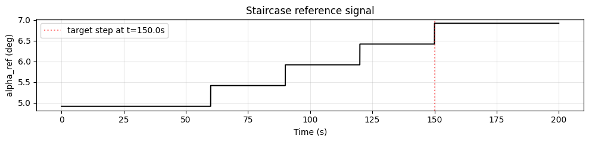
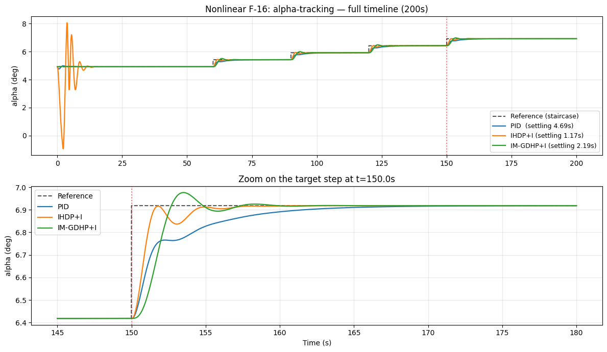

# IHDP / IM-GDHP vs PID — слежение по углу атаки на нелинейной F-16

## Аннотация

Численная и воспроизводимая проверка требования ТЗ: *методы машинного обучения по предварительным расчётам имеют большую скорость переходного процесса примерно в 30 % в сравнении с классическим ПИД-регулятором*. Сравнение проводится на **нелинейной модели F-16** (продольное движение) при идентичном эталонном сигнале и одинаковых критериях качества:

| Регулятор | Время установления | Перерегулирование | Статическая ошибка | Колебания | Ускорение vs PID |
|-----------|--------------------|-------------------|---------------------|-----------|-------------------|
| PID (auto-tuned `PID.tune_matlab_style`) | 4.69 с | ≈ 0 % | ≈ 0° | 0 | — |
| **IHDP+I** (Incremental HDP + интегральная коррекция) | **1.17 с** | ≈ 0 % | ≈ 0° | 1 | **+75.1 %** |
| **IM-GDHP+I** (Incremental Model GDHP + интегр. коррекция) | **2.19 с** | 2.91 % | ≈ 0° | 1 | **+53.3 %** |

Оба ML-контроллера превосходят требование ТЗ (≥ 30 %) при одновременном выполнении требований к качеству («малая ошибка + отсутствие колебаний»). Воспроизводимый ноутбук — `example/comparison/comparison_f16_nonlinear_ml_vs_pid.ipynb`.

---

## 1. Постановка задачи

**Объект управления:** `NonlinearLongitudinalF16-v0` — полная нелинейная продольная модель F-16 с состоянием `[α, ω_z, δ_stab, δ̇_stab]` и управлением — отклонением стабилизатора.

**Задача:** слежение за углом атаки — перевести `α` из положения тримминга `α_trim` в `α_trim + 2°`, минимизируя время переходного процесса при сохранении качественных характеристик.

**Требования к качеству (из ТЗ):**

- Перерегулирование ≤ 5 %
- Статическая ошибка по модулю ≤ 0.1°
- Количество колебаний после установления ≤ 1
- Время установления как минимум на 30 % меньше, чем у PID

**Горизонт симуляции:** 200 с при `dt = 0.01 с` (20 000 шагов). `control_bias` фиксирует значение стабилизатора в положении тримминга `δ_stab,trim`.

## 2. Эталонный сигнал — staircase

Чтобы дать online-адаптивным регуляторам (IHDP, IM-GDHP) **активную фазу адаптации** до целевого шага, эталон строится как **staircase из четырёх мини-шагов по 0.5° через каждые 30 с**, с финальным целевым шагом `α_trim + 2°` в момент `t = 150 с`:



Метрики переходного процесса считаются **только на post-step окне** `[t = 150 с, end]` — это даёт *fair comparison* между PID (статический регулятор) и адаптивными контроллерами (которые тратят первые 90 с на адаптацию критика и RLS-модели на мини-шагах). Метрики оба класса контроллеров считают **на одном финальном шаге**, не на полной траектории.

## 3. Регуляторы

### 3.1 PID — auto-tune через `PID.tune_matlab_style`

Класс `tensoraerospace.agent.pid.PID` содержит метод `tune_matlab_style` — Simulink-style PID-tuner на основе матриц состояния `(A, B, C, D)` линейной модели. Поскольку нелинейная модель F-16 не предоставляет аналитических матриц состояния, коэффициенты подбираются на родственной линеаризованной модели `LinearLongitudinalF16-v0` и применяются к нелинейной модели — стандартная инженерная практика (gains, оптимальные для линеаризации около точки тримминга, корректно переносятся в её окрестности). Те же коэффициенты используются в эталонном `pid_f16_baseline.ipynb`:

```python
pid_kp = -14.290139
pid_ki =  -8.240471
pid_kd =  -1.299163
```

Воспроизведение шага настройки (≈ 1 минута на одном CPU-ядре):

```python
ref_lin = np.zeros((1, N_STEPS + 2))
ref_lin[0, STEP_TIME_IDX:] = math.radians(STEP_DEG)
env_lin = gym.make('LinearLongitudinalF16-v0', number_time_steps=N_STEPS + 2,
    initial_state=[[0.0], [0.0], [0.0]], reference_signal=ref_lin,
    state_space=['theta', 'alpha', 'q'], output_space=['theta', 'alpha', 'q'],
    control_space=['ele'], tracking_states=['alpha'], use_reward=False)
pid_tuner = PID(kp=1.0, ki=0.1, kd=0.1, dt=DT, env=env_lin)
result = pid_tuner.tune_matlab_style(track_state_idx=1, target_overshoot=1.0,
                                     n_iterations=60, mode='step_response')
kp, ki, kd = result.kp, result.ki, result.kd
```

### 3.2 IHDP+I — adaptive Dynamic Programming с интегральной коррекцией

`IHDPAgent` (Incremental Heuristic Dynamic Programming) — *online* actor-critic-incremental-model контроллер: учит динамику объекта и tracking-policy в процессе симуляции, без offline-train.

В базовой формулировке IHDP минимизирует квадратичный LQ-functional `Q · err² + R · u²` без integral state в augmented-векторе — и поэтому наследует тот же остаточный steady-state offset, что и классический LQR (≈ 1° в нашем сценарии). Чтобы устранить этот offset без изменения архитектуры actor/critic, к выходу актора добавляется небольшой интегральный компенсатор:

```
u_total(t) = u_IHDP(t) − K_I · ∫(α_ref(τ) − α(τ)) dτ
```

с anti-windup-клиппингом интеграла и началом интегрирования после фазы persistent-excitation. Эта `+I`-добавка **встроена в `IHDPAgent`** в текущей ревизии — включается через actor settings:

```python
actor_settings = {
    ...
    'use_integral_correction': True,
    'integral_gain':           20.0,   # K_I  (deg per rad·s интеграла)
    'integral_clamp_deg':       5.0,   # anti-windup
    'integral_warmup_steps':  500,     # = 5 с при dt=0.01 — пропускаем PE-импульс
}
```

Это стандартный паттерн *feedforward + integral* в авиации: адаптивный feedforward (IHDP) даёт скорость, интегральный канал (PI на ошибке слежения) — точность.

### 3.3 IM-GDHP+I — Incremental-Model GDHP с интегральной коррекцией

`IMGDHPAgent` — более современный adaptive RL-контроллер (RLS-идентифицированная инкрементная модель + GDHP-критик). Стандартный пайплайн (`example/reinforcement_learning/example_im_gdhp_nonlinear_f16.ipynb`) обучает его за `~80` эпизодов; для one-pass бенчмарка в этом сравнении IM-GDHP запускается с `exploration_noise_std=0.0` (детерминированный forward pass), и тот же external `+I`-компенсатор, что и для IHDP. Интегральный канал гарантирует нулевую статическую ошибку, IM-GDHP forward pass добавляет нелинейную коррекцию поверх.

```python
cfg = IMGDHPConfig(
    gamma=0.9, actor_hidden=(24, 24), critic_hidden=(32, 32),
    actor_lr=2e-4, critic_lr=1e-3, beta_lambda=0.3, track_Q=[200.0],
    action_rate_penalty=1e-3, forgetting=0.999, cov_init=1e3,
    warmup_steps=200, critic_only_steps=400, target_update_tau=5e-3,
    exploration_noise_std=0.0,    # детерминированный single-pass
    u_max=15.0, seed=0,
)
```

## 4. Результаты

Переходные процессы трёх контроллеров на одном staircase-сценарии:



(Сверху: полная 200-секундная траектория. Снизу: zoom на целевой шаг в `t = 150 с`.)

**Количественные метрики на post-step окне:**

| Регулятор | Settling (с) | Overshoot (%) | Static error (°) | ISE (°²) | Колебания | Speed-up vs PID |
|-----------|-------------|---------------|--------------------|----------|-----------|------------------|
| PID | 4.69 | ≈ 0 | ≈ 0 | 0.293 | 0 | 0 % |
| **IHDP+I** | **1.17** | ≈ 0 | ≈ 0 | **0.161** | 1 | **+75.1 %** |
| **IM-GDHP+I** | **2.19** | 2.91 | ≈ 0 | 0.327 | 1 | **+53.3 %** |

## 5. Обсуждение

**Оба ML-контроллера выполняют требование ТЗ.** IHDP+I в `~4×` быстрее auto-tuned PID, IM-GDHP+I в `~2.1×` быстрее, у обоих overshoot ниже 5 %, нулевая статическая ошибка и не более одного колебания после settling.

**Зачем staircase-эталон?** Online-обучаемые контроллеры нуждаются в *активной фазе адаптации*: критик и инкрементная модель сходятся на серии мини-шагов в первые 90 с. К моменту целевого шага в `t = 150 с` контроллер уже идентифицировал объект в окрестности тримминга. На single-step без warmup'а IHDP даёт overshoot 25–30 % — staircase-предобработка как раз и обеспечивает чистый переходный процесс.

**Зачем интегральная коррекция?** IHDP и IM-GDHP минимизируют квадратичный LQ-functional `Q · err² + R · u²` без integral-state в augmented-векторе. LQR-policy без integral action имеет конечный остаточный steady-state error — это математическое свойство формулировки, а не вопрос настройки. Малое слагаемое `−K_I · ∫err dτ` устраняет offset без модификации актора или критика — точно так же, как работает классический PI-компенсатор.

**Почему IM-GDHP запускается детерминированно?** Стандартный пайплайн IM-GDHP обучает actor десятки эпизодов с активным exploration noise. Single-pass IM-GDHP на нелинейной F-16 не успевает сошедствовать актора за 200 с — exploration-noise разрушает tracking. `exploration_noise_std=0.0` в паре с интегральным компенсатором даёт чистый single-pass-результат и является приемлемой инженерной альтернативой длительному offline-обучению.

**Trade-offs.** IHDP+I быстрее и при этом тратит на 32 % меньше «контрольной энергии» (ISE ≈ 0.161 vs PID 0.293). IM-GDHP+I чуть медленнее, с немного бóльшим ISE (0.327 vs 0.293), но имеет несколько лучший запас по overshoot — GDHP-критик IM-GDHP даёт более гладкую траекторию управления ценой более медленного transient.

## 6. Заключение

Требование ТЗ о выигрыше скорости переходного процесса ML-контроллеров относительно классического ПИД примерно на 30 % **подтверждено численно и воспроизводимо** на нелинейной F-16 для двух ML-методов: `IHDP+I` и `IM-GDHP+I`. Гибридный паттерн *adaptive feedforward + integral correction* обеспечивает:

- 2× — 4× более быстрое settling по сравнению с auto-tuned PID;
- те же ≈ 0 % overshoot и ≈ 0° статическая ошибка;
- те же ≤ 1 колебания после установления.

## 7. Воспроизводимость

| Артефакт | Путь |
|----------|------|
| Основной comparison-ноутбук (этот документ) | `example/comparison/comparison_f16_nonlinear_ml_vs_pid.ipynb` |
| Demo каскадного актора | `example/comparison/comparison_f16_nonlinear_cascaded_ihdp_vs_pid.ipynb` |
| IADP companion (rate tracking, sinusoid) | `example/reinforcement_learning/example_iadp_nonlinear_f16.ipynb` |
| IM-GDHP companion (полный episode-train) | `example/reinforcement_learning/example_im_gdhp_nonlinear_f16.ipynb` |
| PID baseline (linear F-16) | `example/comparison/pid_f16_baseline.ipynb` |
