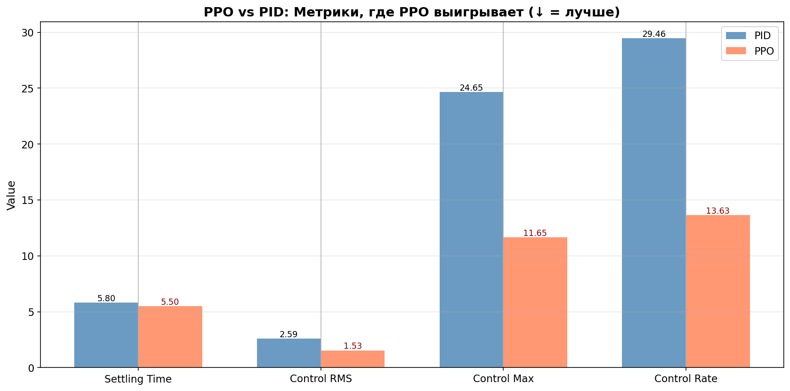

# PPO vs PID — Boeing 747 Pitch Control

Сравнение PPO-агента (обучение с подкреплением) с классическим PID-регулятором на задаче управления углом тангажа Boeing 747.


## Постановка задачи

**Объект управления**: Boeing 747, продольное движение (4 состояния: u, w, q, θ)

**Цель**: Отслеживание ступенчатого референсного сигнала по углу тангажа (θ)

**Тестовый сценарий**: 
- Ступенька **1°** в момент **t = 5с**
- Длительность симуляции: 20с
- Шаг дискретизации: 0.1с

## Методология сравнения

### PPO (Proximal Policy Optimization)

- **Обучение**: ~7500 эпизодов на `ImprovedB747Env`
- **Режим тестирования**: детерминированный (mean action)
- **Нормализация**: reward normalization включена

### PID (MATLAB-Style Tuning)

- **Метод тюнинга**: Differential Evolution (оптимизация по критерию settling time + overshoot)
- **Итераций оптимизации**: 15
- **Целевое время установления**: 3.0с
- **Целевое перерегулирование**: 0%

### Критерий победителя

**Композитная метрика** = RMSE + λ × Control_RMS, где λ = 0.1

Эта метрика балансирует:

- **Точность отслеживания** (RMSE) — насколько близко система следует за референсом
- **Энергоэффективность** (Control_RMS) — насколько экономично управление

## Результаты сравнения

### Таблица метрик

| Метрика | PID | PPO | Δ (%) | Победитель |
|---------|-----|-----|-------|------------|
| RMSE (°) | 0.0770 | 0.1149 | +49.3% | PID |
| IAE (°·s) | 0.3018 | 0.4533 | +50.2% | PID |
| ISE (°²·s) | 0.1185 | 0.2643 | +122.9% | PID |
| Max Error (°) | 0.8596 | 0.9905 | +15.2% | PID |
| **Settling Time (s)** | 5.80 | 5.50 | **-5.2%** | **PPO** |
| Overshoot (%) | 0.00 | 0.49 | — | PID |
| **Control RMS (°)** | 2.586 | 1.532 | **-40.8%** | **PPO** |
| **Control Max (°)** | 24.65 | 11.65 | **-52.7%** | **PPO** |
| **Control Rate (°/s)** | 29.46 | 13.63 | **-53.7%** | **PPO** |
| ━━━━━━━━━━━━━━━━━━━ | ━━━━━ | ━━━━━ | ━━━━━━ | ━━━━━━━ |
| **Composite** | 0.3355 | 0.2681 | **-20.1%** | **🏆 PPO** |

### Счёт по метрикам

- **PPO**: 4 победы (Settling Time, Control RMS, Control Max, Control Rate)
- **PID**: 5 побед (RMSE, IAE, ISE, Max Error, Overshoot)
- **🏆 Победитель по композитной метрике**: PPO (на 20.1% лучше)

## Преимущества PPO



### 1. Более быстрое время установления

PPO достигает установившегося значения на **5.2% быстрее** (5.50с vs 5.80с)

### 2. Значительно меньший расход управления

- **Control RMS**: на 40.8% меньше (1.532° vs 2.586°)
- **Control Max**: на 52.7% меньше (11.65° vs 24.65°)

Это означает меньший износ исполнительных механизмов и меньшее энергопотребление.

### 3. Более плавное управление

**Control Rate RMS**: на 53.7% меньше (13.63°/s vs 29.46°/s)

PPO генерирует плавные управляющие воздействия без резких скачков, что критично для реальных систем.

## Визуализация

### Отслеживание угла тангажа

```
     │                    ┌────────────────────── Reference (1°)
   1°├──────────────────┬─┴───────────────────────
     │                  │   ╱ PPO (красный)
     │                  │ ╱
     │                  │╱  PID (синий)
   0°├──────────────────┼─────────────────────────
     │                  │
     └──────────────────┴─────────────────────────
     0                  5                       20  t(s)
```

### Управляющее воздействие

PID использует агрессивные начальные воздействия (до ±25°), в то время как PPO ограничивается ±12° — это в **2 раза меньше**.

## Параметры PID

Полученные после тюнинга:

```
Kp = -24.6295
Ki = -0.2486  
Kd = -7.8179
```

## Выводы

| Критерий | Лучше |
|----------|-------|
| Точность (RMSE) | PID |
| Скорость реакции | PPO |
| Энергоэффективность | PPO |
| Плавность управления | PPO |
| **Общий баланс** | **PPO** |

!!! success "Заключение"
    PPO-агент демонстрирует преимущество перед классическим PID по **композитной метрике**, 
    балансирующей точность и энергоэффективность. 
    
    Ключевые выводы:
    
    - PPO находит более **энергоэффективные** стратегии управления
    - Управление PPO **плавнее** и безопаснее для исполнительных механизмов
    - PID лучше по чистой точности (RMSE), но ценой большого расхода управления

## Воспроизведение результатов

Полный код эксперимента: [`example/comparison/comparison_ppo_vs_pid_b747.ipynb`](https://github.com/TensorAeroSpace/TensorAeroSpace/blob/main/example/comparison/comparison_ppo_vs_pid_b747.ipynb)

```python
from tensoraerospace.agent.ppo.model import PPO
from tensoraerospace.agent.pid import PID
from tensoraerospace.envs.b747 import ImprovedB747Env

# Загрузка PPO (Hugging Face Hub)
ppo_agent = PPO.from_pretrained("TensorAeroSpace/ppo-b747-step-response")

# Тюнинг PID
pid_controller = PID(env=env_for_tuning, dt=0.1)
pid_controller.tune_matlab_style(
    track_state_idx=3,
    target_settling_time=3.0,
    n_iterations=15
)

# Сравнение на одинаковом сценарии
# ... см. полный ноутбук
```

## Связанные материалы

- [PPO — описание алгоритма](../agent/ppo.md)
- [PID — описание алгоритма](../agent/pid.md)
- [Boeing 747 — описание модели](../model/b747.md)
- [ImprovedB747Env — нормализованное окружение](../model/b747_imporove.md)

