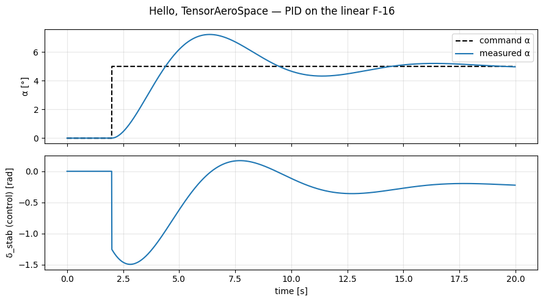

# Рецепт 01 — Hello, TensorAeroSpace

Пошаговый первый прогон: install → среда → PID → график. Занимает около 10 минут. Копируйте каждый блок в свежую сессию Python или ноутбук и сверяйте результат с эталонным графиком в конце.

Исходный ноутбук: [`example/cookbook/recipe_01_hello.ipynb`](https://github.com/TensorAeroSpace/TensorAeroSpace/blob/develop/example/cookbook/recipe_01_hello.ipynb).

## Шаг 1 — Установка

```bash
pip install tensoraerospace
```

Для разработки библиотеки подходит `poetry install` из корня репо.

## Шаг 2 — Импорты и параметры симуляции

```python
import warnings
warnings.filterwarnings('ignore')

import gymnasium as gym
import matplotlib.pyplot as plt
import numpy as np

import tensoraerospace  # регистрирует все среды Gymnasium
from tensoraerospace.agent.pid import PID
from tensoraerospace.signals.standard import unit_step
from tensoraerospace.utils import generate_time_period

dt = 0.01
tp = generate_time_period(tn=20, dt=dt)       # 20 с симуляции, 100 Гц
number_time_steps = len(tp)

# Ступенька +5° по углу атаки в момент t = 2 с.
reference_signal = np.reshape(
    unit_step(tp=tp, degree=5, time_step=2.0, output_rad=True),
    (1, -1),
)
```

**Что проверить.** `reference_signal.shape` должно быть `(1, 2001)` — один отслеживаемый канал, 2001 тик.

## Шаг 3 — Создать среду

```python
env = gym.make(
    'LinearLongitudinalF16-v0',
    number_time_steps=number_time_steps,
    use_reward=False,
    initial_state=[[0], [0], [0]],               # theta, alpha, q
    reference_signal=reference_signal,
    state_space=['theta', 'alpha', 'q'],
    output_space=['theta', 'alpha', 'q'],
    tracking_states=['alpha'],
)
env.reset()
```

`.unwrapped` здесь не обязателен; мы используем его, когда нужен доступ к env-специфичным помощникам вроде `env.ref_signal`.

## Шаг 4 — Замкнуть PID-контур

```python
pid = PID(env, kp=-14.29, ki=-8.24, kd=-1.30, dt=dt)

alpha_meas = []
u_trace = []
xt = np.zeros(3)                               # [theta, alpha, q] — соответствует state_space

for step in range(number_time_steps - 2):
    setpoint = float(reference_signal[0, step])
    ut = pid.select_action(setpoint, float(xt[1]))
    xt, reward, terminated, truncated, info = env.step(np.array([ut]))
    alpha_meas.append(float(xt[1]))
    u_trace.append(float(ut))

alpha_meas = np.asarray(alpha_meas)
u_trace = np.asarray(u_trace)
ref = reference_signal[0, : len(alpha_meas)]

rmse_deg = np.degrees(np.sqrt(np.mean((alpha_meas[-500:] - ref[-500:]) ** 2)))
print(f'Late-window RMSE on α: {rmse_deg:.3f}°')
```

**Ожидаемый вывод:**

```
Late-window RMSE on α: 0.141°
```

Если ваш результат в пределах ±0.05° от `0.141°`, всё идёт хорошо. Сильно больший RMSE обычно означает несовпадение знаков PID-коэффициентов (все три — **отрицательные**, у объекта отрицательный DC-коэффициент).

## Шаг 5 — График

```python
t = tp[: len(alpha_meas)]
fig, axes = plt.subplots(2, 1, figsize=(9, 5), sharex=True)
axes[0].plot(t, np.degrees(ref), 'k--', label='команда α')
axes[0].plot(t, np.degrees(alpha_meas), label='измеренный α')
axes[0].set_ylabel('α [°]'); axes[0].legend(); axes[0].grid(alpha=0.3)

axes[1].plot(t, u_trace)
axes[1].set_ylabel('δ_stab (управление) [рад]')
axes[1].set_xlabel('время [с]'); axes[1].grid(alpha=0.3)

plt.tight_layout(); plt.show()
```

**Эталонный график — сравните со своим:**



На верхней панели α должен достичь команды 5° примерно за 1 с и удерживаться. На нижней — переходный процесс руля высоты, выходящий на малое установившееся значение.

## Типичные отклонения

| Симптом | Причина |
|---|---|
| α остаётся около 0 | Положительные PID-коэффициенты (все должны быть отрицательными для этого объекта). |
| α колеблется / расходится | Слишком большие по модулю коэффициенты или `dt` в PID не совпадает с `dt` среды. |
| RMSE > 1° | `tracking_states` не соответствует форме reference_signal. |
| `IndexError` в конце цикла | Цикл идёт до `number_time_steps` вместо `number_time_steps - 2`. |

## Куда дальше

- **[Рецепт 02 — Устройство среды](02_env_anatomy.md)** — разбор каждого аргумента.
- **[Рецепт 03 — Задающие сигналы](03_reference_signals.md)** — что кроме одной ступеньки.
- **[Рецепт 04 — Как выбрать агента](04_choosing_agent.md)** — когда PID не хватает.
