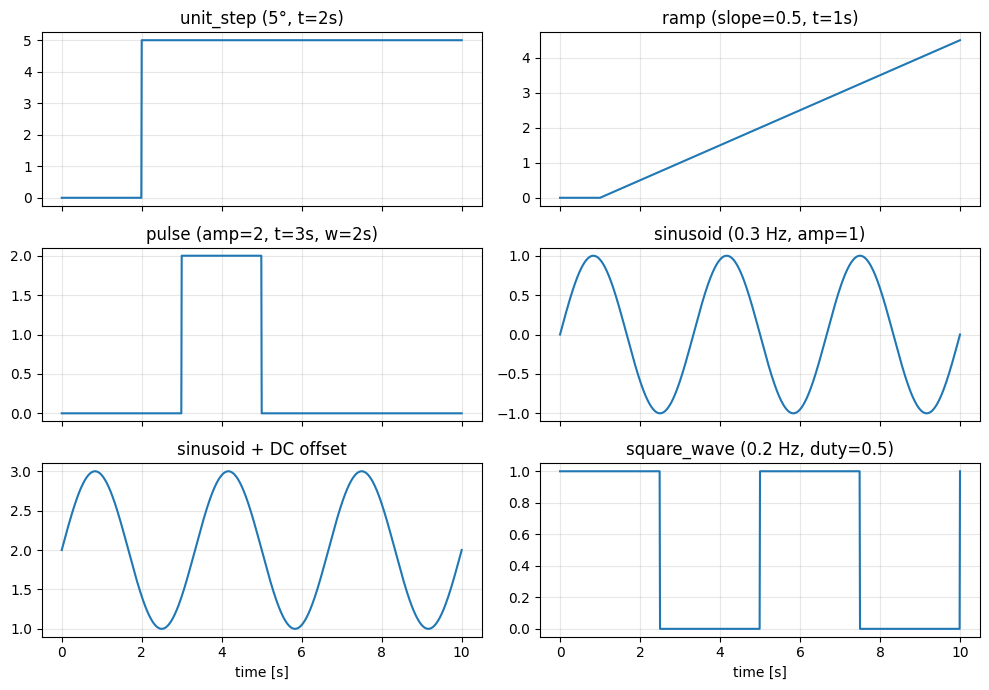
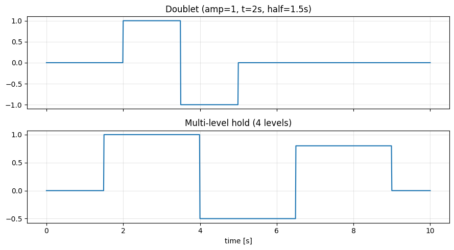
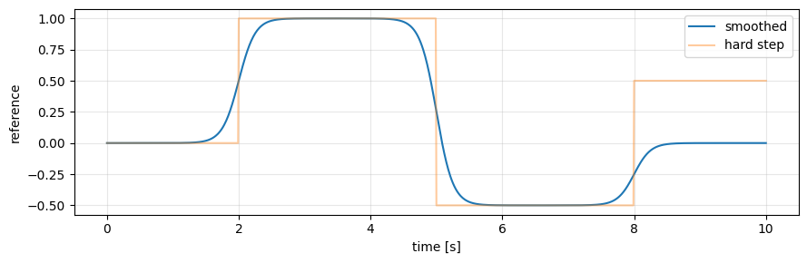

# Рецепт 03 — Задающие сигналы

Пошагово проходим по примитивам библиотеки, затем по составным расписаниям (дублеты, многоуровневое удержание, сглаженные переходы). Копируйте каждый блок и сверяйте свой график с эталонным.

Исходный ноутбук: [`example/cookbook/recipe_03_reference_signals.ipynb`](https://github.com/TensorAeroSpace/TensorAeroSpace/blob/develop/example/cookbook/recipe_03_reference_signals.ipynb).

## Контракт формы (прочесть один раз)

Среда ожидает `reference_signal.shape == (len(tracking_states), number_time_steps)`. Для одного канала всегда `np.reshape(sig, (1, -1))`. Все построители в `tensoraerospace.signals.standard` принимают временной вектор `tp = generate_time_period(tn=T, dt=dt)` первым аргументом.

## Шаг 1 — Примитивы

```python
import warnings
warnings.filterwarnings('ignore')

import matplotlib.pyplot as plt
import numpy as np

from tensoraerospace.signals.standard import (
    unit_step, ramp, pulse, sinusoid, sinusoid_vertical_shift,
    square_wave, constant_line,
)
from tensoraerospace.utils import generate_time_period

dt = 0.01
tp = generate_time_period(tn=10, dt=dt)       # 10 с, 1001 тик

fig, axes = plt.subplots(3, 2, figsize=(10, 7), sharex=True)
axes[0,0].plot(tp, unit_step(tp=tp, degree=5, time_step=2.0));            axes[0,0].set_title('unit_step (5°, t=2с)')
axes[0,1].plot(tp, ramp(tp=tp, slope=0.5, time_start=1.0));               axes[0,1].set_title('ramp (slope=0.5, t=1с)')
axes[1,0].plot(tp, pulse(tp=tp, amplitude=2.0, time_start=3.0, width=2.0)); axes[1,0].set_title('pulse')
axes[1,1].plot(tp, sinusoid(tp=tp, frequency=0.3, amplitude=1.0));         axes[1,1].set_title('sinusoid (0.3 Гц)')
axes[2,0].plot(tp, sinusoid_vertical_shift(tp=tp, frequency=0.3, amplitude=1.0, vertical_shift=2.0)); axes[2,0].set_title('sinusoid + DC')
axes[2,1].plot(tp, square_wave(tp=tp, frequency=0.2, amplitude=1.0));      axes[2,1].set_title('square_wave')
for ax in axes.flat: ax.grid(alpha=0.3)
plt.tight_layout(); plt.show()
```

**Эталонный график:**



| Примитив | Сигнатура |
|---|---|
| `unit_step` | `(tp, degree, time_step, output_rad=False)` |
| `ramp` | `(tp, slope, time_start)` |
| `pulse` | `(tp, amplitude, time_start, width)` |
| `sinusoid` | `(tp, frequency, amplitude)` |
| `sinusoid_vertical_shift` | `(tp, frequency, amplitude, vertical_shift)` |
| `square_wave` | `(tp, frequency, amplitude, duty_cycle)` |
| `constant_line` | `(tp, value_state)` |

## Шаг 2 — Составные расписания

```python
def doublet(tp, amplitude, t_start, half_width):
    return (pulse(tp=tp, amplitude=amplitude, time_start=t_start, width=half_width)
            + pulse(tp=tp, amplitude=-amplitude, time_start=t_start + half_width, width=half_width))

def multi_step(tp, schedule):
    """schedule: список (t_start, level), отсортированных по времени."""
    sig = np.zeros_like(tp)
    for i, (t_start, level) in enumerate(schedule):
        next_t = schedule[i+1][0] if i+1 < len(schedule) else tp[-1] + 1.0
        mask = (tp >= t_start) & (tp < next_t)
        sig[mask] = level
    return sig

doublet_sig = doublet(tp, amplitude=1.0, t_start=2.0, half_width=1.5)
multi = multi_step(tp, [(0.0, 0.0), (1.5, 1.0), (4.0, -0.5), (6.5, 0.8), (9.0, 0.0)])

fig, axes = plt.subplots(2, 1, figsize=(9, 5), sharex=True)
axes[0].plot(tp, doublet_sig); axes[0].set_title('Дублет (amp=1, t=2с, half=1.5с)')
axes[1].plot(tp, multi); axes[1].set_title('Многоуровневое удержание (4 уровня)')
for ax in axes: ax.grid(alpha=0.3)
axes[1].set_xlabel('время [с]')
plt.tight_layout(); plt.show()
```

**Эталонный график:**



**Когда что использовать:**

- **Дублет** → идентификация частотной характеристики (стандарт в авиации).
- **Многоуровневое удержание** → пакетные LS policy-evaluator'ы (iADP и пр.); разные уровни возбуждают кросс-члены `P̃`.

## Шаг 3 — Сглаженные переходы

Разрывные ступеньки возбуждают весь спектр до полосы привода — часто приятнее смягчить `tanh`-фронтами.

```python
def smooth_step(tp, from_level, to_level, t_mid, transition_time):
    k = 4.0 / max(transition_time, 1e-6)
    return from_level + 0.5 * (to_level - from_level) * (1.0 + np.tanh(k * (tp - t_mid)))

smooth = (smooth_step(tp, 0.0, 1.0, t_mid=2.0, transition_time=1.0)
          + smooth_step(tp, 0.0, -1.5, t_mid=5.0, transition_time=1.0)
          + smooth_step(tp, 0.0, 0.5, t_mid=8.0, transition_time=1.0))

fig, ax = plt.subplots(figsize=(9, 3))
ax.plot(tp, smooth, label='сглаженный')
ax.plot(tp, multi_step(tp, [(0.0, 0.0), (2.0, 1.0), (5.0, -0.5), (8.0, 0.5)]),
        alpha=0.4, label='жёсткий')
ax.set_xlabel('время [с]'); ax.set_ylabel('reference')
ax.legend(); ax.grid(alpha=0.3)
plt.tight_layout(); plt.show()
```

**Эталонный график:**



Жёсткая ступенька (блёклая линия) переключается мгновенно; сглаженная (сплошная) проезжает за `transition_time = 1 с`.

## Шаг 4 — Передаём в среду

Один канал:

```python
reference_signal = np.reshape(smooth, (1, -1))
env = gym.make('LinearLongitudinalF16-v0',
    number_time_steps=len(tp),
    reference_signal=reference_signal,
    tracking_states=['alpha'],
    ...)
```

Многоканальное слежение (6-DoF p/q/r):

```python
ref_p = doublet(tp, 0.3, 2.0, 1.0)
ref_q = smooth_step(tp, 0.0, 0.5, 4.0, 0.5)
ref_r = np.zeros_like(tp)
reference_signal = np.stack([ref_p, ref_q, ref_r], axis=0)
# tracking_states=['p', 'q', 'r']
```

## Правила большого пальца

- **PID / MPC benchmarking** — импульсы и дублеты.
- **Адаптивные критики (IHDP / IM-GDHP / iADP)** — многоуровневое удержание.
- **Обучение RL** — случайные расписания между эпизодами.
- **ID частотной характеристики** — чирп или мультисинус. В iADP-ноутбуке используется `2·sin(2π·0.7t) + 1·sin(2π·1.5t)`.

## Куда дальше

- **[Рецепт 04 — Как выбрать агента](04_choosing_agent.md)** — форма сигнала ↔ возможности агента.
- **[Рецепт 09 — Отказоустойчивость](09_fault_tolerance.md)** — команды в сочетании с отказами привода.
