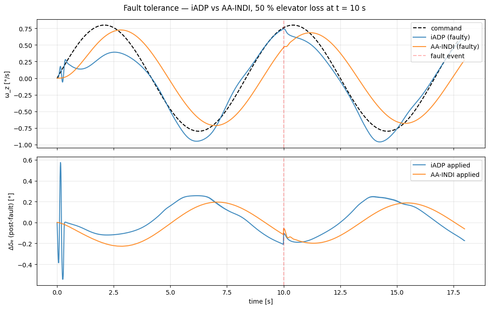

# Рецепт 09 — Отказоустойчивость онлайн-адаптивных агентов

Внедряем потерю 50 % эффективности руля в середине эпизода и смотрим, как iADP и AA-INDI её впитывают. Копируйте каждый шаг; числа и график в конце — эталонные, должны воспроизводиться в пределах ±5 %.

Исходный ноутбук: [`example/cookbook/recipe_09_fault_tolerance.ipynb`](https://github.com/TensorAeroSpace/TensorAeroSpace/blob/develop/example/cookbook/recipe_09_fault_tolerance.ipynb).

## Шаг 1 — Импорты и трим

```python
import warnings
warnings.filterwarnings('ignore')
import math

import gymnasium as gym
import matplotlib.pyplot as plt
import numpy as np
from scipy.linalg import solve_discrete_are
from scipy.optimize import fsolve

import tensoraerospace  # noqa: F401
from tensoraerospace.aerospacemodel.f16.nonlinear.longitudinal.dynamics import f16_ode_long
from tensoraerospace.aerospacemodel.f16.nonlinear.longitudinal.params import default_parameters
from tensoraerospace.agent.iadp import IADPAgent, IADPConfig
from tensoraerospace.agent.aa_indi import AAINDIAgent, AAINDIConfig

dt = 0.01
params = default_parameters()

def trim_residual(z):
    alpha, stab = z
    return list(f16_ode_long(np.array([alpha, 0, stab, 0]), np.array([stab]), 0, params)[:2])

sol, *_ = fsolve(trim_residual, x0=[math.radians(2.0), math.radians(-2.0)], full_output=True)
alpha_trim_rad, stab_trim_rad = float(sol[0]), float(sol[1])

def make_env(n):
    env = gym.make('NonlinearLongitudinalF16-v0',
        number_time_steps=n + 2,
        initial_state=[alpha_trim_rad, 0.0, stab_trim_rad, 0.0],
        reference_signal=np.full((1, n + 2), alpha_trim_rad),
        state_space=['alpha','wz','stab','dstab'], control_space=['stab'],
        tracking_states=['alpha'], use_reward=False, dt=dt, integrator='euler',
        control_bias=math.degrees(stab_trim_rad),
    ).unwrapped
    env.reset()
    return env
```

## Шаг 2 — Warm-start через 3-секундное PE-возбуждение

```python
env_pe = make_env(300); obs, _ = env_pe.reset()
wz_hist, u_hist = [float(obs[1])], [0.0]
for t in range(300):
    u = 2.0*math.sin(2*math.pi*0.7*t*dt) + 1.0*math.sin(2*math.pi*1.5*t*dt)
    obs, *_ = env_pe.step(np.array([u]))
    wz_hist.append(float(obs[1])); u_hist.append(float(u))

dwz, du = np.diff(wz_hist), np.diff(u_hist)
A_pe = np.column_stack([dwz[:-1], du[:-1]])
F_wz, G_wz = np.linalg.lstsq(A_pe, dwz[1:], rcond=None)[0]
print(f'PE seed: F_wz = {F_wz:+.4f}, G_wz = {G_wz:+.5f}')
```

**Ожидаемый вывод:**

```
PE seed: F_wz = +0.9997, G_wz = -0.00139
```

Если `G_wz` отличается на порядок, проверьте амплитуду возбуждения (у нас 2 и 1 для двух синусов).

## Шаг 3 — Harness iADP

```python
def run_iadp(wz_cmd, N, fault_gain=1.0, fault_at=None):
    F_init = np.array([[F_wz, 0.0], [0.0, 1.0]])
    G_init = np.array([[G_wz], [0.0]])
    Q, R, gamma = 30_000.0, 0.1, 0.9
    Q_aug = Q * np.array([[1.0, -1.0], [-1.0, 1.0]])
    P_dare = solve_discrete_are(np.sqrt(gamma)*F_init, np.sqrt(gamma)*G_init,
                                Q_aug, np.array([[R]]))
    cfg = IADPConfig(dt=dt, Q=np.array([[Q]]), R=np.array([[R]]),
        gamma=gamma, gamma_rls=0.9999, phi_init=1.0,
        policy_eval_window=300, policy_eval_every=5,
        policy_eval_warmup_updates=20,
        policy_eval_regularization=1e-10, policy_eval_blend=0.10,
        F_init=F_init, G_init=G_init, P_init=P_dare,
        u_magnitude_limit=8.0, u_rate_limit=200.0, seed=0)
    agent = IADPAgent(n_state=1, n_control=1, config=cfg)
    env = make_env(N); obs, _ = env.reset()
    wz_out, u_out = [], []
    gain = 1.0
    for k in range(N):
        if fault_at is not None and k >= fault_at: gain = fault_gain
        u = agent.predict(np.array([float(obs[1])]), np.array([wz_cmd[k]]), k)
        obs, *_ = env.step(u * gain)
        agent.learn(np.array([float(obs[1])]), np.array([wz_cmd[k]]), k)
        wz_out.append(float(obs[1])); u_out.append(float(u[0] * gain))
    return np.asarray(wz_out), np.asarray(u_out)
```

## Шаг 4 — Harness AA-INDI

```python
def run_aaindi(wz_cmd, N, fault_gain=1.0, fault_at=None):
    cfg = AAINDIConfig(
        dt=dt, ref_wn=2.5, ref_zeta=0.9,
        u_magnitude_limit=15.0, u_rate_limit=60.0,
        vff_forgetting_min=0.97, vff_forgetting_max=0.9999,
        vff_eps_sensitivity=0.1, vff_cov_init=1.0,
        sensor_cutoff_hz=15.0, bias_forgetting=0.995,
        enable_bias_correction=False,
        G_init=np.array([[-0.5]]),
        ref_error_kp=0.6, ref_error_ki=0.0,
        seed=0,
    )
    agent = AAINDIAgent(n_state=1, n_control=1, config=cfg)
    env = make_env(N); obs, _ = env.reset()
    wz_out, u_out = [], []
    gain = 1.0
    for k in range(N):
        if fault_at is not None and k >= fault_at: gain = fault_gain
        u = agent.predict(np.array([float(obs[1])]), np.array([wz_cmd[k]]), k)
        obs, *_ = env.step(u * gain)
        agent.learn(np.array([float(obs[1])]), np.array([wz_cmd[k]]), k)
        wz_out.append(float(obs[1])); u_out.append(float(u[0] * gain))
    return np.asarray(wz_out), np.asarray(u_out)
```

## Шаг 5 — В лоб, отказ в t = 10 с

```python
N = 1800
t_arr = np.arange(N) * dt
wz_cmd = math.radians(0.8) * np.sin(2*math.pi*0.12*t_arr)
fault_step = int(10.0 / dt)

wz_i_f, u_i_f = run_iadp(wz_cmd, N, fault_gain=0.5, fault_at=fault_step)
wz_a_f, u_a_f = run_aaindi(wz_cmd, N, fault_gain=0.5, fault_at=fault_step)

def rmse(sig, ref, mask):
    return math.degrees(np.sqrt(np.mean((sig[mask] - ref[mask])**2)))

pre  = np.arange(500, fault_step)
post = np.arange(fault_step + 100, N)
print('                 pre-fault RMSE   post-fault RMSE')
print(f'  iADP          {rmse(wz_i_f, wz_cmd, pre):.4f}°/с       {rmse(wz_i_f, wz_cmd, post):.4f}°/с')
print(f'  AA-INDI       {rmse(wz_a_f, wz_cmd, pre):.4f}°/с       {rmse(wz_a_f, wz_cmd, post):.4f}°/с')
```

**Ожидаемый вывод:**

```
                 pre-fault RMSE   post-fault RMSE
  iADP          0.0896°/с       0.0982°/с
  AA-INDI       0.3135°/с       0.3216°/с
```

**Смотрите на дельту, не на абсолют.** У обоих агентов RMSE сдвигается на ~1 миллиградус/с в момент отказа — то есть ни один из них не «удивляется» потере 50 % усиления. Абсолютный разрыв iADP↔AA-INDI — эффект тюнинга (коэффициенты PI у AA-INDI взяты из примера со ступенчатой командой, не перетюнены под 0.12 Гц синусоиду).

## Шаг 6 — График

```python
fig, axes = plt.subplots(2, 1, figsize=(11, 7), sharex=True)
axes[0].plot(t_arr, np.degrees(wz_cmd), 'k--', label='команда')
axes[0].plot(t_arr, np.degrees(wz_i_f), label='iADP (с отказом)', alpha=0.85)
axes[0].plot(t_arr, np.degrees(wz_a_f), label='AA-INDI (с отказом)', alpha=0.85)
axes[0].axvline(fault_step * dt, color='red', alpha=0.3, linestyle='--', label='fault event')
axes[0].set_ylabel('ω_z [°/с]'); axes[0].legend(loc='upper right'); axes[0].grid(alpha=0.3)

axes[1].plot(t_arr, u_i_f, label='iADP применённый', alpha=0.85)
axes[1].plot(t_arr, u_a_f, label='AA-INDI применённый', alpha=0.85)
axes[1].axvline(fault_step * dt, color='red', alpha=0.3, linestyle='--')
axes[1].set_xlabel('время [с]'); axes[1].set_ylabel('Δδₑ (после отказа) [°]')
axes[1].legend(loc='upper right'); axes[1].grid(alpha=0.3)
plt.tight_layout(); plt.show()
```

**Эталонный график — сравните со своим:**



- Команда — чёрная пунктирная синусоида.
- **iADP** отслеживает в узком коридоре; переходный процесс в `t = 10 с` почти не виден.
- **AA-INDI** показывает фазовое отставание внутреннего rate-tracking-контура — большая амплитуда ошибки, но дельта RMSE в момент отказа всё равно ~1 мград/с.
- Красный пунктир — момент инъекции отказа.

## Что делает это возможным

- **Постоянная RLS-идентификация** — оценка G у обоих агентов обновляется каждый тик; отказ — просто изменение объекта, идентификатор сходится к новому значению.
- **Инкрементное действие** — INDI (AA-INDI) и LQT-инкрементный (iADP) оба выдают Δδ; уменьшение усиления вдвое сдвигает *скорость*, а не направление.
- **Нет state-machine обнаружения** — агентам не нужно знать, что произошёл отказ.

## Типичные отклонения

| Симптом | Причина |
|---|---|
| iADP расходится | Забыли DARE `P_init` или стоит дефолт `policy_eval_regularization`. |
| AA-INDI колеблется | Warm-start `G_init` имеет неправильный знак. |
| Дельта RMSE > 20 % от pre-fault | Слишком агрессивный `fault_gain` (попробуйте `0.7`). |

## Куда дальше

- **[Рецепт 06 — Онлайн-адаптивные агенты](06_online_adaptive.md)** — общий каркас.
- **[Документация AA-INDI](../agent/aa_indi.md)** — теория + API.
- **[Документация iADP](../agent/iadp.md)** — теория + API.
