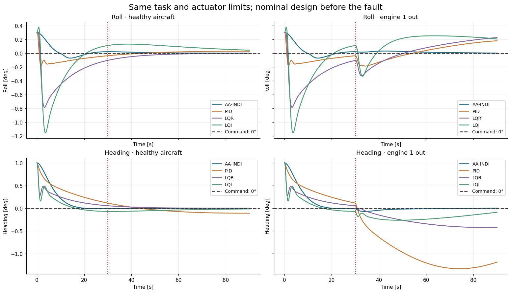
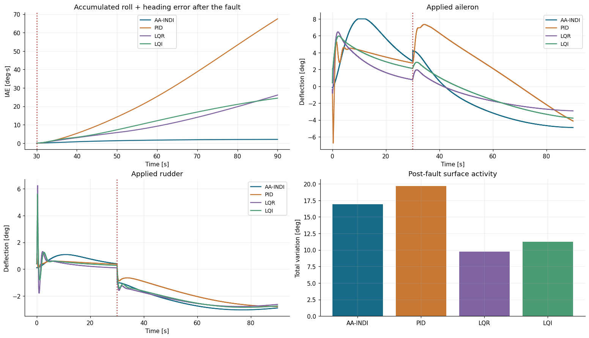

# Рецепт 09 — Проверка отказоустойчивости на общем объекте

**Цель:** настроить классические регуляторы на исправном B747, внести физический
отказ двигателя и сравнить AA-INDI, PID, LQR и LQI при одинаковых условиях полёта
и ограничениях приводов. Вы выполните пары исправных и аварийных прогонов,
проверите причинность, построите задания и отклики, измерите восстановление
и затраты управления.

**Ноутбук:** [recipe_09_fault_tolerance.ipynb](https://github.com/TensorAeroSpace/TensorAeroSpace/blob/develop/example/cookbook/recipe_09_fault_tolerance.ipynb).
В нём есть исполняемые ячейки и сохранённые графики. Блоки Python ниже выполняются
по порядку в окружении с установленной текущей версией `tensoraerospace`. В
[полном сравнении](../comparison/aaindi_vs_pid_lqr_lqi_b747.md) дополнительно показаны
физические каналы и диагностика адаптации.

## 1. Определите, что именно отказывает

Штатный нелинейный B747 с 12 состояниями имеет четыре двигателя. На 30-й секунде
левый внешний двигатель полностью теряет тягу. При неизменных газе и условиях
полёта суммарная тяга становится равной 75% исправного значения, появляется
асимметричный момент рыскания. Штатный `EngineFailureEvent` меняет силовую
установку внутри физической модели.

Эффективность элеронов и руля направления остаётся прежней. Умножение измеренного
курса или произвольный скачок состояния описывали бы другой эксперимент.

| Условие | Общее значение |
|---|---|
| Высота / скорость | 20,000 ft / 674 ft/s |
| Начальные крен / курс | 0.3° / 1° |
| Задания крена / курса | 0° / 0° весь полёт |
| Длительность / период управления | 90 с / 0.02 с |
| Ограничения элеронов и руля направления | ±8° и 20°/с |
| Продольное управление | Общий PI/PD-контур скорости и высоты по измерениям |
| Датчики | Идеальные IMU, навигация и обратная связь по фактическим рулям |


```python
import numpy as np
import pandas as pd
import matplotlib.pyplot as plt
from tensoraerospace.benchmark import B747EngineFailureBenchmark

experiment = B747EngineFailureBenchmark(
    duration=90.0, dt=0.02, fault_time=30.0,
    engine_fraction=0.0, engine_id=1,
    initial_heading_deg=1.0, initial_roll_deg=0.3, seed=11,
)
COLORS = {"AA-INDI": "#176b87", "PID": "#c77835",
          "LQR": "#8064a2", "LQI": "#4b9b75"}
```


`experiment` настраивает симулятор и оценку. Конструкторы регуляторов не получают
расписание отказа. `B747EngineFailureBenchmark` использует модели, датчики и регуляторы библиотеки; протокол выполняет
номинальную инициализацию, ограничение рулей, проверку завершения эпизода и закрытие
окружения. При переносе на другой самолёт изучите
[его реализацию](https://github.com/TensorAeroSpace/TensorAeroSpace/blob/develop/tensoraerospace/benchmark/engine_failure.py).

## 2. Подберите базовые регуляторы на исправных данных

PID содержит раздельные контуры крена и курса с защитой интегратора от насыщения.
LQR использует пять боковых состояний; LQI добавляет два ограниченных интеграла
ошибок углов для компенсации постоянного возмущения. Параметры выбираются
в отдельном **исправном эпизоде длительностью 60 с** с большими начальными
отклонениями: крен 1°, курс 2°.

Общий критерий — среднее
`roll_error² + heading_error² + 0.002*(aileron² + rudder²)`, углы в градусах.
Проверяются семь вариантов PID и по пять наборов весов LQR и LQI.


```python
settings, trials = experiment.tune_baselines()
print(pd.DataFrame([
    {"Controller": row["algorithm"], "Healthy cost": row["healthy_cost"]}
    for row in trials
]).to_string(index=False))
for name, selected in settings.items():
    print(name, selected)
```


Сохраните выбранные настройки для всех дальнейших сценариев отказа. Этот конечный
перебор воспроизводим, но не доказывает глобальную оптимальность PID, LQR или LQI.
AA-INDI использует номинальные производные, наблюдатель и коэффициенты, описанные
на странице сравнения; каждый эпизод начинается заново, адаптация работает весь полёт.

## 3. Независимо запустите исправный и аварийный самолёт

Каждый вызов создаёт новое окружение и нового регулятора. Возвращаются полные
состояния, фактические действия, метрики, журнал событий и диагностика AA-INDI.
Независимая инициализация важна: повторное использование уже адаптированного агента
дало бы второму прогону другие начальные условия.


```python
runs = {}
for name in experiment.algorithms:
    for failed in (False, True):
        runs[(name, failed)] = experiment.run(name, fault=failed, **settings.get(name, {}),
        )
        assert len(runs[(name, failed)]["actions"]) == experiment.steps
    event_index = round(experiment.fault_time / experiment.dt)
    np.testing.assert_array_equal(
        runs[(name, False)]["states"][:event_index + 1],
        runs[(name, True)]["states"][:event_index + 1],
    )
    np.testing.assert_array_equal(
        runs[(name, False)]["actions"][:event_index],
        runs[(name, True)]["actions"][:event_index],
    )
assert runs[("AA-INDI", True)]["updates"] == [experiment.steps] * 3
print("Eight complete trajectories; pre-failure histories agree")
```


Проверки равенства включают состояние на 30 с и все действия до этого момента.
Они выявляют влияние события на более ранние стадии интегрирования или различные
настройки регулятора до отказа. Здесь точное совпадение ожидаемо, поскольку датчики
идеальны и детерминированы. При шуме используйте одинаковые seed и совпадающие
последовательности шумов в парных прогонах.

AA-INDI выполняет 4,500 обновлений идентификации на каждую ось момента. Ни один
алгоритм не сбрасывается, не переключается и не замораживается в момент отказа.
Цикл отвергает нечисловые состояния, выход из диапазона примера и неполные эпизоды.

## 4. Постройте задание вместе с откликом


```python
time = np.arange(experiment.steps + 1) * experiment.dt
fig, axes = plt.subplots(2, 2, figsize=(14, 8), sharex=True, sharey="row", constrained_layout=True)
for column, failed in enumerate((False, True)):
    for algorithm in experiment.algorithms:
        state = runs[(algorithm, failed)]["states"]
        for row, index in enumerate((6, 8)):
            axes[row, column].plot(time, np.rad2deg(state[:, index]),
                                   color=COLORS[algorithm], label=algorithm)
    for row, name in enumerate(("Roll", "Heading")):
        ax = axes[row, column]
        ax.axhline(0, color="#333333", linestyle="--", label="Command: 0°")
        ax.axvline(experiment.fault_time, color="#b44040", linestyle=":")
        ax.set(title=f"{name} · {'engine 1 out' if failed else 'healthy aircraft'}",
               ylabel=f"{name} [deg]", xlabel="Time [s]")
        ax.grid(alpha=0.22)
        ax.legend(fontsize=9, loc="best")
fig.suptitle("Same task and actuator limits; nominal design before the fault", fontsize=16)
plt.show()
```




Сравнивайте соответствующие строки: сверху крен (Roll), снизу курс (Heading).
Одинаковые масштабы позволяют сопоставлять исправный и аварийный объект.
Линия на 30 с — отметка для оценки; она не подаётся на вход регулятору.
Графики и исполняемый ноутбук оформлены на английском; Time — секунды, deg — градусы.

## 5. Измерьте ошибку и активность управления

Окно после отказа — **(30, 90] с**. `ControlBenchmark.tracking_metrics`, вызываемый протоколом, вычисляет:

- Совместную RMSE: `sqrt(mean(roll_error² + heading_error²))`, градусы.
- Совместную IAE: `dt*sum(abs(roll_error) + abs(heading_error))`, градусы·секунды.
- Восстановление: время от отказа до входа обеих ошибок в ±0.05° с удержанием до конца.
- Среднеквадратичное отклонение и суммарную вариацию элеронов/руля направления в том же окне.


```python
columns = ["roll_rmse_deg", "heading_rmse_deg", "combined_rmse_deg",
           "angle_iae_deg_s", "recovery_s", "surface_rms_deg",
           "surface_total_variation_deg"]
post_fault = pd.DataFrame({name: runs[(name, True)]["after"]
                          for name in experiment.algorithms}).T[columns]
print(post_fault.to_string(float_format=lambda value: f"{value:.6f}",
                          na_rep="Not reached"))
healthy = pd.DataFrame({name: runs[(name, False)]["whole"]
                       for name in experiment.algorithms}).T[columns]
print("Healthy aircraft, full 90 s:")
print(healthy.to_string(float_format=lambda value: f"{value:.6f}",
                       na_rep="Not reached"))
```


| Регулятор | Совместная RMSE, ° | Совместная IAE, °·с | Восстановление после отказа, с |
|---|---:|---:|---:|
| AA-INDI | 0.032433 | 2.03693 | 8.68 |
| PID | 1.086181 | 67.48585 | Не достигнуто |
| LQR | 0.359953 | 26.10714 | Не достигнуто |
| LQI | 0.300430 | 24.43503 | Не достигнуто |

AA-INDI даёт меньшую ошибку углов в этой конфигурации. Среднеквадратичное отклонение
рулей составляет 3.0300°, у LQR — 2.1685°, у LQI — 2.3486°: выигрыш в точности
здесь требует большей активности управления. Суммарная вариация измеряет
изменения команд, но не физические энергозатраты или калиброванный износ приводов.



Это подавление возмущения при нулевом задании; процентное перерегулирование,
нормированное на задание, не определено. Для ступеньки тангажа используйте
`ControlBenchmark` на B737 из [рецепта 14](14_aaindi.md). Разделяйте окна реакции
на ступеньку и на отказ, если в полёте присутствуют оба события.

## 6. Отличите медленное восстановление от расходимости

Включите следующий блок для ещё 12 траекторий: отказ правого внешнего двигателя
на 20 с, сохранение 50% тяги двигателя № 1 с 45 с и исходный отказ при длительности
полёта **500 с**. Настройки не меняются.


```python
RUN_EXTENDED_VALIDATION = False
if RUN_EXTENDED_VALIDATION:
    validation = experiment.validate_additional_cases(settings)
    table = pd.DataFrame([
        {"Case": row["case"], "Controller": row["algorithm"], **row["after"]}
        for row in validation
    ])
    print(table.to_string(index=False, na_rep="Not reached"))
```


В прогоне на 500 с восстановление после отказа занимает **8.68 с у AA-INDI,
186.10 с у PID и 88.34 с у LQI**. Стандартный LQR сохраняет ненулевое отклонение.
Поэтому «не достигнуто» в 90-секундном прогоне не означает расходимость PID или LQI.
Перед выводом изучите полную траекторию и требуемую длительность проверки.

[Сохранённый отчёт](https://github.com/TensorAeroSpace/TensorAeroSpace/blob/develop/reports/aaindi-b747-engine-loss.md)
содержит отдельно выполненные длительные прогоны и физические регрессионные проверки.

## 7. Перенесите проверку на другой тип отказа

| Вопрос | Подходящий пример |
|---|---|
| Компенсирует ли регулятор асимметрию тяги? | Это сравнение на B747. |
| Что происходит при потере аэродинамической эффективности руля высоты? | [iADP на B737](https://github.com/TensorAeroSpace/TensorAeroSpace/blob/develop/example/reinforcement_learning/incremental_adp/example_iadp_fault_b737.ipynb) и [AA-INDI на B737](https://github.com/TensorAeroSpace/TensorAeroSpace/blob/develop/example/reinforcement_learning/incremental_adp/example_aaindi_fault_b737.ipynb). |
| Может ли независимая навигация восстановить смещение гироскопа? | [Эксперимент AA-INDI с отказами датчика и привода](../example/agent/aa_indi/example_aaindi_nonlinear.md). |

Отказ B737 масштабирует угол руля **внутри аэродинамического расчёта**; датчик
положения продолжает сообщать физический угол. В примерах длительностью 60 с
ступенька тангажа +1° подаётся на 15 с, потеря 50% эффективности возникает на 30 с.
RMSE тангажа после отказа — 0.129777° для текущей конфигурации iADP и 0.003756°
для AA-INDI. У iADP остаётся смещение; эти результаты нельзя описывать как
универсальное восстановление с нулевой ошибкой.

## Интерпретация и типичные проблемы

| Наблюдение | Что исследовать |
|---|---|
| Исправная и аварийная истории различаются до события | Сбросы, seed, запланированные изменения коэффициентов и время интегрирования события. |
| Ошибка углов мала, но скорость/высота ухудшаются | Общий продольный контур, доступную тягу и диапазон полёта. |
| Ошибка мала, но производные дрейфуют | Регрессия AA-INDI не включает остальные аэродинамические и двигательные моменты; коэффициенты могут поглощать их вклад. |
| Все рули достигают ограничений | Балансировку, единицы, знаки коэффициентов и запас управления до подбора скорости обучения. |
| Восстановления нет к последнему отсчёту | Укажите «не достигнуто», увеличьте горизонт, различайте смещение, медленную сходимость и расходимость. |

Модель B747 использует упрощённую аэродинамику, идеальные датчики, постоянные между
отсчётами углы рулей и квазистационарную тягу. Инерция приводов и раскрутка двигателей
не моделируются. Выигрыш относится к полной системе регулятора, наблюдателя
и адаптации; сравнение не выделяет обучение параметров как его причину
и не доказывает сходимость физических производных.

**Далее:** [Рецепт 14 — Физические измерения AA-INDI](14_aaindi.md) ·
[Рецепт 08 — Сохранение и продолжение](08_huggingface.md).
