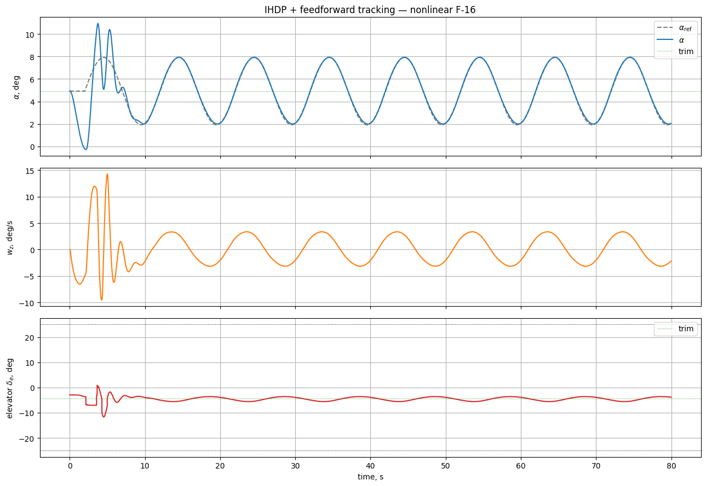

# Рецепт 11 — IHDP на нелинейной F-16

IHDP (Incremental Heuristic Dynamic Programming) — это **нейросетевой актор + онлайн-идентифицированная модель** в библиотеке. Исторически начальная точка, которую расширили остальные адаптивные критики (IM-GDHP, ET-DHP).

**Документация.** [IHDP](../agent/ihdp.md) · **Полный ноутбук.** [`example_ihdp_nonlinear_f16.ipynb`](../example/agent/ihdp/example_ihdp_nonlinear.md) · **Связано.** [Рецепт 06 — Онлайн-адаптивные агенты](06_online_adaptive.md).

## Когда использовать IHDP

| Свойство | IHDP |
|---|---|
| Онлайн-адаптация | ✓ (RLS-модель + градиентный шаг актора каждый тик) |
| Нужна модель? | Warm-start `G_init`, остальное идентифицируется онлайн |
| НС в контуре | Да — MLP-актёр и критик |
| Интерпретируемость | Средняя (критик непрозрачен, RLS-модель инспектируема) |
| Отказоустойчивость | Естественная — RLS переидентифицирует объект при отказах |

Выбирайте IHDP, когда нужен **нейросетевой актор** с онлайн-адаптацией, но не требуется двухголовый критик IM-GDHP или событийная механика ET-DHP.

## Шаг 1 — Минимальная конфигурация

```python
import numpy as np
from tensoraerospace.agent.ihdp import IHDPAgent, IHDPConfig

cfg = IHDPConfig(
    dt=0.01,
    # актор / критик
    actor_hidden=(32, 32),
    critic_hidden=(64, 64),
    actor_lr=1e-3,
    critic_lr=5e-4,
    gamma=0.95,
    # онлайн-модель (RLS)
    rls_forgetting=0.995,
    rls_cov_init=1e2,
    G_init=np.array([[-0.5]]),         # из линеаризации или PE-возбуждения
    # безопасность
    u_magnitude_limit=15.0,
    u_rate_limit=60.0,
    seed=0,
)
```

Как iADP / AA-INDI, IHDP требует разумного `G_init`. См. [Рецепт 06](06_online_adaptive.md) — паттерн warm-start через PE-возбуждение.

## Шаг 2 — Цикл

Идентичен другим онлайн-адаптивным агентам:

```python
agent = IHDPAgent(n_state=1, n_control=1, config=cfg)
env.reset()

for k in range(n_steps):
    obs = env.get_state()
    u = agent.predict(obs[controlled_channels], ref[:, k], k)
    obs, *_ = env.step(u)
    agent.learn(obs[controlled_channels], ref[:, k], k)
```

`predict` прогоняет актёр-НС вперёд; `learn` делает шаг RLS + по одному SGD-шагу на актор и критик.

## Шаг 3 — Ожидаемое поведение на нелинейной F-16

Слежение за плавным расписанием α на `NonlinearLongitudinalF16-v0`:



График взят прямо из полного примера — см. [`example_ihdp_nonlinear_f16.ipynb`](../example/agent/ihdp/example_ihdp_nonlinear.md) для точного построения среды, эталонного сигнала и warm-start PE.

## Шаг 4 — Save / load / публикация в HuggingFace

```python
run_dir = agent.save('./checkpoints')
restored = IHDPAgent.from_pretrained(run_dir)
agent.publish_to_hub('me/my-ihdp', folder_path=run_dir, access_token='hf_…')
```

Контракт одинаков у всех пяти онлайн-адаптивных агентов — см. [Рецепт 08](08_huggingface.md).

## Подводные камни

- **Актор схлопывается к нулю.** Проверьте знак `G_init`. Неверный знак толкает каждый градиентный шаг не в ту сторону.
- **Критик расходится.** Уменьшите `critic_lr` (5e-4 уже консервативно) или поднимите `rls_forgetting` ближе к 1 для менее шумного сигнала модели.
- **Нестабильность на первых тиках.** Увеличьте `policy_eval_warmup_updates` (там, где этот параметр выставляется), чтобы критик видел установившуюся модель до начала тренировки.

## Куда дальше

- **[Рецепт 12 — IM-GDHP](12_imgdhp.md)** — двухголовый критик, на уровень выше по возможностям.
- **[Рецепт 13 — ET-DHP](13_etdhp.md)** — событийный вариант для маломощных платформ.
- **[Документация IHDP](../agent/ihdp.md)** — теория + API.
