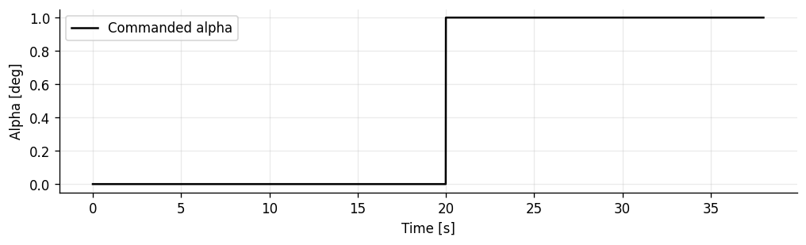
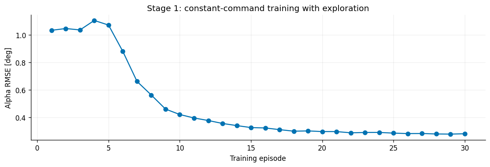
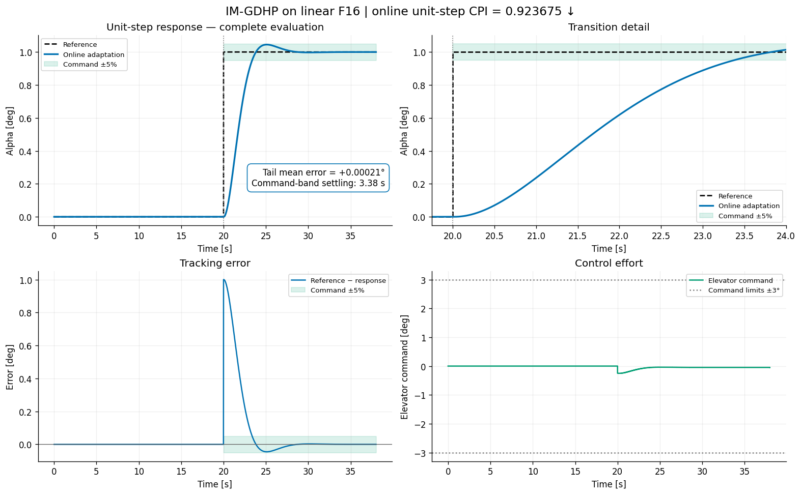
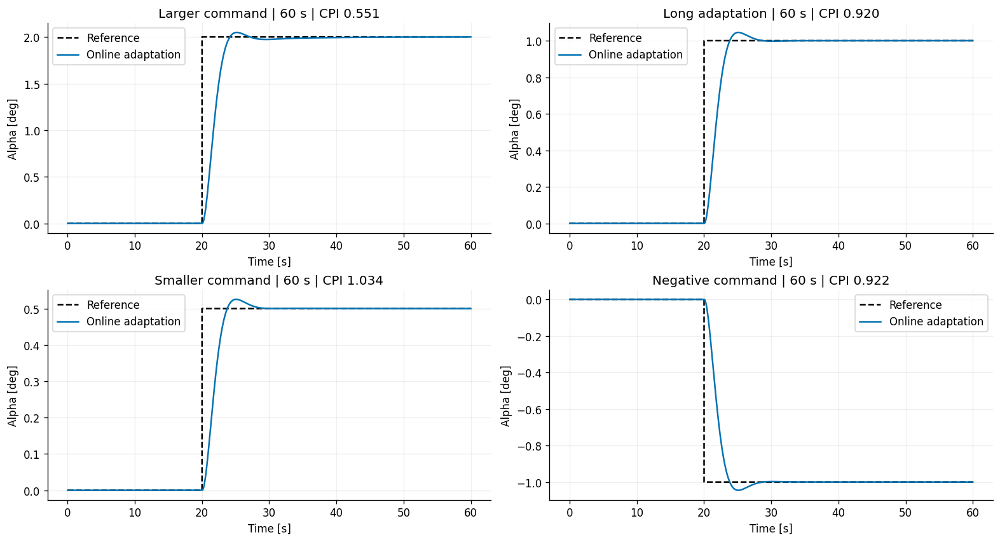
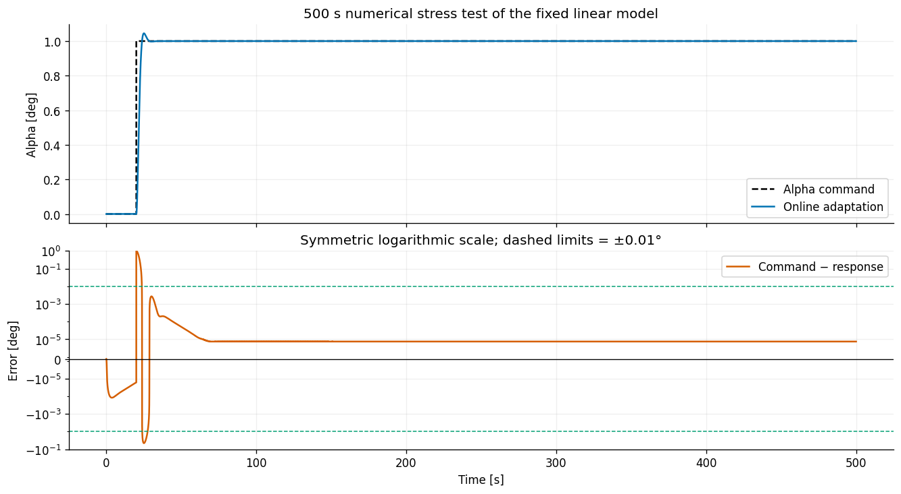
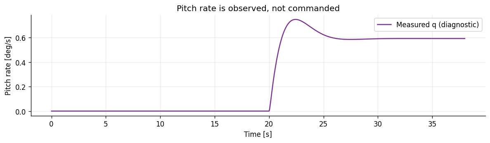
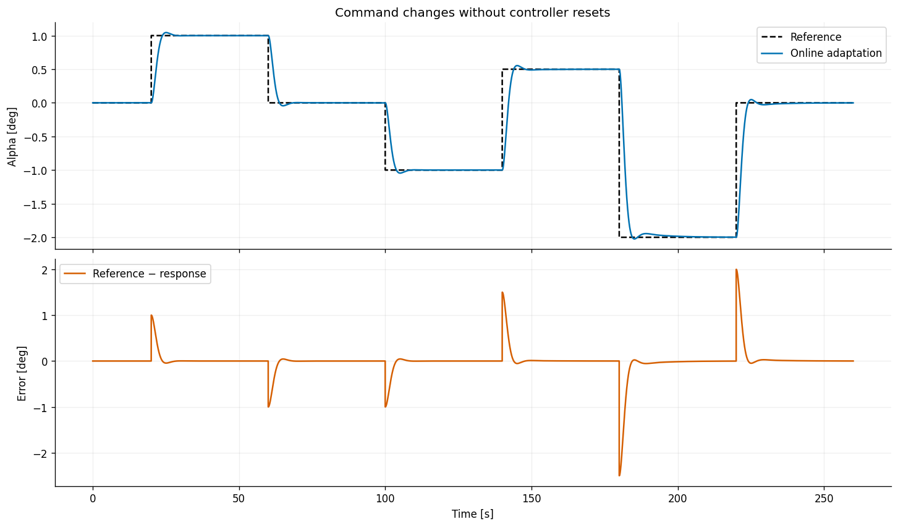
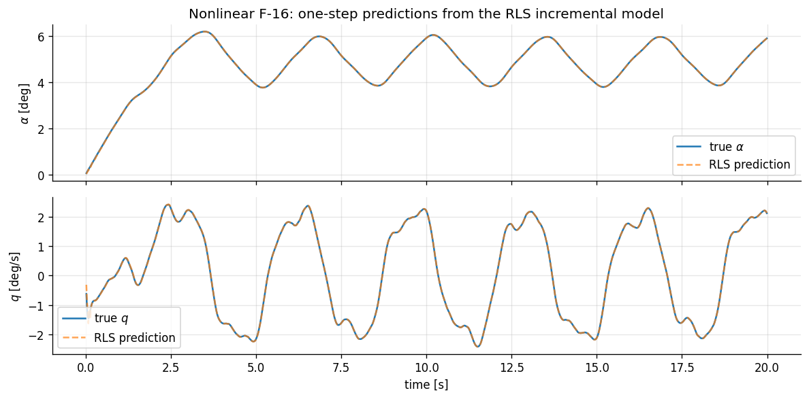

# Рецепт 12 — IM-GDHP: устранение смещения на ступеньке

Полный пример использует **SDK TensorAeroSpace** и **единственное задание по углу атаки α**. Угловая скорость `q` записывается для диагностики: она не входит в политику и не получает отдельного задания. Ступенька **0° → 1° начинается на 20-й секунде**. Основная оценка сохраняет прежний горизонт **38 с**, дополнительные прогоны на 60 с позволяют отличить затухающий переход от постоянного смещения.

Актор и скалярный критик сохраняют функции потерь из [статьи Sun и van Kampen (2021)](https://doi.org/10.1016/j.asoc.2021.107153), формулы (51)–(67). Здесь явно включено **расширение для известного задания**: RLS идентифицирует измеренные выходы самолёта, а из прогноза вычитается известное следующее задание. По умолчанию SDK сохраняет идентификацию динамики ошибки из статьи. В данном примере скачок команды больше не принимается за динамику объекта.

Предыдущая настройка сохраняла команду балансировки, обученную при α=1°, и слишком медленно её изменяла. Здесь второй этап обучения воспроизводимо настраивает масштабы входов актора и шаг обучения, затем включает эпизод с нулевым заданием. **Во всех последующих оценках актор, критик и RLS продолжают адаптацию.** В момент скачка параметры не переключаются; PID или интегральный регулятор не добавляются.

Замкнутый контур использует **линейный продольный F16**. Нелинейный раздел отдельно проверяет идентификацию, а не качество нелинейной политики. При длительном удержании α накапливается тангаж: длинные расчёты являются численными проверками фиксированной линеаризации. Точность этих опытов не доказывает глобальную устойчивость.

**Пересчитанный результат, seed 0:** максимальная ошибка нулевого участка **0.000120°**, ошибка хвоста на 38 с **+0.000212°**, перерегулирование **4.50%**, установление в полосе задания **3.38 с**, **CPI 0.9237**. Все 12 проверок seed/амплитуда прошли условие точности 0.1% за последние пять секунд 60-секундного опыта. В последовательности команд конечные остатки больше: наибольшее среднее по последним пяти секундам около 0.00192°. Это измеренные ошибки конечного горизонта, а не утверждение о математически точном нуле для любого сигнала.

```python
from dataclasses import replace
import copy
import numpy as np
import pandas as pd
from IPython.display import display
import matplotlib.pyplot as plt
import gymnasium as gym
import torch

import tensoraerospace  # registers the Gymnasium environments
from tensoraerospace.agent.im_gdhp import IMGDHPAgent, IMGDHPConfig, IncrementalModelRLS

torch.set_num_threads(1)
np.random.seed(0)
torch.manual_seed(0)
plt.rcParams.update({"figure.dpi": 120, "axes.spines.top": False, "axes.spines.right": False})
from tensoraerospace.benchmark import ControlBenchmark
```

## 1. Единственное задание — угол атаки

Среда возвращает `[alpha, q]` в рад и рад/с, команда руля задана в градусах. `tracking_states=["alpha"]`, `tracking_indices=[0]` и `reference_size=1` задают единственный отслеживаемый канал. Массив задания имеет форму `(1, T)`.

Первый этап обучения использует 12-секундные эпизоды постоянного задания 1°. Оценка проводится отдельно: команда равна нулю до **20 с**, затем становится 1°. Основной опыт длится **38 с**, сохраняя прежние 18 с после скачка. Нулевой участок и неудачные проверки не исключаются из результатов.

```python
DT = 0.01
N = 1200
STEP_TIME = 20.0
STEP_AMPLITUDE_DEG = 1.0
POST_STEP_DURATION = 18.0
EVALUATION_DURATION = STEP_TIME + POST_STEP_DURATION
TIME = np.arange(N) * DT

def step_reference(samples, amplitude_deg=STEP_AMPLITUDE_DEG):
    time = np.arange(samples) * DT
    alpha = np.deg2rad(np.where(time >= STEP_TIME, amplitude_deg, 0.0))
    return alpha[None, :]

REFERENCE = np.full((1, N), np.deg2rad(STEP_AMPLITUDE_DEG))
EVALUATION_REFERENCE = step_reference(round(EVALUATION_DURATION / DT))

def make_env(reference):
    return gym.make(
        "LinearLongitudinalF16-v0",
        initial_state=np.zeros(4),
        reference_signal=reference,
        tracking_states=["alpha"], state_space=["alpha", "q"],
        number_time_steps=reference.shape[1],
    ).unwrapped

plt.figure(figsize=(10, 2.5))
plt.plot(np.arange(EVALUATION_REFERENCE.shape[1]) * DT, np.rad2deg(EVALUATION_REFERENCE[0]), color="black", label="Commanded alpha")
plt.xlabel("Time [s]")
plt.ylabel("Alpha [deg]")
plt.grid(alpha=0.25)
plt.legend()
plt.show()
```



## 2. Конфигурация начального обучения

Сети получают только `alpha - alpha_ref`. `obs_scale` переводит вход в градусы; идентификатор и производная критика остаются в физических координатах. Стоимость — `200 * alpha_error_rad**2`, штраф управления равен нулю. Диагональный приор RLS учитывает разные единицы приращений α и руля.

Следующая конфигурация воспроизводит прежний начальный этап из 30 эпизодов. Это **ещё не финальная конфигурация управления**. Раздел 4 применяет одинаковую процедуру настройки чувствительностей к каждому seed и включает нулевое задание в обучение. Ранний лучший checkpoint не восстанавливается.

`beta_lambda` — отношение веса производной к весу скалярной невязки; параметр статьи `beta=1/(1+beta_lambda)`. Малое значение приближает критерий к пределу HDP из формулы (59). Частота 100 Гц, масштабирование, ограничение градиента, прогрев и протокол настройки отличаются от эксперимента статьи; её графики здесь не воспроизводятся.

```python
scale = 180 / np.pi
actor_bias = 0.46
covariance_diagonal = (1e4 * np.full(4, scale)**2).tolist() + [1e4] * 4
cfg = IMGDHPConfig(
    actor_hidden=(16,), critic_hidden=(16,), actor_bias_input=actor_bias,
    actor_lr=2.0 / actor_bias**2, critic_lr=0.01,
    actor_lr_decay=0.99995, critic_lr_decay=0.9997,
    actor_lr_min=1e-5, critic_lr_min=1e-5,
    track_Q=(200 / scale**2,), control_R=(0.0,), beta_lambda=0.001 / scale**2,
    history_length=4, obs_scale=(scale, scale), gamma=0.9,
    warmup_steps=2000, critic_only_steps=1000, max_grad_norm=5.0,
    cov_init=covariance_diagonal, forgetting=0.999, u_max=3.0, seed=0,
)
agent = IMGDHPAgent(
    n_obs=2, n_action=1, reference_size=1, tracking_indices=[0], config=copy.deepcopy(cfg)
)
```

## 3. Полный цикл взаимодействия с SDK

Онлайн-взаимодействие — `predict → env.step → learn`. Метод `learn` сначала использует прежнюю инкрементальную модель для целей обучения, затем добавляет новое измерение в RLS. `reset` очищает историю эпизода, сохраняя обученные параметры. Функция ниже выполняет опыт и собирает метрики; алгоритм управления и динамика самолёта находятся в библиотеке.

Диагностические остановки контролируют конечность состояния, потерь сетей и предел |α|=25°. Этот предел служит для остановки неудачного численного опыта и не является сертифицированной областью применения линеаризации.

```python
def run_episode(agent, reference, *, learning, noise=0.0):
    env = make_env(reference)
    obs, _ = env.reset()
    agent.reset()
    agent.cfg.exploration_noise_std = noise
    observations, commands = [], []
    try:
        for k in range(reference.shape[1] - 1):
            action = agent.predict(
                np.asarray(obs).ravel(), reference, k, deterministic=noise == 0
            )
            obs, _, terminated, truncated, _ = env.step(action)
            if not np.isfinite(obs).all() or abs(
                float(np.asarray(obs).ravel()[0])
            ) > np.deg2rad(25):
                raise RuntimeError(f"alpha envelope exceeded at step {k}")
            if learning:
                updates = agent.learn(np.asarray(obs).ravel(), reference, k)
                if k > 0 and agent._total_steps > agent.cfg.warmup_steps + agent.cfg.critic_only_steps + 1:
                    if not all(np.isfinite(updates[key]) for key in ("actor_loss", "critic_loss")):
                        raise RuntimeError(f"Nonfinite network loss at step {k}")
            observations.append(np.asarray(obs).ravel().copy())
            commands.append(action.copy())
            if terminated or truncated:
                break
        peak_theta_deg = float(np.max(np.abs(np.rad2deg(
            env.model.store_states[0, :env.model.time_step + 1]
        ))))
    finally:
        env.close()
    y, u = np.asarray(observations), np.asarray(commands)
    err = np.rad2deg(y[:, 0] - reference[0, 1 : len(y) + 1])
    return (
        {
            "rmse_deg": float(np.sqrt(np.mean(err**2))),
            "mae_deg": float(np.mean(np.abs(err))),
            "peak_alpha_deg": float(np.max(np.abs(np.rad2deg(y[:, 0])))),
            "peak_rate_deg_s": float(np.max(np.abs(np.rad2deg(y[:, 1])))),
            "peak_command_deg": float(np.max(np.abs(u))),
            "saturation_fraction": float(np.mean(np.abs(u) >= 0.99 * agent.cfg.u_max)),
            "samples": len(y),
            "peak_theta_deg": peak_theta_deg,
        },
        y,
        u,
    )
```

## 4. Начальное обучение и настройка чувствительности адаптации

Сначала выполняем **30 эпизодов** с исследовательским шумом руля σ=0.1°. Затем задаём локальную чувствительность обратной связи **0.25° руля на 1° ошибки α**. Метод `retune_actor_inputs` изменяет веса входа ошибки и масштабирует постоянный вход актора до 30. Смена постоянного входа сохраняет текущую команду при нулевой ошибке, но меняет чувствительность последующих SGD-обновлений балансировочной команды. Критик и идентификатор сохраняются.

Шаг онлайн-обучения выводится из приближения **существующей формулы (67)** для малой ошибки. Пусть `g0` — идентифицированное мгновенное влияние входа, `lambda0` — производная критика при нуле, а `a = du/dw`. Тогда чувствительность изменения команды за секунду приближённо равна

$$
k_{adapt} = \frac{\eta_a\,\lambda_0^2 |g_0|\,\|a\|^2}{(180/\pi)\,dt}.
$$

Выбираем **0.03°/(°·с)**. Это правило подбора гиперпараметра исходной функции потерь актора, а не добавочный сигнал обратной связи. Оно учитывает, что одинаковые численные шаги SGD дают разную скорость адаптации у сетей с разными обученными градиентами. Процедура использует текущие производные сетей и модели; времена и амплитуды проверочных ступенек в неё не входят.

Затем выполняем **60 с дополнительного обучения на нулевом задании**, чтобы убрать команду, унаследованную от обучения на α=1°. Это явно описанный учебный эпизод, а не скрытый участок, отрезанный от графика оценки. После него независимые опыты сбрасывают состояние самолёта и историю, сохраняя обученные параметры. Шаг актора при оценке остаётся положительным и постоянным; критик продолжает работать на положительной нижней границе своего шага.

Режим статьи с неизвестной динамикой задания остаётся доступен. Для известных команд агент переключается в `identifier_mode="output"` после очистки истории. Параметры идентификатора, обученного на постоянном задании, можно использовать: при постоянном задании приращения выхода и ошибки совпадают.

```python
benchmark = ControlBenchmark()

def step_metrics(reference, observation):
    metrics = benchmark.benchmarking_step_response(
        control_signal=reference[0, 1:len(observation) + 1],
        system_signal=observation[:, 0], signal_val=0.0, dt=DT,
    )
    tail = max(1, int(0.1 * len(observation)))
    error = reference[0, 1:len(observation) + 1] - observation[:, 0].astype(float)
    metrics["tail_static_error"] = float(np.mean(error[-tail:]))
    metrics["tail_peak_to_peak"] = float(np.ptp(observation[-tail:, 0].astype(float)))
    return metrics

NUM_EPISODES = 30
training_rmse = []
for ep in range(NUM_EPISODES):
    train_metrics, _, _ = run_episode(agent, REFERENCE, learning=True, noise=0.1)
    training_rmse.append(train_metrics["rmse_deg"])
    if (ep + 1) % 10 == 0:
        print(f"Warm-start episode {ep + 1}: RMSE={training_rmse[-1]:.5f} deg")

fig, ax = plt.subplots(figsize=(10, 3.5))
ax.plot(np.arange(1, NUM_EPISODES + 1), training_rmse, "o-", color="#0072B2")
ax.set(xlabel="Training episode", ylabel="Alpha RMSE [deg]",
       title="Stage 1: constant-command training with exploration")
ax.grid(alpha=0.2)
plt.tight_layout()
plt.show()

FEEDBACK_SENSITIVITY = 0.25
ADAPTATION_SENSITIVITY = 0.03
ONLINE_BIAS_INPUT = 30.0
ZERO_TRAINING_DURATION = 60.0

def prepare_online_learning(trial):
    """Configure a trained SDK agent, then complete its zero-reference training."""
    trial.reset()
    trial.cfg.identifier_mode = "output"
    zero_error = torch.zeros(1, device=trial.device)
    feedback_slope = float(torch.autograd.functional.jacobian(
        trial.actor, zero_error).item()) / scale
    if feedback_slope <= 0:
        raise ValueError("Warm start has the wrong local feedback sign for this F16")
    feedback_gain = FEEDBACK_SENSITIVITY / feedback_slope
    trial.retune_actor_inputs(feedback_gain=feedback_gain, bias_input=ONLINE_BIAS_INPUT)
    action = trial.actor(zero_error)
    gradients = torch.autograd.grad(action.sum(), tuple(trial.actor.parameters()))
    action_gradient_squared = sum(float(gradient.square().sum()) for gradient in gradients)
    lambda_zero = float(trial.critic(zero_error)[1].item())
    input_gain = float(trial.incremental_model.B[0, 0])
    if input_gain >= 0 or abs(lambda_zero) < 1e-8 or action_gradient_squared <= 0:
        raise ValueError("Warm start has insufficient or inconsistent local sensitivities")
    actor_rate = (ADAPTATION_SENSITIVITY * DT * scale
                  / (lambda_zero**2 * abs(input_gain) * action_gradient_squared))
    if not np.isfinite(actor_rate) or actor_rate < trial.cfg.actor_lr_min:
        raise ValueError("Derived actor rate is outside the configured learning range")
    trial.cfg.actor_lr = actor_rate
    trial.cfg.actor_lr_decay = 1.0
    for group in trial.actor_opt.param_groups:
        group["lr"] = actor_rate
    zero_reference = np.zeros((1, round(ZERO_TRAINING_DURATION / DT)))
    zero_metrics, _, _ = run_episode(trial, zero_reference, learning=True)
    return {"Feedback gain multiplier": feedback_gain, "Actor bias input": ONLINE_BIAS_INPUT,
            "Online actor learning rate": actor_rate, "Identified input gain": input_gain,
            "Critic derivative at zero": lambda_zero,
            "Zero-training RMSE [deg]": zero_metrics["rmse_deg"]}

online_tuning = prepare_online_learning(agent)
display(pd.Series(online_tuning, name="Stage 2 configuration").to_frame())
print("Final actor learning rate:", agent.actor_opt.param_groups[0]["lr"])
print("Final critic learning rate:", agent.critic_opt.param_groups[0]["lr"])
```

```text
Warm-start episode 10: RMSE=0.41933 deg
```

```text
Warm-start episode 20: RMSE=0.29476 deg
```

```text
Warm-start episode 30: RMSE=0.27876 deg
```



<div>
<style scoped>
    .dataframe tbody tr th:only-of-type {
        vertical-align: middle;
    }

    .dataframe tbody tr th {
        vertical-align: top;
    }

    .dataframe thead th {
        text-align: right;
    }
</style>
<table border="1" class="dataframe">
  <thead>
    <tr style="text-align: right;">
      <th></th>
      <th>Stage 2 configuration</th>
    </tr>
  </thead>
  <tbody>
    <tr>
      <th>Feedback gain multiplier</th>
      <td>0.635616</td>
    </tr>
    <tr>
      <th>Actor bias input</th>
      <td>30.000000</td>
    </tr>
    <tr>
      <th>Online actor learning rate</th>
      <td>0.019916</td>
    </tr>
    <tr>
      <th>Identified input gain</th>
      <td>-0.000001</td>
    </tr>
    <tr>
      <th>Critic derivative at zero</th>
      <td>-24.125891</td>
    </tr>
    <tr>
      <th>Zero-training RMSE [deg]</th>
      <td>0.045141</td>
    </tr>
  </tbody>
</table>
</div>

```text
Final actor learning rate: 0.019916313603912175
Final critic learning rate: 1e-05
```

## 5. Оценка ступеньки через ControlBenchmark

Основной опыт: **1° на 20-й секунде**, полная длительность **38 с**, **онлайн-обучение включено всё время**. Библиотечный `ControlBenchmark.benchmarking_step_response` оценивает участок после скачка в радианах при dt=0.01 с. **Меньший CPI лучше при одинаковом протоколе.**

Каждый независимый прогон начинается с копии полностью обученного агента вместе с состоянием оптимизаторов и идентификатора. Основной экземпляр сохраняется. В проверке последовательности команд ниже одна копия непрерывно адаптируется между всеми переключениями без сбросов.

### 5.1. Основной опыт

```python
online_metrics, y, u = run_episode(
    copy.deepcopy(agent), EVALUATION_REFERENCE, learning=True
)
online_step = step_metrics(EVALUATION_REFERENCE, y)
print(f"Step: 0 → {STEP_AMPLITUDE_DEG:g} deg at t={STEP_TIME:g} s")
print(f"Experiment: {EVALUATION_DURATION:g} s; dt={DT:g} s; adaptation ON")
print(f"Composite performance index: {online_step['performance_index']:.6f} (lower is better)")
```

```text
Step: 0 → 1 deg at t=20 s
Experiment: 38 s; dt=0.01 s; adaptation ON
Composite performance index: 0.923675 (lower is better)
```

### 5.2. Метрики перехода и суммарная ошибка

Установление относительно команды означает, что выход остаётся в полосе **±5% от заданного приращения**, а не вокруг неверного конечного уровня. Перерегулирование также считаем относительно команды. Штатные метрики относительно конечного выхода приведены отдельно для сравнения соглашений.

Интегралы IAE, ISE и ITAE показывают накопленную ошибку на всём выделенном переходе. Критерий остаточной точности использует последние 10% отсчётов. Инженерные условия примера — остаточная ошибка ≤1%, перерегулирование ≤10%, установление в ±5% за ≤8 с и конечность сигналов. Это выбранные цели опыта, а не требования из статьи.

Начальный участок с нулевым заданием проверяется отдельно. Прохождение условий после ступеньки не означает качественного слежения за полным сигналом.

```python
metric_rows = [
    ("Composite performance index ↓", "library score", "performance_index", 1.0),
    ("Overshoot relative to command", "%", "command_overshoot", 1.0),
    ("Settling within command ±5%", "s after step", "command_settling_time", 1.0),
    ("Final 10% mean error (command − response)", "deg", "tail_static_error", 180 / np.pi),
    ("Static error (benchmark convention)", "deg", "static_error", 180 / np.pi),
    ("Final 10% peak-to-peak response", "deg", "tail_peak_to_peak", 180 / np.pi),
    ("Maximum absolute tracking error", "deg", "maximum_deviation", 180 / np.pi),
    ("Rise time (10–90% of final response)", "s", "rise_time", 1.0),
    ("Settling near final response ±5%", "s after step", "settling_time", 1.0),
    ("Overshoot relative to final response", "%", "overshoot", 1.0),
    ("First peak time", "s after step", "peak_time", 1.0),
    ("Total absolute error — IAE", "rad·s", "iae", 1.0),
    ("Integral squared error — ISE", "rad²·s", "ise", 1.0),
    ("Time-weighted absolute error — ITAE", "rad·s²", "itae", 1.0),
    ("Oscillation count", "count", "oscillation_count", 1.0),
]
step_metrics_table = pd.DataFrame(
    {"Metric": [row[0] for row in metric_rows], "Unit": [row[1] for row in metric_rows]}
)
for label, metrics in (("Online adaptation", online_step),):
    step_metrics_table[label] = [
        "Not reached" if metrics[key] is None else f"{metrics[key] * factor:.6g}"
        for _, _, key, factor in metric_rows
    ]
display(step_metrics_table.set_index("Metric"))

static_deg = np.rad2deg(online_step["tail_static_error"])
print(f"Static error: {static_deg:+.4f} deg ({100 * static_deg / STEP_AMPLITUDE_DEG:+.2f}% of the command)")
print(f"Total absolute error (IAE): {online_step['iae']:.6f} rad·s")
if online_step["command_settling_time"] is None:
    print("The response does NOT settle within the command ±5% band during this experiment.")
else:
    print(f"Command-band settling time: {online_step['command_settling_time']:.3f} s after the step")


# Explicit engineering targets for this example, separate from the CPI ranking.
MAX_STATIC_ERROR_FRACTION = 0.01
MAX_COMMAND_OVERSHOOT_PERCENT = 10.0
MAX_COMMAND_SETTLING_SECONDS = 8.0
settling = online_step["command_settling_time"]
quality_checks = [
    ("Static error ≤1% of commanded step",
     abs(static_deg) <= MAX_STATIC_ERROR_FRACTION * abs(STEP_AMPLITUDE_DEG)),
    ("Command overshoot ≤10%",
     online_step["command_overshoot"] <= MAX_COMMAND_OVERSHOOT_PERCENT),
    ("Remain in command ±5% band within 8 s",
     settling is not None and settling <= MAX_COMMAND_SETTLING_SECONDS),
    ("Finite response and command", np.isfinite(y).all() and np.isfinite(u).all()),
]
quality_accepted = all(passed for _, passed in quality_checks)
display(pd.DataFrame([
    {"Acceptance condition": name, "Result": "PASS" if passed else "FAIL"}
    for name, passed in quality_checks
]).set_index("Acceptance condition"))
print("PRIMARY POST-STEP CONDITIONS:", "PASS" if quality_accepted else "FAIL")
prestep_mask = EVALUATION_REFERENCE[0, 1:len(y) + 1] == 0.0
prestep_error_deg = float(np.max(np.abs(np.rad2deg(y[prestep_mask, 0]))))
print(f"Maximum error during the zero-command hold: {prestep_error_deg:.5f} deg")
print("ZERO-HOLD ACCURACY (0.01 deg):", "PASS" if prestep_error_deg <= 0.01 else "FAIL")
print("Overall reliability also requires the amplitude and initialization checks below.")
```

<div>
<style scoped>
    .dataframe tbody tr th:only-of-type {
        vertical-align: middle;
    }

    .dataframe tbody tr th {
        vertical-align: top;
    }

    .dataframe thead th {
        text-align: right;
    }
</style>
<table border="1" class="dataframe">
  <thead>
    <tr style="text-align: right;">
      <th></th>
      <th>Unit</th>
      <th>Online adaptation</th>
    </tr>
    <tr>
      <th>Metric</th>
      <th></th>
      <th></th>
    </tr>
  </thead>
  <tbody>
    <tr>
      <th>Composite performance index ↓</th>
      <td>library score</td>
      <td>0.923675</td>
    </tr>
    <tr>
      <th>Overshoot relative to command</th>
      <td>%</td>
      <td>4.50205</td>
    </tr>
    <tr>
      <th>Settling within command ±5%</th>
      <td>s after step</td>
      <td>3.38</td>
    </tr>
    <tr>
      <th>Final 10% mean error (command − response)</th>
      <td>deg</td>
      <td>0.000211881</td>
    </tr>
    <tr>
      <th>Static error (benchmark convention)</th>
      <td>deg</td>
      <td>0.000202087</td>
    </tr>
    <tr>
      <th>Final 10% peak-to-peak response</th>
      <td>deg</td>
      <td>0.000107469</td>
    </tr>
    <tr>
      <th>Maximum absolute tracking error</th>
      <td>deg</td>
      <td>0.999984</td>
    </tr>
    <tr>
      <th>Rise time (10–90% of final response)</th>
      <td>s</td>
      <td>2.46</td>
    </tr>
    <tr>
      <th>Settling near final response ±5%</th>
      <td>s after step</td>
      <td>3.38</td>
    </tr>
    <tr>
      <th>Overshoot relative to final response</th>
      <td>%</td>
      <td>4.52308</td>
    </tr>
    <tr>
      <th>First peak time</th>
      <td>s after step</td>
      <td>5.1</td>
    </tr>
    <tr>
      <th>Total absolute error — IAE</th>
      <td>rad·s</td>
      <td>0.0329431</td>
    </tr>
    <tr>
      <th>Integral squared error — ISE</th>
      <td>rad²·s</td>
      <td>0.000380705</td>
    </tr>
    <tr>
      <th>Time-weighted absolute error — ITAE</th>
      <td>rad·s²</td>
      <td>0.0472654</td>
    </tr>
    <tr>
      <th>Oscillation count</th>
      <td>count</td>
      <td>1</td>
    </tr>
  </tbody>
</table>
</div>

```text
Static error: +0.0002 deg (+0.02% of the command)
Total absolute error (IAE): 0.032943 rad·s
Command-band settling time: 3.380 s after the step
```

<div>
<style scoped>
    .dataframe tbody tr th:only-of-type {
        vertical-align: middle;
    }

    .dataframe tbody tr th {
        vertical-align: top;
    }

    .dataframe thead th {
        text-align: right;
    }
</style>
<table border="1" class="dataframe">
  <thead>
    <tr style="text-align: right;">
      <th></th>
      <th>Result</th>
    </tr>
    <tr>
      <th>Acceptance condition</th>
      <th></th>
    </tr>
  </thead>
  <tbody>
    <tr>
      <th>Static error ≤1% of commanded step</th>
      <td>PASS</td>
    </tr>
    <tr>
      <th>Command overshoot ≤10%</th>
      <td>PASS</td>
    </tr>
    <tr>
      <th>Remain in command ±5% band within 8 s</th>
      <td>PASS</td>
    </tr>
    <tr>
      <th>Finite response and command</th>
      <td>PASS</td>
    </tr>
  </tbody>
</table>
</div>

```text
PRIMARY POST-STEP CONDITIONS: PASS
Maximum error during the zero-command hold: 0.00012 deg
ZERO-HOLD ACCURACY (0.01 deg): PASS
Overall reliability also requires the amplitude and initialization checks below.
```

### 5.3. Задание, выход, переходный процесс и команда руля

Зелёная полоса показана вокруг команды. На графиках остаются видимыми задание α, отклик, ошибка `задание − выход` и команда руля. Наблюдение после шага имеет время `(k+1)*dt`, а соответствующая команда — `k*dt`. Такое выравнивание не сдвигает выход на один отсчёт относительно задания.

```python
t_plot = np.arange(1, len(y) + 1) * DT
command_time = np.arange(len(u)) * DT
commanded_alpha = np.rad2deg(EVALUATION_REFERENCE[0, 1:len(y) + 1])
measured_alpha = np.rad2deg(y[:, 0])
tracking_error_deg = commanded_alpha - measured_alpha
band_deg = 0.05 * abs(STEP_AMPLITUDE_DEG)
post_step = t_plot >= STEP_TIME

fig, axes = plt.subplots(2, 2, figsize=(13, 8), constrained_layout=True)
for ax in axes[0]:
    ax.step(t_plot, commanded_alpha, where="post", color="black", ls="--", lw=1.6, label="Reference")
    ax.plot(t_plot, measured_alpha, color="#0072B2", lw=2, label="Online adaptation")
    ax.fill_between(t_plot, commanded_alpha - band_deg, commanded_alpha + band_deg,
                    where=post_step, color="#009E73", alpha=0.14, label="Command ±5%")
    ax.axvline(STEP_TIME, color="0.5", ls=":", lw=1)
    ax.set(xlabel="Time [s]", ylabel="Alpha [deg]")
axes[0, 0].set_title("Unit-step response — complete evaluation")
axes[0, 1].set(title="Transition detail", xlim=(max(0, STEP_TIME - 0.25), STEP_TIME + 4.0))
axes[0, 0].annotate(
    f"Tail mean error = {static_deg:+.5f}°\nCommand-band settling: "
    + ("not reached" if online_step["command_settling_time"] is None
       else f"{online_step['command_settling_time']:.2f} s"),
    xy=(0.98, 0.25), xycoords="axes fraction", ha="right", va="center",
    bbox=dict(boxstyle="round,pad=0.5", facecolor="white", edgecolor="#0072B2", alpha=0.95),
)
axes[1, 0].plot(t_plot, tracking_error_deg, color="#0072B2", label="Reference − response")
axes[1, 0].fill_between(t_plot, -band_deg, band_deg, where=post_step,
                        color="#009E73", alpha=0.14, label="Command ±5%")
axes[1, 0].axhline(0, color="0.4", lw=0.8)
axes[1, 0].set(title="Tracking error", xlabel="Time [s]", ylabel="Error [deg]")
axes[1, 1].step(command_time, u[:, 0], where="post", color="#009E73", label="Elevator command")
axes[1, 1].axhline(cfg.u_max, color="0.5", ls=":", label=f"Command limits ±{cfg.u_max:g}°")
axes[1, 1].axhline(-cfg.u_max, color="0.5", ls=":")
axes[1, 1].set(title="Control effort", xlabel="Time [s]", ylabel="Elevator command [deg]")
for ax in axes.ravel():
    ax.grid(alpha=0.2)
    ax.legend(fontsize=8, loc="best")
fig.suptitle(
    f"IM-GDHP on linear F16 | online unit-step CPI = {online_step['performance_index']:.6f} ↓",
    fontsize=14,
)
plt.show()
```



### 5.4. Другие амплитуды и точность установившегося участка

Проверяем **0.5°, 2° и −1°**, а также более длинную единичную ступеньку. Команда всегда подаётся на **20-й секунде**, полная длительность — **60 с**. Таблица сохраняет и результаты прежнего 38-секундного префикса: увеличение горизонта не скрывает раннюю ошибку.

Для каждой амплитуды выводятся средняя ошибка и размах последних 10% отсчётов. Максимальная абсолютная ошибка последних пяти секунд проверяет, не маскирует ли малое среднее колебания. Более строгое условие поздней точности — **0.1% амплитуды команды**, в дополнение к исходному условию 1% короткого опыта. CPI разных горизонтов и амплитуд напрямую не ранжируются.

```python
step_cases = [("Primary", STEP_AMPLITUDE_DEG, EVALUATION_DURATION, online_step)]
additional_step_responses = []
late_accuracy_rows = []
for name, amplitude_deg, duration in (("Larger command", 2.0, 60.0),
                                      ("Long adaptation", 1.0, 60.0),
                                      ("Smaller command", 0.5, 60.0),
                                      ("Negative command", -1.0, 60.0)):
    reference = step_reference(round(duration / DT), amplitude_deg)
    _, response, _ = run_episode(copy.deepcopy(agent), reference, learning=True)
    metrics = step_metrics(reference, response)
    step_cases.append((name, amplitude_deg, duration, metrics))
    prefix_samples = round(EVALUATION_DURATION / DT)
    prefix = step_metrics(reference[:, :prefix_samples], response[:prefix_samples - 1])
    late_error = np.rad2deg(reference[0, -500:] - response[-500:, 0].astype(float))
    late_max = float(np.max(np.abs(late_error)))
    late_accuracy_rows.append({
        "Experiment": name, "Step [deg]": amplitude_deg,
        "38 s tail error [deg]": np.rad2deg(prefix["tail_static_error"]),
        "60 s tail error [deg]": np.rad2deg(metrics["tail_static_error"]),
        "60 s tail peak-to-peak [deg]": np.rad2deg(metrics["tail_peak_to_peak"]),
        "Final 5 s max error [deg]": late_max,
        "Late accuracy ≤0.1%": "PASS" if late_max <= 0.001 * abs(amplitude_deg) else "FAIL",
    })
    additional_step_responses.append((name, duration, reference, response, metrics))

additional_step_table = pd.DataFrame([
    {
        "Experiment": name,
        "Step [deg]": amplitude,
        "Duration [s]": duration,
        "CPI ↓": metrics["performance_index"],
        "Command overshoot [%]": metrics["command_overshoot"],
        "Command settling [s]": ("Not reached" if metrics["command_settling_time"] is None
                                 else f"{metrics['command_settling_time']:.3f}"),
        "Static error [deg]": np.rad2deg(metrics["tail_static_error"]),
        "IAE [rad·s]": metrics["iae"],
    }
    for name, amplitude, duration, metrics in step_cases
]).set_index("Experiment")
display(additional_step_table.round(6))
display(pd.DataFrame(late_accuracy_rows).set_index("Experiment").round(7))

fig, axes = plt.subplots(2, 2, figsize=(13, 7), constrained_layout=True)
axes = axes.ravel()
for ax, (name, duration, reference, response, metrics) in zip(axes, additional_step_responses):
    time = np.arange(1, len(response) + 1) * DT
    ax.step(time, np.rad2deg(reference[0, 1:len(response) + 1]), where="post",
            color="black", ls="--", label="Reference")
    ax.plot(time, np.rad2deg(response[:, 0]), color="#0072B2", label="Online adaptation")
    ax.set(title=f"{name} | {duration:g} s | CPI {metrics['performance_index']:.3f}",
           xlabel="Time [s]", ylabel="Alpha [deg]")
    ax.grid(alpha=0.2)
    ax.legend()
plt.show()
```

<div>
<style scoped>
    .dataframe tbody tr th:only-of-type {
        vertical-align: middle;
    }

    .dataframe tbody tr th {
        vertical-align: top;
    }

    .dataframe thead th {
        text-align: right;
    }
</style>
<table border="1" class="dataframe">
  <thead>
    <tr style="text-align: right;">
      <th></th>
      <th>Step [deg]</th>
      <th>Duration [s]</th>
      <th>CPI ↓</th>
      <th>Command overshoot [%]</th>
      <th>Command settling [s]</th>
      <th>Static error [deg]</th>
      <th>IAE [rad·s]</th>
    </tr>
    <tr>
      <th>Experiment</th>
      <th></th>
      <th></th>
      <th></th>
      <th></th>
      <th></th>
      <th></th>
      <th></th>
    </tr>
  </thead>
  <tbody>
    <tr>
      <th>Primary</th>
      <td>1.0</td>
      <td>38.0</td>
      <td>0.923675</td>
      <td>4.502054</td>
      <td>3.380</td>
      <td>0.000212</td>
      <td>0.032943</td>
    </tr>
    <tr>
      <th>Larger command</th>
      <td>2.0</td>
      <td>60.0</td>
      <td>0.550822</td>
      <td>2.419444</td>
      <td>3.550</td>
      <td>0.000872</td>
      <td>0.069075</td>
    </tr>
    <tr>
      <th>Long adaptation</th>
      <td>1.0</td>
      <td>60.0</td>
      <td>0.920155</td>
      <td>4.502054</td>
      <td>3.380</td>
      <td>0.000022</td>
      <td>0.032972</td>
    </tr>
    <tr>
      <th>Smaller command</th>
      <td>0.5</td>
      <td>60.0</td>
      <td>1.033652</td>
      <td>5.123751</td>
      <td>5.360</td>
      <td>-0.000050</td>
      <td>0.016666</td>
    </tr>
    <tr>
      <th>Negative command</th>
      <td>-1.0</td>
      <td>60.0</td>
      <td>0.922258</td>
      <td>4.512865</td>
      <td>3.380</td>
      <td>-0.000020</td>
      <td>0.032971</td>
    </tr>
  </tbody>
</table>
</div>

<div>
<style scoped>
    .dataframe tbody tr th:only-of-type {
        vertical-align: middle;
    }

    .dataframe tbody tr th {
        vertical-align: top;
    }

    .dataframe thead th {
        text-align: right;
    }
</style>
<table border="1" class="dataframe">
  <thead>
    <tr style="text-align: right;">
      <th></th>
      <th>Step [deg]</th>
      <th>38 s tail error [deg]</th>
      <th>60 s tail error [deg]</th>
      <th>60 s tail peak-to-peak [deg]</th>
      <th>Final 5 s max error [deg]</th>
      <th>Late accuracy ≤0.1%</th>
    </tr>
    <tr>
      <th>Experiment</th>
      <th></th>
      <th></th>
      <th></th>
      <th></th>
      <th></th>
      <th></th>
    </tr>
  </thead>
  <tbody>
    <tr>
      <th>Larger command</th>
      <td>2.0</td>
      <td>0.010638</td>
      <td>0.000872</td>
      <td>0.000630</td>
      <td>0.001086</td>
      <td>PASS</td>
    </tr>
    <tr>
      <th>Long adaptation</th>
      <td>1.0</td>
      <td>0.000212</td>
      <td>0.000022</td>
      <td>0.000017</td>
      <td>0.000028</td>
      <td>PASS</td>
    </tr>
    <tr>
      <th>Smaller command</th>
      <td>0.5</td>
      <td>-0.000650</td>
      <td>-0.000050</td>
      <td>0.000036</td>
      <td>0.000062</td>
      <td>PASS</td>
    </tr>
    <tr>
      <th>Negative command</th>
      <td>-1.0</td>
      <td>-0.000186</td>
      <td>-0.000020</td>
      <td>0.000012</td>
      <td>0.000024</td>
      <td>PASS</td>
    </tr>
  </tbody>
</table>
</div>



### 5.4.1. 500 секунд с продолжающейся адаптацией

Ступенька по-прежнему начинается на 20-й секунде. Актор, критик и идентификатор обновляются на всём 500-секундном прогоне; положительные шаги обучения выведены ниже. Проверяйте всю траекторию ошибки и установление в полосе задания ±1%: одного малого конечного среднего недостаточно для вывода о сходимости.

Это **численная проверка фиксированной линейной модели**, а не подтверждение длительного нелинейного полёта. Ненулевой α в сокращённой модели вызывает ненулевую q и накопление тангажа далеко за областью интерпретации малых возмущений. CPI здесь имеет другой горизонт, чем в основном опыте.

```python
long_reference = step_reference(round(500.0 / DT))
long_agent = copy.deepcopy(agent)
long_metrics, long_y, long_u = run_episode(long_agent, long_reference, learning=True)
long_step = step_metrics(long_reference, long_y)
long_one_percent = benchmark.benchmarking_step_response(
    long_reference[0, 1:], long_y[:, 0], 0.0, DT, tolerance=0.01
)
print(f"500 s final-10% mean error: {np.rad2deg(long_step['tail_static_error']):+.8f} deg")
print(f"500 s final-10% peak-to-peak response: {np.rad2deg(long_step['tail_peak_to_peak']):.8f} deg")
print(f"500 s CPI (separate horizon): {long_step['performance_index']:.6f}")
print("Settling within command ±1% over the whole 500 s:", long_one_percent["command_settling_time"], "s after step")
print("Final learning rates:", long_agent.actor_opt.param_groups[0]["lr"],
      long_agent.critic_opt.param_groups[0]["lr"])
print(f"Accumulated maximum |pitch angle|: {long_metrics['peak_theta_deg']:.1f} deg — outside a small-perturbation flight interpretation")

long_time = np.arange(1, len(long_y) + 1) * DT
long_error = np.rad2deg(long_reference[0, 1:] - long_y[:, 0].astype(float))
fig, axes = plt.subplots(2, 1, figsize=(11, 6), sharex=True, constrained_layout=True)
axes[0].step(long_time, np.rad2deg(long_reference[0, 1:]), where="post", color="black", ls="--", label="Alpha command")
axes[0].plot(long_time, np.rad2deg(long_y[:, 0]), color="#0072B2", label="Online adaptation")
axes[0].set(ylabel="Alpha [deg]", title="500 s numerical stress test of the fixed linear model")
axes[0].legend()
axes[1].plot(long_time, long_error, color="#D55E00", label="Command − response")
axes[1].axhline(0, color="black", lw=0.8)
for level in (-0.01, 0.01):
    axes[1].axhline(level, color="#009E73", ls="--", lw=0.9)
axes[1].set_yscale("symlog", linthresh=1e-5)
axes[1].set_yticks([-0.1, -0.001, -1e-5, 0, 1e-5, 0.001, 0.1, 1.0])
axes[1].set(xlabel="Time [s]", ylabel="Error [deg]", title="Symmetric logarithmic scale; dashed limits = ±0.01°")
axes[1].legend()
for ax in axes:
    ax.grid(alpha=0.2)
plt.show()
```

```text
500 s final-10% mean error: +0.00000887 deg
500 s final-10% peak-to-peak response: 0.00000000 deg
500 s CPI (separate horizon): 0.927028
Settling within command ±1% over the whole 500 s: 7.54 s after step
Final learning rates: 0.019916313603912175 1e-05
Accumulated maximum |pitch angle|: 284.2 deg — outside a small-perturbation flight interpretation
```



### 5.5. Дополнительная диагностика на синусе

Задание по-прежнему содержит только α. Синус амплитудой 2° и периодом 4 с предъявляет более высокие требования к слежению, чем ступеньки. **Текущая настройка для ступенек отслеживает этот быстрый синус неточно:** в исполненном 12-секундном опыте RMSE составляет около **1.685°**. Это ограничение сохранено; заданный сигнал не заменяется более простым.

RMSE синусоидального слежения не заменяет CPI переходного процесса. Проверки независимых инициализаций ниже повторяют обновлённое двухэтапное обучение; их текущие результаты заменяют выводы о провалах прежних конфигураций.

```python
t_diagnostic = np.arange(1200) * DT
sine_reference = np.deg2rad(2 * np.sin(2 * np.pi * t_diagnostic / 4))[None, :]
try:
    sine_metrics, _, _ = run_episode(copy.deepcopy(agent), sine_reference, learning=True)
    print("Sinusoidal tracking diagnostic:", sine_metrics)
except (RuntimeError, ValueError, FloatingPointError) as exc:
    print("Sinusoidal tracking FAILED:", exc)
```

```text
Sinusoidal tracking diagnostic: {'rmse_deg': 1.684739366698682, 'mae_deg': 1.5034454190848783, 'peak_alpha_deg': 0.9151015281677246, 'peak_rate_deg_s': 1.0946741104125977, 'peak_command_deg': 0.637323260307312, 'saturation_fraction': 0.0, 'samples': 1199, 'peak_theta_deg': 1.609705637521572}
```

### 5.6. Угловая скорость без задания и ограничения линейной модели

В этом опыте **нет `q_ref`**. На графике показана фактическая угловая скорость без целевой кривой. Контур α не регулирует тангаж, высоту и скорость. Длительная ненулевая q накапливает изменение тангажа, поэтому длинный расчёт фиксированной линеаризации не подтверждает физическую достоверность такого манёвра. Нелинейная идентификация в следующем разделе не устраняет это ограничение управления.

```python
fig, ax = plt.subplots(figsize=(10, 3))
ax.plot(np.arange(1, len(y) + 1) * DT, np.rad2deg(y[:, 1]), color="#7B3294", label="Measured q (diagnostic)")
ax.set(xlabel="Time [s]", ylabel="Pitch rate [deg/s]", title="Pitch rate is observed, not commanded")
ax.grid(alpha=0.25)
ax.legend()
plt.tight_layout()
plt.show()
print(f"Primary maximum |pitch angle| in the linear model: {online_metrics['peak_theta_deg']:.3f} deg")
print(f"Primary peak elevator command: {online_metrics['peak_command_deg']:.3f} deg")
print(f"Primary command saturation fraction: {online_metrics['saturation_fraction']:.6f}")
```



```text
Primary maximum |pitch angle| in the linear model: 10.733 deg
Primary peak elevator command: 0.252 deg
Primary command saturation fraction: 0.000000
```

### 5.7. Независимые инициализации обучения

Повторяем оба этапа с нуля для seed 1 и 2. После начального обучения применяем **одинаковые** целевые чувствительности обратной связи и адаптации, затем обучаем на нулевом задании. Численные шаги актора могут отличаться из-за разных обученных градиентов: один и тот же шаг SGD ранее не обеспечивал перенос качества между инициализациями.

Каждый seed проверяется на **0.5°, ±1° и 2°** в течение 60 с с продолжающейся адаптацией. Неудачные случаи сохраняются в таблице. Три успешные инициализации — проверка повторяемости, а не доказательство устойчивости методом Монте-Карло.

```python
seed_results = []
for trial_seed in (0, 1, 2):
    phase = "training"
    completed = 0
    try:
        if trial_seed == 0:
            trial = copy.deepcopy(agent)
            completed = NUM_EPISODES
            tuning = online_tuning
        else:
            trial = IMGDHPAgent(
                n_obs=2, n_action=1, reference_size=1, tracking_indices=[0],
                config=replace(cfg, seed=trial_seed),
            )
            for _ in range(NUM_EPISODES):
                run_episode(trial, REFERENCE, learning=True, noise=0.1)
                completed += 1
            phase = "sensitivity tuning and zero-reference training"
            tuning = prepare_online_learning(trial)
        phase = "step evaluation"
        for amplitude in (1.0, -1.0, 0.5, 2.0):
            reference = step_reference(round(60.0 / DT), amplitude)
            _, trial_y, _ = run_episode(copy.deepcopy(trial), reference, learning=True)
            metrics = step_metrics(reference, trial_y)
            late = np.rad2deg(reference[0, -500:] - trial_y[-500:, 0].astype(float))
            max_error = float(np.max(np.abs(late)))
            seed_results.append({
                "Seed": trial_seed, "Step [deg]": amplitude, "Outcome": "Completed",
                "Actor learning rate": tuning["Online actor learning rate"],
                "CPI": metrics["performance_index"],
                "Tail mean error [deg]": np.rad2deg(metrics["tail_static_error"]),
                "Final 5 s max error [deg]": max_error,
                "Command overshoot [%]": metrics["command_overshoot"],
                "Late accuracy ≤0.1%": "PASS" if max_error <= 0.001 * abs(amplitude) else "FAIL",
            })
    except (RuntimeError, ValueError, FloatingPointError) as exc:
        seed_results.append({"Seed": trial_seed, "Outcome": f"FAILED during {phase} after {completed} episodes: {exc}"})
display(pd.DataFrame(seed_results).set_index(["Seed", "Step [deg]"]).round(7))
```

<div>
<style scoped>
    .dataframe tbody tr th:only-of-type {
        vertical-align: middle;
    }

    .dataframe tbody tr th {
        vertical-align: top;
    }

    .dataframe thead th {
        text-align: right;
    }
</style>
<table border="1" class="dataframe">
  <thead>
    <tr style="text-align: right;">
      <th></th>
      <th></th>
      <th>Outcome</th>
      <th>Actor learning rate</th>
      <th>CPI</th>
      <th>Tail mean error [deg]</th>
      <th>Final 5 s max error [deg]</th>
      <th>Command overshoot [%]</th>
      <th>Late accuracy ≤0.1%</th>
    </tr>
    <tr>
      <th>Seed</th>
      <th>Step [deg]</th>
      <th></th>
      <th></th>
      <th></th>
      <th></th>
      <th></th>
      <th></th>
      <th></th>
    </tr>
  </thead>
  <tbody>
    <tr>
      <th rowspan="4" valign="top">0</th>
      <th>1.0</th>
      <td>Completed</td>
      <td>0.019916</td>
      <td>0.920155</td>
      <td>0.000022</td>
      <td>0.000028</td>
      <td>4.502054</td>
      <td>PASS</td>
    </tr>
    <tr>
      <th>-1.0</th>
      <td>Completed</td>
      <td>0.019916</td>
      <td>0.922258</td>
      <td>-0.000020</td>
      <td>0.000024</td>
      <td>4.512865</td>
      <td>PASS</td>
    </tr>
    <tr>
      <th>0.5</th>
      <td>Completed</td>
      <td>0.019916</td>
      <td>1.033652</td>
      <td>-0.000050</td>
      <td>0.000062</td>
      <td>5.123751</td>
      <td>PASS</td>
    </tr>
    <tr>
      <th>2.0</th>
      <td>Completed</td>
      <td>0.019916</td>
      <td>0.550822</td>
      <td>0.000872</td>
      <td>0.001086</td>
      <td>2.419444</td>
      <td>PASS</td>
    </tr>
    <tr>
      <th rowspan="4" valign="top">1</th>
      <th>1.0</th>
      <td>Completed</td>
      <td>2.960771</td>
      <td>0.934475</td>
      <td>-0.000054</td>
      <td>0.000067</td>
      <td>4.572512</td>
      <td>PASS</td>
    </tr>
    <tr>
      <th>-1.0</th>
      <td>Completed</td>
      <td>2.960771</td>
      <td>0.924538</td>
      <td>0.000049</td>
      <td>0.000061</td>
      <td>4.522790</td>
      <td>PASS</td>
    </tr>
    <tr>
      <th>0.5</th>
      <td>Completed</td>
      <td>2.960771</td>
      <td>1.037299</td>
      <td>-0.000060</td>
      <td>0.000075</td>
      <td>5.141595</td>
      <td>PASS</td>
    </tr>
    <tr>
      <th>2.0</th>
      <td>Completed</td>
      <td>2.960771</td>
      <td>0.626433</td>
      <td>0.000371</td>
      <td>0.000460</td>
      <td>2.851294</td>
      <td>PASS</td>
    </tr>
    <tr>
      <th rowspan="4" valign="top">2</th>
      <th>1.0</th>
      <td>Completed</td>
      <td>0.000069</td>
      <td>1.013699</td>
      <td>-0.000070</td>
      <td>0.000086</td>
      <td>4.971929</td>
      <td>PASS</td>
    </tr>
    <tr>
      <th>-1.0</th>
      <td>Completed</td>
      <td>0.000069</td>
      <td>1.009829</td>
      <td>0.000066</td>
      <td>0.000084</td>
      <td>4.952591</td>
      <td>PASS</td>
    </tr>
    <tr>
      <th>0.5</th>
      <td>Completed</td>
      <td>0.000069</td>
      <td>1.061544</td>
      <td>-0.000060</td>
      <td>0.000074</td>
      <td>5.262831</td>
      <td>PASS</td>
    </tr>
    <tr>
      <th>2.0</th>
      <td>Completed</td>
      <td>0.000069</td>
      <td>0.828256</td>
      <td>0.000268</td>
      <td>0.000334</td>
      <td>3.909055</td>
      <td>PASS</td>
    </tr>
  </tbody>
</table>
</div>

### 5.8. Последовательность команд и поздняя ступенька

**Один непрерывно адаптирующийся агент** отрабатывает `0 → 1 → 0 → −1 → 0.5 → −2 → 0` градусов. Сброс выполняется только в начале полного прогона. Для каждого участка, включая возвраты к нулю, оцениваются последние пять секунд.

Отдельный опыт длится 240 с: нулевое задание удерживается до **200 с**, затем подаётся 1°. Время переключения не передаётся политике через расписание коэффициентов; используется тот же API задания. Это численные проверки линейной модели с ранее описанным ограничением по накоплению тангажа.

```python
sequence_levels = [(0.0, 0.0), (20.0, 1.0), (60.0, 0.0),
                   (100.0, -1.0), (140.0, 0.5), (180.0, -2.0), (220.0, 0.0)]
sequence_reference = np.zeros((1, round(260.0 / DT)))
for start, amplitude in sequence_levels:
    sequence_reference[:, round(start / DT):] = np.deg2rad(amplitude)
sequence_metrics, sequence_y, sequence_u = run_episode(
    copy.deepcopy(agent), sequence_reference, learning=True
)
sequence_time = np.arange(1, len(sequence_y) + 1) * DT
sequence_error = np.rad2deg(sequence_reference[0, 1:] - sequence_y[:, 0].astype(float))
sequence_rows = []
ends = [start for start, _ in sequence_levels[1:]] + [260.0]
for (start, amplitude), end in zip(sequence_levels, ends):
    mask = (sequence_time >= end - 5.0) & (sequence_time < end)
    tail = sequence_error[mask]
    sequence_rows.append({"Start [s]": start, "End [s]": end, "Reference [deg]": amplitude,
                          "Final 5 s mean error [deg]": float(tail.mean()),
                          "Final 5 s max error [deg]": float(np.abs(tail).max()),
                          "Final 5 s peak-to-peak [deg]": float(np.ptp(tail))})
display(pd.DataFrame(sequence_rows).round(7))
fig, axes = plt.subplots(2, 1, figsize=(12, 7), sharex=True, constrained_layout=True)
axes[0].step(sequence_time, np.rad2deg(sequence_reference[0, 1:]), where="post",
             color="black", ls="--", label="Reference")
axes[0].plot(sequence_time, np.rad2deg(sequence_y[:, 0]), color="#0072B2", label="Online adaptation")
axes[0].set(ylabel="Alpha [deg]", title="Command changes without controller resets")
axes[1].plot(sequence_time, sequence_error, color="#D55E00", label="Reference − response")
axes[1].set(xlabel="Time [s]", ylabel="Error [deg]")
for ax in axes:
    ax.grid(alpha=0.2)
    ax.legend()
plt.show()
late_reference = np.zeros((1, round(240.0 / DT)))
late_reference[:, round(200.0 / DT):] = np.deg2rad(1.0)
_, late_y, _ = run_episode(copy.deepcopy(agent), late_reference, learning=True)
late_step_metrics = step_metrics(late_reference, late_y)
print("Step at 200 s, tail mean error [deg]:", np.rad2deg(late_step_metrics["tail_static_error"]))
print("Step at 200 s, command overshoot [%]:", late_step_metrics["command_overshoot"])
```

<div>
<style scoped>
    .dataframe tbody tr th:only-of-type {
        vertical-align: middle;
    }

    .dataframe tbody tr th {
        vertical-align: top;
    }

    .dataframe thead th {
        text-align: right;
    }
</style>
<table border="1" class="dataframe">
  <thead>
    <tr style="text-align: right;">
      <th></th>
      <th>Start [s]</th>
      <th>End [s]</th>
      <th>Reference [deg]</th>
      <th>Final 5 s mean error [deg]</th>
      <th>Final 5 s max error [deg]</th>
      <th>Final 5 s peak-to-peak [deg]</th>
    </tr>
  </thead>
  <tbody>
    <tr>
      <th>0</th>
      <td>0.0</td>
      <td>20.0</td>
      <td>0.0</td>
      <td>-0.000022</td>
      <td>0.000030</td>
      <td>0.000014</td>
    </tr>
    <tr>
      <th>1</th>
      <td>20.0</td>
      <td>60.0</td>
      <td>1.0</td>
      <td>0.000021</td>
      <td>0.000028</td>
      <td>0.000013</td>
    </tr>
    <tr>
      <th>2</th>
      <td>60.0</td>
      <td>100.0</td>
      <td>0.0</td>
      <td>-0.000046</td>
      <td>0.000061</td>
      <td>0.000027</td>
    </tr>
    <tr>
      <th>3</th>
      <td>100.0</td>
      <td>140.0</td>
      <td>-1.0</td>
      <td>-0.000022</td>
      <td>0.000029</td>
      <td>0.000012</td>
    </tr>
    <tr>
      <th>4</th>
      <td>140.0</td>
      <td>180.0</td>
      <td>0.5</td>
      <td>0.000298</td>
      <td>0.000396</td>
      <td>0.000179</td>
    </tr>
    <tr>
      <th>5</th>
      <td>180.0</td>
      <td>220.0</td>
      <td>-2.0</td>
      <td>-0.001921</td>
      <td>0.002537</td>
      <td>0.001124</td>
    </tr>
    <tr>
      <th>6</th>
      <td>220.0</td>
      <td>260.0</td>
      <td>0.0</td>
      <td>0.000910</td>
      <td>0.001206</td>
      <td>0.000539</td>
    </tr>
  </tbody>
</table>
</div>



```text
Step at 200 s, tail mean error [deg]: 8.747915189835463e-05
Step at 200 s, command overshoot [%]: 4.500602968555123
```

## 6. Нелинейный F16: прогноз до добавления измерения

Отдельный опыт использует небольшую сумму синусов около принятой балансировочной команды руля. Сначала строим прогноз по прежней модели, затем обновляем RLS фактическим следующим состоянием. Ошибка прогноза после прогрева характеризует идентификацию на этом сигнале. Здесь не обучается и не проверяется нелинейная политика управления.

```python
from tensoraerospace.aerospacemodel.f16.nonlinear.longitudinal import initial_state

N_ID = 2000
x0 = initial_state.reshape(-1)
nonlin_env = gym.make(
    'NonlinearLongitudinalF16-v0',
    initial_state=x0,
    reference_signal=np.zeros((1, N_ID)),
    number_time_steps=N_ID,
    control_bias=-4.45,  # F-16 trim elevator
    dt=DT,
).unwrapped

rls_nl = IncrementalModelRLS(n_y=2, n_u=1, forgetting=0.999, cov_init=1e4, seed=0, history_length=4)
rng = np.random.default_rng(0)
obs, _ = nonlin_env.reset()
obs = np.asarray(obs).reshape(-1).astype(np.float64)
y_hist = [obs.copy(), obs.copy()]
u_hist = [np.zeros(1)]
y_true_log, y_pred_log = [], []

for t in range(N_ID - 1):
    # Multi-sine persistently-exciting input (small amplitude around trim)
    u_t = np.array([
        0.5*np.sin(2*np.pi*0.3*t*DT)
        + 0.3*np.sin(2*np.pi*0.9*t*DT)
        + 0.2*np.sin(2*np.pi*1.7*t*DT)
        + 0.1*rng.normal()
    ])
    obs_next, _, done, truncated, _ = nonlin_env.step(u_t)
    obs_next = np.asarray(obs_next).reshape(-1).astype(np.float64)
    y_hist.append(obs_next); u_hist.append(u_t)
    if t >= 1:
        y_pred = rls_nl.predict_next(
            y_curr=y_hist[-2], y_prev=y_hist[-3],
            u_curr=u_hist[-1], u_prev=u_hist[-2],
        )
        rls_nl.update(y_hist[-3], y_hist[-2], y_hist[-1], u_hist[-2], u_hist[-1])
        y_true_log.append(y_hist[-1].copy())
        y_pred_log.append(y_pred.copy())
    if done or truncated:
        break

y_true_arr = np.array(y_true_log)
y_pred_arr = np.array(y_pred_log)
nonlin_env.close()
pred_err = (y_true_arr - y_pred_arr)[200:]
print(f'Final identification after {rls_nl.num_updates} RLS updates:')
print(f'  A =\n{np.round(rls_nl.A, 4)}')
print(f'  B = {rls_nl.B.ravel()}')
print(f'  post-warmup prior-prediction RMSE (alpha) = {np.sqrt(np.mean(pred_err[:,0]**2)):.2e} rad')
print(f'  post-warmup prior-prediction RMSE (q)     = {np.sqrt(np.mean(pred_err[:,1]**2)):.2e} rad/s')
```

```text
Final identification after 1995 RLS updates:
  A =
[[ 0.2256  0.0038  0.2268  0.0077  0.2285  0.0092  0.2288  0.0123]
 [-0.0057  0.492  -0.0105  0.3219 -0.0158  0.1511 -0.0168  0.0134]]
  B = [ 1.03855954e-05  1.67555421e-05  1.69800303e-05  1.09455050e-05
 -5.44424181e-05 -4.62755265e-05 -1.18733239e-04 -1.24699348e-04]
  post-warmup prior-prediction RMSE (alpha) = 5.31e-05 rad
  post-warmup prior-prediction RMSE (q)     = 1.09e-04 rad/s
```

```python
fig, axes = plt.subplots(2, 1, figsize=(10, 5), sharex=True)
t_id = (np.arange(len(y_true_arr)) + 2) * DT
axes[0].plot(t_id, np.degrees(y_true_arr[:, 0]), label='true $\\alpha$')
axes[0].plot(t_id, np.degrees(y_pred_arr[:, 0]), '--', alpha=0.7, label='RLS prediction')
axes[0].set_ylabel('$\\alpha$ [deg]'); axes[0].legend(); axes[0].grid(alpha=0.3)
axes[0].set_title('Nonlinear F-16: one-step predictions from the RLS incremental model')
axes[1].plot(t_id, np.degrees(y_true_arr[:, 1]), label='true $q$')
axes[1].plot(t_id, np.degrees(y_pred_arr[:, 1]), '--', alpha=0.7, label='RLS prediction')
axes[1].set_ylabel('$q$ [deg/s]'); axes[1].set_xlabel('time [s]'); axes[1].legend(); axes[1].grid(alpha=0.3)
plt.tight_layout(); plt.show()
```



## 7. Сохранение и интерпретация

`agent.save("checkpoints", save_gradients=True)` сохраняет полностью обученный seed 0, режим известного задания, преобразованные входные веса актора, оптимизаторы, идентификатор и генератор шума. Загрузка — `IMGDHPAgent.from_pretrained(path, load_gradients=True)`. Перед новым независимым прогоном вызывается `reset()`; для точного продолжения также нужны состояние среды и индекс времени.

Основная оценка на 38 с сохраняет прежний горизонт. Таблицы на 60 с дополнительно показывают установившуюся точность, включая размах и максимальную ошибку хвоста. Последовательность команд и поздняя ступенька используют одного адаптирующегося регулятора без сброса параметров при переключениях.

Опубликованные функции потерь актора и критика сохранены. Идентификация при известном задании и два этапа настройки чувствительностей — явные дополнения к протоколу эксперимента. Они не выдаются за воспроизведение эксперимента статьи или общее доказательство устойчивости. Диагностика быстрого синуса и различие между линейным управлением и нелинейной идентификацией остаются видимыми.
