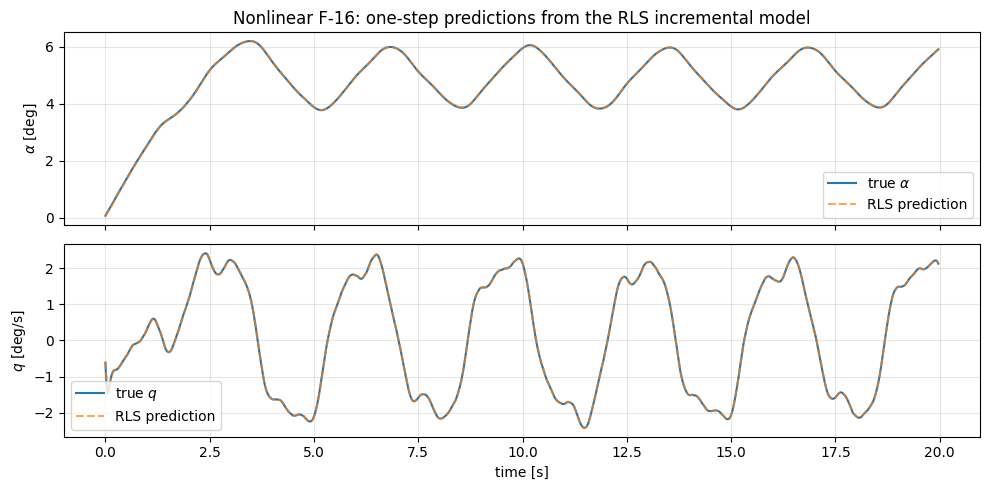

# Рецепт 12 — IM-GDHP на нелинейной F-16

IM-GDHP (Incremental Model Global Dual Heuristic Programming) улучшает IHDP добавлением **двухголового критика**, предсказывающего и значение `J`, и его градиент `λ = ∂J/∂x`. Дополнительная градиентная голова даёт более чистый сигнал для актора — в F-16-демо это превращается в более быструю сходимость с меньшим перерегулированием.

**Документация.** [IM-GDHP](../agent/imgdhp.md) · **Полный ноутбук.** [`example_im_gdhp_nonlinear_f16.ipynb`](../example/agent/imgdhp/example_imgdhp_nonlinear.md) · **Связано.** [Рецепт 11 — IHDP](11_ihdp.md).

## Когда использовать IM-GDHP

Выбирайте IM-GDHP, когда одноголовый критик IHDP не справляется с градиентом cost-to-go — обычно это проявляется как **дёргающийся градиент актора** или **медленная сходимость на быстрых эталонах**. Дополнительная голова критика дешёвая: ~50 % лишних NN-операций на тик, всё равно перекрывается шагом RLS.

| Свойство | IM-GDHP vs IHDP |
|---|---|
| Выход критика | `(J, λ)` vs только `J` |
| Градиент актора | Замкнутая форма из `λ` | Конечная разность из `J` |
| Число параметров | ~2× критик | — |
| Сходимость | Быстрее, глаже | Медленнее, шумнее |

## Шаг 1 — Минимальная конфигурация

```python
import numpy as np
from tensoraerospace.agent.im_gdhp import IMGDHPAgent, IMGDHPConfig

cfg = IMGDHPConfig(
    dt=0.01,
    actor_hidden=(32, 32),
    critic_hidden=(64, 64),
    actor_lr=1e-3,
    critic_lr=5e-4,
    gamma=0.95,
    # вес голов: loss = λ_weight·||λ_true - λ_pred||² + (1-λ_weight)·||J_true - J_pred||²
    lambda_weight=0.5,
    # RLS-идентификатор
    rls_forgetting=0.995,
    rls_cov_init=1e2,
    G_init=np.array([[-0.5]]),
    u_magnitude_limit=15.0,
    u_rate_limit=60.0,
    seed=0,
)
```

## Шаг 2 — Цикл

Идентичен IHDP:

```python
agent = IMGDHPAgent(n_state=1, n_control=1, config=cfg)
env.reset()

for k in range(n_steps):
    obs = env.get_state()
    u = agent.predict(obs[controlled_channels], ref[:, k], k)
    obs, *_ = env.step(u)
    agent.learn(obs[controlled_channels], ref[:, k], k)
```

Внутри `learn()`: один шаг RLS, затем обновление двухголового критика по `J` и оценке `λ` через конечные разности, затем один градиентный шаг актора в направлении, подсказанном `λ`-головой.

## Шаг 3 — Ожидаемое поведение на нелинейной F-16

Плавное слежение за α с агрессивным `actor_lr`:



Команда α — ступенчатое расписание; измеренный α следует с малым перерегулированием. Команда руля остаётся гладкой, потому что `λ`-голова даёт более чистый градиент по сравнению с конечно-разностной альтернативой. Источник: [`example_im_gdhp_nonlinear_f16.ipynb`](../example/agent/imgdhp/example_imgdhp_nonlinear.md).

## Шаг 4 — Save / load / публикация в HuggingFace

```python
run_dir = agent.save('./checkpoints')
restored = IMGDHPAgent.from_pretrained(run_dir)
agent.publish_to_hub('me/my-imgdhp', folder_path=run_dir, access_token='hf_…')
```

Тот же контракт, что у остальных четырёх — см. [Рецепт 08](08_huggingface.md).

## Подводные камни

- **`lambda_weight = 0` сводится к IHDP.** Если получаете поведение IHDP при использовании IM-GDHP, проверьте эту ручку.
- **`lambda_weight = 1` игнорирует `J`.** Актор становится хрупким при зашумлённой `λ`-голове. Полезный диапазон — `0.3–0.7`.
- **Loss критика колеблется.** Уменьшите `critic_lr` или поднимите `rls_forgetting` (≥ 0.999), чтобы сгладить оценки модели, за которыми гоняется критик.

## Куда дальше

- **[Рецепт 13 — ET-DHP](13_etdhp.md)** — событийный родственник IM-GDHP.
- **[Рецепт 14 — AA-INDI](14_aaindi.md)** — не-НС альтернатива с более сильными гарантиями отказоустойчивости.
- **[Документация IM-GDHP](../agent/imgdhp.md)** — теория + API.
