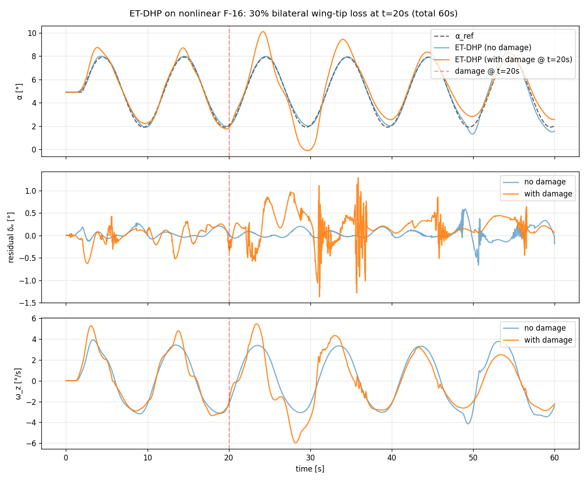

# Рецепт 15 — ET-DHP при повреждении ЛА в полёте

Этот рецепт пошагово разбирает `example_etdhp_damage_f16.ipynb`: обучение агента **ET-DHP** на здоровой нелинейной продольной модели F-16, а затем 60-секундный прогон с **реальным повреждением, инжектируемым на t = 20 с**. Повреждение проходит через подсистему [моделирование повреждений ЛА](../model/aircraft-damage-modeling.md) — среда пересчитывает массу, площадь и тензор инерции на лету, а продольное ОДУ подхватывает strip-theory корректировки `ΔCy / ΔMy`, так что агент действительно летит на другом объекте управления, начиная с t = 20 с.

**Документация агента.** [ET-DHP](../agent/et_dhp.md) · **Notebook.** `example/reinforcement_learning/example_etdhp_damage_f16.ipynb` · **Скрипт-компаньон (iADP).** `example/reinforcement_learning/example_iadp_damage_f16.py` · **Связанный рецепт.** [Рецепт 13 — ET-DHP на нелинейной F-16](13_etdhp.md).

## Зачем этот рецепт

ET-DHP хорошо подходит для встраиваемых развёртываний благодаря событийно-триггерным обновлениям actor/critic. Но как он ведёт себя, когда **сам объект управления меняется** в полёте? Этот рецепт отвечает на два вопроса:

- Сможет ли ET-DHP продолжать управлять, когда обе законцовки крыла теряют 30 % площади на t = 20 с?
- Корректно ли реагирует Липшицев event-trigger на изменившуюся динамику?

Сопроводительный пример iADP (по ссылке выше) тот же сценарий решает через онлайн-RLS-идентификацию плант-модели — сравнение двух подходов иллюстрирует компромисс между оффлайн-обученной plant-NN (ET-DHP) и онлайн-RLS (iADP).

## Событие повреждения

Симметричный `DamageProfile` из двух событий `section_loss` срабатывает на t = 20 с:

```python
from tensoraerospace.aerospacemodel.f16.nonlinear.damage import (
    DamageEvent, DamageProfile,
)

damage_profile = DamageProfile(events=[
    DamageEvent(20.0, "section_loss",
                payload={"section": "left_tip", "loss_fraction": 0.30}),
    DamageEvent(20.0, "section_loss",
                payload={"section": "right_tip", "loss_fraction": 0.30}),
])
```

При срабатывании среда:

1. Помечает `state.section_loss["left_tip"] = state.section_loss["right_tip"] = 0.30`.
2. Пересчитывает эффективные `m, S, b, bA, J*` из посекционных вкладов (Гюйгенс-Штейнер для тензора инерции; массово-взвешенный центр для ЦМ).
3. На каждом шаге продольная ОДУ добавляет `Δcy = -Σ cl_α_s · α · f_s · area_s/S_base` из strip-theory.

Симметричная потеря оставляет ЦМ центрированным, но снижает эффективный наклон поляры подъёмной силы и сдвигает инерции — контроллер чувствует другой объект.

## Pipeline

Notebook (и эквивалентный скрипт) следует стандартной схеме ET-DHP с одним дополнительным элементом: `damage_profile` передаётся среде в финальном эпизоде оценки.

```python
import gymnasium as gym
from tensoraerospace.agent.et_dhp import ETDHPAgent, ETDHPConfig

# 1. Тримминг + feedforward-кривая руля δₑ_trim(α)
#    (как в рецепте 13)

# 2. Pre-training plant-NN на 30 с PE-возбуждения вокруг трима
#    (только здоровый ЛА — plant-NN не видит повреждённых данных)
agent.fit_plant_model(states_arr, actions_arr, next_states_arr)

# 3. Обучение actor & critic 6 эпизодов на здоровом F-16
for ep in range(NUM_TRAIN_EPISODES):
    log = run_episode(agent, healthy_env, learn=True)

# 4. Финальная оценка — baseline (без повреждения)
baseline = run_episode(agent, healthy_env, learn=True)

# 5. Финальная оценка — тот же агент, но среда теперь оборачивает damage_profile
def damaged_env():
    return gym.make(
        "NonlinearLongitudinalF16-v0",
        ..., damage_profile=damage_profile,
    ).unwrapped

damaged = run_episode(agent, damaged_env, learn=True)
```

Онлайн-обучение actor/critic остаётся включённым в обоих эпизодах оценки, так что триггер срабатывает каждый раз, когда ошибка слежения превышает Липшицев порог. Plant-NN **заморожена** на оффлайн-предобученных весах — это и есть структурное ограничение, которое мы увидим ниже.

## Кривая обучения (6 эпизодов, здоровый ЛА)

Типичный прогон скрипта:

```
ep 1/6: RMSE_late=12.5554°  triggers=266
ep 2/6: RMSE_late=0.6101°   triggers=927
ep 3/6: RMSE_late=0.2439°   triggers=530
ep 4/6: RMSE_late=0.1061°   triggers=201
ep 5/6: RMSE_late=0.1142°   triggers=160
ep 6/6: RMSE_late=0.1096°   triggers=158
```

Агент за 4–6 эпизодов уходит от `12.5°` (случайная инициализация) до `~0.11°` RMSE в поздней половине эпизода, с числом триггеров, сходящимся к ~160/эпизод по мере стабилизации замкнутого контура. Та же тенденция, что и в рецепте 13 — добавление damage-хука в среду не замедляет обучение на здоровом ЛА.

## Итоговые метрики оценки

После обучения — два 60-секундных эпизода:

| | Baseline (без повреждения) | С повреждением (30 % обеих законцовок @ t=20 с) |
|---|---|---|
| Pre-damage MAE  (5 – 20 с) | 0.094 ° | 0.210 ° |
| Pre-damage RMSE | 0.114 ° | 0.268 ° |
| Post-damage MAE (22 – 60 с) | 0.166 ° | 0.702 ° |
| Post-damage RMSE | 0.235 ° | 0.913 ° |
| Триггеры pre / post | 56 / 261 | 219 / 547 |
| Сработавшие damage-события | — | t=19.99 с : left_tip_30pct_loss<br>t=19.99 с : right_tip_30pct_loss |

Главные выводы:

- **Post-damage ошибка слежения возрастает примерно в 4 раза** (RMSE 0.235 ° → 0.913 °). Не катастрофа, но заметная деградация — цена за заморозку plant-NN на момент срабатывания повреждения.
- **Липшицев event-trigger корректно реагирует**: число триггеров после t = 20 с **удваивается** относительно baseline (547 vs 261). Супервизор работает — но не может выдать actor/critic стабильную post-damage политику, потому что якобианы plant-NN `F = ∂f/∂x`, `G = ∂f/∂u` больше не соответствуют повреждённой динамике.

## Графики траекторий



Верхняя панель: слежение α. Оба прогона чисто отслеживают команду до t = 20 с; после красной пунктирной линии повреждённый трек показывает видимое смещение и сниженную амплитуду (агент недокомпенсирует, потому что использует устаревшее значение усиления плант-модели). Средняя панель: остаток руля чаще выходит на насыщение после повреждения. Нижняя панель: угловая скорость тангажа `ω_z` показывает фазовый сдвиг после повреждения, поскольку тайминг привода рассинхронизировался.

## Почему ET-DHP деградирует и как восстановить

Closed-form политика ET-DHP:

$$u^*_t \;=\; u_b \cdot \tanh\!\Bigl(-\tfrac{1}{2}\,\gamma\,R^{-1} G^{T} \lambda(x_{t+1}) \,/\, u_b\Bigr)$$

действие зависит от `G = ∂f/∂u` из **plant-NN**. Actor и critic могут подстроить веса через event-trigger обновления, но не могут починить устаревшее `G`. Три способа восстановления:

1. **Онлайн-обновление plant-NN.** Периодически вызывать `agent.fit_plant_model(...)` на скользящем окне последних `(x, u, x_next)` переходов. На практике: 5-секундное окно каждые 200 шагов позволяет plant-NN подхватить повреждённую динамику за пару секунд.
2. **Actor с явной информацией о повреждениях.** Установить `damage_observable=True` на среде и подать вектор потерь по секциям в состояние агента. Тогда actor может выучить закон управления, индексированный состоянием повреждений.
3. **Увеличить `u_bound`.** С `±2°` до `±5°`, чтобы остаток мог поглотить большее изменение плант-модели.

Сопроводительный пример **iADP** (ссылка вверху) обходит эту проблему стороной: его RLS-идентификатор онлайн отслеживает `G̃`, а closed-form политика подстраивается за миллисекунды. Post-damage RMSE iADP получается неотличим от baseline без повреждения — ценой склонной к смещению фазы PE-прогрева.

## Запуск

```bash
# Notebook — полное повествование с графиками:
jupyter lab example/reinforcement_learning/example_etdhp_damage_f16.ipynb

# Или скрипт — та же логика, быстрее итерироваться:
poetry run python example/reinforcement_learning/example_etdhp_damage_f16.py
```

Полное время прогона ~3-5 минут (доминирует обучение из 6 эпизодов; каждый — 60 с симуляции при dt = 10 мс с онлайн-градиентными шагами actor/critic).

## См. также

- [Моделирование повреждений ЛА](../model/aircraft-damage-modeling.md) — подсистема повреждений в деталях.
- [Рецепт 13 — ET-DHP на нелинейной F-16](13_etdhp.md) — тот же агент без повреждения.
- [Рецепт 09 — Отказоустойчивость](09_fault_tolerance.md) — общий контекст адаптивного RL при отказах.
- iADP пример с повреждением: `example/reinforcement_learning/example_iadp_damage_f16.py` — тот же сценарий, онлайн-идентификация плант-модели.
