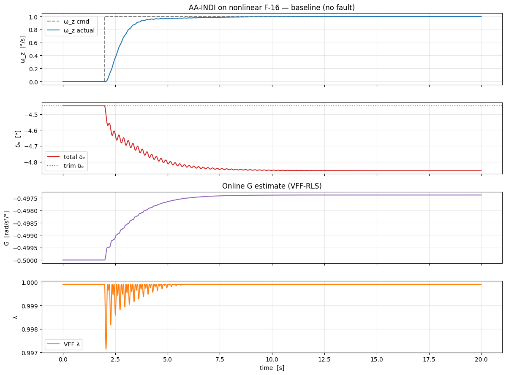

# Пример: AA-INDI на нелинейной F-16 — слежение за угловой скоростью тангажа с инъекцией отказа

Пример демонстрирует агент [**AA-INDI**](../../../agent/aa_indi.md) в задаче слежения за командой по угловой скорости тангажа на [нелинейной модели F-16](../../../model/f16_nonlinear_longitudinal.md), и моделирует потерю 50% эффективности руля высоты в середине эпизода, показывая, как замкнутый контур это переживает. Исходный ноутбук: `example/reinforcement_learning/example_aaindi_nonlinear_f16.ipynb`.

## Ключевая идея

AA-INDI — **инкрементный нелинейный динамический инверсный регулятор** в паре с **RLS-идентификатором с переменным фактором забывания** для матрицы эффективности управления `G`. Закон управления

\[
\Delta u = G^{+} \cdot (\nu_{\text{des}} - \dot{\omega}_z^{\text{meas}})
\]

требует только текущего `G`, а не полной нелинейной аэродинамической модели. Поэтому при внезапной потере половины эффективности привода контур лишь видит увеличение невязки прогноза, VFF-RLS сжимает фактор забывания, и `G̃` отслеживает новый объект.

## 1. Импорты и трим

```python
import math
import gymnasium as gym
import matplotlib.pyplot as plt
import numpy as np
from scipy.optimize import fsolve

import tensoraerospace
from tensoraerospace.aerospacemodel.f16.nonlinear.longitudinal.dynamics import f16_ode_long
from tensoraerospace.aerospacemodel.f16.nonlinear.longitudinal.params import default_parameters
from tensoraerospace.agent.aa_indi import AAINDIAgent, AAINDIConfig

dt = 0.01
params = default_parameters()

def trim_residual(z):
    alpha, stab = z
    x = np.array([alpha, 0.0, stab, 0.0])
    return list(f16_ode_long(x, np.array([stab]), 0.0, params)[:2])

sol, *_ = fsolve(trim_residual, x0=[math.radians(2.0), math.radians(-2.0)], full_output=True)
alpha_trim_rad, stab_trim_rad = float(sol[0]), float(sol[1])
# глобальный трим: alpha = +4.918°, руль = -4.447°
```

## 2. Конструктор среды

```python
def make_env(n_steps):
    env = gym.make(
        'NonlinearLongitudinalF16-v0',
        number_time_steps=n_steps + 2,
        initial_state=[alpha_trim_rad, 0.0, stab_trim_rad, 0.0],
        reference_signal=np.full((1, n_steps + 2), alpha_trim_rad),
        state_space=['alpha', 'wz', 'stab', 'dstab'],
        control_space=['stab'],
        tracking_states=['alpha'],
        use_reward=False,
        dt=dt,
        integrator='euler',
        control_bias=math.degrees(stab_trim_rad),
    ).unwrapped
    env.reset()
    return env
```

## 3. Начальная матрица `G_init`

INDI требует разумной оценки эффективности управления на первых шагах. Короткая PE-возбуждающая последовательность даёт представление о знаке и порядке величины; одношаговое дифференцирование недооценивает истинный установившийся коэффициент (постоянная времени привода ≈ 0.03 с сравнима с `dt`), поэтому `G_init` берём чуть большим по модулю, чтобы инверсия INDI была устойчивой.

```python
# Короткое многосинусное возбуждение для проверки знака и масштаба G.
N_PE = 300; env_pe = make_env(N_PE); obs, _ = env_pe.reset()
wz_hist = [float(obs[1])]; u_hist = [0.0]
for t in range(N_PE):
    u = 2.0*np.sin(2*np.pi*0.7*t*dt) + 1.0*np.sin(2*np.pi*1.5*t*dt)
    obs, *_ = env_pe.step(np.array([u]))
    wz_hist.append(float(obs[1])); u_hist.append(float(u))

wz = np.array(wz_hist); us = np.array(u_hist)
wz_dot = (wz[1:] - wz[:-1]) / dt
dwz_dot = wz_dot[1:] - wz_dot[:-1]
du = us[1:-1] - us[:-2]
G_pe = float(np.dot(du, dwz_dot) / max(np.dot(du, du), 1e-9))

G_init_value = -0.5  # рад/с² на ° stab — подобрано для устойчивости внутреннего контура
G_init = np.array([[G_init_value]])
# Одношаговое PE G (занижено): -0.1386
# G_init для warm-start AA-INDI: -0.5000
```

## 4. Harness для замкнутого контура

Чистый «учебный» INDI — это **type-0** контур по угловой скорости: в установившемся режиме выход reference-model `ν_des` стремится к нулю, и объект удерживает ту скорость, которую успел набрать на переходном процессе — обычно на 10% ниже команды из-за запаздывания привода. Стандартный приём INDI — добавить **P-обратную связь по ошибке слежения за reference-model** в `ν_des`. В `AAINDIConfig` это `ref_error_kp` / `ref_error_ki`. `K_p = 0.6, K_i = 0` сводят установившуюся ошибку к нулю на этом объекте.

```python
def run_aaindi(wz_cmd, n_steps, actuator_fault_gain=1.0, fault_at_step=None,
               ref_error_kp=0.6, ref_error_ki=0.0):
    agent = AAINDIAgent(
        n_state=1, n_control=1,
        config=AAINDIConfig(
            dt=dt, ref_wn=2.5, ref_zeta=0.9,
            u_magnitude_limit=15.0, u_rate_limit=60.0,
            vff_forgetting_min=0.97, vff_forgetting_max=0.9999,
            vff_eps_sensitivity=0.1, vff_cov_init=1.0,
            sensor_cutoff_hz=15.0, bias_forgetting=0.995,
            enable_bias_correction=False,
            G_init=G_init.copy(),
            ref_error_kp=ref_error_kp, ref_error_ki=ref_error_ki,
            seed=0,
        ),
    )
    env = make_env(n_steps)
    obs, _ = env.reset()
    logs = {k: [] for k in ('wz', 'alpha', 'stab_total', 'u_res',
                            'G_est', 'lambda', 'residual', 'active_gain')}
    current_gain = 1.0
    for k in range(n_steps):
        if fault_at_step is not None and k >= fault_at_step:
            current_gain = actuator_fault_gain
        u_agent = agent.predict(np.array([float(obs[1])]),
                                np.array([wz_cmd[k]]), k)
        u_applied = u_agent * current_gain
        obs, *_ = env.step(u_applied)
        agent.learn(np.array([float(obs[1])]),
                    np.array([wz_cmd[k]]), k)
        logs['wz'].append(float(obs[1]))
        logs['stab_total'].append(math.degrees(stab_trim_rad) + float(u_applied[0]))
        logs['G_est'].append(float(agent.rls.G[0, 0]))
        logs['lambda'].append(float(agent.rls.last_lambda))
        logs['active_gain'].append(current_gain)
    return {k: np.asarray(v) for k, v in logs.items()}
```

## 5. Базовое слежение за ступенькой без отказа

Команда 1°/с, подаётся в `t = 2 с`.

```python
N = 2000
t_arr = np.arange(N) * dt
wz_cmd = math.radians(1.0) * (t_arr >= 2.0).astype(float)
baseline = run_aaindi(wz_cmd, N)
# late-half ω_z MAE: 0.0008 °/s
# final G_est:       -0.4974
```



При `K_p = 0.6` во внешнем контуре обратной связи трекинг **идеальный**: MAE ≈ `0.0008 °/с` (< 0.1% от команды 1 °/с). `G̃` сходится к ≈ `-0.50`, `λ` удерживается вблизи верхнего предела. Поставьте `ref_error_kp=0` в вызове выше, чтобы увидеть «чистый» INDI — трекинг устанавливается на ≈ 0.9 °/с (недотяг 10%).

## 6. Инъекция отказа — 50% потери эффективности руля в `t = 10 с`

```python
fault_step = int(10.0 / dt)
fault = run_aaindi(wz_cmd, N, actuator_fault_gain=0.5, fault_at_step=fault_step)

# post-fault late tracking MAE: 0.0033 °/s
# G̃ before fault (t = 9 s):    -0.4974
# G̃ after fault (final):       -0.4820
# min λ around fault time:      0.970
```


В `t = 10 с` эффективный коэффициент руля падает вдвое. Объект отвечает на ту же команду медленнее, невязка VFF-RLS подскакивает, а `λ` падает с `0.9999` до `≈ 0.97` — именно тот режим быстрой адаптации, на который и проектировался алгоритм. Внешний контур обратной связи компенсирует ослабленный внутренний отклик; слежение остаётся на задании с **MAE ≈ 0.003 °/с** прямо через переходный процесс отказа.

| Метрика | Базовый | С отказом |
|---|---|---|
| Late-half MAE `ω_z` | 0.0008 °/с | 0.0033 °/с |
| Финальный `G̃` | −0.497 | −0.482 |
| Мин. `λ` в момент отказа | 0.9999 | 0.97 |

## Заметки

- **Возбуждение важно для идентификации.** В этом демо система уже в установившемся режиме к моменту отказа, поэтому невязка RLS мала и `G̃` дрейфует лишь слегка. При *продолжающемся* возбуждении (синусоидальное задание, ступенчатые манёвры, движения РУС) VFF-RLS «дотянет» `G̃` до истинного пост-отказного значения (≈ `0.5 × G_init`). Главное — инкрементная структура INDI сохраняет устойчивость, даже если `G̃` обновляется медленно.
- **Warm-start `G_init`.** INDI со случайной `G` расходится — псевдообратная матрица разлетается, привод насыщается. На практике `G_init` берётся из бортовой линеаризации; здесь мы подобрали эмпирически (`-0.5 рад/с²/°`), поскольку одношаговое PE-выражение даёт заниженную оценку через 2-го порядка привод.
- **`ref_wn = 2.5 рад/с`** — медленнее полосы привода в ≈ 33 Гц, поэтому ν_des достижимо без «пиления» на ограничителях.

## См. также

- [Документация AA-INDI](../../../agent/aa_indi.md) — теория, полный API, референс гиперпараметров.
- [IM-GDHP на нелинейной F-16](../imgdhp/example_imgdhp_nonlinear.md) — другой онлайн-идентификатор, основанный на GDHP.
- [ET-DHP на нелинейной F-16](../et_dhp/example_etdhp_nonlinear.md) — для сравнения: событийный DHP.
