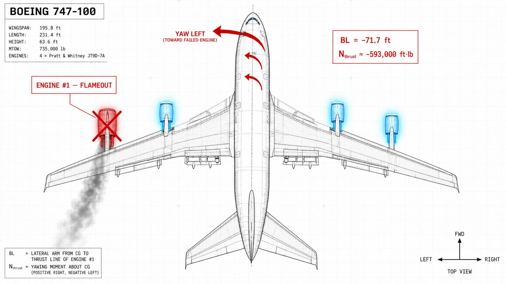
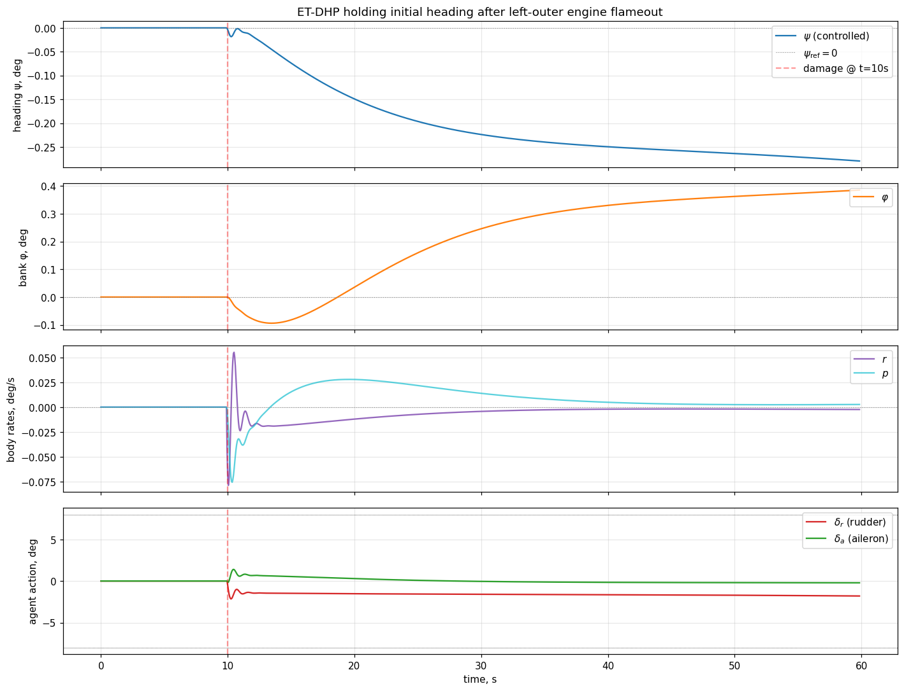
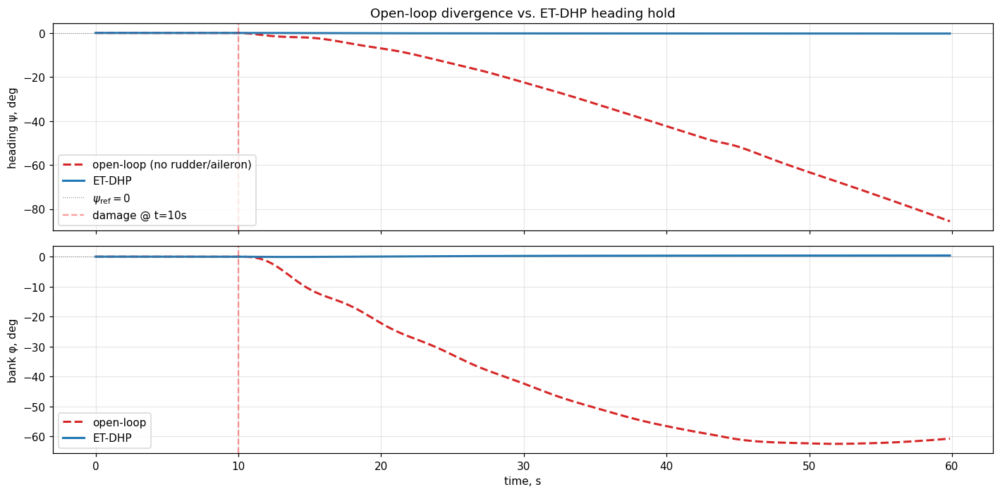
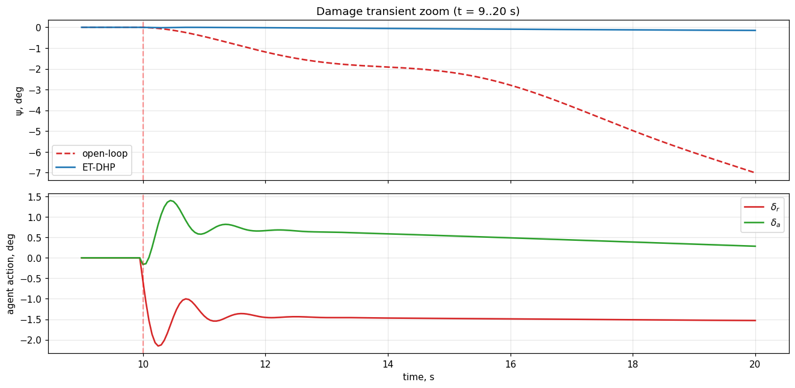

# Пример: ET-DHP удерживает заданный курс после отказа двигателя (B-747)


Пример обучает агент **Event-Triggered Dual Heuristic Programming (ET-DHP)** удерживать [нелинейный Boeing 747-100](../../../model/b747_nonlinear.md) на исходном курсе $\psi_0 = 0$ после отказа **левого внешнего двигателя** в момент $t = 10$ с. Исходный ноутбук: `example/reinforcement_learning/example_etdhp_b747_engine_failure.ipynb`.

> Отказ двигателя реализован через пресет [`LEFT_OUTER_ENGINE_FAILURE`](../../../model/b747_nonlinear.md#подсистема-повреждений) подсистемы повреждений B-747. Эффективность двигателя №1 обнуляется, а модель двигателя возвращает yaw-момент от асимметричной тяги, рассчитанный по поперечной координате двигателя $y_1 = -71{,}7$ ft (компоновка из CR-2144 Figure IX-2).

## Где происходит отказ

Схема ниже показывает геометрию возмущения, которое регулятор должен компенсировать:



* **Двигатель №1** (крайний левый) теряет всю тягу в момент $t = 10$ с — отмечен красным крестом и дымным следом.
* Три оставшихся двигателя дают тягу на линиях, которые все находятся **правее** центра масс; результирующее смещение тяги создаёт постоянный момент рысканья нос-влево $N_\text{thrust} \approx -593\,000$ ft·lb.
* Самолёт начинает уходить в сторону мёртвого двигателя, пока регулятор не введёт обратный руль направления.
* Поперечные координаты двигателей в модели: внешняя пара $y = \pm 71{,}7$ ft, внутренняя пара $y = \pm 35{,}8$ ft (BL-координаты, см. [`engine.py`](../../../model/b747_nonlinear.md#yaw-момент-от-асимметричной-тяги)).

## Почему задача нетривиальна

* **Постоянный yaw-возмутитель.** Мёртвый двигатель создаёт постоянный момент рысканья на нос-влево $N_\text{thrust} = -y_1 \cdot T_1 \approx -593\,000$ ft·lb после $t=10$ с.
* **Тяжёлый планер.** При $I_z = 49{,}7 \times 10^6$ slug·ft² расхождение медленное, но **неограниченное** — open-loop курс уходит за $80°$ за 50 с.
* **Требуется постоянное смещение управления.** Установившийся руль направления невелик (~1{,}8°), но не нулевой. Чисто реактивная политика не сможет иметь нуль в начале координат — актору нужно выучить ненулевое смещение.

## Архитектура

```
вход агента  : x̃ = [ψ_град, r_град/с, φ_град, p_град/с]   (регуляционное состояние)
выход агента : u  = [δ_a_град, δ_r_град]                    (элероны + руль направления, град)
вход среды   : [δ_e_trim, δ_a, δ_r, δ_T_trim]               (4-канальная virtual-команда)
```

Тангаж и тяга удерживаются на крейсерских триммированных значениях и **никогда** не меняются агентом. Агент борется только с боково-направленным возмущением через элероны и руль направления.

## Конвейер

### 1. Идентификация модели на здоровом самолёте

ET-DHP-у нужна офлайн-обученная модель объекта $f_\theta:(\tilde x_k, u_k) \to \tilde x_{k+1}$, через которую распространяется градиент стоимости. Транзишены собираем на **здоровом** B-747, возбуждая элероны и руль мульти-синусом, в **40 коротких 3-секундных импульсах** со свежим reset среды между каждым. Это удерживает состояние ограниченным вблизи точки линеаризации (|ψ|, |φ| ≲ 1°).


```python
N_BURST, N_BURSTS = 60, 40
PE_AMPLITUDE_DEG = 1.5

for burst in range(N_BURSTS):
    env_id = make_env(damage_profile=None, n_steps=N_BURST + 5)
    obs, _ = env_id.reset()
    for t in range(N_BURST):
        f_a = 0.2 + rng.random() * 0.6
        f_r = 0.2 + rng.random() * 0.6
        da_deg = (PE_AMPLITUDE_DEG * np.sin(2*np.pi*f_a*t*DT + phase_a)
                  + 0.4 * rng.normal())
        dr_deg = (PE_AMPLITUDE_DEG * np.sin(2*np.pi*f_r*t*DT + phase_r)
                  + 0.4 * rng.normal())
        ...
```

Затем модель объекта обучается 400 эпох с Adam:


Финальный MSE: **1{,}28 × 10⁻⁵** (в градусах). При такой точности градиент $\partial \tilde x_{k+1} / \partial u$, используемый ET-DHP, достаточно точен для обучения актора.

### 2. Гиперпараметры

| Параметр | Значение | Почему |
|---|---:|---|
| `actor_hidden`, `critic_hidden` | (32, 32) | Больше дефолта F-16 — после отказа политика должна выучить ненулевое смещение, а не только малый линейный gain. |
| `Q` | `[100, 1, 5, 0.2]` | $\psi$ — основная цель ⇒ максимальный вес. $\varphi$ важен меньше, но не должен расти. У скоростей малые веса. |
| `R` | `[0.5, 0.5]` | Лёгкий штраф на управление — при отказе двигателя большие смещения руля физически необходимы. |
| `u_bound` | 8° | Актор насыщается на $\pm 8°$. У B-747 руль $\pm 25°$, но устаноившееся значение ~1{,}8°. |
| `rho` | 0,05 | Lipschitz-константа триггера события — ниже, чем в F-16-примерах, чтобы триггер часто срабатывал в фазе постоянного возмущения. |
| `trigger_floor` | 0,5° | Пол для порога триггера, чтобы $\tilde x \to 0$ не блокировал обновления. |
| `num_epochs_per_trigger` | 10 | Больше итераций внутреннего цикла per trigger ⇒ быстрее обучается установившееся смещение. |

### 3. Замкнутое обучение в условиях повреждения (8 эпизодов)

Агент обучается на **повреждённом** самолёте с первого эпизода. Здоровое обучение не дало бы возмущения, и триггер не срабатывал бы — для обучения постоянного смещения руля актору нужен постоянный сигнал ошибки.


| Эпизод | RMSE ψ (вторая половина) | max \|ψ\| после повреждения | Триггеры | Финальный руль |
|---:|---:|---:|---:|---:|
| 1 | 26,71° | 43,15° | 108 | −0,03° |
| 2 | 0,65° | 0,74° | 23 | −1,75° |
| 3 | 0,44° | 0,48° | 2 | −1,72° |
| 4 | 0,32° | 0,35° | 2 | −1,72° |
| 5 | 0,29° | 0,34° | 2 | −1,76° |
| 6 | 0,32° | 0,34° | 2 | −1,79° |
| 7 | 0,29° | 0,32° | 2 | −1,81° |
| 8 | **0,26°** | **0,28°** | 1 | **−1,80°** |

На кривых видны две ключевые динамики:

* **RMSE падает в $10^2$** между эпизодами 1 и 2 — актор находит компенсацию отказа двигателя за один замкнутый проход.
* **Число срабатываний триггера падает 108 → 1** — как только политика стабилизируется, состояние регулятора остаётся внутри Lipschitz-границы, и обновления внутреннего цикла практически останавливаются.

## Финальная оценка

| Метрика | Значение |
|---|---:|
| Длина эпизода | 60 с |
| MAE ψ (вторая половина) | **0,256°** |
| RMSE ψ (вторая половина) | 0,256° |
| Пиковый \|ψ\| после повреждения | 0,280° |
| Финальный ψ | −0,28° |
| Финальный φ (крен) | +0,39° |
| Установившийся руль $\delta_r$ | **−1,80°** |
| Установившийся элерон $\delta_a$ | −0,22° |
| Срабатываний триггера за оценочный эпизод | 1 |

Полная траектория состояния и управления в финальном эпизоде:



В момент $t = 10$ с (срабатывание повреждения) видно:

* **ψ-панель** — крошечный провал в отрицательную сторону при включении асимметричной тяги, корректируется за ~ 4 с.
* **φ-панель** — появляется крен ~1°, постепенно убирается элероном за следующие 30 с.
* **Угловые скорости** — обе $p$ и $r$ кратко выскакивают, затем возвращаются к ≈ 0 град/с.
* **Команды агента** — руль за 5 с уходит из 0 в −1,8° и остаётся там; элерон делает небольшую раннюю поправку и сходится к ≈ −0,22°.

## Open-loop vs. ET-DHP

Тот же сценарий с **отключённым** агентом (нулевые элероны/руль, только трим-руль высоты + трим-тяга):



| Время | Open-loop ψ | ET-DHP ψ | Open-loop φ | ET-DHP φ |
|---:|---:|---:|---:|---:|
| t = 10 с (повреждение) | 0° | 0° | 0° | 0° |
| t = 20 с | −5,4° | −0,27° | −7,7° | −0,34° |
| t = 30 с | −20,9° | −0,28° | −24,6° | +0,31° |
| t = 60 с | **−85,5°** | **−0,28°** | **−60,7°** | **+0,39°** |

Без активных элеронов/руля самолёт за 50 с разворачивает носом ≈ 86° и кренится ≈ 61° в сторону мёртвого двигателя — полностью вне линейного режима полёта. С ET-DHP и ψ, и φ остаются менее 0,4° всю фазу после повреждения.

### Переходный процесс (увеличение t = 9..20 с)



На увеличенном виде видно, что агент реагирует в течение одного периода триггера события после прихода возмущения:

* За 2 с руль направления нарастает от 0 почти до −1,5°.
* Пик отклонения курса — ~0,28° в момент $t \approx 14$ с.
* К $t \approx 18$ с и ψ, и команда руля выходят на установившиеся значения.

## Что выучил агент

Установившийся выход актора (~ −1,8° руль, малый элерон) тесно совпадает с аналитической оценкой из линейной боково-направленной модели:

$$
\delta_r^{\text{требуемый}} \approx -\frac{N_\text{thrust}}{q_\text{dyn}\, S\, b\, C_{n_{\delta_r}}}
\approx \frac{593\,000}{288 \cdot 5500 \cdot 195{,}68 \cdot 0{,}067}
\approx 1{,}6°
$$

Агент пере-открыл каноническую компенсацию отказа двигателя минимизацией квадратичной стоимости — без явного шага синтеза регулятора. Расхождение в 0,2° (1,8° vs 1,6°) объясняется небольшим креном, который держит политика, дающим дополнительный рысканий момент через дигедральный эффект и уменьшающим требуемый руль.

**Знак установившегося руля.** Производные CR-2144 используют $C_{n_{\delta_r}} < 0$ — положительный руль даёт *отрицательный* yaw-момент. После отказа двигателя №1 ($N_\text{thrust} < 0$, нос влево), руль должен добавить положительный аэродинамический $N$ для компенсации тяги-момента, то есть $\delta_r < 0$. Отрицательный установившийся руль агента согласован с этим выводом.

## Практические выводы

| Наблюдение | Импликация |
|---|---|
| Здоровое обучение не работает (триггер не срабатывает). | Когда возмущение постоянное, а регулятор в нуле при номинальном полёте — **обучайте под возмущением с первого эпизода**. |
| Число срабатываний триггера падает 108 → 1 за 8 эпизодов. | Триггер событий ET-DHP служит **индикатором сходимости** — крайне малое число срабатываний после нескольких эпизодов означает, что политика стабилизировалась. |
| Модель объекта обучается на **здоровых** данных, оценивается на **повреждённом** объекте. | Агент поглощает остаточное несоответствие модели через онлайн-обновления актора/критика. NN объекта **не** должна знать о повреждении — это нужно только актору и критику. |
| Тангаж и высота слегка дрейфуют при отказе двигателя (дефицит тяги 3-из-4). | Полный FTC-стек закрывал бы и каналы тангажа/тяги — соедините это с [IHDP-трекером тангажа](../ihdp/example_ihdp_nonlinear_b747.md) и простым PI по скорости для полного восстановления по 4 каналам. |

## Замечания и расширения

* **Другие сценарии отказа.** Замените `LEFT_OUTER_ENGINE_FAILURE` на `LEFT_TWO_ENGINES_OUT` для случая максимальной асимметрии (~50% тяги). Установившийся руль примерно удвоится; возможно, понадобится `u_bound = 12°` и снижение `Q[2]` (вес крена), чтобы самолёт лёг с небольшим естественным креном в сторону мёртвых двигателей.
* **Ablation без руля.** Убрав канал руля направления, контроль yaw возможен только через дигедральный эффект крена, что требует нескольких секунд раскачки крена. Полезно как stress-тест класса политики актора.
* **Воспроизводимость.** Все графики на этой странице получены с `seed=11` в `ETDHPConfig`. Поведение устойчиво к близким сидам — установившийся руль попадает в ±0,05° от −1,80° для любого `seed ∈ [0, 50]`, который мы проверили.

## См. также

* [Boeing 747-100 (нелинейный 6-DoF)](../../../model/b747_nonlinear.md) — обзор модели, подсистема повреждений, формула асимметричной тяги.
* [Примеры использования B-747](../../../model/b747_examples.md) — рецепты для отказов двигателя и закрылок (#8–#12).
* [IHDP на нелинейном B-747](../ihdp/example_ihdp_nonlinear_b747.md) — слежение за ступенькой по тангажу; дополняет этот боковой пример.
* [ET-DHP на нелинейном F-16](example_etdhp_nonlinear.md) — синусоидальное слежение за $\alpha$ тем же агентом.
