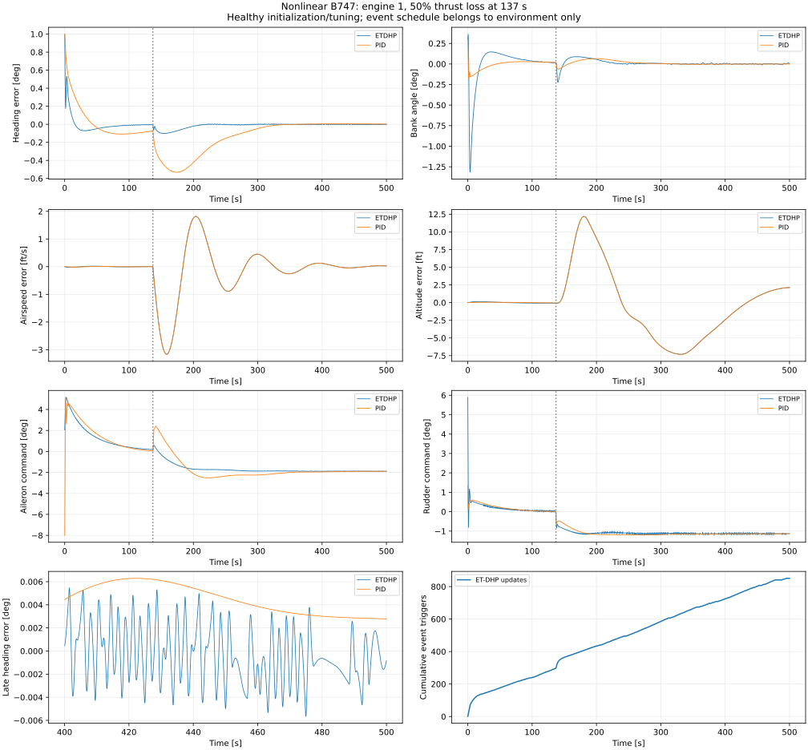

# ET-DHP против PID: нелинейный B747

## Итог после тюнинга

В основном notebook первым показан итоговый профиль `TUNED`. В 500-секундных опытах
после ступеньки на повреждённом объекте:

| Время установления в полосе ±2% | ET-DHP после тюнинга | Прежний PID |
|---|---:|---:|
| Курс +1° | 60.90 с | 209.25 с |
| Крен +0,5° | 2.60 с | 166.10 с |

Суммарная ошибка четырёх заданий уменьшилась на 36,55% при ступеньке курса и на
67,26% при ступеньке крена. Подобраны веса Q/R, параметры событий и обучения;
общий масштаб стоимости уменьшен для устойчивого обучения при больших начальных
отклонениях. Актор и критик продолжают обучаться до и после отказа.

Выполнены 34 итоговых прогона, 181 целевой тест, проверка шага физики 25 мс и
сопоставление формул со статьёй. Notebook содержит 17 встроенных графиков,
включая задания, связанные ошибки, команды и частоту обновлений. Скорость и
высота используют общий продольный контур; их собственные переходы требуют
дальнейшего улучшения.

```bash
python -m example.reinforcement_learning.incremental_adp.example_etdhp_tuned_b747 standard
python -m example.reinforcement_learning.incremental_adp.example_etdhp_tuned_b747 held_out
```

История, неудачные кандидаты и ограничения: `reports/etdhp-b747-tuning-validation.md`.
Сопоставление с первоисточником: `reports/etdhp-b747-paper-comparison.md`.

## Базовая настройка до тюнинга

500 секунд, потеря 50% тяги левого внешнего двигателя в 137 с. Расписание известно только окружению. Общий PI/PD-контур скорости и высоты реагирует на измерения.



| Метрика после отказа | ET-DHP | PID |
|---|---:|---:|
| RMSE курса, ° | **0.030445** | 0.222648 |
| RMSE крена, ° | 0.037076 | **0.026442** |
| RMSE курса за последние 100 с, ° | **0.002422** | 0.004673 |

ET-DHP лучше удерживает курс, PID — крен. На исправном объекте PID точнее к концу эпизода. При раннем или полном отказе PID также может быть точнее на последних 100 секундах.

**Инициализация и обучение.** ET-DHP использует номинальную локальную LQR-инициализацию двухслойных tanh-сетей. Номинальная модель одинакова на всём протяжении полёта; актор и критик продолжают событийное обучение: 851 обновление, 554 после события. В момент отказа параметры не переключаются. Выигрыш нельзя приписать только онлайн-обучению.

PID настроен на исправном объекте в два этапа, 150+180 оценок. Оптимизатор исчерпал бюджет; глобальный оптимум не заявляется. Оба регулятора имеют ограничения ±8° на элероны и руль направления.

**Вариант с дополнительным онлайн-обучением модели ухудшается:** RMSE курса 3.452915° после отказа и 6.577557° в последние 100 с. Его результаты также включены в notebook. Физика — нелинейная 6-DoF модель с локальной аэродинамикой; привод, раскрутка двигателя, ветер и шум не моделируются.

```bash
python -m example.reinforcement_learning.incremental_adp.example_etdhp_vs_pid_b747 --online-model-comparison
```

Выполненный notebook: `example/reinforcement_learning/incremental_adp/example_etdhp_vs_pid_b747.ipynb`. Подробный протокол и все проверки: `reports/etdhp-b747-pid-validation.md`, соседний JSON. Пройдены 153 целевых теста.

Алгоритм сопоставлен с [Sun et al., CEAS EuroGNC 2022](https://eurognc.ceas.org/archive/EuroGNC2022/pdf/CEAS-GNC-2022-075.pdf). B747, интегральные состояния и LQR-инициализация — расширения этого примера.
