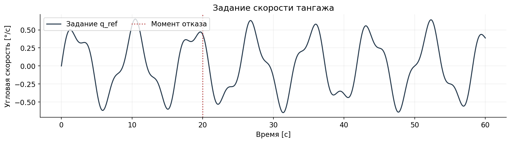
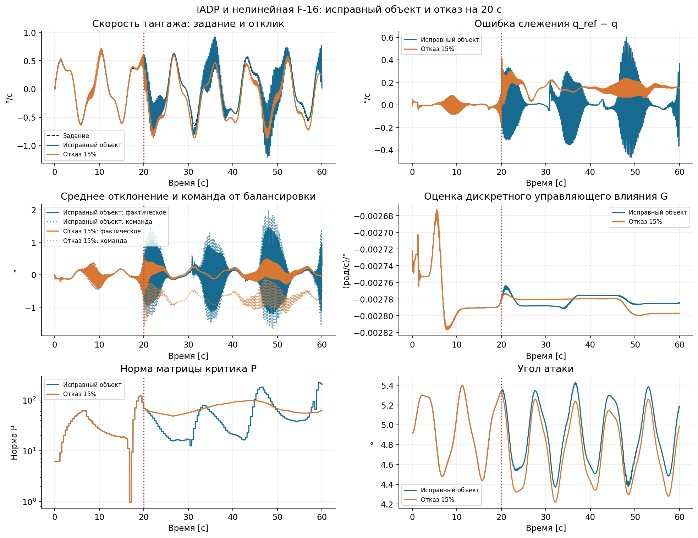
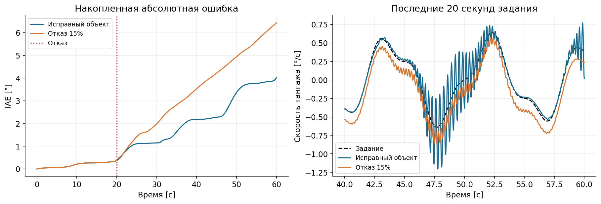

# Урок: управление нелинейной F-16 с iADP при небольшом отказе привода

В этом уроке соберём эксперимент с нуля: найдём балансировку F-16, создадим
`IADPAgent`, выполним два полёта и оценим работу регулятора после отказа.
Весь код приведён ниже. Выполняйте Python-блоки по порядку в одном ноутбуке
или файле с установленной библиотекой `tensoraerospace`.

Управляемая величина — **угловая скорость тангажа** \(q\).
Сравниваются исправный самолёт и самолёт, у которого на 20-й секунде
коэффициент передачи команды стабилизатору уменьшается на 15%.
В обоих случаях iADP продолжает идентификацию и обновление критика весь полёт.
Расписание отказа передаётся только среде.

## 1. Сценарий и единицы измерения

| Параметр | Значение |
|---|---|
| Объект | Штатная нелинейная продольная F-16 |
| Длительность | 60 с, 3000 переходов |
| Шаг управления и интегрирования | 0.02 с, RK4 |
| Скорость и высота | Постоянные параметры крейсерского режима модели |
| Отказ | Потеря 15% усиления полной команды стабилизатору с 20 с |
| Ограничения команды iADP | ±10° относительно балансировки, 60°/с |
| Адаптация | Непрерывная в обоих запусках |

Модель интегрирует четыре состояния:

\[
x_{\mathrm{plant}}=[\alpha,\ q,\ \delta,\ \dot\delta]^T.
\]

| Величина | Единицы в коде |
|---|---|
| `alpha`, `stab` в состоянии объекта | рад |
| `wz` — скорость тангажа \(q\), `dstab` | рад/с |
| Задание `reference` для \(q\) | рад/с |
| Действие `env.step`, выход агента | градусы относительно балансировки |
| `control_bias` среды | балансировочное отклонение в градусах |
| `applied_action` для обучения | среднее фактическое отклонение за переход, градусы относительно балансировки |

Продольная модель использует имя `wz` для скорости тангажа. Здесь обозначаем её
привычным символом \(q\). Аэродинамика и привод работают внутри объекта в радианах;
среда переводит команду из градусов. Это разделение нужно сохранить при настройке
матриц модели, весов стоимости и передаче фактического управления.

## 2. Импорты и оформление графиков

```python
import copy
import numpy as np
import pandas as pd
import matplotlib.pyplot as plt
from scipy.optimize import root
from scipy.linalg import solve_discrete_are

from tensoraerospace.aerospacemodel.f16.nonlinear.damage import (
    DamageEvent,
    DamageProfile,
)
from tensoraerospace.aerospacemodel.f16.nonlinear.longitudinal.dynamics import (
    f16_ode_long,
)
from tensoraerospace.aerospacemodel.f16.nonlinear.longitudinal.params import (
    default_parameters,
)
from tensoraerospace.envs.f16.nonlinear_longitudinal import NonlinearLongitudinalF16
from tensoraerospace.agent.iadp import IADPAgent, IADPConfig
from tensoraerospace.benchmark import ControlBenchmark
plt.rcParams.update(
    {
        "figure.dpi": 125,
        "font.family": "DejaVu Sans",
        "font.size": 11,
        "axes.grid": True,
        "grid.alpha": 0.2,
        "axes.spines.top": False,
        "axes.spines.right": False,
    }
)
labels = {"Healthy": "Исправный объект", "Fault": "Отказ 15%"}
colors = {"Healthy": "#176b91", "Fault": "#d97732"}
```

`DamageEvent` и `DamageProfile` задают отказ через библиотеку.
`NonlinearLongitudinalF16` интегрирует объект и привод, `IADPAgent` выполняет
управление и обучение, а `ControlBenchmark` вычисляет метрики слежения.

## 3. Заданная угловая скорость

Задание складывается из двух синусоид с амплитудами 0.5°/с и 0.15°/с:

\[
q_{\mathrm{ref}}(t)=0.5\sin(2\pi\,0.12t)
+0.15\sin(2\pi\,0.31t)\quad[^{\circ}/\mathrm{с}].
\]

Создаём `steps + 1` отсчётов: начальное состояние и состояние после каждого
из 3000 переходов. Одинаковое задание используется в обоих запусках.

```python
dt, duration, fault_time, loss = 0.02, 60.0, 20.0, 0.15
steps = round(duration / dt)
time = np.arange(steps + 1) * dt
reference = np.deg2rad(
    0.5 * np.sin(2 * np.pi * 0.12 * time) + 0.15 * np.sin(2 * np.pi * 0.31 * time)
)[None, :]
fig, ax = plt.subplots(figsize=(11, 3), constrained_layout=True)
ax.plot(time, np.rad2deg(reference[0]), color="#24384b", label="Задание q_ref")
ax.axvline(fault_time, color="#bb4040", linestyle=":", label="Момент отказа")
ax.set(xlabel="Время [с]", ylabel="Угловая скорость [°/с]", title="Задание скорости тангажа")
ax.legend(ncol=2)
plt.show()
```



## 4. Балансировка исправной F-16

До настройки регулятора найдём угол атаки и положение стабилизатора, при которых
\(\dot\alpha=0\) и \(\dot q=0\), а сам привод неподвижен.
Для этого вызываем штатные уравнения `f16_ode_long` и решаем две нелинейные
балансировочные зависимости через `scipy.optimize.root`.

```python
params = default_parameters()
solution = root(
    lambda z: f16_ode_long([z[0], 0.0, z[1], 0.0], [z[1]], 0.0, params)[:2],
    np.deg2rad([2.0, -2.0]),
)
if not solution.success or np.max(np.abs(solution.fun)) > 1e-10:
    raise RuntimeError(f"Не удалось найти балансировку: {solution.message}")
alpha_trim, surface_trim = solution.x
initial = np.array([alpha_trim, 0.0, surface_trim, 0.0])

print("Скорость [м/с], высота [м]:", params.V, params.Oy)
print("Балансировочный угол атаки и стабилизатор [°]:", np.rad2deg(solution.x))
print("Невязка производных в балансировке:", solution.fun)
```

Для параметров этого примера получаются примерно **4.918°** угла атаки и
**−4.447°** стабилизатора при скорости **150 м/с** и высоте **3000 м**.
Вывод `solution.fun` позволяет проверить, что найдено равновесие, а не просто
завершился численный поиск.

Балансировочное положение передадим в `control_bias`. Агент будет выдавать
приращение относительно него; повторно прибавлять балансировку перед
`env.step` не нужно.

## 5. Начальная модель и конфигурация iADP

Для этого учебного эксперимента агент наблюдает только \(q\), а его расширенное
состояние включает задание: \(X=[q,q_{\mathrm{ref}}]^T\).
Полный нелинейный объект по-прежнему интегрирует все четыре состояния.
Скалярная модель агента приближённая: она не описывает отдельно угол атаки и
динамику привода.

Начальные `F` и `G` получаем из локальных производных **исправного** объекта.
Производную по отклонению руля переводим из «на радиан» в «на градус», поскольку
именно в градусах действует агент. `P_init` находим из дисконтированного
уравнения Риккати для этой начальной модели.

```python
# Производные ускорения тангажа по q и фактическому углу стабилизатора.
derivatives = []
for index in (1, 2):
    delta = np.eye(4)[index] * 1e-5
    plus = f16_ode_long(initial + delta, [surface_trim], 0.0, params)[1]
    minus = f16_ode_long(initial - delta, [surface_trim], 0.0, params)[1]
    derivatives.append((plus - minus) / 2e-5)
gain_per_degree = derivatives[1] * np.pi / 180
F = np.diag([1 + dt * derivatives[0], 1.0])
G = np.array([[dt * gain_per_degree], [0.0]])
R = np.array([[(abs(gain_per_degree) / 20) ** 2]])
gamma = 0.99
P = solve_discrete_are(
    np.sqrt(gamma) * F,
    np.sqrt(gamma) * G,
    np.array([[1.0, -1.0], [-1.0, 1.0]]),
    R,
)
config = IADPConfig(
    dt=dt,
    Q=np.eye(1),
    R=R,
    gamma=gamma,
    F_init=F,
    G_init=G,
    P_init=P,
    gamma_rls=0.9995,
    phi_init=1e3,
    policy_eval_window=300,
    policy_eval_every=20,
    policy_eval_warmup_updates=40,
    learning_mode="continuous",
    u_magnitude_limit=10.0,
    u_rate_limit=60.0,
)
```

В расширенной модели начальный переход задания выбран единичным. Это локальное
приближение постоянного задания за шаг, а не точный генератор двух синусоид.
Такая инициализация использует знание номинального объекта; обучение начинается
с подготовленной политики.

Параметры обучения в этом запуске:

| Настройка | Смысл |
|---|---|
| `learning_mode="continuous"` | Идентификация и критик продолжают обновляться |
| `gamma_rls=0.9995` | Забывание старых данных в RLS |
| `phi_init=1e3` | Начальная ковариация идентификатора |
| `policy_eval_window=300` | Окно критика до 300 переходов, то есть 6 с |
| `policy_eval_every=20` | Попытка обновления критика каждые 0.4 с |
| `policy_eval_warmup_updates=40` | Начальный сбор данных до обновлений критика |

Критик использует текущую реализацию `IADPAgent`. Параметры относятся к этому
объекту, шагу и единицам измерения; переносить их на другой самолёт без проверки
траекторий нельзя.

## 6. Что означает отказ и какое управление получает агент

Отказ действует на **полную команду**, включая балансировку:

\[
\delta_{\mathrm{target}}=\eta\,
\operatorname{clip}(\delta_{\mathrm{trim}}+u_{\mathrm{cmd}},-25^\circ,25^\circ),
\qquad
\eta=\begin{cases}1,&t<20\ \mathrm{с},\\0.85,&t\ge20\ \mathrm{с}.\end{cases}
\]

Уменьшается коэффициент передачи команды приводу. Стабилизатор перемещается по
штатной динамике сервопривода; аэродинамические таблицы, масса и инерция прежние.
Это не модель потери 15% площади стабилизатора.

В продольной модели `stab_left` и `stab_right` адресуют один коллективный канал.
Поэтому создаём **одно** событие для `stab_left`. Два одинаковых события
применили бы ослабление дважды; асимметричный крен эта модель не описывает.

Для обучения нужно фактическое воздействие, а не запрошенная команда.
По положению сервопривода до и после перехода приближаем среднее отклонение:

\[
u_{\mathrm{applied},k}
=\operatorname{rad2deg}\left(
\frac{\delta_k+\delta_{k+1}}{2}-\delta_{\mathrm{trim}}\right).
\]

Это трапецеидальное приближение среднего положения за 0.02 с.
Оно учитывает движение привода, но не заменяет проверку с более мелким шагом
интегрирования при быстрых переходных процессах.

## 7. Полный цикл управления и обучения

Каждый сценарий получает новую среду и новый агент с той же начальной
конфигурацией. Последовательность на каждом шаге:

1. `predict` рассчитывает команду по наблюдаемой скорости тангажа и заданию.
2. `env.step` продвигает нелинейный объект и привод на один шаг.
3. По фактическому положению поверхности вычисляется `applied_action`.
4. `learn` обновляет идентификатор и критик по завершённому переходу.
5. Состояния, команды и диагностические величины записываются для графиков.

В момент отказа агент не сбрасывается и не переключает режим обучения.

```python
runs = {}
for label, failed in (("Healthy", False), ("Fault", True)):
    events = (
        [
            DamageEvent(
                trigger_time=fault_time,
                event_type="control_failure",
                payload={
                    "surface": "stab_left",
                    "mode": "efficiency_loss",
                    "efficiency": 1.0 - loss,
                },
                label="collective_stabilator_command_gain_loss",
            )
        ]
        if failed
        else []
    )
    env = NonlinearLongitudinalF16(
        initial_state=initial.copy(),
        reference_signal=reference,
        number_time_steps=steps + 1,
        state_space=["alpha", "wz", "stab", "dstab"],
        control_space=["stab"],
        tracking_states=["wz"],
        use_reward=False,
        dt=dt,
        integrator="rk4",
        airspeed=params.V,
        control_bias=float(np.rad2deg(surface_trim)),
        damage_profile=DamageProfile(events=events),
    )
    agent = IADPAgent(1, 1, copy.deepcopy(config))
    observation, _ = env.reset(seed=17)
    state = env.model.current_state
    states, commands, actual, learning = [state.copy()], [], [], []
    failure = None
    try:
        for k in range(steps):
            command = agent.predict(observation[1:2], reference, k)
            previous_surface = state[2]
            observation, _, terminated, truncated, _ = env.step(command)
            state = env.model.current_state
            applied = np.array(
                [np.rad2deg(0.5 * (previous_surface + state[2]) - surface_trim)]
            )
            agent.learn(observation[1:2], reference, k, applied_action=applied)
            if not all(np.isfinite(v).all() for v in (state, command, agent.P, agent.rls.theta, agent.rls.Phi)):
                raise FloatingPointError(f"Нечисловое состояние или параметр на шаге {k}")
            if abs(state[1]) > np.deg2rad(10) or abs(
                state[0] - alpha_trim
            ) > np.deg2rad(10):
                raise RuntimeError(f"Выход из проверяемого диапазона на шаге {k}")
            if np.linalg.eigvalsh(agent.rls.Phi).min() <= 0 or agent.G[0, 0] >= 0:
                raise RuntimeError(f"Недопустимое состояние идентификатора на шаге {k}")
            if (
                abs(state[2]) > env.model.param.maxabsstab + 1e-10
                or abs(state[3]) > env.model.param.maxabsdstab + 1e-10
            ):
                raise RuntimeError(f"Нарушены ограничения привода на шаге {k}")
            if (terminated or truncated) and k + 1 < steps:
                raise RuntimeError(f"Среда завершилась раньше заданного срока на шаге {k}")
            states.append(state.copy())
            commands.append(float(command[0]))
            actual.append(float(applied[0]))
            learning.append(
                [agent.G[0, 0], np.linalg.norm(agent.P), agent.rls.num_updates]
            )
    except (RuntimeError, ValueError, FloatingPointError, np.linalg.LinAlgError) as exc:
        failure = str(exc)
    finally:
        env.close()
    runs[label] = {
        "states": np.asarray(states),
        "commands": np.asarray(commands),
        "actual": np.asarray(actual),
        "learning": np.asarray(learning),
        "completed_s": len(commands) * dt,
        "failure": failure,
    }
    print(label, f"{len(commands)*dt:.2f}/{duration:.0f} s", failure or "Завершено")

# До интервала с отказом состояния двух объектов должны совпадать.
# Пограничный отсчёт в момент события в эту проверку не включаем.
paired = min(round(fault_time / dt), *(len(run["states"]) for run in runs.values()))
np.testing.assert_allclose(
    runs["Healthy"]["states"][:paired],
    runs["Fault"]["states"][:paired],
    rtol=0,
    atol=1e-10,
)
```

Проверки в цикле контролируют конечность чисел, положительность ковариации RLS,
знак скалярного управляющего влияния и ограничения штатного привода.
Диапазоны \(|q|\le10^\circ/\mathrm{с}\) и
\(|\alpha-\alpha_{\mathrm{trim}}|\le10^\circ\) — границы этого эксперимента.
Они не задают сертифицированную область полёта.

Если проверка останавливает запуск, в `failure` сохраняется причина, а
`completed_s` показывает время последнего принятого перехода.
На графики и в метрики попадут только эти сохранённые отсчёты.
Для приведённых настроек ожидаются два сообщения `60.00/60 s Завершено`.

## 8. Задание, отклик, привод и адаптация

Покажем отдельно запрошенное и фактически реализованное отклонение.
Здесь обе величины заданы относительно балансировки, в тех же единицах,
которые использует агент.

```python
fig, axes = plt.subplots(3, 2, figsize=(13, 10), constrained_layout=True)
axes[0, 0].plot(
    time, np.rad2deg(reference[0]), "k--", linewidth=1.2, label="Задание"
)
for label, run in runs.items():
    state = run["states"]
    t = time[: len(state)]
    q = np.rad2deg(state[:, 1])
    error = np.rad2deg(reference[0, : len(state)]) - q
    style = {"color": colors[label], "label": labels[label]}
    axes[0, 0].plot(t, q, **style)
    axes[0, 1].plot(t, error, **style)
    axes[1, 0].plot(
        t[1:], run["actual"], color=colors[label], label=labels[label] + ": фактическое"
    )
    axes[1, 0].plot(
        t[1:], run["commands"], ":", alpha=0.7,
        color=colors[label], label=labels[label] + ": команда"
    )
    if len(run["learning"]):
        axes[1, 1].plot(t[1:], run["learning"][:, 0], **style)
        axes[2, 0].semilogy(
            t[1:], np.maximum(run["learning"][:, 1], 1e-20), **style
        )
    axes[2, 1].plot(t, np.rad2deg(state[:, 0]), **style)

for ax, title, unit in zip(
    axes.flat,
    [
        "Скорость тангажа: задание и отклик",
        "Ошибка слежения q_ref − q",
        "Среднее отклонение и команда от балансировки",
        "Оценка дискретного управляющего влияния G",
        "Норма матрицы критика P",
        "Угол атаки",
    ],
    ["°/с", "°/с", "°", "(рад/с)/°", "Норма P", "°"],
):
    ax.set(title=title, xlabel="Время [с]", ylabel=unit)
    ax.axvline(fault_time, color="#bb4040", linestyle=":")
    ax.legend(fontsize=8)
fig.suptitle("iADP и нелинейная F-16: исправный объект и отказ на 20 с")
plt.show()
```



Не интерпретируйте изменение `G` как процент отказа. В этом опыте ослаблена
команда приводу, а идентификатор получает фактическое положение стабилизатора.
Аэродинамическое влияние единицы фактического отклонения напрямую на 15% не
уменьшается. Кроме того, скалярная модель агента не включает все состояния объекта.

## 9. Накопленная ошибка по всему заданному сигналу

Для переменного задания полезно видеть не только локальные колебания ошибки,
но и её накопление:

\[
\mathrm{IAE}(t_k)=\Delta t\sum_{i=1}^{k}|q_{\mathrm{ref},i}-q_i|.
\]

Если ошибка скорости выражена в градусах в секунду, IAE измеряется в градусах.
Это интеграл **модуля** ошибки: положительные и отрицательные участки не
компенсируют друг друга.

```python
fig, axes = plt.subplots(1, 2, figsize=(12, 4), constrained_layout=True)
late_start = max(fault_time, duration - 20.0)
selected = time >= late_start
axes[1].plot(
    time[selected], np.rad2deg(reference[0, selected]), "k--", label="Задание"
)
for label, run in runs.items():
    t = time[: len(run["states"])]
    q = np.rad2deg(run["states"][:, 1])
    error = np.rad2deg(reference[0, : len(q)]) - q
    accumulated_iae = np.r_[0.0, np.cumsum(np.abs(error[1:])) * dt]
    axes[0].plot(t, accumulated_iae, color=colors[label], label=labels[label])
    selected = t >= late_start
    axes[1].plot(t[selected], q[selected], color=colors[label], label=labels[label])
axes[0].set(title="Накопленная абсолютная ошибка", ylabel="IAE [°]")
axes[1].set(title="Последние 20 секунд задания", ylabel="Скорость тангажа [°/с]")
for ax in axes:
    ax.set_xlabel("Время [с]")
    if ax is axes[0]:
        ax.axvline(fault_time, color="#bb4040", linestyle=":", label="Отказ")
    ax.legend(fontsize=9)
plt.show()
```



## 10. Метрики через `ControlBenchmark`

Оценим оба запуска на одинаковых интервалах: до отказа, сразу после него,
за всё время после события и на последних 20 секундах.
`tracking_metrics` использует полуинтервал **`(start, end]`** и принимает массив
действий длиной на один элемент меньше массива состояний.

```python
benchmark = ControlBenchmark()
common_end = min(run["completed_s"] for run in runs.values())
windows = {
    "До отказа": (0.0, fault_time),
    "Первые 5 с после отказа": (fault_time, min(fault_time + 5.0, duration)),
    "После отказа": (fault_time, duration),
    "Поздний участок": (max(fault_time, duration - 20.0), duration),
}
status = pd.DataFrame(
    [
        {
            "Сценарий": labels[label],
            "Завершено [с]": run["completed_s"],
            "Запрошено [с]": duration,
            "Причина остановки": run["failure"] or "Нет",
        }
        for label, run in runs.items()
    ]
)
print(status.to_string(index=False))
rows = []
for label, run in runs.items():
    measured = np.rad2deg(run["states"][:, 1])
    for name, (start, requested_end) in windows.items():
        end = min(requested_end, common_end)
        if end <= start:
            continue
        metrics = benchmark.tracking_metrics(
            np.rad2deg(reference[0, : len(measured)]),
            measured,
            dt,
            start=start,
            end=end,
            actions=run["actual"],
        )
        rows.append(
            {
                "Сценарий": labels[label],
                "Окно": name,
                "Начало [с]": start,
                "Конец [с]": end,
                "RMSE [°/с]": metrics["combined_rmse"],
                "IAE [°]": metrics["iae"],
                "Макс. ошибка [°/с]": float(metrics["peak_error"][0]),
                "RMS отклонения [°]": metrics["control_rms"],
            }
        )
table = pd.DataFrame(rows)
print(table.to_string(index=False, float_format=lambda x: f"{x:.6f}"))
```

Если один из запусков завершился досрочно, `common_end` сокращает окно оценки
для **обоих** сценариев. Таблица статуса сохраняет факт остановки. Для окна,
до которого объект не дошёл, строка не создаётся: отсутствие данных не означает
нулевую ошибку.

### Результат выполнения приведённого кода

| Сценарий | Завершено | RMSE на (20, 60] с, °/с | IAE на (20, 60] с, ° | RMS фактического отклонения от балансировки, ° |
|---|---:|---:|---:|---:|
| Исправный объект | 60.00 с | 0.144936 | 3.643438 | 0.412562 |
| Потеря 15% усиления команды | 60.00 с | 0.158714 | 6.061936 | 0.156181 |

Оба запуска завершаются, но ошибка слежения остаётся заметной. При отказе растёт
IAE. Меньшее среднеквадратическое отклонение стабилизатора в повреждённом запуске
само по себе не означает более качественного управления.

Для синусоидального задания RMSE и IAE характеризуют слежение за всей
траекторией. Время установления и перерегулирование ступенчатого отклика здесь
не вычисляются: для них нужен отдельный эксперимент со ступенькой.

## 11. Как продолжить эксперимент

Для другого небольшого отказа измените `loss` и повторите блоки начиная с
создания временной сетки. Для другого момента события измените `fault_time`.
Он должен лежать внутри длительности моделирования; выбирайте значения,
кратные `dt`. В каждом сравнении создавайте новые экземпляры среды и агента.

Чтобы проверить 500 с, измените `duration = 500.0` в блоке задания и выполните
все следующие блоки заново. Сначала проверьте `completed_s` и `failure`:
успешные 60 с не доказывают устойчивость на более длинном интервале.
Если запуск прекращается раньше отказа, оценивать восстановление после него
по этой траектории нельзя.

При подборе параметров сначала используйте только исправный объект и отдельное
задание. После выбора настроек зафиксируйте их, затем проверяйте разные времена
и величины отказа. Время события не должно использоваться для переключения или
заморозки обучающегося агента.

В этом уроке исследуется потеря коэффициента передачи команды сервоприводу.
Аэродинамическая потеря эффективности относительно фактического угла руля —
другая модель отказа; её результаты нельзя подменять этим экспериментом.

## Связанные уроки

- [iADP: нелинейный B737 и отказ руля](example_iadp_nonlinear.md).
- [iADP: параметры, модель и алгоритм обучения](../../../agent/iadp.md).
- [Нелинейная продольная модель F-16](../../../model/f16_nonlinear_longitudinal.md).
- [Метрики качества управления](../../../benchmark/bench.md).
